---
lab:
  title: 在 Power BI Desktop 中準備資料
  module: Module 2 - Get Data in Power BI
ms.openlocfilehash: c44eb33136e3d429a44f6e091897388f4eed4135
ms.sourcegitcommit: 6853b027da7f5e739951c3eef54f4cd458854c66
ms.translationtype: HT
ms.contentlocale: zh-TW
ms.lasthandoff: 06/12/2022
ms.locfileid: "146274811"
---
# **在 Power BI Desktop 中準備資料**

**完成實驗室的估計時間為 45 分鐘**

在此實驗室中，您會開始為 Adventure Works 公司開發 Power BI Desktop 解決方案。 這牽涉到連線到來源資料、預覽資料，以及使用資料預覽技術來了解來源資料的特性與品質。

在此實驗室中，您將了解如何：

- 開啟 Power BI Desktop

- 設定 Power BI Desktop 選項

- 連線至來源資料

- 預覽來源資料

- 使用資料預覽技術進一步了解資料

### **實驗室案例**

此實驗室為一系列實驗室的其中之一，其設計用意是完整呈現資料準備到報表和儀表板發行的整個過程。 您可以依照任何順序完成實驗室。 然而，若您想要逐步完成多個實驗室，建議您依照下列順序完成前 10 個實驗室：

1. **在 Power BI Desktop 中準備資料**

2. 在 Power BI Desktop 中載入資料

3. 在 Power BI Desktop 中設計資料模型

5. 在 Power BI Desktop 中建立 DAX 計算，第 1 部分

6. 在 Power BI Desktop 中建立 DAX 計算，第 2 部分

7. 在 Power BI Desktop 中設計報表，第 1 部分

8. 在 Power BI Desktop 中設計報表，第 2 部分

9. 建立 Power BI 儀表板

10. 在 Power BI Desktop 中執行資料分析

11. 強制執行資料列層級安全性

## **練習 1：準備資料**

在此練習中，您將會建立八個 Power BI Desktop 查詢。 六個查詢將會從 SQL Server 取得來源資料，而兩個會從 CSV 檔案取得。

### **工作 1：儲存 Power BI Desktop 檔案**

在此工作中，您會先儲存 Power BI Desktop 檔案。

1. 若要開啟 Power BI Desktop，請在工作列上按一下 [Microsoft Power BI Desktop] 捷徑。

    

1. 若要關閉 [開始使用] 視窗，請按一下視窗右上角的 [X]。

    

1. 若要儲存檔案，請按一下 [檔案] 功能區索引標籤，以開啟 Backstage 檢視。

1. 選取 [儲存]。

    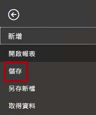

1. 在 [另存新檔] 視窗中，瀏覽至 **D:\PL300\MySolution** 資料夾。

1. 在 [檔案名稱] 方塊中，輸入 **銷售分析**。

    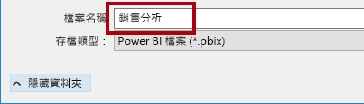

1. 按一下 [檔案] 。

    

    提示：您也可以按一下位於左上角的 [儲存] 圖示來儲存檔案。

    

### **工作 2：設定 Power BI Desktop 選項**

在此工作中，您將設定 Power BI Desktop 選項。

1. 在 Power BI Desktop 中，按一下 [檔案] 功能區索引標籤以開啟 Backstage 檢視。

1. 在左側，選取 [選項及設定]，然後選取 [選項]。

    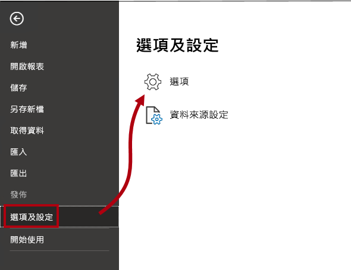

1. 在 [選項] 視窗中，在左側的 [目前的檔案] 群組中，選取 [資料載入]。

    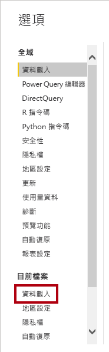

    目前檔案的 [資料載入] 設定可讓您設定在建立模型時決定預設行為的選項。

1. 在 [關聯性] 群組中，取消選取兩個已經選取的選項。

    

    雖然啟用這兩個選項可能可以在開發資料模型時提供幫助，但您先前為了支援實驗室體驗已經將其停用。 當您於《在 Power BI Desktop 中載入資料》實驗室中建立關聯性時，您將會了解個別加以新增的原因。

1. 按一下 [確定]。

    

1. 儲存 Power BI Desktop 檔案。

### **工作 3：從 SQL Server 取得資料**

在此工作中，您將根據 SQL Server 資料表建立查詢。

1. 在 [首頁] 功能區索引標籤上，從 [資料] 群組內，按一下 [SQL Server]。

    

2. 在 [SQL Server 資料庫] 視窗的 [伺服器] 方塊中，輸入 **localhost**。

    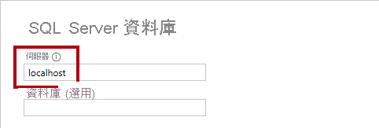

    在此實驗室中，您將使用 **localhost** 來連線到 SQL Server 資料庫。 不過，當您在建立自己的解決方案時，這不是建議的做法。 這是因為閘道資料來源無法解析 **localhost**。

3. 按一下 [確定]。

    

4. 如果系統提示您輸入認證，請在 [SQL Server 資料庫] 視窗中，選取 [使用我目前的認證]。 然後，選取 [連線]。

4. 在 [導覽器] 視窗中，展開左側的 **AdventureWorksDW2020** 資料庫。

    **AdventureWorksDW2020** 資料庫是以 **AdventureWorksDW2017** 範例資料庫為基礎。 其已經過修改，可支援課程實驗室的學習目標。

    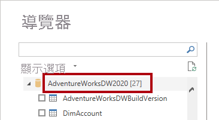

5. 選取 (但不要核取) [DimEmployee] 資料表。

    

6. 在右窗格中，請注意資料表資料的預覽。

    預覽資料可讓您判斷資料行與資料列範例。

7. 若要建立查詢，請選取下列六個資料表旁邊的核取方塊：

    - DimEmployee

    - DimEmployeeSalesTerritory

    - DimProduct

    - DimReseller

    - DimSalesTerritory

    - FactResellerSales

8. 若要將轉換套用至所選取資料表的資料，請按一下 [轉換資料]。

    您將不會在此實驗室中轉換資料。 此實驗室的目標著重於在 [Power Query 編輯器] 視窗中探索及分析資料。

    

### **工作 4：預覽 SQL Server 查詢**

在此工作中，您將預覽 SQL Server 查詢的資料。 首先，您將了解資料的相關資訊。 您也將使用資料行品質、資料行散發與資料行分析工具來了解資料，以及評估資料品質。

1. 在 [Power Query 編輯器] 視窗中的左側，注意 [查詢] 窗格。

    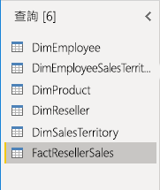

    [查詢] 窗格針對每個選取的資料表皆包含一個查詢。

2. 選取第一個查詢：[DimEmployee]。

    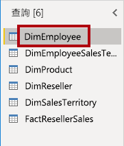

    SQL Server 資料庫中的 [DimEmployee] 資料表會為每個員工儲存一個資料列。 此資料表之資料列的子集代表銷售人員，這將與您要開發的模型相關。

3. 在左下角的狀態列中，請注意資料表統計資料：資料表有 33 個資料行與 296 個資料列。

    

4. 在資料預覽窗格中，水平捲動以檢閱所有資料行。

5. 請注意，最後五個資料行包含 **資料表** 或 **值** 連結。

    這五個資料行代表與資料庫中其他資料表的關聯性。 其可用來將資料表聯結在一起。 您將會於《在 Power BI Desktop 中載入資料》實驗室中聯結資料表。

6. 若要評估資料行品質，請在 [檢視] 功能區索引標籤上，從 [資料預覽] 群組內，選取 [資料行品質]。

    

    資料行品質功能可讓您輕鬆地判斷資料行中有效、錯誤或空白值的百分比。

7. 針對 [職位] 資料行 (第六個資料行)，請注意 94% 的資料列是空的 (Null)。

    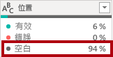

8. 若要評估資料行散發，請在 [檢視] 功能區索引標籤上，從 [資料預覽] 群組內部，檢查 [資料行散發]。

    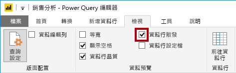

9. 再次檢閱 [職位] 資料行，並注意有四個相異值與一個唯一值。

10. 檢閱 **EmployeeKey** (第一個) 資料行的資料行散發，有 296 個相異值與 296 個唯一值。

    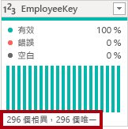

    當相異與唯一計數相同時，表示資料行包含唯一值。 建立模型時，某些模型資料表必須包含唯一資料行。 這些唯一資料行可用來建立一對多關聯性，而您將會於《在 Power BI Desktop 中設計資料模型》實驗室中這麼做。

11. 在 [查詢] 窗格中，選取 **DimEmployeeSalesTerritory** 查詢。

    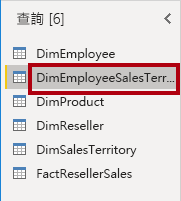

    **DimEmployeeSalesTerritory** 資料表會針對每個員工與他們所管理的銷售領域區域，各儲存一個資料列。 資料表支援將多個區域與單一員工相關聯。 有些員工會管理一個、兩個或更多區域。 當您建立此資料的模型時，您將會需要定義多對多關聯性。

12. 在 [查詢] 窗格中，選取 **DimProduct** 查詢。

    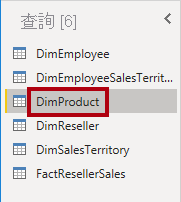

    **DimProduct** 資料表會針對由公司銷售的每個產品，各包含一個資料列。

13. 水平捲動以顯示後面的資料行。

14. 請注意 **DimProductSubcategory** 資料行。

    當您於 **在 Power BI Desktop 中載入資料** 實驗室內將轉換新增至此查詢時，將會使用 **DimProductSubcategory** 資料行來聯結資料表。

15. 在 [查詢] 窗格中，選取 **DimReseller** 查詢。

    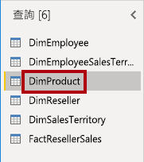

    **DimReseller** 資料表會針對每個轉銷商，各包含一個資料列。 轉銷商會銷售、散發或加值 Adventure Works 產品。

16. 若要檢視資料行值，請在 [檢視] 功能區索引標籤上，從 [資料預覽] 群組內部，檢查 [資料行設定檔]。

    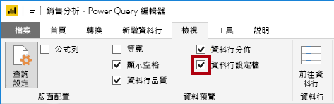

17. 選取 **BusinessType** 資料行標題。

18. 請注意，新的窗格會出現在 [資料預覽] 窗格下方。

19. 檢閱資料預覽窗格中的資料行統計資料和值分布。

20. 請注意資料品質問題：倉儲有兩個標籤 (**Warehouse** 與拼錯的 **Ware House**)。

    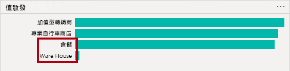

21. 將游標停在 [Ware House] 列上方，並注意有五個具有此值的資料列。

    您將套用轉換，於 **在 Power BI Desktop 中載入資料** 實驗室內，將這五個資料列重新標記。

22. 在 [查詢] 窗格中，選取 **DimSalesTerritory** 查詢。

    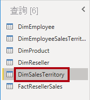

    **DimSalesTerritory** 資料表針對每個銷售區域 (包括 **Corporate HQ** (公司總部)) 皆包含一個資料列。 區域會指派給國家/地區，而國家/地區會指派給群組。 於《在 Power BI Desktop 中設計資料模型》實驗室中，您將會建立階層以支援區域、國家/地區或群組層級的分析。

23. 在 [查詢] 窗格中，選取 **FactResellerSales** 查詢。

    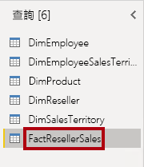

    [FactResellerSales] 資料表針對每個銷售訂單明細都會包含一個資料列；銷售訂單會包含一或多個明細項目。

24. 檢閱 **TotalProductCost** 資料行的資料行品質，並注意有 8% 的資料列是空的。

    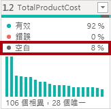

    遺漏 **TotalProductCost** 資料行值是資料品質問題。 若要於《在 Power BI Desktop 中載入資料》實驗室內解決此問題，您將會使用產品標準成本 (其儲存在相關的 [DimProduct] 資料表中) 來套用轉換以填入遺失值。

### **工作 5：從 CSV 檔案取得資料**

在此工作中，您將會根據 CSV 檔案建立查詢。

1. 若要加入新的查詢，請在 [Power Query 編輯器] 視窗的 [首頁] 功能區索引標籤上，從 [新增查詢] 群組內，按一下 [新增來源] 向下箭號，然後選取 [文字/CSV]。

    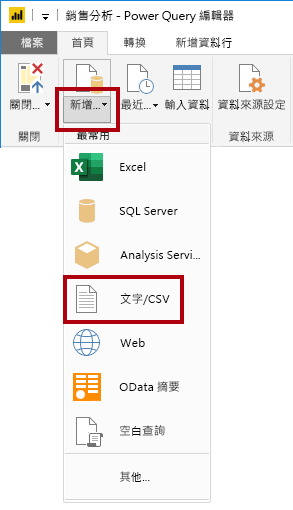

2. 在 [開啟] 視窗中，瀏覽至 **D:\PL300\Resources** 資料夾，然後選取 **ResellerSalesTargets.csv** 檔案。

3. 按一下 [開啟]。

4. 在 [ResellerSalesTargets.csv] 視窗中，檢閱預覽資料。

5. 按一下 [確定]。

    
 

6. 在 [查詢] 窗格中，注意 **ResellerSalesTargets** 查詢的加入。

    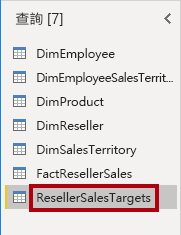

    **ResellerSalesTargets** CSV 檔案包含每位銷售人員每年一個資料列。 每個資料列都會記錄 12 個每月銷售目標 (以千為單位表示)。 請注意，Adventure Works 公司的營業年度會在 7 月 1 日開始。

7. 請注意，沒有任何資料行包含空白值。

    當沒有每月銷售目標時，會改為儲存連字號字元。

8. 檢閱每個資料行標頭中的圖示 (在資料行名稱的左邊)。

    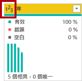

    圖示代表資料行資料類型。 **123** 是整數，而 **ABC** 是文字。

    您將會套用許多轉換，以達成僅由三個資料行所組成的不同圖形化結果：**在 Power BI Desktop 中載入資料** 實驗室內的 **Date**、**EmployeeKey** 與 **TargetAmount**。

### **工作 6：從 CSV 檔案取得其他資料**

在此工作中，您將根據不同的 CSV 檔案建立額外的查詢。

1. 使用先前工作中的步驟，依據 **D:\PL300\Resources\ColorFormats.csv** 檔案建立查詢。

    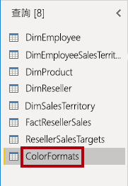

    **ColorFormats** CSV 檔案會針對每個產品色彩包含一個資料列。 每個資料列都會記錄十六進位代碼，以設定背景與字型色彩格式。 您會將此資料與 **在 Power BI Desktop 中載入資料** 實驗室內的 **DimProduct** 查詢資料整合。

### **工作 7：完成**

在此工作中，您將完成實驗室。

1. 在 [檢視] 功能區索引標籤上，從 [資料預覽] 群組內，取消選取先前在此實驗室中啟用的三個資料預覽選項：

    - 資料行品質

    - 資料行散發

    - 資料行設定檔

    

2. 若要儲存 Power BI Desktop 檔案，請在 [Power Query 編輯器] 視窗中的 [檔案] Backstage 檢視上，選取 [儲存]。

    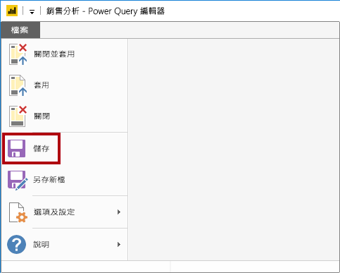

3. 當系統提示您套用查詢時，請按一下 [稍後套用]。

    

    套用查詢會將其資料載入到資料模型。 您還沒準備好這麼做，因為有許多必須先套用的轉換。

4. 若您想要開始下一個實驗室，請讓 Power BI Desktop 保持開啟狀態。

    您將會於《在 Power BI Desktop 中載入資料》實驗室中將各種轉換套用至查詢，接著套用這些查詢以將其載入資料模型中。
