---
lab:
  title: 在 Power BI Desktop 中載入資料
  module: Module 3 - Clean, Transform, and Load Data in Power BI
ms.openlocfilehash: aced37b7bfdd2ccf94a9d3e7bdb8f8ff7013c125
ms.sourcegitcommit: 9ea1e7e21b9b3c718030c94b1693d153a2010ec7
ms.translationtype: HT
ms.contentlocale: zh-TW
ms.lasthandoff: 06/29/2022
ms.locfileid: "146650222"
---
# <a name="load-data-in-power-bi-desktop"></a>**在 Power BI Desktop 中載入資料**

**完成實驗室的估計時間為 45 分鐘**

在此實驗室中，您將會對在上個實驗室中所建立的每個查詢套用轉換。 接著，您將會把每項查詢載入為資料模型的資料表。

在此實驗室中，您將了解如何：

- 套用各種轉換

- 運用查詢以將其載入至資料模型

### <a name="lab-story"></a>**實驗室案例**

此實驗室為一系列實驗室的其中之一，其設計用意是完整呈現資料準備到報表和儀表板發行的整個過程。 您可以依照任何順序完成實驗室。 然而，若您想要逐步完成多個實驗室，建議您依照下列順序加以完成：

1. 在 Power BI Desktop 中準備資料

2. **在 Power BI Desktop 中載入資料**

3. 在 Power BI Desktop 中設計資料模型


5. 在 Power BI Desktop 中建立 DAX 計算，第 1 部分

6. 在 Power BI Desktop 中建立 DAX 計算，第 2 部分

7. 在 Power BI Desktop 中設計報表，第 1 部分

8. 在 Power BI Desktop 中設計報表，第 2 部分

9. 建立 Power BI 儀表板

10. 在 Power BI Desktop 中執行資料分析

11. 強制執行資料列層級安全性

## <a name="exercise-1-load-data"></a>**練習 1：載入資料**

在此練習中，您將會對在上一個實驗室中所建立的每個查詢套用轉換。

### <a name="task-1-get-started"></a>**工作 1：開始作業**

在此工作中，您將設定實驗室的環境。

*重要：若您是從上一個實驗室繼續進行 (且已成功完成該實驗室)，請不要完成此工作；相反地，請從下一個工作繼續。*

1. 若要開啟 Power BI Desktop，請在工作列上按一下 [Microsoft Power BI Desktop] 捷徑。

    

1. 若要關閉 [開始使用] 視窗，請按一下視窗左上角的 [X]。

    

1. 若要開啟 Power BI Desktop 入門檔案，請按一下 [檔案] 功能區索引標籤以開啟 Backstage 檢視。

1. 選取 [開啟報表]。

    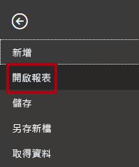

1. 按一下 [瀏覽報表]。

    

1. 在 [開啟] 視窗中，瀏覽至 **D:\PL300\Labs\02-load-data-with-power-query-in-power-bi-desktop\Starter** 資料夾。

1. 選取 **Sales Analysis** 檔案。

1. 按一下 [開啟]。

    

1. 關閉任何可能開啟的資訊視窗。

1. 注意功能區下方的黃色警告訊息。

    *該訊息會警告您尚未套用查詢來以模型資料表的形式載入。您將在此實驗室的稍後對查詢套用轉換。*

1. 若要關閉此警告訊息，請按一下黃色警告訊息右側的 **X**。

    

1. 若要建立檔案的複本，請按一下 [檔案] 功能區索引標籤，以開啟 Backstage 檢視。

1. 選取 [另存新檔]。

    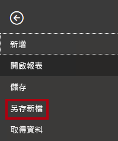

1. 若系統提示您套用變更，請按一下 [稍後套用]。

    

1. 在 [另存新檔] 視窗中，瀏覽至 **D:\PL300\MySolution** 資料夾。

1. 按一下 [儲存]。

    

1. 若要開啟 [Power Query 編輯器] 視窗，請在 [首頁] 功能區索引標籤上，從 [查詢] 群組內按一下 [轉換資料] 圖示。

    

### <a name="task-2-configure-the-salesperson-query"></a>**工作 2：設定 Salesperson 查詢**

在此工作中，您將設定 **Salesperson** 查詢。

1. 在 [Power Query 編輯器] 視窗的 [查詢] 窗格中，選取 [DimEmployee] 查詢。

    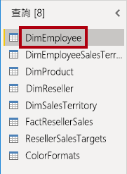

2. 若要重新命名查詢，請在 [查詢設定] (位於右側) 窗格的 [名稱] 方塊中，將文字更換為 **Salesperson**，然後按 **Enter**。

    *查詢名稱會決定模型資料表名稱。建議定義簡潔但易記的名稱。*

3. 在 [查詢] 窗格中，驗證查詢名稱已更新。

    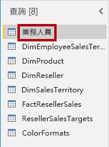

    *您現在要篩選查詢資料列，以只擷取職務為銷售人員的員工。*

4. 若要尋找特定的資料行，請在 [常用] 功能區索引標籤上，按一下 [管理資料行] 向下箭號，並按一下 [選擇資料行] 向下箭號，然後選取 [移至資料行]。

    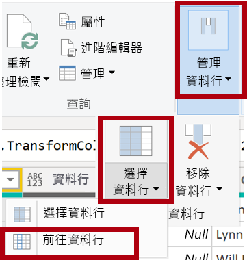

    *提示：當查詢包含許多資料行時，這項技術很有用。如果資料行數目沒有很多，您可以直接水平捲動來找到您感興趣的資料行。*

5. 在 [移至資料行] 視窗中，若要依資料行名稱排序清單，請按一下 [AZ] 按鈕，然後選取 [名稱]。

    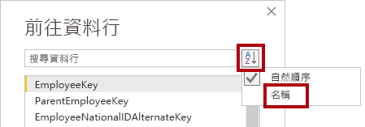

6. 選取 [SalesPersonFlag] 資料行，然後按一下 [確定]。

7. 若要篩選查詢，請在 [SalesPersonFlag] 資料行標頭中，按一下向下箭號，然後取消核取 [FALSE]。

    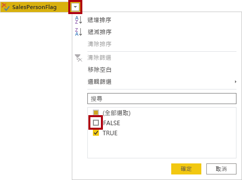

8. 按一下 [確定]。

    

9. 在 [查詢設定] 窗格的 [套用的步驟] 清單中，請注意新增的 **已篩選資料列** 步驟。

    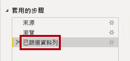

    *您所建立每個轉換都會造成額外的步驟邏輯。您可編輯或刪除步驟。也可選取一個步驟，來預覽該查詢轉換階段的查詢結果。*

10. 若要移除資料行，請在 [常用] 功能區索引標籤上，按一下 [管理資料行] 群組，然後按一下 [選擇資料行] 圖示。

    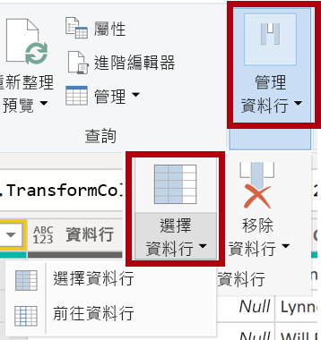

11. 在 [選擇資料行] 視窗中，若要取消選取所有資料行，請取消選取 [(選取所有資料行)] 項目。

    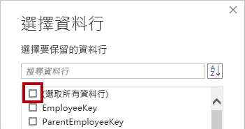

12. 若要包含資料行，請核取下列六個資料行：

    - EmployeeKey

    - EmployeeNationalIDAlternateKey

    - FirstName

    - LastName

    - Title

    - EmailAddress

13. 按一下 [確定]。

    

14. 在 [套用的步驟] 清單中，請注意新增的另一個查詢步驟。

    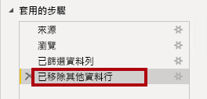

15. 若要建立單一名稱資料行，請先選取 [FirstName] 資料行標頭。

16. 按下 **Ctrl** 鍵的同時，選取 LastName 資料行。

    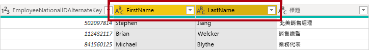

17. 以滑鼠右鍵按一下其中一個選取的資料行標頭，然後在操作功能表中選取 [合併資料行]。

    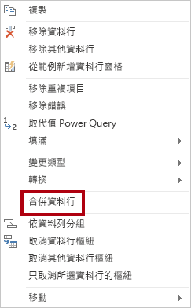

    *以滑鼠右鍵按一下資料行標頭，然後從操作功能表中選擇轉換項目，即可套用許多常見的轉換。不過，請注意功能區中提供更多的轉換。*

18. 在 [合併資料行] 視窗的 [分隔符號] 下拉式清單中，選取 [空格]。

19. 在 [新資料行名稱] 方塊中，將文字取代為 **Salesperson**。

    

20. 按一下 [確定]。

    

21. 若要重新命名 **EmployeeNationalIDAlternateKey** 資料行，請按兩下 [EmployeeNationalIDAlternateKey] 資料行標頭。

22. 將文字更換為 **EmployeeID**，然後按 **Enter**。

    *重要：收到重新命名資料行的指示時，請務必完全依照所述方式重新命名資料行。*

23. 使用前面的步驟，將 **EmailAddress** 資料行重新命名為 **UPN**。

    *UPN 是使用者主體名稱的縮寫。*

24. 在左下的狀態列中，確認該查詢具有五個資料行和 18 個資料列。

    

    *重要：如果查詢未產生正確的結果，請務必不要繼續作業，因為您並無法完成後續的實驗室。如果查詢資料行或資料列不相符，請回頭參考此工作中的步驟，以修正任何問題。*

### <a name="task-3-configure-the-salespersonregion-query"></a>**工作 3：設定 SalespersonRegion 查詢**

在此工作中，您將會設定 **SalespersonRegion** 查詢。

1. 在 [查詢] 窗格中，選取 **DimEmployeeSalesTerritory** 查詢。

    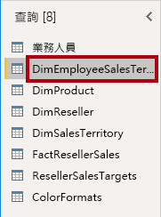

2. 在 [查詢設定] 窗格中，將查詢重新命名為 **SalespersonRegion**。

3. 若要移除最後兩個資料行，請先選取 **DimEmployee** 資料行標頭。

4. 按下 **Ctrl** 鍵時，請選取 **DimSalesTerritory** 資料行標頭。

5. 以滑鼠右鍵按一下其中一個選取資料行標頭，然後在操作功能表中選取 [移除資料行]。

    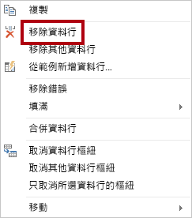

6. 在狀態列中，驗證該查詢具有兩個資料行和 39 個資料列。

    

### <a name="task-4-configure-the-product-query"></a>**工作 4：設定 Product 查詢**

在此工作中，您將會設定 [Product] 查詢。

*重要：由於已經提供詳細指示，因此實驗室步驟現在會提供更精簡的指示。如果需要詳細指示，可回頭參考先前工作的步驟。*

1. 選取 **DimProduct** 查詢。

    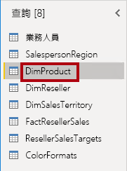

2. 將此查詢重新命名為 **Product**。

3. 找出 **FinishedGoodsFlag** 資料行，然後篩選該資料行以擷取屬於成品 (亦即 TRUE) 的產品。

4. 移除所有資料行，但不包括下列各項：

    - ProductKey

    - EnglishProductName

    - StandardCost

    - Color

    - DimProductSubcategory

5. 請注意，**DimProductSubcategory** 資料行代表相關資料表 (其中包含 **Value** 連結)。

6. 在 **DimProductSubcategory** 資料行標頭中，按一下資料行名稱右邊的展開按鈕。

    

7. 若要取消核取所有資料行，請取消核取 [(選取所有資料行)] 項目。

8. 選取 **EnglishProductSubcategoryName** 和 **DimProductCategory** 資料行。

    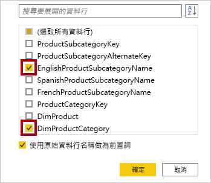

    *透過選取這兩個資料行，將會套用轉換來聯結 **DimProductSubcategory** 資料表，然後包括這些資料行。**DimProductCategory** 資料行實際上是資料來源中的另一個相關資料表。*

9. 取消核取 [使用原始資料行名稱作為前置詞] 核取方塊。

    

    *查詢資料行名稱必須一律是唯一的。保持選取時，此核取方塊會在每個資料行前面加上擴充的資料行名稱 (在本案例中為 **DimProductSubcategory**)。由於已知選取的資料行名稱不會與 **Product** 查詢中的資料行名稱相衝突，因此會取消選取此選項。*

10. 按一下 [確定]。

    

11. 請注意，轉換會導致新增兩個資料行，而且已移除 [DimProductSubcategory] 資料行。

12. 展開 **DimProductCategory** 資料行，然後只引進 **EnglishProductCategoryName** 資料行。

13. 將下列四個資料行重新命名：

    - 將 **EnglishProductName** 重新命名為 **Product**

    - 將 **StandardCost** 重新命名為 **Standard Cost** (包含空格)

    - 將 **EnglishProductSubcategoryName** 重新命名為 **Subcategory**

    - 將 **EnglishProductCategoryName** 重新命名為 **Category**

14. 在狀態列中，確認該查詢具有六個資料行和 397 個資料列。

    

### <a name="task-5-configure-the-reseller-query"></a>**工作 5：設定 Reseller 查詢**

在此工作中，您將設定 **Reseller** 查詢。

1. 選取 **DimReseller** 查詢。

    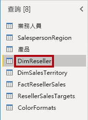

2. 將此查詢重新命名為 **Reseller**。

3. 移除所有資料行，但不包括下列各項：

    - ResellerKey

    - BusinessType

    - ResellerName

    - DimGeography

4. 展開 **DimGeography** 資料行，以只包含下列三個資料行：

    - City

    - StateProvinceName

    - EnglishCountryRegionName

    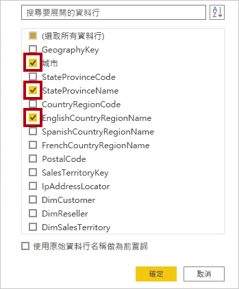

5. 在 **Business Type** 資料行標頭中，按一下向下箭號，然後檢閱相異資料行值，然後請注意 warehouse 的不正確拼寫。

    

  

6. 以滑鼠右鍵按一下 **Business Type** 資料行標頭，然後選取 [取代值]。

    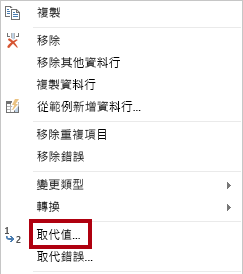

7. 在 [取代值] 視窗中，設定下列值：

    - 在 [要尋找的值] 方塊中，輸入 **Ware House**

    - 在 [取代為] 方塊中，輸入 

    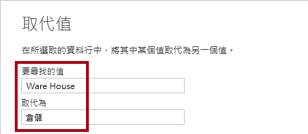

8. 按一下 [確定]。

    

9. 將下列四個資料行重新命名：

    - 將 **BusinessType** 重新命名為 **Business Type** (包含空格)

    - 將 **ResellerName** 重新命名為 **Reseller**

    - 將 **StateProvinceName** 重新命名為 **State-Province**

    - 將 **EnglishCountryRegionName** 重新命名為 **Country-Region**

10. 在狀態列中，確認該查詢具有六個資料行和 701 個資料列。

    

### <a name="task-6-configure-the-region-query"></a>**工作 6：設定 Region 查詢**

在此工作中，您將設定 **Region** 查詢。

1. 選取 **DimSalesTerritory** 查詢。

    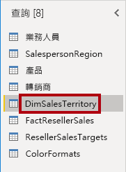

2. 將此查詢重新命名為 **Region**。

3. 將篩選套用至 **SalesTerritoryAlternateKey** 資料行，以移除值 0 (零)。

    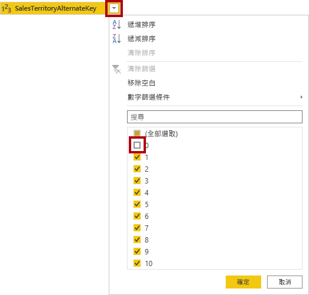

4. 移除所有資料行，但不包括下列各項：

    - SalesTerritoryKey

    - SalesTerritoryRegion

    - SalesTerritoryCountry

    - SalesTerritoryGroup

5. 將下列三個資料行重新命名：

    - 將 **SalesTerritoryRegion** 重新命名為 **Region**

    - 將 **SalesTerritoryCountry** 重新命名為 **Country**

    - 將 **SalesTerritoryGroup** 重新命名為 **Group**

6. 在狀態列中，確認該查詢具有四個資料行和 10 個資料列。

    

### <a name="task-7-configure-the-sales-query"></a>**工作 7：設定 Sales 查詢**

在此工作中，您將會設定 **Sales** 查詢。

1. 選取 **FactResellerSales** 查詢。

    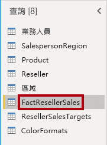

2. 將此查詢重新命名為 **Sales**。

3. 移除所有資料行，但不包括下列各項：

    - SalesOrderNumber

    - OrderDate

    - ProductKey

    - ResellerKey

    - EmployeeKey

    - SalesTerritoryKey

    - OrderQuantity

    - UnitPrice

    - TotalProductCost

    - SalesAmount

    - DimProduct

    *您可能還記得於《在 Power BI Desktop 中準備資料》實驗室中，有一小部分的 **FactResellerSales** 資料列遺漏 **TotalProductCost** 值。已包括 **DimProduct** 資料行來擷取產品標準成本資料行，以協助修正遺漏的值。*

4. 展開 [DimProduct] 資料行、取消選取所有資料行，然後僅包括 [StandardCost] 資料行。

5. 若要建立自訂資料行，請在 [新增資料行] 功能區索引標籤的 [一般] 群組內，按一下 [自訂資料行]。

    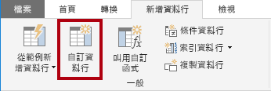

6. 在 [自訂資料行] 視窗的 [新資料行名稱] 方塊中，將文字取代為 **Cost**。

    

7. 在 [自訂資料行公式] 方塊中，(在等號後面) 輸入下列運算式：

8. 為方便起見，您可從 **D:\PL300\Labs\02-load-data-with-power-query-in-power-bi-desktop\Assets\Snippets.txt** 檔案中複製運算式。


   **Power Query**
   ```
   if [TotalProductCost] = null then [OrderQuantity] * [StandardCost] else [TotalProductCost]
   ```


*此運算式會測試 **TotalProductCost** 值是否遺失。如果遺失，請將 **OrderQuantity** 值乘以 **StandardCost** 值來求得此值；否則，系統會使用現有的 **TotalProductCost** 值。*

9. 按一下 [確定]。

    

10. 移除下列兩筆資料行：

    - TotalProductCost

    - StandardCost

11. 重新命名下列三筆資料行：

    - **OrderQuantity** 改為 **Quantity**

    - **UnitPrice** 改為 **Unit Price** (包含空格)

    - **SalesAmount** 改為 **Sales**

12. 若要修改資料行的資料類型，請在 [Quantity] 資料行標頭中，按一下資料行名稱左側的 [1.2] 圖示，然後選取 [整數]。

    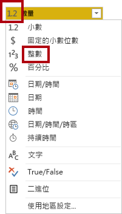

    *設定正確的資料類型很重要。當資料行包含數值時，如果預期會執行數學計算，則選擇正確的類型也很重要。*

13. 將下列三個資料行資料類型修改為 [固定的小數位數]。

    - Unit Price

    - Sales

    - Cost

    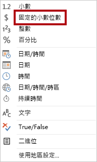

    *固定小數位數的資料類型會以完整精確度來儲存值，因此需要較多的儲存空間供小數位數使用。財務值或費率 (例如匯率) 請務必使用固定的小數位數類型。*

14. 在狀態列中，確認該查詢具有 10 個資料行和 999+ 個資料列。

    

    *每次查詢最多會載入 1000 筆資料列作為預覽資料。*

### <a name="task-8-configure-the-targets-query"></a>**工作 8：設定 Targets 查詢**

在此工作中，您將設定 **Targets** 查詢。

1. 選取 **ResellerSalesTargets** 查詢。

    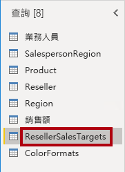

2. 將此查詢重新命名為 **Targets**。

3. 若要取消 12 個月資料行 (**M01**-**M12**) 樞紐，請先複選 [Year] 和 [EmployeeID] 資料行標頭。

    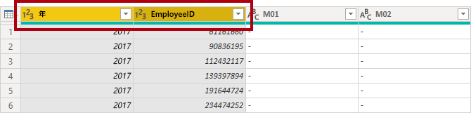

4. 以滑鼠右鍵按一下其中一個選取資料行標頭，然後在操作功能表中選取 [取消其他資料行樞紐]。

    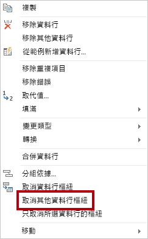

5. 請注意，資料行名稱現在會顯示在 [Attribute] 資料行中，而值會出現在 [Value] 資料行中。

6. 將篩選套用至 [Value] 資料行，以移除連字號 (-) 值。

    *您可能還記得在來源 CSV 檔案中使用連字號字元來代表零 (0)。*

7. 重新命名下列兩筆資料行：

    - 將 **Attribute** 改為 **MonthNumber** (兩字之間沒有空格，其將會於稍後移除)

    - **Value** 改為 **Target**

    *您現在要套用轉換來產生日期資料行。日期會衍生自 [Year] 和 [MonthNumber] 資料行。您將使用 [來自範例的資料行] 功能來建立資料行。*

8. 若要準備 **MonthNumber** 資料行值，請以滑鼠右鍵按一下 [MonthNumber] 資料行標頭，然後選取 [取代值]。

    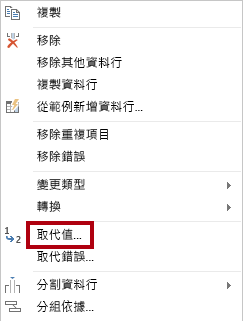

9. 在 [取代值] 視窗的 [要尋找的值] 方塊中，輸入 **M**。

    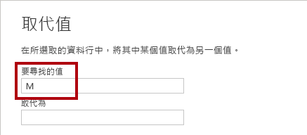

10. 按一下 [確定]。

11. 將 [MonthNumber] 資料行的資料類型修改為 [整數]。

    

12. 在 [新增資料行] 功能區索引標籤的 [一般] 群組內，按一下 [來自範例的資料行] 圖示。

    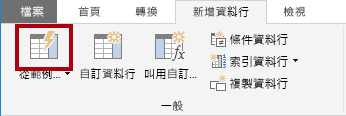

13. 請注意，第一個資料列是適用於 **2017** 年和 **7** 月。

14. 在 [Column1] 資料行的第一個格線儲存格中，開始輸入 **7/1/2017**，然後按 **Enter**。

    *由於虛擬機器是使用美國地區設定，因此此日期實際上是 2017 年 7 月 1 日。*

15. 請注意，方格儲存格會使用預測的值更新。

    *此功能已精準預測到您正在結合 **Year** 和 **MonthNumber** 資料行的值。*

16. 另請注意查詢方格上方顯示的公式。

    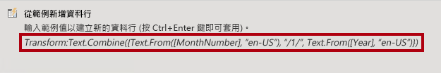

17. 若要重新命名新的資料行，請按兩下 **合併的** 資料行標頭。

18. 將資料行重新命名為 **TargetMonth**。

    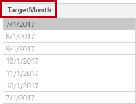

19. 若要新增資料行，請按一下 [確定]。

    

20. 移除下列資料行：

    - Year

    - MonthNumber

21. 修改下列資料行的資料類型：

    - **Target** 為固定的小數位數

    - **TargetMonth** 為日期

22. 若要將 **Target** 值乘以 1000，請選取 [Target] 資料行標頭，然後在 [轉換] 功能區索引標籤的 [數字資料行] 群組內，按一下 [標準]，然後選取 [乘]。

    *您可能還記得目標值是以千為單位儲存。*

    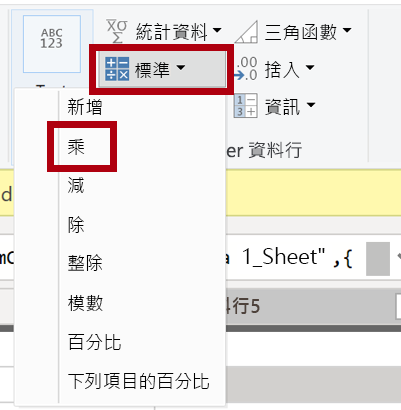

23. 在 [乘] 視窗的 [值] 方塊中，輸入 **1000**。

    

24. 按一下 [確定]。

    

25. 在狀態列中，確認該查詢具有三個資料行和 809 個資料列。

    

### <a name="task-9-configure-the-colorformats-query"></a>**工作 9：設定 ColorFormats 查詢**

在此工作中，您將設定 **ColorFormats** 查詢。

1. 選取 [ColorFormats] 查詢。

    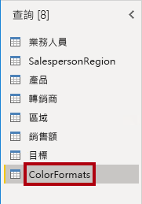

2. 請注意，第一筆資料列包含資料行名稱。

3. 在 [常用] 功能區索引標籤上，從 [轉換] 群組中，按一下 [使用第一個資料列作為標頭]。

    

4. 在狀態列中，確認該查詢具有三個資料行和 10 個資料列。

    

### <a name="task-10-update-the-product-query"></a>**工作 10：更新 Product 查詢**

在此工作中，您將透過合併 **ColorFormats** 查詢來更新 **Product** 查詢。

1. 選取 [Product] 查詢。

    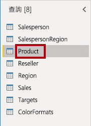

2. 若要合併 **ColorFormats** 查詢，請在 [常用] 功能區索引標籤上，按一下 [合併] 向下箭頭，然後按一下 [合併查詢]。

    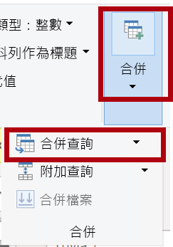

    *合併查詢允許整合資料，在此案例中是來自不同資料來源 (SQL Server 和 CSV 檔案) 的資料。*

3. 在 [合併] 視窗的 [Product] 查詢格線中，選取 [Color] 資料行標頭。

    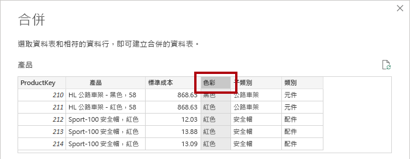

4. 在 [Product] 查詢格線下的下拉式清單中，選取 [ColorFormats] 查詢。

    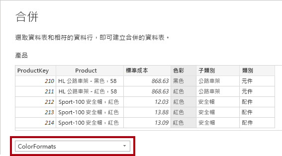

5. 在 [ColorFormats] 查詢格線中，選取 [Color] 資料行標頭。

6. 當 [隱私權等級] 視窗開啟時，針對這兩個資料來源，請在對應的下拉式清單中選取 [組織]。

    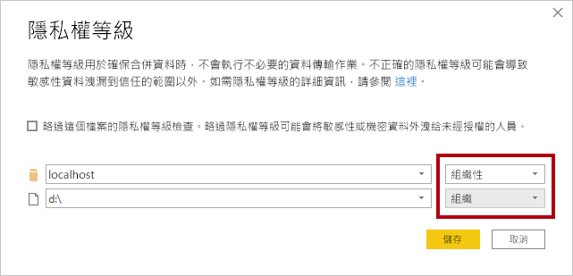

    *您可設定資料來源的隱私權等級，以判斷資料是否可以在來源之間共用。如有需要，將每個資料來源設定為 [組織] 可使其共用資料。請注意，私人資料來源永遠不會與其他資料來源共用。這不表示私人資料無法共用，而是 Power Query 引擎無法在這些來源間共用資料。*

7. 按一下 [儲存]。

    

8. 在 [合併] 視窗中，使用預設的 [聯結種類] - 保持選取 [左方外部]，然後按一下 [確定]。

    

9. 展開 [ColorFormats] 資料行，以包括下列兩個資料行：

    - 背景色彩格式

    - 字型色彩格式

    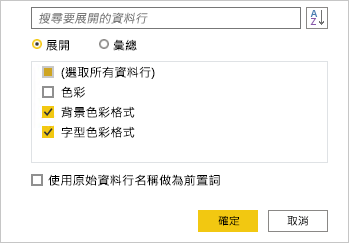

10. 在狀態列中，確認該查詢現在具有八個資料行和 397 個資料列。

    

### <a name="task-11-update-the-colorformats-query"></a>**工作 11：更新 ColorFormats 查詢**

在此工作中，您將更新 **ColorFormats** 以停用其載入。

1. 選取 [ColorFormats] 查詢。

    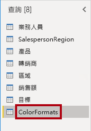

2. 在 [查詢設定] 窗格中，按一下 [所有屬性] 連結。

    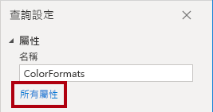

3. 在 [查詢屬性] 視窗中，取消選取 [啟用載入至報告] 核取方塊。

    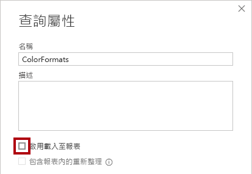

    停用載入表示其不會以資料表的形式載入資料模型。 這是因為此查詢已與啟用載入資料模型的 **Product** 查詢合併。

4. 按一下 [確定]。

    

### <a name="task-12-finish-up"></a>**工作 12：完成**

在此工作中，您將完成實驗室。

1. 請驗證您有八項查詢，並正確命名如下：

    - Salesperson

    - SalespersonRegion

    - Product

    - Reseller

    - Region

    - Sales

    - Targets

    - ColorFormats (其不會載入資料模型)

2. 若要載入資料模型，請在 [檔案] Backstage 檢視上，選取 [關閉並套用]。

    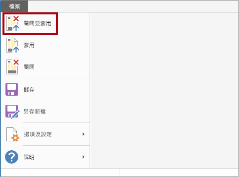

    *所有已啟用載入的查詢現在都會載入至資料模型。*

3. 在 [欄位] 窗格 (位於右側) 中，請注意載入資料模型的七份資料表。

    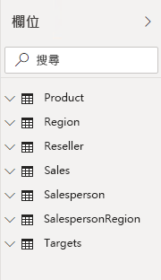

4. 儲存 Power BI Desktop 檔案。

5. 若您想要開始下一個實驗室，請將 Power BI Desktop 保持開啟狀態。

    *您將於《在 Power BI Desktop 中設計資料模型》實驗室中，設定資料模型的資料表和關聯性。*
