---
lab:
  title: 在 Power BI Desktop 中設計資料模型
  module: Module 4 - Design a Data Model in Power BI
---

# **在 Power BI Desktop 中設計資料模型**

**完成實驗室的估計時間為 45 分鐘**

In this lab you will commence developing the data model. It will involve creating relationships between tables, and then configuring table and column properties to improve the friendliness and usability of the data model. You will also create hierarchies and create quick measures.

在此實驗室中，您將了解如何：

- 建立模型關聯性

- 設定資料表與資料行屬性

- 建立階層

### **實驗室案例**

This lab is one of many in a series of labs that was designed as a complete story from data preparation to publication as reports and dashboards. You can complete the labs in any order. However, if you intend to work through multiple labs, for the first 10 labs, we suggest you do them in the following order:

1. 在 Power BI Desktop 中準備資料

2. 在 Power BI Desktop 中載入資料

3. **在 Power BI Desktop 中設計資料模型**

5. 在 Power BI Desktop 中建立 DAX 計算，第 1 部分

6. 在 Power BI Desktop 中建立 DAX 計算，第 2 部分

7. 在 Power BI Desktop 中設計報表，第 1 部分

8. 在 Power BI Desktop 中設計報表，第 2 部分

9. 建立 Power BI 儀表板

10. 在 Power BI Desktop 中執行資料分析

11. 強制執行資料列層級安全性

## **練習 1：建立模型關聯性**

在本練習中，您將建立模型關聯性。

### **工作 1：開始作業**

在此工作中，您將設定實驗室的環境。

*重要：若您是從上一個實驗室繼續進行 (且已成功完成該實驗室)，請不要完成此工作；相反地，請從下一個工作繼續。*

1. 若要開啟 Power BI Desktop，請在工作列上按一下 [Microsoft Power BI Desktop] 捷徑。

    

1. 若要關閉 [開始使用] 視窗，請按一下視窗左上角的 [X]。

    

1. 若要開啟 Power BI Desktop 入門檔案，請按一下 [檔案] 功能區索引標籤以開啟 Backstage 檢視。

1. 選取 [開啟報表]。

    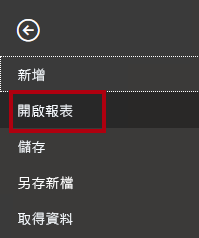

1. 按一下 [瀏覽報表]。

    

1. 在 [開啟] 視窗中，瀏覽至 **D:\PL300\Labs\03-configure-data-model-in-power-bi-desktop\Starter** 資料夾。

1. 選取 **Sales Analysis** 檔案。

1. 按一下 [開啟]。

    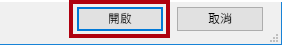

1. 關閉任何可能開啟的資訊視窗。

1. 若要建立檔案的複本，請按一下 [檔案] 功能區索引標籤，以開啟 Backstage 檢視。

1. 選取 [另存新檔]。

    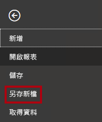

1. 若系統提示您套用變更，請按一下 [套用]。

    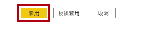

1. 在 [另存新檔] 視窗中，瀏覽至 **D:\PL300\MySolution** 資料夾。

1. 按一下 [檔案] 。

    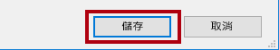

### **工作 2：建立模型關聯性**

在此工作中，您將建立模型關聯性。

1. 在 Power BI Desktop 中，按一下左側的 [模型] 檢視圖示。

    

2. 如果您看不到所有七個資料表，請水平捲動到右側，然後更緊密地拖曳並排列資料表，讓其可以同時顯示。

    *提示：您也可以使用位於視窗底部的縮放控制項。*

    *在 [模型] 檢視中，您可以檢視每個資料表及關聯性 (資料表之間的連接線)。目前沒有任何關聯性，因為於《在 Power BI Desktop 中準備資料》實驗室中，您已停用資料載入關聯性選項。*

3. 若要返回報表檢視，請按一下左側的 [報表] 檢視圖示。

    

4. 若要檢視所有資料表欄位，請在 [欄位] 窗格中，以滑鼠右鍵按一下空白區域，然後選取 [全部展開]。

    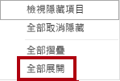

5. 若要建立資料表視覺效果，請在 [欄位] 窗格中，從 [Product] 資料表內，選取 [Category] 欄位。

    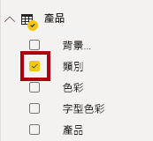

    *實驗室使用速記標記法來參考欄位。其看起來將會像下面這樣：[Product \| Category]。在此範例中，[Product] 是資料表名稱，而 [Category] 是欄位名稱。*

6. 若要將額外的資料行加入資料表，請在 [欄位] 窗格中，選取 [Sales \| Sales] 欄位。

7. 請注意，資料表視覺效果會列出四個產品類別，而且每個項目的銷售值與總計都是相同的。

    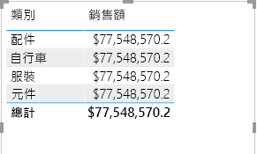

    *問題在於資料表是以不同資料表中的欄位為基礎。預期的情況是每個產品類別都會顯示該類別的銷售額。不過，因為這些資料表之間沒有模型關聯性，所以不會篩選 [Sales] 資料表。您現在將新增關聯性，以在資料表之間傳播篩選。*

8. 在 [模型化] 功能區索引標籤上，從 [關聯性] 群組內，按一下 [管理關聯性]。

    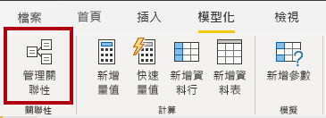

9. 在 [管理關聯性] 視窗中，請注意尚未定義任何關聯性。

10. 若要建立關聯性，請按一下 [新增]。

    

11. 在 [建立關聯性] 視窗的第一個下拉式清單中，選取 [Product] 資料表。

    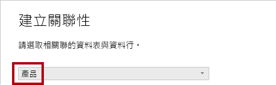

12. 在第二個下拉式清單中 (在 [產品] 資料表方格底下)，選取 [Product] 資料表。

    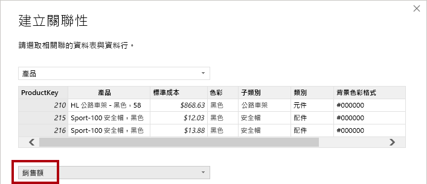

13. 請注意，已自動選取每個資料表中的 [ProductKey] 資料行。

    *已選取資料行的原因，是因為這些資料行共用相同的名稱和資料類型。*

14. 在 [基數] 下拉式清單中，請注意已選取 [一對多 (1:*)]。

    *系統會自動偵測基數，因為 Power BI 了解來自 **Product** 資料表的 **ProductKey** 資料行包含唯一值。一對多關聯性是最常見的基數，而且您在此實驗室中建立的所有關聯性都是這種類型。您將會在「Power BI Desktop 中的模型資料 (第 2 部分)」實驗室中處理多對多基數。*

15. 在 [交叉篩選方向] 下拉式清單中，請注意已選取 [單一]。

    *單一篩選方向表示篩選會從「一端」傳播到「多端」。在此案例中，這表示已套用到 **Product** 資料表的篩選將會傳播到 **Sales** 資料表，但不會以相反方向傳播。您將會在「Power BI Desktop 中的模型資料 (第 2 部分)」實驗室中處理雙向關聯性。*

16. 請注意，已選取 [將此關聯性設為作用中]。

    *作用中的關聯性將會傳播篩選。您可以將關聯性標示為非作用中，這樣就不會傳播篩選。當資料表之間有多個關聯性路徑時，可能會有非作用中的關聯性存在。在此案例中，模型計算可以使用特殊函數來加以啟用。您將會在「Power BI Desktop 中的模型資料 (第 2 部分)」實驗室中處理非作用中關聯性。*

17. 按一下 [確定]。

    

18. 在 [管理關聯性] 視窗中，請注意新的關聯性會列出，然後按一下 [關閉]。

    

19. 請注意，報表中的資料表視覺效果已更新，以顯示每個產品類別的不同值。

    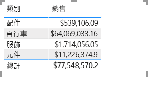

    *套用至 [Product] 資料表的篩選現在會傳播至 [Sales] 資料表。*

20. 切換至 [模型] 檢視，並請注意兩個資料表之間現在已存在連接線 (資料表是否位於彼此旁邊並不重要)。

    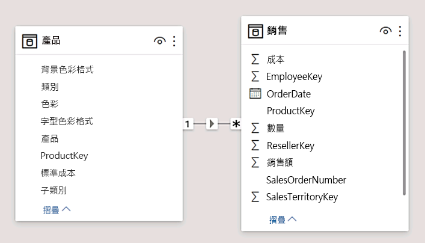

21. 請注意，在圖表中，您可以解讀基數，其是由 **1** 與 ***** 指標來表示。

    *篩選方向是以箭頭來表示。此外，實線代表作用中的關聯性；虛線代表非作用中的關聯性。*

22. 將游標暫留在關聯性上方，以醒目提示相關的資料行。

    *有比較簡單的方式可建立關聯性。在模型圖中，您可以拖放資料行來建立新的關聯性。*

23. 若要使用不同的技巧建立新的關聯性，請從 [Reseller] 資料表中，將 [ResellerKey] 資料行拖曳至 [Sales] 資料表的 [ResellerKey] 資料行。

    

    *提示：有時候，您會無法拖曳資料行。如果發生這種情況，請選取不同的資料行，然後再次選取您想要拖曳的資料行，然後再試一次。請確定您可以看到新的關聯性已新增至圖表。*

24. 使用這個新技巧來建立下列兩個模型關聯性：

    - [Region \| SalesTerritoryKey] 至 [Sales \| SalesTerritoryKey]

    - [Salesperson \| EmployeeKey] 至 [Sales \| EmployeeKey]

    *在此實驗室中，**SalespersonRegion** 與 **Targets** 資料表仍會維持中斷連線。銷售人員與區域之間有多對多關聯性，而且您將會在「Power BI Desktop 中的模型資料 (第 2 部分)」實驗室中處理這個進階案例。*

25. In the diagram, arrange the tables so that the <bpt id="p1">**</bpt>Sales<ept id="p1">**</ept> table is positioned in the center of the diagram, and the related tables are arranged about it. Position the disconnected tables to the side.

    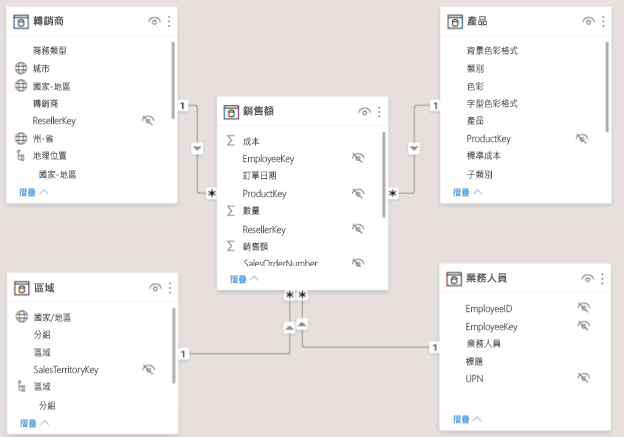

26. 儲存 Power BI Desktop 檔案。

## **練習 2：設定資料表**

在此練習中，您將會透過建立階層，以及隱藏、格式化及分類資料行，來設定每個資料表。

### **工作 1：設定 [Product] 資料表**

在此工作中，您將會設定 [Product] 資料表。

1. 在 [模型] 檢視的 [欄位] 窗格中，如有必要，請展開 [Product] 資料表以顯示所有欄位。

2. 若要建立階層，請在 [欄位] 窗格中，以滑鼠右鍵按一下 [Category] 資料行，然後選取 [建立階層]。

    

3. 在 [屬性] 窗格中 (在 [欄位] 窗格的左側)，於 [名稱] 方塊中，將文字取代為 **Products**。

    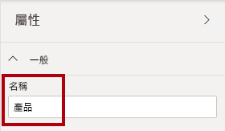

4. 若要在階層中新增第二個層級，請在 [屬性] 窗格的 [階層] 下拉式清單中選取 [子類別] (您可能需要在窗格內向下捲動)。

5. 若要將第三個層級新增至階層，請在 [階層] 下拉式清單中，選取 [Product]。

6. 若要完成階層設計，請按一下 [套用層級變更]。

    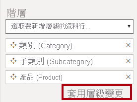

    *提示：別忘了按一下 [套用層級變更]，這個步驟很容易會錯誤地忽略。*

7. 在 [欄位] 窗格中，注意 [Products] 階層。

    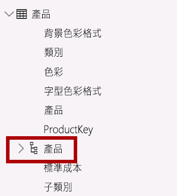

8. 若要顯示階層層級，請展開 [Products] 階層。

    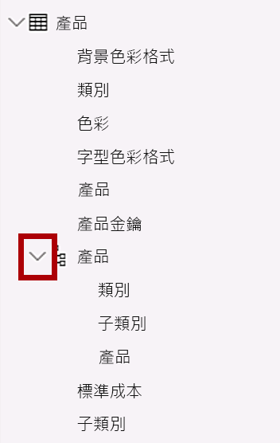

9. 若要將資料行組織到顯示資料夾中，在 [欄位] 窗格中，先選取 [背景色彩格式] 資料行。

10. 按下 **Ctrl** 鍵的同時，選取 [字型色彩格式] 資料行。

11. 在 [屬性] 窗格的 [顯示資料夾] 方塊中，輸入**格式**。

    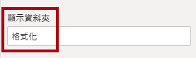

12. 在 [欄位] 窗格中，請注意這兩個資料行現在位於資料夾內。

    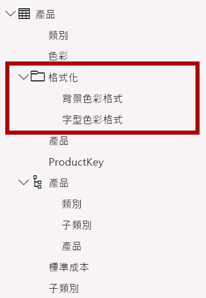

    *顯示資料夾是清理資料表的絕佳方式，特別是那些包含許多欄位的資料表。*

### **工作 2：設定 [Region] 資料表**

在此工作中，您將設定 [Region] 資料表。

1. 在 [Region] 資料表中，建立名為 [Regions] 的階層，其中包含下列三個層級：

    - Group

    - Country

    - 區域

    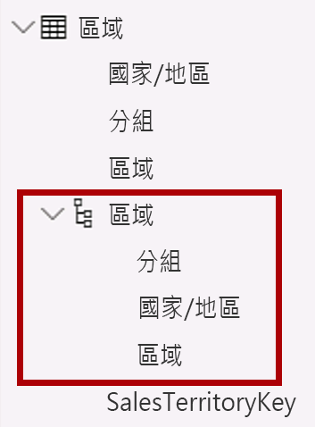

2. 選取 [Country] 資料行 (而不是 [Country] 階層層級)。

3. 在 [屬性] 窗格中，展開 [進階] 區段 (位於窗格底部)，然後在 [資料類別] 下拉式清單中選取 [國家/地區]。

    

    *資料分類可以提供提示給報表設計師。在此案例中，將資料行分類為國家或地區可在 Power BI 轉譯地圖視覺效果時為其提供更精確的資訊。*

### **工作 3：設定 [Reseller] 資料表**

在此工作中，您將設定 [Reseller] 資料表。

1. 在 [Reseller] 資料表中，建立名為 [Resellers] 的階層，其中包含下列兩個層級：

    - Business Type

    - Reseller

    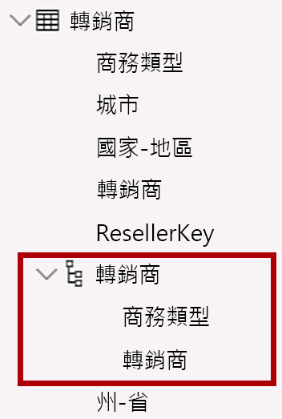

2. 建立名為 [Geography] 的第二個階層，其具有下列四個層級：

    - Country-Region

    - State-Province

    - City

    - Reseller

    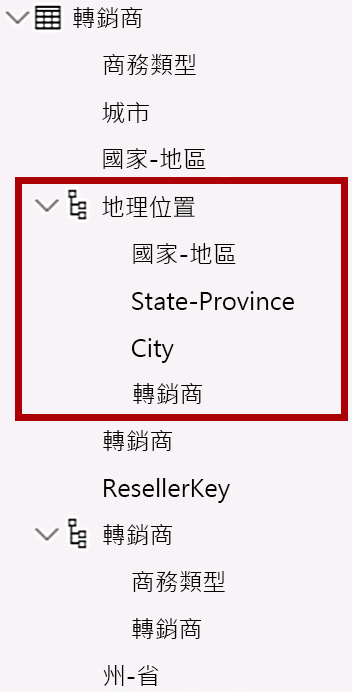

3. 分類下列三個資料行：

    - **Country-Region**為**國家/地區**

    - **State-Province** 為**縣市**

    - **City** 為**城市**

### **工作 4：設定 [Sales] 資料表**

在此工作中，您將設定 [Sales] 資料表。

1. 在 [Sales] 資料表中，選取 [Cost] 資料行。

2. 在 [屬性] 窗格的 [描述] 方塊中，輸入：**以標準成本為基礎**

    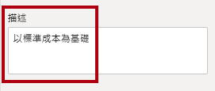

    *可以將描述套用至資料表、資料行、階層或量值。在 [欄位] 窗格中，當報表作者將游標停留在欄位上方時，描述文字會顯示在工具提示中。*

3. 選取 [Quantity] 資料行。

4. 在 [屬性] 窗格中，從 [格式] 區段中，將 [千位分隔符號] 屬性滑動到 [開啟]。

    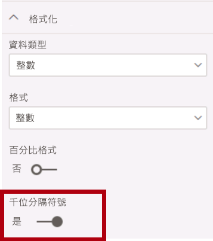

5. 選取 [Unit Price] 資料行。

6. 在 [屬性] 窗格中，從 [格式] 區段中，將 [小數位數] 屬性滑動到 [2]。

7. 在 [進階] 群組中 (您可能需要向下捲動捲動以找到它)，在 [摘要方式] 下拉式清單中，選取 [平均]。

    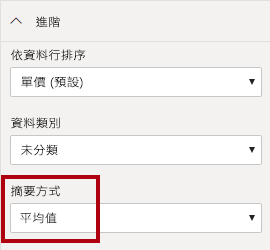

    *根據預設，數值資料行會透過將值加總在一起來進行彙總。此預設行為不適用於如 [Unit Price] 之類的資料行，因為其代表費率。將預設摘要設定為 [平均] 將會產生具有意義的結果。*

### **工作 5：大量更新屬性**

In this task you will update multiple columns using single bulk updates. You will use this approach to hide columns, and format column values.

1. 在 [欄位] 窗格中，選取 [Product \| ProductKey] 資料行。

2. 按下 **Ctrl** 鍵時，選取下列 13 個資料行 (跨多個資料表)：

    - Region \| SalesTerritoryKey

    - Reseller \| ResellerKey

    - Sales \| EmployeeKey
    
    - Sales \| ProductKey

    - Sales \| ResellerKey

    - Sales \| SalesOrderNumber

    - Sales \| SalesTerritoryKey

    - Salesperson \| EmployeeID

    - Salesperson \| EmployeeKey

    - Salesperson \| UPN

    - SalespersonRegion \| EmployeeKey

    - SalespersonRegion \| SalesTerritoryKey

    - Targets \| EmployeeID

3. 在 [屬性] 窗格中，將 [已隱藏] 屬性滑動到 [開啟]。

    

    *資料行已隱藏，因為其是由關聯性使用，或是用於資料列層級安全性設定或計算邏輯。*

    *您將會在 **Power BI Desktop 中的模型資料 (第 2 部分)** 實驗室中使用 **UPN** 資料行來定義資料列層級安全性。您將會於「在 Power BI Desktop 中建立 DAX 計算 (第 1 部分)」實驗室中於計算中使用 **SalesOrderNumber**。*

4. 複選以下三個資料行：

    - Product \| Standard Cost

    - Sales \| Cost

    - Sales \| Sales

5. 在 [屬性] 窗格中，從 [格式] 區段中，將 [小數位數] 屬性滑動到 [0] \(零\)。

    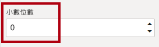

## **練習 3：檢閱模型介面**

在此練習中，您將會切換至 [報表] 檢視，並檢閱模型介面。

### **工作 1：檢閱模型介面**

在此工作中，您將會切換至 [報表] 檢視，並檢閱模型介面。

1. 切換至 [報表] 檢視。

2. 在 [欄位] 窗格中，注意下列項目：

    - 資料行、階層與其層級都是欄位，可以用來設定報表視覺效果

    - 只會顯示與報表製作相關的欄位

    - 不會顯示 [SalespersonRegion] 資料表，因為其所有欄位都已隱藏

    - [Region] 與 [Reseller] 資料表中的空間欄位已使用空間圖示來裝置

    - 以 Sigma 符號 (Ʃ) 裝飾的欄位依預設會彙總

    - 將游標停留在 [Sales \| Cost] 欄位上方時會出現工具提示

3. 展開 [Sales \| OrderDate] 欄位，然後注意其會顯示日期階層。

    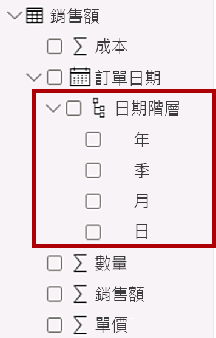

    *[Targets \| TargetMonth] 欄位會提供類似的階層。這些階層不是由您建立的。其是由系統自動建立的。不過，有個問題。Adventure Works 財務年度於每年 7 月 1 日開始。但是，在這些自動建立的日期階層中，年度日期階層會於每年 1 月 1 日開始。*

    *您現在將會關閉此自動行為。於《在 Power BI Desktop 中建立 DAX 計算，第 1 部分》實驗室中，您將使用 DAX 建立日期資料表，並加以設定以定義 Adventure Works 的行事曆。*

4. 若要關閉自動日期/時間，請按一下 [檔案] 功能區索引標籤以開啟 Backstage 檢視。

5. 在左側，選取 [選項及設定]，然後選取 [選項]。

    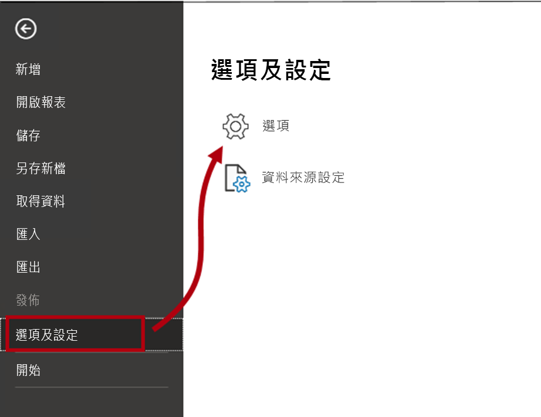

6. 在 [選項] 視窗中，在左側的 [目前的檔案] 群組中，選取 [資料載入]。

    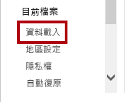

7. 在 [時間智慧] 區段中，取消選取 [自動日期/時間]。

    

8. 按一下 [確定]。

    

9. 在 [欄位] 窗格中，請注意日期階層已無法再使用。

    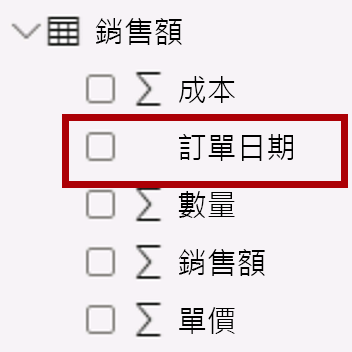

### **工作 2：完成**

在此工作中，您將完成實驗室。

1. 儲存 Power BI Desktop 檔案。

2. 如果系統提示您套用查詢，請按一下 [稍後套用]。

3. 若您想要開始下一個實驗室，請讓 Power BI Desktop 保持開啟狀態。

    *您將會在「Power BI Desktop 中的模型資料 (第 2 部分)」實驗室中，透過設定多對多關聯性與資料列層級安全性來增強資料模型。*
