---
lab:
  title: 在 Power BI Desktop 中建立 DAX 計算 (第 1 部分)
  module: Module 5 - Create Model Calculations using DAX in Power BI
---


# <a name="create-dax-calculations-in-power-bi-desktop-part-1"></a>**在 Power BI Desktop 中建立 DAX 計算 (第 1 部分)**

**實驗室的完成時間估計為 45 分鐘**

在此實驗室中，您將使用 Data Analysis Expression (DAX) 建立導出資料表、計算結果欄和簡單量值。

在此實驗中，您將了解如何：

- 建立導出資料表

- 建立計算結果欄

- 建立量值

### <a name="lab-story"></a>**實驗室案例**

此實驗室為一系列實驗室的其中之一，其設計用意是完整呈現資料準備到報表和儀表板發行的整個過程。 您可以依照任何順序完成實驗室。 然而，若您想要逐步完成多個實驗室，建議您依照下列順序完成前 10 個實驗室：

1. 在 Power BI Desktop 中準備資料

2. 在 Power BI Desktop 中載入資料

3. 在 Power BI Desktop 中設計資料模型

5. **在 Power BI Desktop 中建立 DAX 計算 (第 1 部分)**

6. 在 Power BI Desktop 中建立 DAX 計算 (第 2 部分)

7. 在 Power BI Desktop 中設計報表，第 1 部分

8. 在 Power BI Desktop 中設計報表，第 2 部分

9. 建立 Power BI 儀表板

10. 在 Power BI Desktop 中執行資料分析

11. 強制執行資料列層級安全性

## <a name="exercise-1-create-calculated-tables"></a>**練習 1：建立導出資料表**

在此練習中，您要建立兩份導出資料表。 第一個是 Salesperson 資料表，以允許其與 Sales 資料表之間的直接關聯性。 第二個是 Date 資料表。

### <a name="task-1-get-started"></a>**工作 1：開始作業**

在此工作中，您將設定實驗室的環境。

*重要：若您是從上一個實驗室繼續進行 (且已成功完成該實驗室)，請不要完成此工作；相反地，請從下一個工作繼續。*

1. 若要開啟 Power BI Desktop，請在工作列上按一下 [Microsoft Power BI Desktop] 捷徑。

    

1. 若要關閉 [開始使用] 視窗，請按一下視窗左上角的 [X]。

    

1. 若要開啟 Power BI Desktop 入門檔案，請按一下 [檔案] 功能區索引標籤，開啟 Backstage 檢視畫面。

1. 選取 [開啟報表]。

    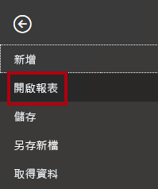

1. 按一下 [瀏覽報表]。

    

1. 在 [開啟] 視窗中，瀏覽至 **D:\PL300\Labs\05-create-dax-calculations-in-power-bi-desktop\Starter** 資料夾。

1. 選取 **Sales Analysis** 檔案。

1. 按一下 [開啟]。

    

1. 關閉任何可能開啟的資訊視窗。

1. 若要建立檔案的複本，請按一下 [檔案] 功能區索引標籤，以開啟 Backstage 檢視。

1. 選取 [另存新檔]。

    

1. 若系統提示您套用變更，請按一下 [套用]。

    

1. 在 [另存新檔] 視窗中，瀏覽至 **D:\PL300\MySolution** 資料夾。

1. 按一下 [檔案] 。

    

### <a name="task-2-create-the-salesperson-table"></a>**工作 2：建立 Salesperson 資料表**

在此工作中，您會建立 [銷售人員] 資料表 (與 [銷售額] 的直接關聯性)。

1. 在 Power BI Desktop 的 [報表] 檢視中，從 [模型] 功能區的 [計算] 群組內，按一下 [新增資料表]。

    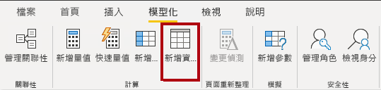

2. 在公式列 (在建立或編輯計算時直接在功能區下方開啟) 中，輸入 **Salesperson =**，按 **Shift+Enter**，輸入 **'Salesperson (Performance)'**，然後按 **Enter** 鍵。

    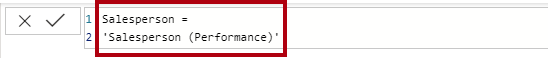

    *為了方便起見，此實驗室中的所有 DAX 定義都可從程式碼片段檔案複製，位置為 **D:\PL300\Labs\05-create-dax-calculations-in-power-bi-desktop\Assets\Snippets.txt**。*

    *建立導出資料表的方式是先輸入資料表名稱，後面接著等號 (=)，然後是傳回資料表的 DAX 公式。請注意，資料表名稱不可與資料模型中的名稱重複。*

    *公式列支援輸入有效的 DAX 公式，其中包含自動完成、Intellisense 和色彩編碼等功能，可讓您快速且正確地輸入公式。*

    *此資料表定義會建立 [銷售人員 (績效)] 資料表的複本。此定義只會複製資料，不會複製可見度、格式化等屬性。*

    *提示：建議您輸入「空白字元」(也就是歸位字元和定位字元)，以直觀且易讀的格式配置公式，尤其是當公式冗長且複雜時，更需如此。若要輸入歸位字元，請按 **Shift+Enter**。您可自行選擇是否輸入「空白字元」。*

3. 在 [欄位] 窗格中，請留意資料表圖示是藍色的陰影 (表示導出資料表)。

    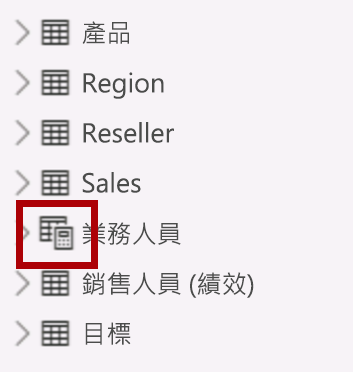

    *導出資料表是以傳回資料表的 DAX 公式所定義。請務必了解，導出資料表會將值具體化並加以儲存，因此會增加資料模型的大小。每當重新整理公式相依性時，這些資料表就會重新計算，而且在新的 (未來) 日期值載入資料表時，此資料模型也會如此。*

    *不同於 Power Query 所產生的資料表，系統無法使用導出資料表來載入外部資料來源的資料。這些資料表只能根據已載入資料模型的資料來轉換資料。*

4. 切換至 [模型] 檢視。

5. 您會發現 [銷售人員] 資料表可供使用 (請注意，檢視畫面可能不會直接顯示此資料表，請左右捲動加以尋找)。

6. 建立從 [銷售人員 \| EmployeeKey] 資料行到 [銷售額 \| EmployeeKey] 資料行的關聯性。

7. 以滑鼠右鍵按一下 [銷售人員 (效能)] 資料表與 [銷售] 資料表之間的非作用中關聯性，然後選取 [刪除]。

    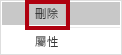

8. 當系統提示您確認刪除時，請按一下 [刪除]。

    

9. 在 [銷售人員] 資料表中，多重選取下列資料行，然後將這些資料行隱藏 (將 [隱藏] 屬性設為 [是])：

    - EmployeeID

    - EmployeeKey

    - UPN

10. 在模型圖表中，選取 [銷售人員] 資料表。

11. 在 [屬性] 窗格的 [描述] 方塊中，輸入：**與銷售額相關的銷售人員**

    *您應該記得，使用者將游標停留在資料表或欄位上方時，描述會以 [欄位] 窗格中的工作提示形式出現。*

12. 針對 [銷售人員 (效能)] 資料表，將描述設定為：**與區域相關的銷售人員**

    *資料模型現在可在分析銷售人員時提供兩個替代選項。[銷售人員] 資料表可用來分析銷售人員所產生的銷售額，而 [銷售人員 (績效)] 資料表則可供分析指派給銷售人員之銷售區域的銷售額。*

### <a name="task-3-create-the-date-table"></a>**工作 3：建立日期資料表**

在此工作中，您會建立 [日期] 資料表。

1. 切換至 [資料] 檢視。

    

2. 在 [首頁] 功能區索引標籤上，從 [計算] 群組內按一下 [新增資料表]。

    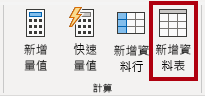

3. 在公式列中，輸入下列內容：


    **DAX**


    ```
    Date =  
    CALENDARAUTO(6)
    ```


    

    
    *CALENDARAUTO() 函式會傳回由日期值組成的單一資料行資料表。「自動」行為會掃描資料模型的所有日期資料行，以判斷儲存在資料模型中的最舊和最新日期值。接著，系統會為此範圍內的每個日期建立資料列，並朝任一方向擴充範圍，以確保各個年度的所有資料都已確實儲存。*

    *此函式可採用開放自由選用的單一引數，也就是一年中的最後一個月份。若加以省略，其值將是 12，表示 12 月是一年的最後一個月。此案例中會輸入 6，表示 6 月是一年的最後一個月。*

4. 請注意日期值的資料行。

    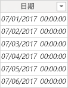

    *顯示的日期會使用美國地區設定 (即 mm/dd/yyyy) 進行格式化。*

5. 在左下角的狀態列中查看資料表統計資料，確認已產生 1826 個資料列，這代表五個完整年度的資料。

    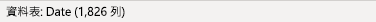

### <a name="task-4-create-calculated-columns"></a>**工作 4：** **建立計算結果欄**

在此工作中，您會新增額外的資料行，以便依據不同期間加以篩選和分組。 您也會建立一個計算結果欄，以控制其他資料行的排序順序。

*為了方便起見，此實驗室中的所有 DAX 定義都可從程式碼片段檔案複製，位置為 **D:\PL300\Labs\05-create-dax-calculations-in-power-bi-desktop\Assets\Snippets.txt**。*

1. 在 [資料表工具] 內容功能區中，從 [計算] 群組內按一下 [新增資料行]。

    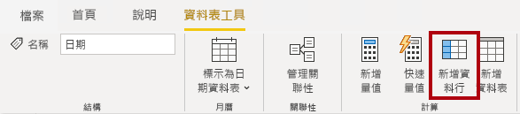

2. 在公式列中輸入下列內容 (或從程式碼片段檔案複製)，然後按 **Enter**：


    **DAX**


    ```
    Year =
    "FY" & YEAR('Date'[Date]) + IF(MONTH('Date'[Date]) > 6, 1)
    ```


    *建立計算結果欄的方式是先輸入資料行名稱，後面接著等號 (=)，然後是傳回單一值結果的 DAX 公式。資料行名稱不可與資料表中的名稱重複。*

    *此公式會使用日期的年度值，但如果月份落在六月之後，年度值就會加一。這是 Adventure Works 計算會計年度的方式。*

3. 確認已新增資料行。

    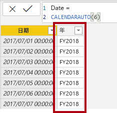

4. 使用程式碼片段檔案定義，為 [日期] 資料表建立下列兩個計算結果欄：

    - Quarter

    - Month

    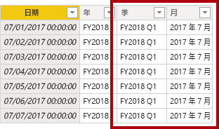

5. 若要驗證計算，請切換至 [報表] 檢視。

6. 若要建立新的報表頁面，請在左下方按一下加號圖示。

    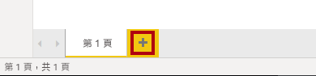

7. 若要將矩陣視覺效果新增至新的報表頁面，請在 [視覺效果] 窗格中選取矩陣視覺效果類型。

    *提示：將游標停留在各個圖示上方，即可顯示說明視覺效果類型的工具提示。*

    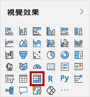

8. 在 [欄位] 窗格的 [日期] 資料表中，將 Year 欄位拖曳至 [資料列] 井/區域中。

    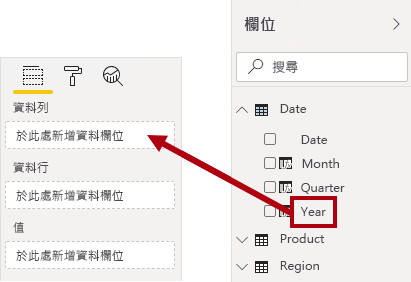

9. 將 Month 欄位拖曳至 [資料列] 井/區域中，放在 Year 欄位的正下方。

    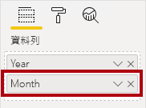

10. 在矩陣視覺效果的右上方 (或底部，依視覺效果的位置而有所不同)，按一下分叉雙箭號圖示 (這會將所有年度向下展開一層)。

    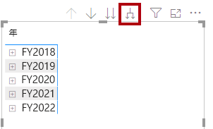

11. 請注意，年度會展開為月份，而月份會依字母順序排序，而不是按時間順序。

    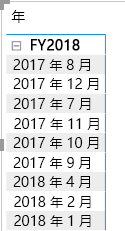

    *根據預設，文字值會依字母順序排序，數字會由小至大排序，日期則會由舊至新排序。*

12. 若要自訂 Month 欄位的排序順序，請切換至 [資料] 檢視。

13. 將 **MonthKey** 資料行新增至 [日期] 資料表。


    **DAX**


    ```
    MonthKey =
    (YEAR('Date'[Date]) * 100) + MONTH('Date'[Date])
    ```


    *此公式會計算每個年度/月份組合的數值。*

14. 在 [資料] 檢視中，確認新資料行包含數值 (例如，201707 表示 2017 年 7 月等等)。

    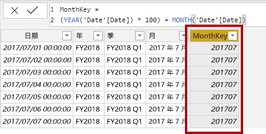

15. 切換回 [報表] 檢視。

16. 在 [欄位] 窗格中，確定已選取 Month 欄位 (選取時，此欄位會有深灰色背景)。

17. 在 [資料行工具] 內容功能區中，從 [排序] 群組內按一下 [依資料行排序]，然後選取 [MonthKey]。

    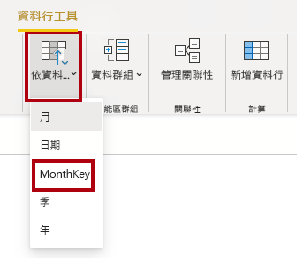

18. 在矩陣視覺效果中，您會發現月份此時依時間排序。

    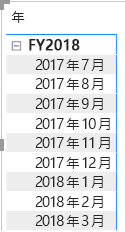

### <a name="task-5-complete-the-date-table"></a>**工作 5：** **完成日期資料表**

在此工作中，您需隱藏資料行並建立階層，以完成 [日期] 資料表的設計。 接著，您會建立 [銷售] 和 [目標] 資料表的關聯性。

1. 切換至 [模型] 檢視。

2. 在 [日期] 資料表中，將 [MonthKey] 資料行隱藏 (將 [隱藏] 設為 [是])。

3. 在 [欄位] 右側窗格中，選取 [日期] 資料表，以滑鼠右鍵按一下 [年度] 資料行，然後選取 [建立階層]。 

4. 以滑鼠右鍵按一下新建立的階層，然後按一下 [重新命名]，將其重新命名為 [會計]。 
5. 在 [欄位] 窗格中選取下列兩個剩餘欄位並按一下滑鼠右鍵，然後選取 [新增至階層] -> [會計]，將其新增至 [會計] 階層。
    
    - Quarter

    - Month

    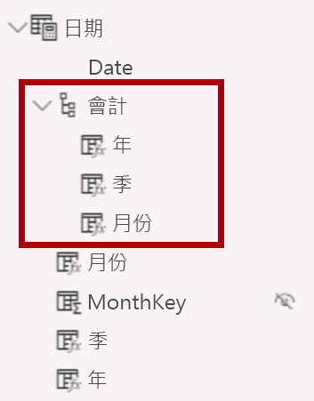

6. 建立下列兩個模型關聯性：

    - **日期 \| 日期**與**銷售額 \| OrderDate**

    - **日期 \| 日期**與**目標 \| TargetMonth**

7. 隱藏以下兩個資料行：

    - 銷售額 \| OrderDate

    - 目標 \| TargetMonth

### <a name="task-6-mark-the-date-table"></a>**工作 6：標示日期資料表**

在此工作中，您會將 [日期] 資料表標示為日期資料表。

1. 切換至 [報表] 檢視。

2. 在 [欄位] 窗格中，選取 **Date** 資料表 (非 **Date** 欄位)。

3. 在 [資料表工具] 內容功能區中，從 [日曆] 群組內按一下 [標示為日期資料表]，然後選取 [標示為日期資料表]。

    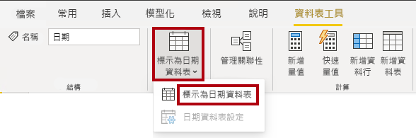

4. 在 [標示為日期資料表] 視窗的 [日期資料行] 下拉式清單中，選取 [日期]。

    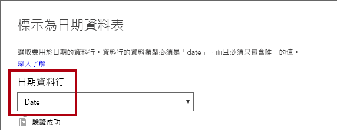

5. 按一下 [確定]。

    

6. 儲存 Power BI Desktop 檔案。

    *Power BI Desktop 此時會了解此資料表定義了日期 (時間)。若您需要仰賴時間智慧計算，這就相當重要。您會於 **在 Power BI Desktop 中建立 DAX 計算 (第 2 部分)** 實驗室中運用時間智慧計算。*

    *請注意，如果您的資料來源中沒有日期資料表，就適合使用這種日期資料表設計方法。如果您有資料倉儲資料庫的存取權，您應從日期維度資料表載入日期資料，而不要在資料模型中「重新定義」日期邏輯。*

## <a name="exercise-2-create-measures"></a>**練習 2：建立量值**

在此練習中，您會建立並格式化數個量值。

### <a name="task-1-create-simple-measures"></a>**工作 1：建立簡單量值**

在此工作中，您會建立簡單的量值。 簡單量值會彙總資料表中單一資料行或計數資料列中的值。

1. 在 [報表] 檢視畫面的**第 2 頁**中，從 [欄位] 窗格將 [銷售額 \| 單價] 欄位拖放到矩陣視覺效果中。

    *實驗室使用速記標記法來參考欄位。其看起來將會像下面這樣：銷售額  單價。在此範例中，Sales (銷售額) 是資料表名稱，而 Unit Price (單價) 是欄位名稱。

    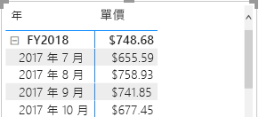

    *回顧一下，在「Power BI Desktop 中的模型資料 (第 2 部分)」實驗室中，您將 [單價] 資料行設定為依 [平均] 來建立摘要。您在矩陣視覺效果中看到的結果是每月平均單價 (單價總和值除以單價計數)。*

2. 在視覺效果欄位窗格 (位於 [視覺效果] 窗格底下) 的 [值] 井/區域中，您會看到畫面上已列出 [單價]。

    

3. 按一下 [單價] 的向下箭號，並留意可用的功能表選項。

    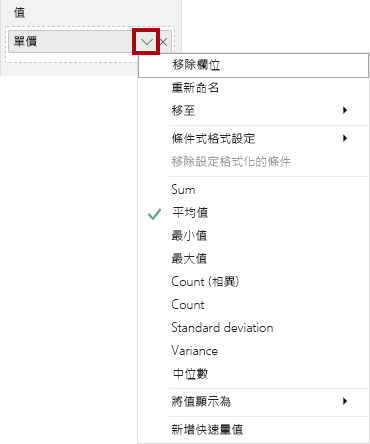

    *可見的數值資料行可讓報表建立者在報表設計階段決定資料行的彙總方式 (或是否彙總)。這可能會導致建立者獲得不適當的報表。不過，有些資料建模者不想賭運氣，他們會選擇隱藏這些資料行，改而公開由量值所定義的彙總邏輯。這就是您在此實驗室中即將採用的方法。*

4. 若要建立量值，請在 [欄位] 窗格中以滑鼠右鍵按一下 [銷售] 資料表，然後選取 [新增量值]。

    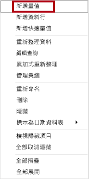

5. 在公式列中，新增下列量值定義：


    **DAX**


    ```
    Avg Price =  
    ‎AVERAGE(Sales[Unit Price])
    ```


6. 將 [平均價格] 量值新增至矩陣視覺效果。

7. 請注意，其產生的結果與 [單價] 資料行相同 (但格式不同)。

8. 在 [值] 井中，開啟 [平均價格] 欄位的操作功能表，並注意您無法變更彙總技術。

    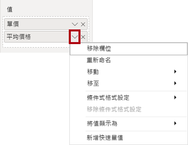

    *您無法修改量值的彙總行為。*

9. 使用程式碼片段檔案定義，為 [銷售] 資料表建立下列五個量值：

    - 中間價格

    - 最低價格

    - 最高價格

    - 訂單

    - 訂單明細

    *[訂單] 量值中使用的 DISTINCTCOUNT() 函式只會計算訂單一次 (忽略重複項目)。[訂單明細] 量值中使用的 COUNTROWS() 函式會對資料表進行運算。*

    *在此案例中，訂單數是透過計算相異的 **SalesOrderNumber** 資料行值所得出，而訂單明細的數目就是資料表資料列的數目 (每個資料列分別是訂單的一行)。*

10. 切換至 [模型] 檢視，然後複選四個價格量值：[平均價格]、[最高價格]、[中間價格] 和 [最低價格]。

11. 複選量值時，請設定下列需求：

    - 將格式設定為兩個小數位數

    - 指派給名為 **Pricing** 的顯示資料夾

    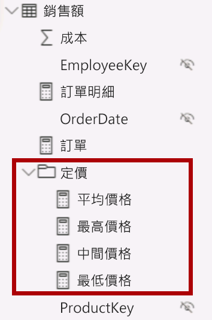

12. 隱藏 [單價] 資料行。

    *報表建立者目前無法使用 [單價] 資料行，必須使用您所新增至模型的量值。這種設計方法可確保報表建立者不會以不適當的方式彙總價格，例如以加總方式來彙總。*

13. 複選 [訂單明細] 和 [訂單] 量值，並設定下列需求：

    - 設定使用千位分隔符號的格式

    - 指派給名為 **Counts** 的顯示資料夾

    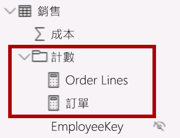

14. 在 [報表] 檢視畫面的矩陣視覺效果 [值] 井/區域中，針對 [單價] 欄位，按一下 [X] 加以移除。

    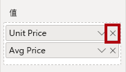

15. 增加矩陣視覺效果的大小，以符合頁面寬度和高度。

16. 將下列五個量值新增至矩陣視覺效果：

    - 中間價格

    - 最低價格

    - 最高價格

    - 訂單

    - 訂單明細

17. 確認結果看起來很合理，且格式正確。

    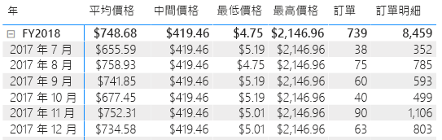


### <a name="task-2-finish-up"></a>**工作 2：完成**

在此工作中，您將完成實驗室。

1. 儲存 Power BI Desktop 檔案。

2. 若您想要開始下一個實驗室，請將 Power BI Desktop 保持開啟狀態。

    *您需使用**在 Power BI Desktop 中建立 DAX 計算 (第 2 部分)** 實驗室中的 DAX 執行更進階的計算作業，提升資料模型的品質。*
