---
lab:
  title: 在 Power BI Desktop 中建立 DAX 計算，第 2 部分
  module: Module 5 - Create Model Calculations using DAX in Power BI
---


# <a name="create-dax-calculations-in-power-bi-desktop-part-2"></a>**在 Power BI Desktop 中建立 DAX 計算，第 2 部分**

**實驗室的完成時間估計為 45 分鐘**

在此實驗室中，您將使用與篩選內容操作有關的 DAX 運算式來建立量值。

在此實驗中，您將了解如何：

- 使用 CALCULATE() 函式來操作篩選內容

- 使用時間智慧函式

### <a name="lab-story"></a>**實驗室案例**

此實驗室為一系列實驗室的其中之一，其設計用意是完整呈現資料準備到報表和儀表板發行的整個過程。 您可以依照任何順序完成實驗室。 然而，若您想要逐步完成多個實驗室，建議您依照下列順序完成前 10 個實驗室：

1. 在 Power BI Desktop 中準備資料

2. 在 Power BI Desktop 中載入資料

3. 在 Power BI Desktop 中設計資料模型

5. 在 Power BI Desktop 中建立 DAX 計算，第 1 部分

6. **在 Power BI Desktop 中建立 DAX 計算，第 2 部分**

7. 在 Power BI Desktop 中設計報表，第 1 部分

8. 在 Power BI Desktop 中設計報表，第 2 部分

9. 建立 Power BI 儀表板

10. 在 Power BI Desktop 中執行資料分析

11. 強制執行資料列層級安全性

## <a name="exercise-1-work-with-filter-context"></a>**練習 1：使用篩選內容**

在此練習中，您將使用與篩選內容操作有關的 DAX 運算式來建立量值。

### <a name="task-1-get-started"></a>**工作 1：開始作業**

在此工作中，您將設定實驗室的環境。

*重要：若您是從上一個實驗室繼續進行 (且已成功完成該實驗室)，請不要完成此工作；相反地，請從下一個工作繼續。*

1. 若要開啟 Power BI Desktop，請在工作列上按一下 [Microsoft Power BI Desktop] 捷徑。

    

1. 若要關閉 [開始使用] 視窗，請按一下視窗左上角的 [X]。

    

1. 若要開啟 Power BI Desktop 入門檔案，請按一下 [檔案] 功能區索引標籤以開啟 Backstage 檢視。

1. 選取 [開啟報表]。

    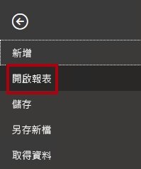

1. 按一下 [瀏覽報表]。

    

1. 在 [開啟] 視窗中，瀏覽至 **D:\PL300\Labs\06-create-dax-calculations-in-power-bi-desktop-advanced\Starter** 資料夾。

1. 選取 **Sales Analysis** 檔案。

1. 按一下 [開啟]。

    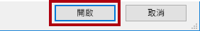

1. 關閉任何可能開啟的資訊視窗。

1. 若要建立檔案的複本，請按一下 [檔案] 功能區索引標籤，以開啟 Backstage 檢視。

1. 選取 [另存新檔]。

    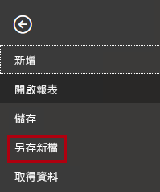

1. 若系統提示您套用變更，請按一下 [套用]。

    

1. 在 [另存新檔] 視窗中，瀏覽至 **D:\PL300\MySolution** 資料夾。

1. 按一下 [檔案] 。

    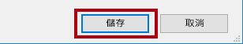

### <a name="task-2-create-a-matrix-visual"></a>**工作 2：建立矩陣視覺效果**

在此工作中，您將建立一個矩陣視覺效果，以支援新量值的測試。

1. 在 Power BI Desktop 的 [報表] 檢視中，建立新的報表頁面。

    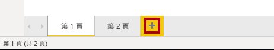

2. 在 [第 3 頁] 上，新增矩陣視覺效果。

    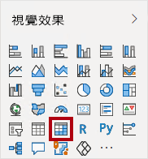

3. 調整矩陣視覺效果的大小，以填滿整個頁面。

4. 若要設定矩陣視覺效果欄位，請從 [欄位] 窗格中將 [Region \| Region] 階層拖放到視覺效果內。

    *實驗室使用速記標記法來參考欄位或階層。其看起來將會像下面這樣：[Region \| Regions]。在此範例中，**Region** 是資料表名稱，而 **Regions** 是階層名稱。*

5. 同時請新增 [Sales \| Sales] 欄位。

6. 若要展開整個階層，請在矩陣視覺效果的右上方，按分叉雙箭號圖示兩次。

    

    *您應該記得，[Regions] 階層具有 [Group]、[Country] 和 [Region] 層級。*

7. 若要將視覺效果格式化，請在 [視覺效果] 窗格底下選取 [格式] 窗格。

    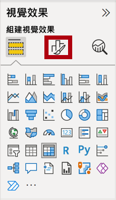

8. 在 [搜尋] 方塊中，輸入**分層式**。

    

9. 將 [分層式配置] 屬性設定為 [關閉]。

    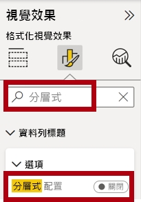

10. 確認矩陣視覺效果有四個資料行標頭。

    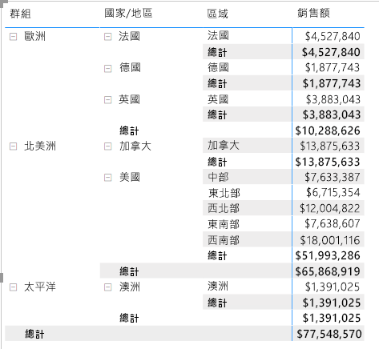

    *在 Adventure Works 中，銷售區域會分類為群組、國家/地區以及區域。所有國家/地區 (美國除外) 都只有一個區域，以國家/地區命名。由於美國是大型銷售領域，因此分成五個銷售區域。*

    *您將在此練習中建立數個量值，然後將其新增至矩陣視覺效果中，以進行測試。*

### <a name="task-3-manipulate-filter-context"></a>**工作 3：操作篩選內容**

在此工作中，您將使用會採用 CALCULATE() 函式操作篩選內容的 DAX 運算式來建立數個量值。

1. 根據下列運算式，將量值新增至 [Sales] 資料表：

    *為了方便起見，此實驗室中的所有 DAX 定義都可從 **D:\PL300\Labs\06-create-dax-calculations-in-power-bi-desktop-advanced\Assets\Snippets.txt** 檔案複製。*


    **DAX**


    ```
    Sales All Region =

    CALCULATE(SUM(Sales[Sales]), REMOVEFILTERS(Region))
    ```


    *CALCULATE() 函式是用來操作篩選內容的強大函式。第一個引數會取用運算式或量值 (量值就是一個具名運算式)。後續引數可讓您修改篩選內容。*

    *REMOVEFILTERS() 函式會移除作用中的篩選準則。此函式可以不使用引數，或以資料表、資料行或多個資料行作為其引數。*

    *在此公式中，量值會在修改過的篩選內容中評估 [Sales] 資料行的總和，該內容會移除套用至 [Region] 資料表之資料行的任何篩選。*

2. 將 [Sales All Region] 量值新增至矩陣視覺效果。

    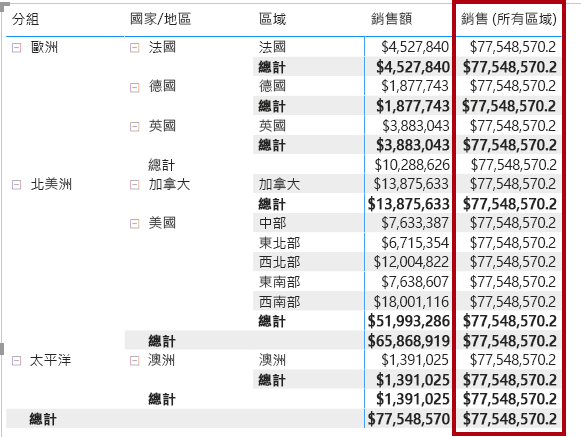

3. 請注意，[所有區域的銷售] 量值會計算每個區域、國家/地區 (小計) 和群組 (小計) 的所有地區銷售額的總計。

    *此量值尚無法提供有用的結果。當群組、國家/地區或區域的銷售額除以此值時，將會產生一個有用的比率，稱為「總計百分比」。*

4. 在 [欄位] 窗格中，確定已選取 [Sales All Region] 量值 (選取後，其將會具有深灰色背景)，然後在公式列中，將量值名稱和公式取代為下列公式：

    *提示：若要取代現有的公式，請先複製程式碼片段。然後，按一下公式列內部，並按 **Ctrl+A** 以選取所有文字。接著，按 **Ctrl+V** 貼上程式碼片段，以覆寫選取的文字。然後，按 **Enter**。*


    **DAX**


    ```
    Sales % All Region =  
    ‎DIVIDE(  
    ‎ SUM(Sales[Sales]),  
    ‎ CALCULATE(  
    ‎ SUM(Sales[Sales]),  
    ‎ REMOVEFILTERS(Region)  
    ‎ )  
    ‎)
    ```


    *量值已重新命名，以正確反映更新的公式。DIVIDE() 函式會將 [Sales] 量值 (未經篩選內容修改)，除以修改內容中的 [Sales] 量值，其會移除套用至 [Region] 資料表的所有篩選。*

5. 在矩陣視覺效果中，請留意量值已重新命名，且每個群組、國家/地區和區域此時都會顯示不同的值。

6. 將 [所有區域的銷售百分比] 量值格式化為具有兩個小數位數的百分比。

7. 在矩陣視覺效果中，檢閱 [所有區域的銷售百分比] 量值。

    

8. 根據下列運算式將另一個量值新增至 [銷售] 資料表，並格式化為百分比：


    **DAX**

    ```
    Sales % Country =  
    ‎DIVIDE(  
    ‎ SUM(Sales[Sales]),  
    ‎ CALCULATE(  
    ‎ SUM(Sales[Sales]),  
    ‎ REMOVEFILTERS(Region[Region])  
    ‎ )  
    ‎)
    ```


9. 請注意，[國家/地區的銷售百分比] 量值公式與 [所有區域的銷售百分比] 量值公式略有不同。

    *不同之處在於，分母修改篩選內容的方式為移除 [Region] 資料表之 [Region] 資料行的篩選條件，而不是 [Region] 資料表的所有資料行。這表示，套用至群組或國家/地區資料行的任何篩選條件仍會保留。其結果將會以國家/地區百分比的形式顯示銷售額。*

10. 將 [國家/地區的銷售百分比] 量值新增至矩陣視覺效果。

11. 請注意，只有美國的區域會產生不是 100% 的值。

    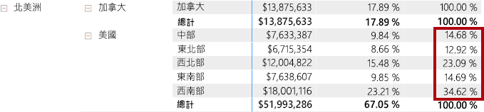

    *您應該記得，只有美國才有多個區域。所有其他國家/地區都只有單一區域，因此其值皆為 100%。*

12. 若要在視覺效果中改善此量值的可讀性，請使用此改良的公式來覆寫 [國家/地區的銷售百分比] 量值。


    **DAX**


    ```
    Sales % Country =  
    ‎IF(  
    ‎ ISINSCOPE(Region[Region]),  
    ‎ DIVIDE(  
    ‎ SUM(Sales[Sales]),  
    ‎ CALCULATE(  
    ‎ SUM(Sales[Sales]),  
    ‎ REMOVEFILTERS(Region[Region])  
    ‎ )  
    ‎ )  
    ‎)
    ```


    *ISINSCOPE() 函式內嵌在 IF() 函式中，可用來測試區域資料行是否為層級階層中的層級。若為 true，則會評估 DIVIDE() 函式。若缺少 false 部分，表示當區域資料行不在範圍內時，就會傳回空值。*

13. 請注意，就目前而言，只有區域位於範圍內時，[國家/地區的銷售百分比] 量值才會傳回值。

    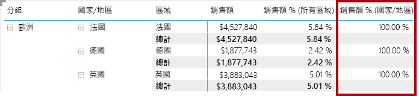

14. 根據下列運算式將另一個量值新增至 [銷售] 資料表，並格式化為百分比：


    **DAX**


    ```
    Sales % Group =  
    ‎DIVIDE(  
    ‎ SUM(Sales[Sales]),  
    ‎ CALCULATE(  
    ‎ SUM(Sales[Sales]),  
    ‎ REMOVEFILTERS(  
    ‎ Region[Region],  
    ‎ Region[Country]  
    ‎ )  
    ‎ )  
    ‎)
    ```


    *若要以群組百分比的形式來顯示銷售額，可以套用兩個篩選條件，以有效移除兩個資料行上的篩選條件。*

15. 將 [群組的銷售百分比] 量值新增至矩陣視覺效果。

16. 若要在視覺效果中改善此量值的可讀性，請使用此改良的公式來覆寫 [群組的銷售百分比] 量值。


    **DAX**


    ```
    Sales % Group =  
    ‎IF(  
    ‎ ISINSCOPE(Region[Region])  
    ‎ || ISINSCOPE(Region[Country]),  
    ‎ DIVIDE(  
    ‎ SUM(Sales[Sales]),  
    ‎ CALCULATE(  
    ‎ SUM(Sales[Sales]),  
    ‎ REMOVEFILTERS(  
    ‎ Region[Region],  
    ‎ Region[Country]  
    ‎ )  
    ‎ )  
    ‎ )  
    ‎)
    ```


17. 請注意，就目前而言，只有區域或國家/地區位於範圍內時，[群組的銷售百分比] 量值才會傳回值。

18. 在 [模型] 檢視中，將三個新的量值放入名為 **Ratios** 的顯示資料夾中。

    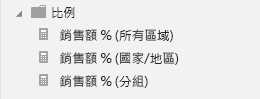

19. 儲存 Power BI Desktop 檔案。

    *新增至 [Sales] 資料表的量值已修改篩選內容，以達成階層式導覽的目的。請注意，若要達成計算小計的模式，必須從篩選內容中移除一些資料行，而若要算出總計，則必須移除所有資料行。*

## <a name="exercise-2-work-with-time-intelligence"></a>**練習 2：使用時間智慧**

在此練習中，您將建立年初至今的銷售 (YTD) 量值，和銷售年成長 (YoY) 量值。

### <a name="task-1-create-a-ytd-measure"></a>**工作 1：建立 YTD 量值**

在此工作中，您將建立銷售 YTD 量值。

1. 在 [報表] 檢視的 [第 2 頁] 上，請注意矩陣視覺效果顯示了在資料列上對年度和月份進行分組的各種量值。

2. 根據下列運算式將量值新增至 [銷售] 資料表，並格式化為零個小數位數：


    **DAX**


    ```
    Sales YTD =  
    ‎TOTALYTD(SUM(Sales[Sales]), 'Date'[Date], "6-30")
    ```


    *TOTALYTD() 函式會對指定的日期資料行評估運算式，在此案例中為 [Sales] 資料行的總和。日期資料行必須屬於標示為日期資料表的日期資料表，如同於《在 Power BI Desktop 中建立 DAX 計算，第 1 部分》實驗室中所做。*

    *此函式也可取用第三個選擇性引數，代表一年中的最後一個日期。若沒有此日期，表示 12 月 31 日為一年的最後一個日期。Adventure Works 以 6 月作為其年度的最後一個月，因此使用 "6-30"。*

3. 將 [銷售] 欄位和 [銷售 YTD] 量值新增至矩陣視覺效果。

4. 請注意年度內銷售值的累積。

    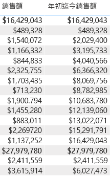

    *TOTALYTD() 函式會執行篩選操作，特別是時間篩選操作。例如，若要計算 2017 年 9 月 (會計年度的第三個月) 的 YTD 銷售額，[Date] 資料表的所有篩選都會移除，並取代為新的日期篩選 (從年度起始日 2017 年 7 月 1 日開始，並延伸至內容日期範圍的最後一個日期 2017 年 9 月 30 日)。*

    *請注意，DAX 中有許多時間智慧函式可支援常見的時間篩選操作。*

### <a name="task-2-create-a-yoy-growth-measure"></a>**工作 2：建立 YoY 成長量值**

在此工作中，您將建立銷售 YoY 成長量值。

1. 根據下列運算式，將其他量值新增至 [銷售] 資料表：


    **DAX**


    ```
    Sales YoY Growth =  
    ‎VAR SalesPriorYear =  
    ‎ CALCULATE(  
    ‎ SUM(Sales[Sales]),  
    ‎ PARALLELPERIOD(  
    ‎ 'Date'[Date],  
    ‎ -12,  
    ‎ MONTH  
    ‎ )  
    ‎ )  
    ‎RETURN  
    ‎ SalesPriorYear
    ```


    *[Sales YoY Growth] 量值公式會宣告一個變數。變數有助於簡化公式邏輯，且在公式需要多次評估運算式時，將可提高效率 (對 YoY 成長邏輯而言就是如此)。變數是由唯一名稱所宣告，隨後，量值運算式則必須在 **RETURN** 關鍵字之後輸出。*

    *系統會為 **SalesPriorYear** 變數指派一個運算式，使用 PARALLELPERIOD() 函式將篩選內容中的每個日期往回移 12 個月，以在修改過的內容中計算 [Sales] 資料行的總和。*

2. 將 [銷售 YoY 成長] 量值新增至矩陣視覺效果。

3. 請注意，新的量值針對前 12 個月會傳回空值 (因為在會計年度 2017 之前沒有任何銷售記錄)。

4. 請注意，[2018 Jul] 的 [Sales YoY Growth] 值為 [2017 Jul] 的 [Sales] 值。

    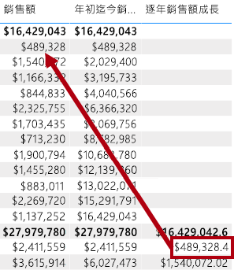

    *現在，公式「困難的部分」已經過測試，接下來您可以使用計算成長結果的最終公式來覆寫量值。*

5. 若要完成量值，請使用此公式覆寫 [銷售 YoY 成長] 量值，並將其格式化為兩個小數位數的百分比：


    **DAX**


    ```
    Sales YoY Growth =  
    ‎VAR SalesPriorYear =  
    ‎ CALCULATE(  
    ‎ SUM(Sales[Sales]),  
    ‎ PARALLELPERIOD(  
    ‎ 'Date'[Date],  
    ‎ -12,  
    ‎ MONTH  
    ‎ )  
    ‎ )  
    ‎RETURN  
    ‎ DIVIDE(  
    ‎ (SUM(Sales[Sales]) - SalesPriorYear),  
    ‎ SalesPriorYear  
    ‎ )
    ```


6. 在公式的 **RETURN** 子句中，請注意變數會被參考兩次。

7. 確認 **2018 年 7 月**的 YoY 成長為 **392.83%**。

    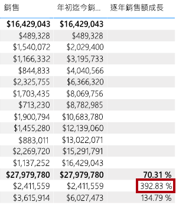

    *這表示 2018 年 7 月的銷售額 ($2,411,559) 比前一年在相同時間達成的銷售額 ($489,328) 成長了將近 400% (接近 4 倍)。*

8. 在 [模型] 檢視中，將兩個新的量值放入名為 **Time Intelligence** 的顯示資料夾中。

    

### <a name="task-3-finish-up"></a>**工作 3：完成作業**

在此工作中，您將完成實驗室。

1. 若要清除準備用於報表開發的方案，請在左下角以滑鼠右鍵按一下 [第 2 頁] 索引標籤，然後選取 [刪除頁面]。

    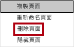

2. 當系統提示您刪除頁面時，按一下 [刪除]。

    

3. 請一併刪除 [第 3 頁]。

4. 在剩餘的頁面中，若要清除頁面，請選取資料表視覺效果，然後按下 **Delete** 鍵。

5. 儲存 Power BI Desktop 檔案。

6. 若您想要開始下一個實驗室，請將 Power BI Desktop 保持開啟狀態。

    *您將會根據《在 Power BI Desktop 中設計報表，第 1 部分》實驗室中的資料模型來建立報表。*
