---
lab:
  title: 在 Power BI Desktop 中設計報表，第 1 部分
  module: Module 7 - Create Reports
---

# **在 Power BI Desktop 中設計報表，第 1 部分**

**完成實驗室的估計時間為 45 分鐘**

In this lab you will create a three-page report. You will then publish it to Power BI, whereupon you will open and interact with the report.

在此實驗室中，您將了解如何：

- 設計報表

- 設定視覺效果欄位和格式屬性

### **實驗室案例**

This lab is one of many in a series of labs that was designed as a complete story from data preparation to publication as reports and dashboards. You can complete the labs in any order. However, if you intend to work through multiple labs, for the first 10 labs, we suggest you do them in the following order:

1. 在 Power BI Desktop 中準備資料

2. 在 Power BI Desktop 中載入資料

3. 在 Power BI Desktop 中設計資料模型

5. 在 Power BI Desktop 中建立 DAX 計算，第 1 部分

6. 在 Power BI Desktop 中建立 DAX 計算，第 2 部分

7. **在 Power BI Desktop 中設計報表，第 1 部分**

8. 在 Power BI Desktop 中設計報表，第 2 部分

9. 建立 Power BI 儀表板

10. 在 Power BI Desktop 中執行資料分析

11. 強制執行資料列層級安全性

## **練習 1：建立報表**

在此練習中，您將建立一個名為 **Sales Report** 的三頁報表。

### **工作 1：開始使用 - 登入**

在此工作中，您將登入 Power BI 以設定實驗室的環境。

*重要：若您已登入 Power BI，請繼續進行下一個工作。*

1. 若要開啟 Microsoft Edge，請按一下工作列上的 [Microsoft Edge] 程式捷徑。

    

1. 在 Microsoft Edge 瀏覽器視窗中，瀏覽至 **https://powerbi.com**。

    *提示：您也可以使用 Microsoft Edge [我的最愛] 列上的 [Power BI 服務] 我的最愛項目。*

1. 按一下 [登入] (位於右上角)。

    

1. 輸入提供給您的帳戶詳細資料 (請查看＜資源＞)。

1. 若系統提示您更新密碼，請重新輸入提供的密碼，然後輸入並確認新密碼。

    *重要：請務必記錄您的新密碼。*

1. 完成登入程序。

1. 若 Microsoft Edge 提示您保持登入，請按一下 [是]。

1. 讓 Microsoft Edge 瀏覽器視窗保持開啟。

### **工作 2：開始使用 – 啟用地圖及區域分布圖視覺效果**

在此工作中，您將透過更新 Power BI 系統管理入口網站中的 [整合設定]，在實驗室的環境中啟用地圖及區域分布圖視覺效果。 

1. 若要開啟 Power BI 系統管理入口網站，請按一下瀏覽器右上方的 [設定] 圖示。

    

1. 選取 [系統管理入口網站]。

    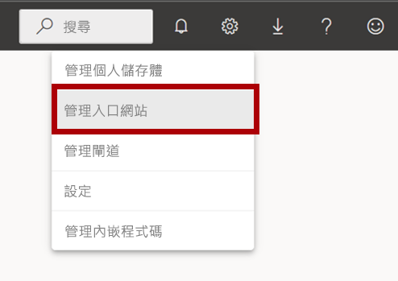

1. Scroll down the page to Integration settings. Click the arrow to expand the Map and filled map visuals option.

    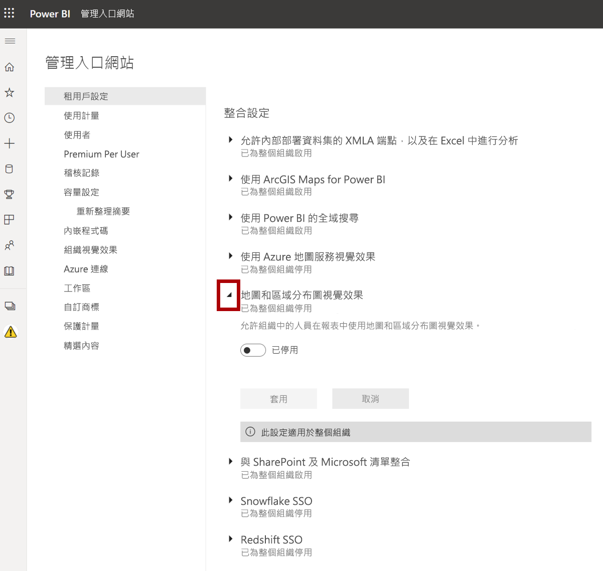

1. 將 [地圖及區域分布圖視覺效果] 選項設定為 [已啟用]。

1. 按一下 [套用] 以套用變更。 

    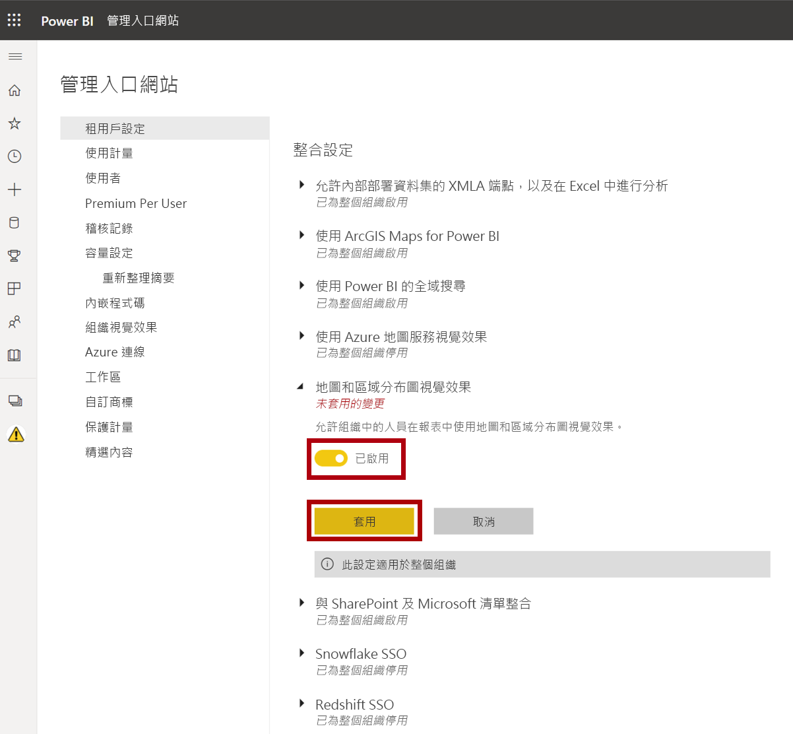

1. 系統會在瀏覽器右上方顯示一則訊息，指出將在接下來 15 分鐘內套用租用戶設定變更。 

    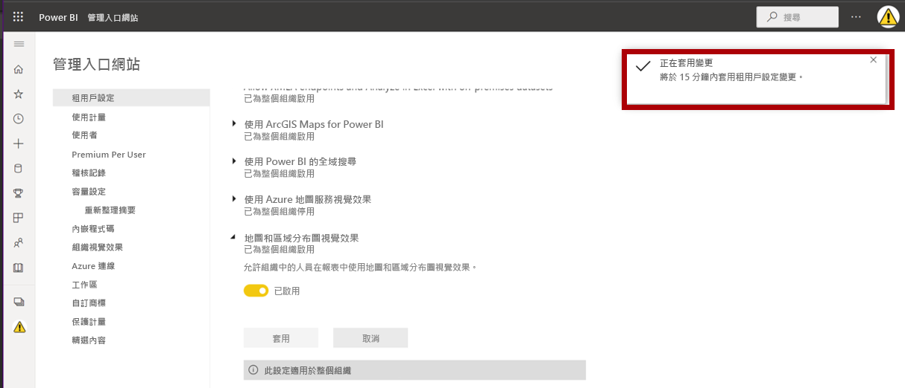

1. 讓 Microsoft Edge 瀏覽器視窗保持開啟。

### **工作 3：開始使用 – 開啟報表**

在此工作中，您將開啟入門報表以設定實驗室的環境。

*重要：若您是從上一個實驗室繼續進行 (且已成功完成該實驗室)，請不要完成此工作；相反地，請從下一個工作繼續。*

1. 若要開啟 Power BI Desktop，請在工作列上按一下 [Microsoft Power BI Desktop] 捷徑。

    

2. 若要關閉 [開始使用] 視窗，請按一下視窗左上角的 [X]。

    

3. 若要登入 Power BI 服務，請按一下右上角的 [登入]。

    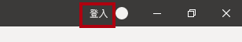

4. 使用您用來登入 Power BI 服務的相同帳戶以完成登入程序。

5. 若要開啟 Power BI Desktop 入門檔案，請按一下 [檔案] 功能區索引標籤以開啟 Backstage 檢視。

6. 選取 [開啟報表]。

    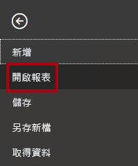

7. 按一下 [瀏覽報表]。

    

8. 在 [開啟] 視窗中，瀏覽至 **D:\PL300\Labs\07-design-report-in-power-bi-desktop\Starter** 資料夾。

9. 選取 **Sales Analysis** 檔案。

10. 按一下 [開啟]。

    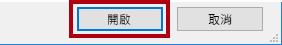

11. 關閉任何可能開啟的資訊視窗。

12. 若要建立檔案的複本，請按一下 [檔案] 功能區索引標籤，以開啟 Backstage 檢視。

13. 選取 [另存新檔]。

    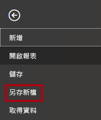

14. 若系統提示您套用變更，請按一下 [套用]。

    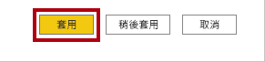

15. 在 [另存新檔] 視窗中，瀏覽至 **D:\PL300\MySolution** 資料夾。

16. 按一下 [檔案] 。

    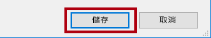

### **工作 4：設計第 1 頁**

In this task you will design the first report page. When you’ve completed the design, the page will look like the following:

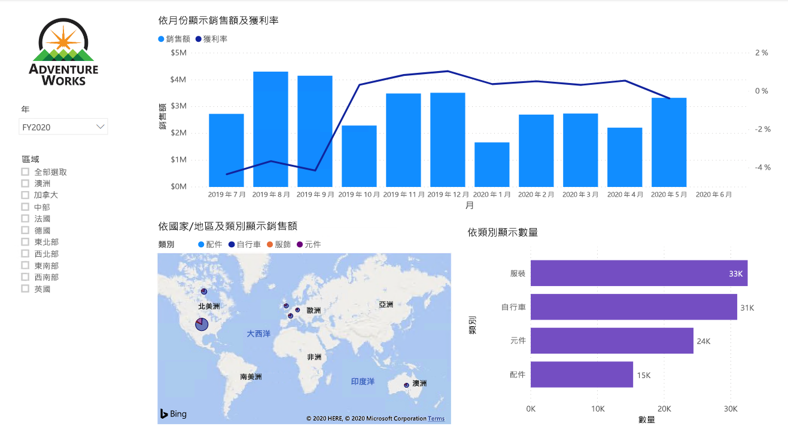

1. 在 Power BI Desktop 中，若要重新命名頁面，請以滑鼠右鍵按一下左下方的 [第 1 頁]，然後選取 [重新命名]。

    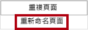

    *提示：您也可以按兩下頁面名稱來加以重新命名。*

2. 將頁面重新命名為 [概觀]，然後按 **Enter**。

    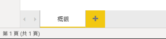

3. 若要新增影像，請在 [插入] 功能區索引標籤上，從 [元素] 群組中，按一下 [影像]。

    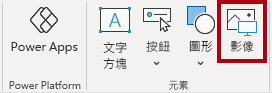

4. 在 [開啟] 視窗中，瀏覽至 **D:\PL300\Resources** 資料夾。

5. 選取 **AdventureWorksLogo.jpg** 檔案，然後按一下 [開啟]。

    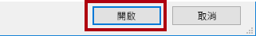

6. 拖曳影像以將其放置在左上角，並拖曳輔助標記來調整其大小。

    

7. 若要加入交叉分析篩選器，請先按一下報表頁面的空白區域，以取消選取該影像。
8. 在 [欄位] 窗格中，選取 [Date \| Year] 欄位 (不是階層的 **Year** 層級)。
    
    *實驗室使用速記標記法來參考欄位。其看起來將會像下面這樣：[Date \| Year]。在此範例中，**Date** 是資料表名稱，而 **Year** 則是欄位名稱。*

9. 請注意，以「年」作為值的資料表已新增至報表頁面。

10. 若要將視覺效果從資料表轉換為交叉分析篩選器，請在 [視覺效果] 窗格中，選取 [交叉分析篩選器]。

    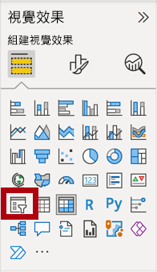

11. 若要將交叉分析篩選器從清單轉換為下拉式清單，請按一下交叉分析篩選器右上方的向下箭號，然後選取 [下拉式]。

    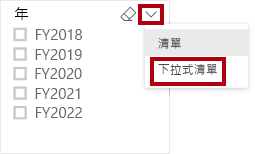

12. 調整交叉分析篩選器的大小與位置，使其位於影像下方，並且與影像同寬。

    

13. 在 [Year] 交叉分析篩選器中，開啟下拉式清單並選取 [FY2020]，然後摺疊下拉式清單。

    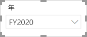

    *報表頁面現在會依 **FY2020** 年進行篩選。*

14. 按一下報表頁面的空白區域，以取消選取交叉分析篩選器。

15. 根據 [Region \| Region] 欄位 (不是階層的 **Region** 層級) 建立第二個交叉分析篩選器。

16. 將交叉分析篩選器保留為清單，然後調整交叉分析篩選器的大小，並將其放置於 [Year] 交叉分析篩選器的下方。

    

17. 若要將交叉分析篩選器格式化，請在 [視覺效果] 窗格底下開啟 [格式] 窗格。

    

18. 展開 [選取控制項] 群組。

    

19. 將 [顯示 [全選] 選項] 設定為 [開啟]。

    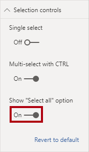

20. 在 [區域] 交叉分析篩選器中，您會看到第一個項目現在為 [全選]。

    *選取時，此項目會選取所有項目或取消選取所有項目。其可讓報表使用者設定必要的交叉分析篩選器項目。*

21. 按一下報表頁面的空白區域，以取消選取交叉分析篩選器。

22. 若要將圖表新增至頁面，請在 [視覺效果] 窗格中，按一下 [折線圖和堆疊直條圖] 視覺效果類型。

    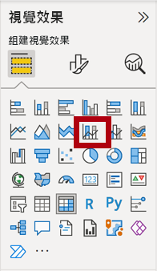

23. 調整視覺效果的大小和位置，使其位於標誌的右邊，並填滿報表頁面的寬度。

    

24. 將下列欄位拖曳至視覺效果：

    - Date \| Month

    - Sales \| Sales

25. 在 [視覺效果欄位] 窗格中 (不是 [欄位] 窗格，[視覺效果欄位] 窗格位於 [視覺效果] 窗格底下)，請注意，這些欄位會指派給 [共用軸] 和 [直條圖值] 井/區域。

    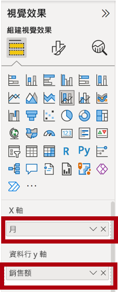

    *將欄位拖曳到視覺效果中，即可將其新增至預設區域。為求精確，您可以將欄位直接拖曳到區域中，如同您接下來要做的動作。*

26. 從 [欄位] 窗格中，將 [銷售] \| [毛利率] 欄位拖曳至 [折線圖值] 井/區域。

    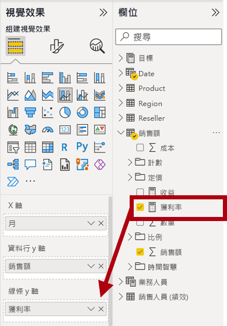

27. 請注意，視覺效果只有 11 個月。

    *該年的最後一個月 (2020 年 6 月) 沒有任何銷售額 (尚未)。根據預設，視覺效果已排除銷售額空白的月份。您現在會將視覺效果設定為顯示所有月份。*

28. 在 [視覺效果欄位] 窗格的 [共用軸] 井/區域中，針對 [月份] 欄位，按一下向下箭號，然後選取 [顯示沒有資料的項目]。

    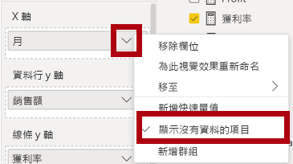

29. 請注意，現在應該會顯示 **2020 年 6 月**的月份。

30. 按一下報表頁面的空白區域，以取消選取圖表。

31. 若要將圖表新增至頁面，請在 [視覺效果] 窗格中，按一下 [地圖] 視覺效果類型。

    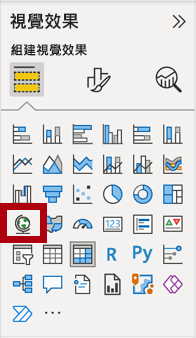

32. 調整視覺效果的大小和位置，使其位於直條圖/折線圖底下，並填滿上面圖表的一半寬度。

    

33. 將下列欄位新增至視覺效果區域：

    - 位置：**Region \| Country**

    - 圖例：**Product \| Category**

    - 大小：**Sales \| Sales**

34. 按一下報表頁面的空白區域，以取消選取圖表。

35. 若要將圖表新增至頁面，請在 [視覺效果] 窗格中，按一下 [叢集長條圖] 視覺效果類型。

    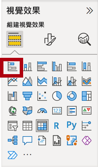

36. 調整視覺效果的大小和位置，使其填滿剩餘的報表頁面空間。

    

37. 將下列欄位新增至視覺效果區域：

    - 軸：**Product \| Category**

    - 值：**Sales \| Quantity**

38. 若要格式化視覺效果，請開啟 [格式] 窗格。

    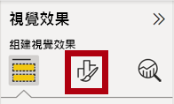

39. 展開 [資料色彩] 群組，然後將 [預設色彩] 屬性設為適當的色彩 (以強化直條圖/折線圖)。

40. 將 [資料標籤] 屬性設定為 [開啟]。

    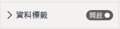

41. 儲存 Power BI Desktop 檔案。

    *第一個頁面的設計現在已完成。*

### **工作 5：設計第 2 頁**

在此實驗室中，您將會建立一份三頁報表。

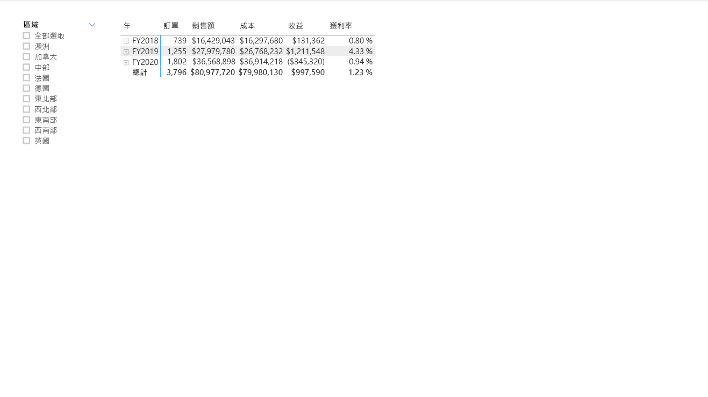

*重要：當在實驗室中提供了詳細指示後，實驗室步驟將會提供更精簡的指示。如需詳細指示，請參考此實驗室之前的其他工作。*

1. 若要建立新的頁面，請在左下方按一下加號圖示。

    

2. 將頁面重新命名為 [收益]。

    

  
‎ 

3. 根據 [Region \| Region] 欄位新增交叉分析篩選器。

4. 使用 [格式] 窗格啟用 [全部選取] 選項 (在 [選取控制項] 群組中)。

5. 調整交叉分析篩選器的大小和位置，使其位於報表頁面的左邊，大約佔頁面高度的一半。

    

6. 新增矩陣視覺效果，並調整其大小及位置，使其填滿報表頁面的剩餘空間

    

7. 將 [Date \| Fiscal] 階層新增至 [資料列] 矩陣的區域。

    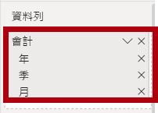

8. 將下列五個 [Sales] 資料表欄位新增至 [值] 區域：

    - 訂單 (來自 [計數] 資料夾)

    - 銷售額

    - 成本

    - 收益

    - 獲利率

    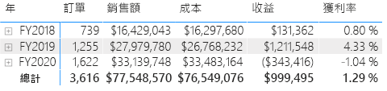

9. 在 [篩選] 窗格中 (位於 [視覺效果] 窗格的左側)，注意到 [此頁面上的篩選] (您可能需要向下捲動)。

    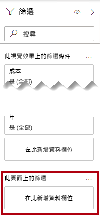

10. 從 [欄位] 窗格中，將 [Product \| Category] 欄位拖曳到 [此頁面上的篩選] 區域。

11. 在篩選器卡片內部，按一下右上方的箭號以摺疊卡片。

    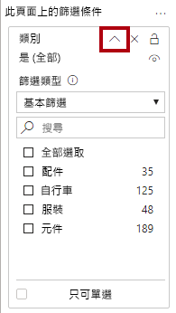

    *新增至 [篩選] 窗格的欄位，可以得到與交叉分析篩選器相同的結果。其中一個差異在於，其不會佔用報表頁面上的空間。另一個差異是，其可設定為達成更複雜的篩選需求。*

12. 將下列每個 [Product] 資料表欄位直接新增至 [類別] 卡片底下的 [此頁面上的篩選] 區域，並將其全部摺疊：

    - 子類別

    - 產品

    - 色彩

    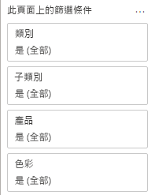

13. 儲存 Power BI Desktop 檔案。

    *第二個頁面的設計現在已完成。*

### **工作 6：設計第 3 頁**

接著，您會將其發佈到 Power BI，然後開啟報表並與之互動。

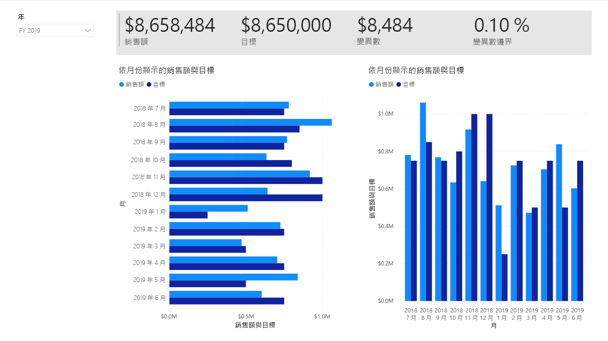

1. 建立新的頁面，然後將其重新命名為「我的效能」。

1. 若要模擬資料列層級安全性篩選的效能，請將 [Salesperson (Performance) \| Salesperson] 欄位拖曳至篩選窗格中的頁面層級篩選。
    
    ![篩選窗格中 [Salesperson] 欄位的影像。](Linked_image_Files/07-design-report-in-power-bi-desktop_image999.png) 

1. Select <bpt id="p1">**</bpt>Michael Blythe<ept id="p1">**</ept>. Data on the <bpt id="p1">**</bpt>My Performance<ept id="p1">**</ept> report page will now be filtered to display data for Michael Blythe only.

1. 根據 [Date \| Year] 欄位來新增下拉式交叉分析篩選器，然後調整其大小，並將其放置於頁面左上角。

    

1. 在交叉分析篩選器中，將頁面設定為依 **FY2019** 進行篩選。

    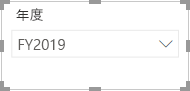

1. 新增 [多列卡片] 視覺效果，然後調整大小並重新置放，使其位於交叉分析篩選器的右邊並填滿頁面的剩餘寬度。

    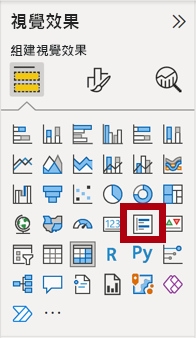

    

1. 將下列 4 個欄位新增至視覺效果：

    - Sales \| Sales

    - Targets \| Target

    - Targets \| Variance

    - Targets \| Variance Margin

1. 格式化視覺效果：

    - 在 [資料標籤] 群組中，將 [文字大小] 屬性提高至 [28pt]

    - 在 [背景] 群組中，將 [色彩] 設定為淺灰色

    

1. 新增 [群組橫條圖] 視覺效果，然後加以調整大小並放置，使其位於多列卡片視覺效果底下，並填滿頁面的剩餘高度及多列卡片視覺效果的一半寬度。

    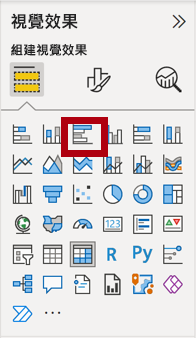

    

1. 將下列欄位新增至視覺效果區域：

    - 軸：**Date \| Month**

    - 值：[Sales \| Sales] 和 [Targets \| Target]

    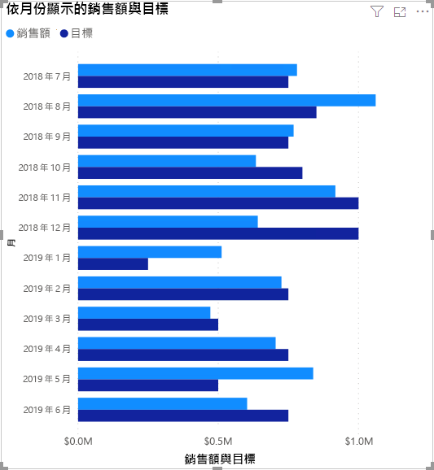

1. 若要建立視覺效果的複本，請按 **Ctrl + C**，然後按 **Ctrl + V**。

1. 將新的視覺效果放在原始視覺效果的右邊。

    

1. 若要修改視覺效果類型，請在 [視覺效果] 窗格中，選取 [叢集直條圖]。

    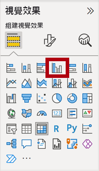

    *現在可能會看到依兩種不同視覺效果類型來表示的相同資料。這並不是使用頁面配置的好方法，然而，您將會於《在 Power BI Desktop 中設計報表，第 2 部分》實驗室中透過疊加視覺效果來加以改善。透過將按鈕新增至頁面，您將可讓報表使用者判斷要顯示這兩個視覺效果中的哪一個。*

    *現在，第三個 (且是最後一個) 頁面的設計已完成。*

### **工作 7：發佈報表**

在此工作中，您將會發佈報表。

1. 選取 [概觀] 頁面。

2. 儲存 Power BI Desktop 檔案。

3. 在 [首頁] 功能區索引標籤的 [共用] 群組內，按一下 [發佈]。

    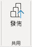

4. 請注意，在 [發佈至 Power BI] 視窗中已選取 [我的工作區]。

5. 若要發佈報表，請按一下 [選取]。

    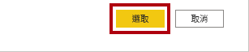

6. 當發佈成功時，請按一下 [了解]。

    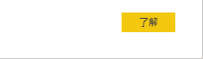

7. 將 Power BI Desktop 保持為開啟狀態。

    *在下一個練習中，您將探索 Power BI 服務中的報表。*

## **練習 2：探索報表**

在此練習中，您將探索發佈至 Power BI 的報表。

### **工作 1：探索報表**

在此工作中，您將探索發佈至 Power BI 的報表。

1. 在 Microsoft Edge 瀏覽器視窗中，在 Power BI 服務中的 [導覽] 窗格 (位於左側，且可能已摺疊) 展開 [我的工作區]。

    

2. 檢閱工作區的內容，並注意 [Sales Analysis] 報表與資料集。

    *當您發佈 Power BI Desktop 檔案時，資料模型會以資料集的形式發佈。*

    *若您未看到此項目，請按 **F5** 重新載入瀏覽器，然後再次展開工作區。*

    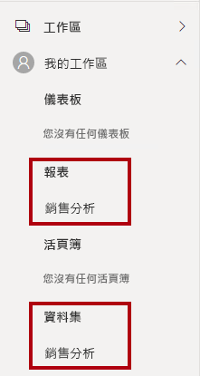

3. 若要開啟報表，請按一下 [Sales Analysis] 報表。

4. 在左側的 [頁面] 窗格中，選取 [概觀] 頁面。 

5. 在 [區域] 交叉分析篩選器中，按下 **Ctrl** 鍵，然後選取多個區域。

6. 在直條圖/折線圖中，選取任何月份的資料行來交叉篩選頁面。

7. 按下 **Ctrl** 鍵時，選取其他月份。

    *根據預設，交叉篩選會篩選頁面上的其他所有視覺效果。*

8. 請注意，長條圖會經過篩選和醒目提示，而較粗的長條代表篩選的月份。

9. 將游標暫留在橫條圖視覺效果上，然後在右上方將游標暫留在篩選器圖示上。

    

    *篩選圖示可讓您了解套用至視覺效果的所有篩選器，包括來自其他視覺效果的交叉分析篩選器和交叉篩選器。*

10. 將游標暫留在長條上，然後注意工具提示資訊。

11. 若要復原交叉篩選，請在直條圖/折線圖中，按一下視覺效果的空白區域。

12. 將游標暫留在地圖視覺效果上，然後按一下右上方的 [焦點模式] 圖示。

    

    *焦點模式會將視覺效果縮放至全頁大小。*

13. 將游標停留在橫條圖的不同區段上方，以顯示工具提示。

14. 若要返回報表頁面，請在左上方按一下 [返回報表]。

    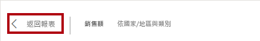

15. 再次將游標停留在地圖視覺效果上，然後按一下右上方的省略符號 (...)，並注意功能表選項。

    

16. 請嘗試 [在 Teams 中聊天] 以外的每個選項。

17. 在左側的 [頁面] 窗格中，選取 [收益] 頁面。

    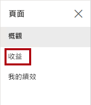

18. 請注意，[Region] 交叉分析篩選器在 [概觀] 頁面的 [Region] 交叉分析篩選器上有不同選擇。

    *交叉分析篩選器尚未同步。您將會於《在 Power BI Desktop 中設計報表，第 2 部分》實驗室中修改報表設計，以確保其會在頁面之間同步。*

19. 在 [篩選器] 窗格中 (位於右側)，展開篩選卡片，然後套用一些篩選器。

    *[篩選] 窗格可讓您定義更多篩選，超過符合頁面的交叉分析篩選器數量。*

20. 在矩陣視覺效果中，使用加號 (+) 按鈕，鑽研至 [會計] 階層。

21. 選取 [我的效能] 頁面。

    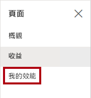

22. 在功能表列的右上方，按一下 [檢視]，然後選取 [全螢幕]。

    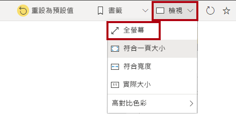

23. 藉由修改交叉分析篩選器與頁面進行互動，並交叉篩選頁面。

24. 請注意視窗下方用於變更頁面、在頁面之間往返巡覽，或是結束全螢幕模式的命令。

25. 按一下左側圖示以結束全螢幕模式。

    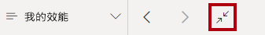

### **工作 2：完成**

在此工作中，您將完成實驗室。

1. 若要返回您的工作區，請在視窗網頁的橫幅中，按一下 [我的工作區]。

    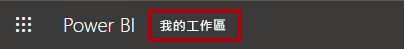

2. 讓 Microsoft Edge 瀏覽器視窗保持開啟。

    *您將會於《在 Power BI Desktop 中設計報表，第 2 部分》實驗室中使用進階功能增強報表設計。*
