---
lab:
  title: 增強Power BI Desktop中的報表
  module: 7 - Create Reports
---

# 增強Power BI Desktop中的報表

**實驗室的完成時間估計為 45 分鐘。**

在此實驗室中，您將使用進階設計功能來增強 **銷售分析** 。

在此實驗室中，您將了解如何：

- 同步交叉分析篩選器
- 建立鑽研頁面
- 套用條件式格式設定
- 建立和使用書籤

### **實驗室案例**

此實驗室為一系列實驗室的其中之一，其設計用意是完整呈現資料準備到報表和儀表板發行的整個過程。 您可以依照任何順序完成實驗室。 然而，若您想要逐步完成多個實驗室，建議您依照下列順序加以完成：

1. 在 Power BI Desktop 中準備資料
1. 在 Power BI Desktop 中載入資料
1. 在 Power BI 中設計資料模型
1. 在 Power BI Desktop 中建立 DAX 計算
1. 在 Power BI Desktop 中建立進階 DAX 計算
1. 在 Power BI Desktop 中設計報表
1. **增強Power BI Desktop中的報表**
1. 在 Power BI 中執行資料分析
1. 建立 Power BI 儀表板
1. 強制執行資料列層級安全性

## **練習 1：設定同步交叉分析篩選器**

在此練習中，您將同步處理報表頁面交叉分析篩選器。

### 工作 1：開始使用 - 登入

在這項工作中，您將藉由登入 Power BI 來設定實驗室的環境。

*注意：如果您已經登入 Power BI，請跳至下一個工作。*

1. 若要開啟 Microsoft Edge，請選取工作列上的 Microsoft Edge 程式捷徑。

     

1. 在 Microsoft Edge 瀏覽器視窗中，瀏覽至 **https://app.powerbi.com**。

    *提示：您也可以使用 Microsoft Edge [我的最愛] 列上的 [Power BI 服務] 我的最愛項目。*

1. 使用組織認證完成登入程式， (或提供給您) 的認證。 如果 Microsoft Edge 提示您保持登入，請選取 [是]。

1. 在 Microsoft Edge 瀏覽器視窗中，從 Power BI 服務的 [瀏覽] 窗格，展開 [我的工作區]。 讓 Microsoft Edge 瀏覽器視窗保持開啟。

     

### 工作 2：開始使用 - 開啟報表

在這項工作中，您將開啟入門報告來設定實驗室的環境。

*重要事項：如果您繼續從先前的實驗室 (，而且您已完成該實驗室已成功) ，請勿完成這項工作;請改為跳至下一個工作。*

1. 開啟 Power BI Desktop。

    

    *提示：根據預設，消費者入門對話方塊會在Power BI Desktop前面開啟。您可以選擇登入，然後關閉快顯視窗。*

1. 若要開啟入門Power BI Desktop檔案，請選取 [檔案 **] > [開啟報表] > [流覽報表**]。

1. 在 **[開啟** ] 視窗中，流覽至 **D：\PL300\Labs\07-design-report-in-power-bi-desktop-enhanced\Starter** 資料夾，然後開啟 **Sales Analysis** 檔案。

1. 關閉任何可能開啟的資訊視窗。

1. 注意功能區下方的黃色警告訊息。 

    *此訊息會提醒您查詢尚未套用為模型資料表載入的事實。您稍後會在此實驗室中套用查詢。*

    *若要關閉警告訊息，請在黃色警告訊息右側選取 **[X**]。*

1. 若要建立檔案的複本，請移至 [ **檔案] >** [另存新檔]，然後儲存至 **D：\PL300\MySolution** 資料夾。

1. 如果系統提示您套用變更，請選取 [稍後套用]。

### **工作 3：同步交叉分析篩選器**

在這項工作中，您將同步**處理 Year**和**Region**交叉分析篩選器，繼續在 Power BI Desktop 實驗室中**設計報表**中所建立的報表開發。

1. 在 Power BI Desktop 的 [概觀] 頁面上，將 [年度] 交叉分析篩選器設定為 [FY2018]。

1. 移至 [我的效能] 頁面，然後注意 [年度] 交叉分析篩選器是不同的值。
    
    *當交叉分析篩選器未同步處理時，可能會對報表使用者造成資料錯誤和挫折。您現在將會同步處理報表交叉分析篩選器。*

1. 返回 [概觀] 頁面，然後選取 [年度] 交叉分析篩選器。

1. 在 [檢視] 功能區索引標籤上，從 [顯示窗格] 群組中，選取 [同步交叉分析篩選器]。

     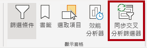

1. 在 [同步交叉分析篩選器] 窗格的 (位於 [視覺效果] 窗格的左側) 的第二個資料行 (代表同步處理) 中，勾選 [概觀] 和 [我的效能] 頁面的核取方塊。

     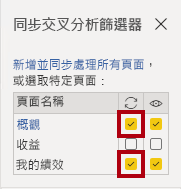

1. 在 [概觀] 頁面上，選取 [區域] 交叉分析篩選器。

1. 同步處理交叉分析篩選器與 [概觀] 和 [利潤] 頁面。

     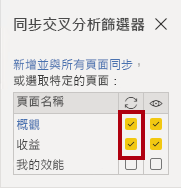

1. 選取不同的篩選選項，然後驗證已同步的交叉分析篩選器是否依相同的選項篩選，以測試同步交叉分析篩選器。

1. 若要關閉 [同步交叉分析篩選器] 頁面，請選取窗格右上角的 [X]。

## **練習 2：設定鑽研**

在此練習中，您將建立新的頁面，並將其設定為鑽研頁面。 當您完成設計時，此頁面會如下所示：

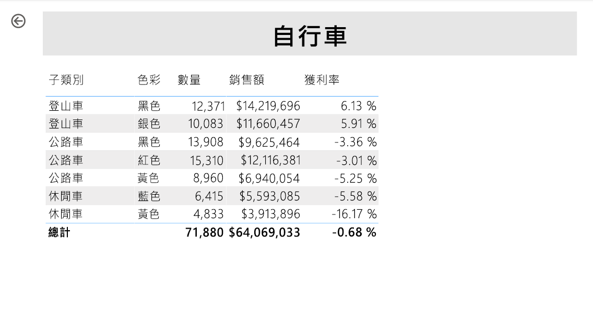

### **工作 1：建立鑽研頁面**

在此工作中，您將建立新的頁面，並將其設定為鑽研頁面。

1. 新增名為 [產品詳細資料] 的新報告頁面。

1. 以滑鼠右鍵按一下 [產品詳細資料] 頁面索引標籤，然後選取 [隱藏頁面]。
    
    *報表使用者將無法直接前往鑽研頁面。他們必須透過其他頁面上的視覺效果來加以存取。您將在此實驗室的最後一個練習中了解如何鑽研至該頁面。*

1. 在 [視覺效果] 窗格下方的 [鑽研] 區段中，將 [Product \| Category] 欄位新增至 [在此處新增鑽研欄位] 方塊。
    
    *實驗室使用速記標記法來參考欄位。其看起來將會像下面這樣：[Product \| Category]。在此範例中，**Product** 是資料表名稱，而 **Category** 是欄位名稱。*

     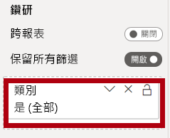

1. 若要測試鑽研頁面，請在鑽研篩選卡片中選取 [自行車]。

     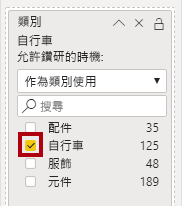

1. 在報告頁面的左上方，注意箭號按鈕。
    
    *當欄位新增至鑽研區/區域時，會自動新增箭號按鈕。它可讓報表使用者巡覽回他們鑽研的頁面。*

1. 在頁面中新增 [卡片] 視覺效果，然後調整其大小和位置，使其位於按鈕的右邊並填滿頁面的剩餘寬度。

    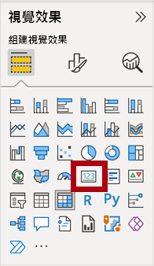

    

1. 將 [Product \| Category] 欄位拖曳到卡片視覺效果中。

1. 設定視覺效果的格式選項，然後將 [類別標籤] 屬性切換為 [關閉]。

     

1. 將 **Effects > Background** 色彩屬性設定為灰色的淺色底，例如 *白色，20% 較深*。

     

1. 在頁面中新增 [資料表] 視覺效果，然後調整其大小和位置，使其位於卡片視覺效果的下方並填滿頁面的剩餘空間。

     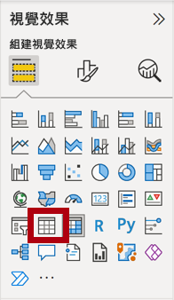

     

1. 將下列欄位新增至視覺效果：

     - Product \| Subcategory
     - Product \| Color
     - Sales \| Quantity
     - Sales \| Sales
     - Sales \| Profit Margin

1. 設定視覺效果的格式選項，然後在 [值] 區段中，將 [文字大小] 屬性設為 [20pt]。

*鑽研頁面的設計幾乎已完成。您將在下一個練習中透過條件式格式設定來強化頁面。*

## **練習 3：新增條件式格式設定**

在此練習中，您將使用條件式格式設定來增強鑽研頁面。 當您完成設計時，此頁面會如下所示：

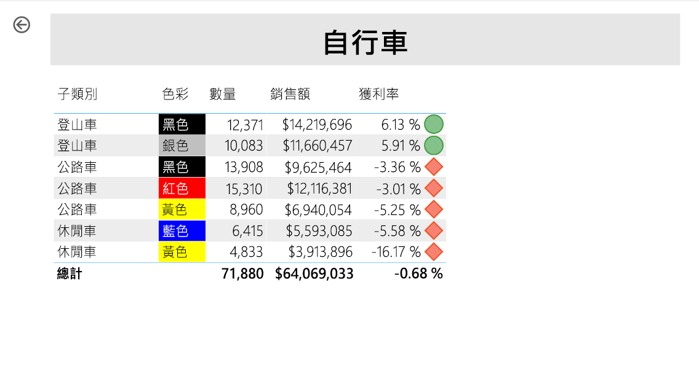

### **工作 1：新增條件式格式設定**

在這項工作中，您將使用條件式格式設定來增強鑽研頁面。

1. 選取資料表視覺效果。 在 [視覺效果] 窗格中，選取 **[收益邊界** ] 值上的向下箭號，然後選取 [ **條件式格式化 \| 圖示**]。

    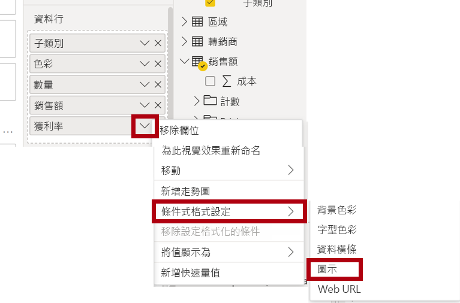

1. 在 [圖示 – Profit Margin] 視窗的 [圖示版面配置] 下拉式清單中，選取 [資料右邊]。

     

1. 若要刪除中間規則，請在黃色三角形右側選取 **[X**]。

     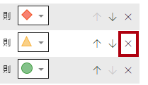

1. 設定第一個規則 (紅色菱形)，如下所示：

    - 在第二個控制項中，移除此值
    - 在第三個控制項中，選取 [數字]
    - 在第五個控制項中，輸入 **0**
    - 在第六個控制項中，選取 [數字]

1. 設定第二個規則 (綠色圓圈) 如下所示，然後選取 [ **確定**]：
    
    *規則可以解釋如下：如果利潤率值小於 0，則顯示紅色菱形；否則，如果此值很大或等於零，則會顯示綠色圓形。*

     - 在第二個控制項中，輸入 **0**
     - 在第三個控制項中，選取 [數字]
     - 在第五個控制項中，移除此值
     - 在第六個控制項中，選取 [數字]

     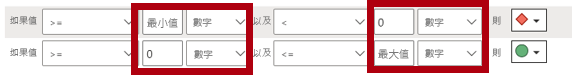

1. 在資料表視覺效果中，確認已顯示正確的圖示。

     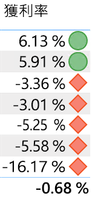

1. 設定 [色彩] 欄位的背景色彩條件式格式設定。

1. 在 [背景色彩 – 色彩] 視窗的 [設定樣式格式] 下拉式清單中，選取 [欄位值]。

1. 在 [ **我們應該根據什麼欄位？]** 下拉式清單中，選取 **[產品 \| 格式 \| 設定背景色彩格式**]，然後選取 **[確定**]。

     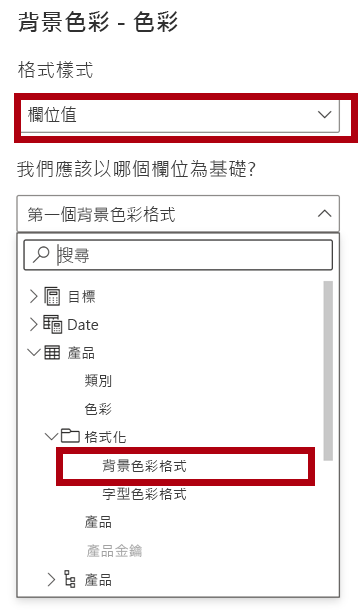

1. 重複上述步驟，以使用 [Product \| 格式設定 \| 字型色彩格式] 欄位，設定 [色彩] 欄位的字型色彩條件式格式設定

*您可能還記得，背景和字型色彩是來自《在 Power BI Desktop 中準備資料》實驗室的 **ColorFormats.csv** 檔案，再將其與《在 Power BI Desktop 中載入資料》實驗室的 **Product** 查詢整合。*

## **練習 4：新增書籤和按鈕**

在此練習中，您將使用按鈕來增強 **[我的效能** ] 頁面，讓報表使用者能夠選取要顯示的視覺效果類型。 當您完成設計時，此頁面會如下所示：

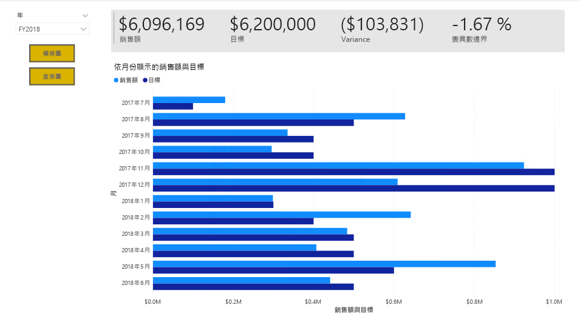

### **工作 1：新增書籤**

在此工作中，您將新增兩個書簽，一個用來顯示每個每月銷售/目標視覺效果。

1. 移至 [我的效能] 頁面。 在 [檢視] 功能區索引標籤上，從 [顯示窗格] 群組中，選取 [書籤]。

     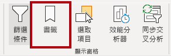

1. 在 [檢視] 功能區索引標籤上，從 [顯示窗格] 群組中，選取 [選取範圍]。

1. 在 [選取範圍] 窗格中，選取 [依月份的銷售額] 和 [依月份的目標] 項目旁邊的眼睛圖示，以隱藏視覺效果。

     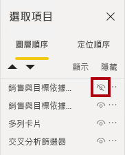

1. 在 [書籤] 窗格中，選取 [新增]。
    
    *若要重新命名書籤，請按兩下書籤。*

     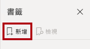

1. 如果可見的圖表是橫條圖，請將書籤重新命名為 [開啟橫條圖]，否則將書籤重新命名為 [開啟直條圖]。

1. 若要編輯書簽，請在 [ **書簽** ] 窗格中，將游標暫留在書簽上方，選取省略號，然後選取 [ **資料**]。
     
     *如果您停用 [資料] 選項，表示書籤不會使用目前的篩選狀態。請務必注意這一點，不然的話，書籤會永久鎖定 [年度] 交叉分析篩選器所套用的篩選準則。*

     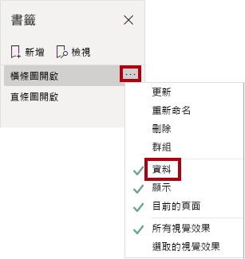

1. 若要更新書簽，請再次選取省略號，然後選取 [ **更新**]。
     
     *在下列步驟中，您將建立並設定第二個書籤來顯示第二個視覺效果。*

1. 在 [選取範圍] 窗格中，切換 [依月份的銷售額] 和 [依月份的目標] 兩個項目的可見度。
     
     *換句話說，讓可見的視覺效果隱藏起來，讓隱藏的視覺效果看得見。*

     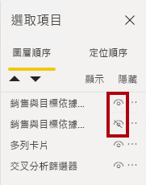

1. 建立第二個書籤並適當地命名 ([開啟直條圖] 或 [開啟橫條圖]**)**。

     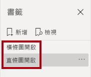

1. 設定第二個書籤以忽略篩選 ([資料] 選項關閉)，並更新書籤。

1. 在 [選取範圍] 窗格中，若要讓這兩個視覺效果均可見，只要顯示隱藏的視覺效果即可。

1. 調整這兩個視覺效果的大小和位置，使其填滿多張卡片視覺效果下方的頁面，且彼此完全重疊。
    
    *若要選取涵蓋的視覺效果，請在 [ **選取** 範圍] 窗格中加以選取。*

    

1. 在 [書籤] 窗格中，選取每個書籤，並注意只有其中一個視覺效果看得見。

*設計的下一個階段是在頁面中新增兩個按鈕，讓報告使用者選取書籤。*

### **工作 2：新增按鈕**

在此工作中，您將新增兩個按鈕，並將書簽動作指派給每個按鈕。

1. 在 [插入] 功能區中，從 [元素] 群組中，選取 [按鈕]，然後選取 [空白]。

     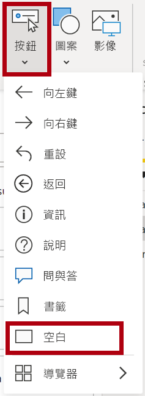

1. 將此按鈕放置在 [年度] 交叉分析篩選器的正下方。

1. 選取按鈕，然後在 [**格式] 按鈕**窗格中，選取 [**按鈕**]，展開 **[樣式**] 區段，然後將 **[文字]** **屬性開啟。**

     

1. 展開 [ **文字]** 區段，然後在 [ **文字方塊** ] 中，輸入 **橫條圖**。

1. 展開 **[填滿]** 區段，然後使用互補色彩來設定填滿色彩。

1. 選取 **[按鈕**]，然後將 **[動作]** **屬性開啟。**

    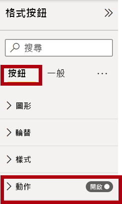

1. 展開 [動作] 區段，然後將 [類型] 下拉式清單設定為 [書籤]。

1. 在 [書籤] 下拉式清單中，選取 [開啟橫條圖]。

    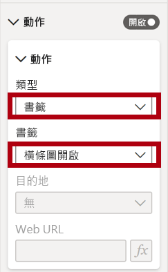

1. 使用複製並貼上來建立按鈕的複本，然後設定新按鈕，如下所示：

    *提示：複製和貼上的快速鍵命令是先按 **Ctrl+C**，接著按 **Ctrl+V**。*

    - 將 [按鈕文字] 屬性設定為 [直條圖]
    - 在 [動作] 區段中，將 [書籤] 下拉式清單設定為 [開啟直條圖]。

*銷售分析報表的設計現已完成。*

### **工作 3：發佈報表**

在此工作中，您將發佈報表。

1. 選取 [概觀] 頁面。

1. 在 [年度] 交叉分析篩選器中，選取 [FY2020]。

1. 在 [區域] 交叉分析篩選器中，選取 [全選]。

1. 儲存 Power BI Desktop 檔案。
    
    *檔案一律必須先經過儲存，才能發佈至 Power BI 服務。*

1. 在 [首頁] 功能區索引標籤上，從 [共用] 群組內選取 [發佈]。

     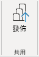

1. 請注意，在 [發佈至 Power BI] 視窗中已選取 [我的工作區]。

1. 若要發佈報表，請選取 [ **選取**]。
    1. 當系統提示您取代資料集時，請選取 [取代]。
    1. 當發佈成功時，請選取 [確認]。

1. 關閉 Power BI Desktop。

*在下一個練習中，您將探索 Power BI 服務中的報表。*

## **練習 5：探索報表**

在此練習中，您將探索Power BI 服務中的報表。

### **工作 1：探索報表**

在這項工作中，您將探索Power BI 服務中的報表。

1. 在 Microsoft Edge 瀏覽器視窗中，流覽至 [**我的工作區**] Power BI 服務 >，然後選取 **[銷售分析**] 報表。

1. 若要測試鑽研功能，請流覽至 [概 **觀** ] 頁面> **[依類別排序的數量** ] 視覺效果。 然後以滑鼠右鍵按一下 **[服裝** ] 列，然後選取 [ **鑽 \| 研產品詳細資料**]。

     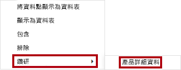

1. 請注意，[產品詳細資料] 頁面適用於 [服裝]。

1. 若要返回來源頁面，請選取頁面左上角的箭號按鈕。

1. 選取 [我的效能] 頁面。
    
    *選取每個按鈕，然後注意顯示的不同視覺效果。*

### **工作 2：完成**

在此工作中，您將完成實驗室。

若要返回您的工作區，請在視窗網頁的橫幅中，選取 **[我的工作區**]。

 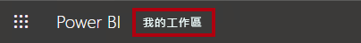
