---
lab:
  title: 在 Power BI Desktop 中設計報表，第 2 部分
  module: Module 7 - Create Reports
ms.openlocfilehash: 72d571e81320d4c0311f9e566d1805725439f961
ms.sourcegitcommit: 9ea1e7e21b9b3c718030c94b1693d153a2010ec7
ms.translationtype: HT
ms.contentlocale: zh-TW
ms.lasthandoff: 06/29/2022
ms.locfileid: "146650204"
---
# **在 Power BI Desktop 中設計報表，第 2 部分**

**完成實驗室的估計時間為 45 分鐘**

在本實驗室中，您將使用進階設計功能來增強 [Sales Analysis]。

在此實驗室中，您將了解如何：

- 同步交叉分析篩選器

- 建立鑽研頁面

- 套用條件式格式設定

- 建立和使用書籤

### **實驗室案例**

此實驗室為一系列實驗室的其中之一，其設計用意是完整呈現資料準備到報表和儀表板發行的整個過程。 您可以依照任何順序完成實驗室。 然而，若您想要逐步完成多個實驗室，建議您依照下列順序加以完成：

1. 在 Power BI Desktop 中準備資料

2. 在 Power BI Desktop 中載入資料

3. 在 Power BI Desktop 中設計資料模型

5. 在 Power BI Desktop 中建立 DAX 計算，第 1 部分

6. 在 Power BI Desktop 中建立 DAX 計算，第 2 部分

7. 在 Power BI Desktop 中設計報表，第 1 部分

8. **在 Power BI Desktop 中設計報表，第 2 部分**

9. 建立 Power BI 儀表板

10. 在 Power BI Desktop 中執行資料分析

11. 強制執行資料列層級安全性

## **練習 1：設定同步交叉分析篩選器**

在此練習中，您將同步處理報表頁面交叉分析篩選器。

### 工作 1：開始使用 - 登入

在此工作中，您將登入 Power BI 以設定實驗室的環境。

*重要：若您已登入 Power BI，請繼續進行下一個工作。*

1. 若要開啟 Microsoft Edge，請按一下工作列上的 [Microsoft Edge] 程式捷徑。

    

1. 在 Microsoft Edge 瀏覽器視窗中，瀏覽至 **https://powerbi.microsoft.com**。

    *提示：您也可以使用 Microsoft Edge [我的最愛] 列上的 [Power BI 服務] 我的最愛項目。*

1. 按一下 [登入] (位於右上角)。

    

1. 輸入提供給您的帳戶詳細資料。

1. 若系統提示您更新密碼，請重新輸入提供的密碼，然後輸入並確認新密碼。

    *重要：請務必記錄您的新密碼。*

1. 完成登入程序。

1. 若 Microsoft Edge 提示您保持登入，請按一下 [是]。

1. 在 Microsoft Edge 瀏覽器視窗中，從 Power BI 服務的 [瀏覽] 窗格，展開 [我的工作區]。

    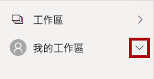

1. 讓 Microsoft Edge 瀏覽器視窗保持開啟。

### 工作 2：開始使用 - 開啟報表

在此工作中，您將開啟入門報表以設定實驗室的環境。

*重要：若您是從上一個實驗室繼續進行 (且已成功完成該實驗室)，請不要完成此工作；相反地，請從下一個工作繼續。*

1. 若要開啟 Power BI Desktop，請在工作列上按一下 [Microsoft Power BI Desktop] 捷徑。

    

2. 若要關閉 [開始使用] 視窗，請按一下視窗左上角的 [X]。

    

3. 若要登入 Power BI 服務，請按一下右上角的 [登入]。

    

4. 使用您用來登入 Power BI 服務的相同帳戶以完成登入程序。

5. 若要開啟 Power BI Desktop 入門檔案，請按一下 [檔案] 功能區索引標籤以開啟 Backstage 檢視。

6. 選取 [開啟報表]。

    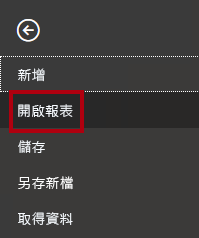

7. 按一下 [瀏覽報表]。

    

8. 在 [開啟] 視窗中，瀏覽至 **D:\PL300\Labs\07-design-report-in-power-bi-desktop-enhanced\Starter** 資料夾。

9. 選取 **Sales Analysis** 檔案。

10. 按一下 [開啟]。

    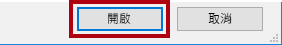

11. 關閉任何可能開啟的資訊視窗。

12. 若要建立檔案的複本，請按一下 [檔案] 功能區索引標籤，以開啟 Backstage 檢視。

13. 選取 [另存新檔]。

    

14. 若系統提示您套用變更，請按一下 [套用]。

    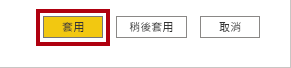

15. 在 [另存新檔] 視窗中，瀏覽至 **D:\PL300\MySolution** 資料夾。

16. 按一下 [檔案] 。

    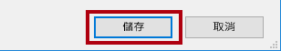

### **工作 3：同步交叉分析篩選器**

在此工作中，您會將 [年度] 和 [區域] 交叉分析篩選器同步處理。

*您將繼續開發於《在 Power BI Desktop 中設計報表，第 1 部分》實驗室中所建立的報表。*

1. 在 Power BI Desktop 的 [概觀] 頁面上，將 [年度] 交叉分析篩選器設定為 [FY2018]。

2. 移至 [我的效能] 頁面，然後注意 [年度] 交叉分析篩選器是不同的值。

    *交叉分析篩選器若未同步，可能會造成資料失真，並且讓報表使用者感到挫折。您現在將會同步處理報表交叉分析篩選器。*

3. 返回 [概觀] 頁面，然後選取 [年度] 交叉分析篩選器。

4. 在 [檢視] 功能區索引標籤上，從 [顯示窗格] 群組中，按一下 [同步交叉分析篩選器]。

    

5. 在 [同步交叉分析篩選器] 窗格的 (位於 [視覺效果] 窗格的左側) 的第二個資料行 (代表同步處理) 中，勾選 [概觀] 和 [我的效能] 頁面的核取方塊。

    

6. 在 [概觀] 頁面上，選取 [區域] 交叉分析篩選器。

7. 同步處理交叉分析篩選器與 [概觀] 和 [利潤] 頁面。

    

8. 選取不同的篩選選項，然後驗證已同步的交叉分析篩選器是否依相同的選項篩選，以測試同步交叉分析篩選器。

9. 若要關閉 [同步交叉分析篩選器] 頁面，請按一下窗格右上方的 **X**。

    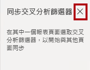

## **練習 2：設定鑽研**

在此練習中，您將建立新的頁面並將其設定為鑽研頁面。 當您完成設計時，此頁面會如下所示：

### **工作 1：建立鑽研頁面**

在此工作中，您將建立新的頁面並將其設定為鑽研頁面。

1. 新增名為 [產品詳細資料] 的新報告頁面。

    

2. 以滑鼠右鍵按一下 [產品詳細資料] 頁面索引標籤，然後選取 [隱藏頁面]。

    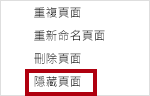

    *報表使用者將無法直接前往鑽研頁面。他們必須透過其他頁面上的視覺效果來加以存取。您將在此實驗室的最後一個練習中了解如何鑽研至該頁面。*

3. 在 [視覺效果] 窗格下方的 [鑽研] 區段中，將 [Product \| Category] 欄位新增至 [在此處新增鑽研欄位] 方塊。

    *實驗室使用速記標記法來參考欄位。其看起來將會像下面這樣：[Product \| Category]。在此範例中，**Product** 是資料表名稱，而 **Category** 是欄位名稱。*

    

4. 若要測試鑽研頁面，請在鑽研篩選卡片中選取 [自行車]。

    

5. 在報告頁面的左上方，注意箭號按鈕。

    

    *當欄位已新增至鑽研區域時，就會自動新增按鈕。其可讓報告使用者瀏覽回其鑽研的起始頁面。*

6. 在頁面中新增 [卡片] 視覺效果，然後調整其大小和位置，使其位於按鈕的右邊並填滿頁面的剩餘寬度。

    

    

7. 將 [Product \| Category] 欄位拖曳到卡片視覺效果中。

8. 設定視覺效果的格式選項，然後將 [類別標籤] 屬性切換為 [關閉]。

    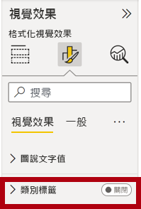

9. 將 [背景色彩] 屬性設定為淺灰色。

10. 在頁面中新增 [資料表] 視覺效果，然後調整其大小和位置，使其位於卡片視覺效果的下方並填滿頁面的剩餘空間。

    

    

11. 將下列欄位新增至視覺效果：

    - Product \| Subcategory

    - Product \| Color

    - Sales \| Quantity

    - Sales \| Sales

    - Sales \| Profit Margin

12. 設定視覺效果的格式選項，然後在 [值] 區段中，將 [文字大小] 屬性設為 [20pt]。

    *鑽研頁面的設計幾乎已完成。您將在下一個練習中透過條件式格式設定來強化頁面。*

## **練習 3：新增條件式格式設定**

在此練習中，您將使用條件式格式設定來強化鑽研頁面。 當您完成設計時，此頁面會如下所示：

### **工作 1：新增條件式格式設定**

在此工作中，您將使用條件式格式設定來強化鑽研頁面。

1. 選取資料表視覺效果。

2. 在視覺效果窗格中，按一下 [Profit Margin] 欄位上的向下箭號，然後選取 [條件式格式設定 \| 圖示]。

    

3. 在 [圖示 – Profit Margin] 視窗的 [圖示版面配置] 下拉式清單中，選取 [資料右邊]。

    

4. 若要刪除中間規則，請按一下黃色三角形左邊的 **X**。

    

5. 設定第一個規則 (紅色菱形)，如下所示：

    - 在第二個控制項中，移除此值

    - 在第三個控制項中，選取 [數字]

    - 在第五個控制項中，輸入 **0**

    - 在第六個控制項中，選取 [數字]

6. 設定第二個規則 (綠色圓形)，如下所示：

    - 在第二個控制項中，輸入 **0**

    - 在第三個控制項中，選取 [數字]

    - 在第五個控制項中，移除此值

    - 在第六個控制項中，選取 [數字]

    

    *規則可以解釋如下：如果利潤率值小於 0，則顯示紅色菱形；否則，如果此值很大或等於零，則會顯示綠色圓形。*

7. 按一下 [確定]。

    

8. 在資料表視覺效果中，確認顯示的是正確的圖示。

    

9. 設定 [色彩] 欄位的背景色彩條件式格式設定。

10. 在 [背景色彩 – 色彩] 視窗的 [設定樣式格式] 下拉式清單中，選取 [欄位值]。

    

11. 在 [我們應該以哪個欄位為基礎?] 下拉式清單中，選取 [Product \| 格式設定 \| 背景色彩格式]。

    

12. 按一下 [確定]。

    

13. 重複上述步驟，以使用 [Product \| 格式設定 \| 字型色彩格式] 欄位，設定 [色彩] 欄位的字型色彩條件式格式設定

    *您可能還記得，背景和字型色彩是來自《在 Power BI Desktop 中準備資料》實驗室的 **ColorFormats.csv** 檔案，再將其與《在 Power BI Desktop 中載入資料》實驗室的 **Product** 查詢整合。*

## **練習 4：新增書籤和按鈕**

在此練習中，您將使用按鈕來強化 [我的績效] 頁面，讓報表使用者選取要顯示的視覺效果類型。 當您完成設計時，此頁面會如下所示：

### **工作 1：新增書籤**

在此工作中，您將新增兩個書籤，個別用來顯示每月銷售額/目標視覺效果。

1. 移至 [我的效能] 頁面。

2. 在 [檢視] 功能區索引標籤上，從 [顯示窗格] 群組中，按一下 [書籤]。

    

3. 在 [檢視] 功能區索引標籤上，從 [顯示窗格] 群組中，按一下 [選取範圍]。

    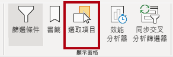

4. 在 [選取範圍] 窗格中，按一下 [依月份的銷售額] 和 [依月份的目標] 項目旁邊的眼睛圖示。

    

5. 在 [書籤] 窗格中，按一下 [新增]。

    

6. 若要重新命名書籤，請按兩下書籤。

7. 如果可見的圖表是橫條圖，請將書籤重新命名為 [開啟橫條圖]，否則將書籤重新命名為 [開啟直條圖]。

8. 若要編輯書籤，請在 [書籤] 窗格中，將游標停留在書籤上方，按一下省略符號，然後選取 [資料]。

    

    *如果您停用 [資料] 選項，表示書籤不會使用目前的篩選狀態。請務必注意這一點，不然的話，書籤會永久鎖定 [年度] 交叉分析篩選器所套用的篩選準則。*

9. 若要更新書籤，請再次按一下省略符號，然後選取 [更新]。

    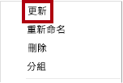

    *在下列步驟中，您將建立並設定第二個書籤來顯示第二個視覺效果。*

10. 在 [選取範圍] 窗格中，切換 [依月份的銷售額] 和 [依月份的目標] 兩個項目的可見度。

    *換句話說，讓可見的視覺效果隱藏起來，讓隱藏的視覺效果看得見。*

    

11. 建立第二個書籤並適當地命名 ([開啟直條圖] 或 [開啟橫條圖]**)**。

    

12. 設定第二個書籤以忽略篩選 ([資料] 選項關閉)，並更新書籤。

13. 在 [選取範圍] 窗格中，若要讓這兩個視覺效果均可見，只要顯示隱藏的視覺效果即可。

14. 調整這兩個視覺效果的大小和位置，使其填滿多張卡片視覺效果下方的頁面，且彼此完全重疊。

    *提示：若要選取遮蓋住的視覺效果，請在 [選取範圍] 窗格中加以選取。*

    

15. 在 [書籤] 窗格中，選取每個書籤，並注意只有其中一個視覺效果看得見。

    *設計的下一個階段是在頁面中新增兩個按鈕，讓報告使用者選取書籤。*

### **工作 2：新增按鈕**

在此工作中，您將新增兩個按鈕，並將書籤動作指派給每個按鈕。

1. 在 [插入] 功能區中，從 [元素] 群組中，按一下 [按鈕]，然後選取 [空白]。

    

2. 將此按鈕放置在 [年度] 交叉分析篩選器的正下方。

3. 選取按鈕，然後在 [格式按鈕] 窗格中，按一下 [一般]，然後將 [標題] 屬性設定為 [開啟]。

    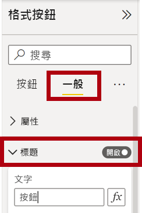

4. 展開 [標題] 區段，然後在 [文字] 方塊中輸入 **橫條圖**。

5. 展開 [背景] 區段，然後使用互補色設定背景色彩。

6. 按一下 [按鈕]，然後將 [動作] 屬性設定為 [開啟]。

    

7. 展開 [動作] 區段，然後將 [類型] 下拉式清單設定為 [書籤]。

8. 在 [書籤] 下拉式清單中，選取 [開啟橫條圖]。

    

9. 使用複製並貼上來建立按鈕的複本，然後設定新按鈕，如下所示：

    *提示：複製和貼上的快速鍵命令是先按 **Ctrl+C**，接著按 **Ctrl+V**。*

    - 將 [按鈕文字] 屬性設定為 [直條圖]

    - 在 [動作] 區段中，將 [書籤] 下拉式清單設定為 [開啟直條圖]。

    *銷售分析報表的設計現已完成。*

### **工作 3：發佈報表**

在此工作中，您將會發佈報表。

1. 選取 [概觀] 頁面。

2. 在 [年度] 交叉分析篩選器中，選取 [FY2020]。

3. 在 [區域] 交叉分析篩選器中，選取 [全選]。

4. 儲存 Power BI Desktop 檔案。

    *檔案一律必須先經過儲存，才能發佈至 Power BI 服務。*

5. 在 [首頁] 功能區索引標籤的 [共用] 群組內，按一下 [發佈]。

    

6. 請注意，在 [發佈至 Power BI] 視窗中已選取 [我的工作區]。

7. 若要發佈報表，請按一下 [選取]。

    

8. 若系統提示您取代資料集，請按一下 [取代]。

9. 當發佈成功時，請按一下 [了解]。

    

10. 關閉 Power BI Desktop。

    *在下一個練習中，您將探索 Power BI 服務中的報表。*

## **練習 5：探索報表**

在此練習中，您將探索 Power BI 服務中的報表。

### **工作 1：探索報表**

在此工作中，您將探索 Power BI 服務中的報表。

1. 在 Microsoft Edge 瀏覽器視窗中，選取 Power BI 服務 [瀏覽] 窗格中的 [我的工作區]，然後按一下 [Sales Analysis] 報表。

2. 若要測試鑽研報告，請在 [概觀] 頁面的 [依類別的數量] 視覺效果中，以滑鼠右鍵按一下 [服裝] 列，然後選取 [鑽研 \| 產品詳細資料]。

    

3. 請注意，[產品詳細資料] 頁面適用於 [服裝]。

4. 若要回到來源頁面，請按一下頁面左上角的箭號按鈕。

5. 選取 [我的效能] 頁面。

6. 按一下每個按鈕，然後注意會顯示不同的視覺效果。

### **工作 2：完成**

在此工作中，您將完成實驗室。

1. 若要返回您的工作區，請在視窗網頁的橫幅中，按一下 [我的工作區]。

    

2. 讓 Microsoft Edge 瀏覽器視窗保持開啟。
