---
lab:
  title: 建立 Power BI 儀表板
  module: Module 8 - Create Dashboards
ms.openlocfilehash: 2ddb086b004fca3fa322e10570f9163342514808
ms.sourcegitcommit: f09183b2093a7f8de629f89b54d70bcad85598b6
ms.translationtype: HT
ms.contentlocale: zh-TW
ms.lasthandoff: 06/07/2022
ms.locfileid: "146109908"
---
# **建立 Power BI 儀表板**

**完成實驗室的估計時間為 45 分鐘**

在此實驗室中，您將建立 **銷售監視** 儀表板。

在此實驗室中，您將了解如何：

- 將視覺效果釘選到儀表板

- 使用問與答建立儀表板圖格

### **實驗室案例**

此實驗室為一系列實驗室的其中之一，其設計用意是完整呈現資料準備到報表和儀表板發行的整個過程。 您可以依照任何順序完成實驗室。 然而，若您想要逐步完成多個實驗室，建議您依照下列順序完成前 10 個實驗室：

1. 在 Power BI Desktop 中準備資料

2. 在 Power BI Desktop 中載入資料

3. 在 Power BI Desktop 中設計資料模型

5. 在 Power BI Desktop 中建立 DAX 計算，第 1 部分

6. 在 Power BI Desktop 中建立 DAX 計算，第 2 部分

7. 在 Power BI Desktop 中設計報表，第 1 部分

8. 在 Power BI Desktop 中設計報表，第 2 部分

9. **建立 Power BI 儀表板**

10. 在 Power BI Desktop 中執行資料分析

11. 強制執行資料列層級安全性

## **練習 1：建立儀表板**

在此練習中，您將建立 **銷售監視** 儀表板。 完成的儀表板看起來會像下面這樣：

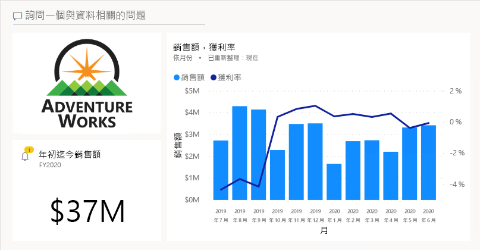

### **工作 1：開始使用 - 登入**

在此工作中，您將登入 Power BI 以設定實驗室的環境。

*重要：如果您已在上一個實驗室中登入 Power BI，請繼續進行下一個工作。*

1. 若要開啟 Microsoft Edge，請按一下工作列上的 [Microsoft Edge] 程式捷徑。

    

2. 在 Microsoft Edge 瀏覽器視窗中，瀏覽至 **https://powerbi.microsoft.com**。

    *提示：您也可以使用 Microsoft Edge [我的最愛] 列上的 [Power BI 服務] 我的最愛項目。*

3. 按一下 [登入] (位於右上角)。

    

4. 輸入提供給您的帳戶詳細資料。

5. 若系統提示您更新密碼，請重新輸入提供的密碼，然後輸入並確認新密碼。

    *重要：請務必記錄您的新密碼。*

6. 完成登入程序。

7. 若 Microsoft Edge 提示您保持登入，請按一下 [是]。

8. 在 Microsoft Edge 瀏覽器視窗中，從 Power BI 服務的 [瀏覽] 窗格，展開 [我的工作區]。

    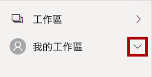

9. 讓 Microsoft Edge 瀏覽器視窗保持開啟。

### **工作 2：開始使用 - 開啟報表**

在此工作中，您將開啟入門報表以設定實驗室的環境。

*重要：若您是從上一個實驗室繼續進行 (且已成功完成該實驗室)，請不要完成此工作；相反地，請從下一個工作繼續。*

1. 若要開啟 Power BI Desktop，請在工作列上按一下 [Microsoft Power BI Desktop] 捷徑。

    

2. 若要關閉 [開始使用] 視窗，請按一下視窗左上角的 [X]。

    

3. 如果 Power BI Desktop 未登入 Power BI 服務，請按一下右上方的 [登入]。

    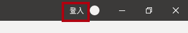

4. 使用您用來登入 Power BI 服務的相同帳戶以完成登入程序。

5. 若要開啟 Power BI Desktop 入門檔案，請按一下 [檔案] 功能區索引標籤以開啟 Backstage 檢視。

6. 選取 [開啟報表]。

    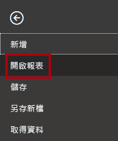

7. 按一下 [瀏覽報表]。

    

8. 在 [開啟] 視窗中，瀏覽至 **D:\PL300\Labs\08-create-power-bi-dashboard\Starter** 資料夾。

9. 選取 **Sales Analysis** 檔案。

10. 按一下 [開啟]。

    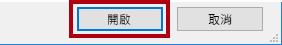

11. 關閉任何可能開啟的資訊視窗。

12. 若要建立檔案的複本，請按一下 [檔案] 功能區索引標籤，以開啟 Backstage 檢視。

13. 選取 [另存新檔]。

    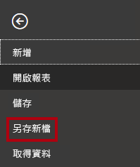

14. 若系統提示您套用變更，請按一下 [套用]。

    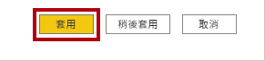

15. 在 [另存新檔] 視窗中，瀏覽至 **D:\PL300\MySolution** 資料夾。

16. 按一下 [檔案] 。

    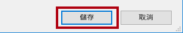

### **工作 3：開始使用 - 發佈報表**

在此工作中，您將建立資料集以設定實驗室的環境。

*重要：如果您已於《在 Power BI Desktop 中設計報表，第 2 部分》實驗室中發佈報表，請繼續進行下一個工作。*

1. 在 Microsoft Edge 瀏覽器視窗中，從 Power BI 服務的 [瀏覽] 窗格，按一下底部的 [取得資料]。

    

2. 在 [檔案] 圖格中，按一下 [取得]。

    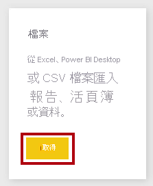

3. 按一下 [本機檔案] 圖格。

    

4. 在 [開啟] 視窗中，瀏覽至 **D:\PL300\Labs\08-create-power-bi-dashboard\Solution** 資料夾。

5. 選取 **Sales Analysis.pbix** 檔案，然後按一下 [開啟]。

6. 若系統提示您取代資料集，請按一下 [取代它]。

### **工作 4：建立儀表板**

在此工作中，您將建立 **銷售監視** 儀表板。 您將從報表釘選一個視覺效果、根據影像資料 URI 新增一個圖格，並使用問與答建立一個圖格。

1. 在 Microsoft Edge 瀏覽器視窗中，從 Power BI 服務開啟 **銷售分析** 報表。

2. 在 概觀 頁面中，將 年 交叉分析篩選器 設定為 **FY2020**。

    

3. 將 [區域] 交叉分析篩選器設定為 [全選]。

    *將視覺效果釘選到儀表板時，視覺效果會使用目前的篩選內容。釘選之後，就無法變更篩選內容。針對時間型篩選，最好是使用相對日期交叉分析篩選器 (或使用相對時間型問題來進行問與答)。*

4. 若要建立儀表板並釘選視覺效果，請將滑鼠游標暫留在 [每月銷售額和獲利率] (直條圖/折線圖) 視覺效果上。

5. 按一下右下角的圖釘。

    

6. 在 [釘選到儀表板] 視窗的 [儀表板名稱] 方塊中輸入 **銷售監視**。

    

7. 按一下 [釘選]。

    

8. 開啟 [導覽] 窗格、選取 [我的工作區]，然後開啟 [銷售監視] 儀表板。

    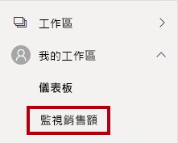

9. 注意儀表板只有一個圖格。

    

10. 若要根據問題來新增圖格，請按一下儀表板左上方的 [詢問資料的相關問題]。

    

    *您可以使用問與答功能來詢問問題，Power BI 將會以視覺效果做出回應。*

11. 在 [問與答] 方塊下方，選取以藍色方塊框住的任何一個建議的問題。

12. 檢閱回應。

13. 移除 [問與答] 方塊中的所有文字。

14. 在 [問與答] 方塊中，輸入下列內容：**年初迄今的銷售額**

    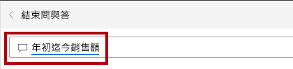

15. 請注意 **(空白)** 的回應。

    

    *您應該還記得您已於《在 Power BI Desktop 中建立 DAX 計算，第 2 部分》實驗室中新增 [Sales YTD] 量值。此量值是時間智慧運算式，而且需要 **Date** 資料表上有篩選才能產生結果。*

16. 使用下列方式擴充問題：**在 FY2020 年**。

    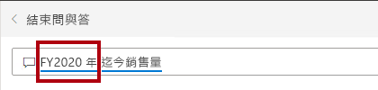

17. 請注意，回應現在是 **$33M**。

    

18. 若要將回應釘選到儀表板，請按一下右上角的 [釘選視覺效果]。

    

19. 當系統提示您將圖格釘選到儀表板時，按一下 [釘選]。

    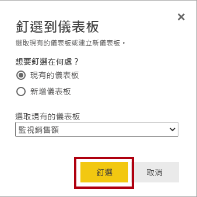

20. 若要返回儀表板，請按一下左上角的 [結束問與答]。

    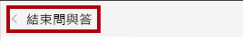

21. 若要新增公司標誌，請在功能表列上按一下 [編輯]，然後選取 [新增圖格]。

    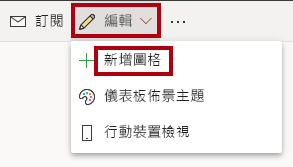

    *使用這項技術新增儀表板圖格可讓您利用下列媒體將儀表板美化，包括 Web 內容、影像、格式豐富的文字方塊，以及影片 (使用 YouTube 或 Vimeo 連結)。*

22. 在位於右側的 [新增圖格] 窗格中，選取 [影像] 圖格。

    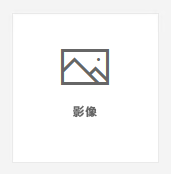

23. 按一下 [下一步] 。

    

24. 在 [加入影像磚] 窗格的 [URL] 方塊中，輸入 **D:\PL300\Resources\AdventureWorksLogo_DataURL.txt** 檔案中找到的完整 URL。

    *您可以使用影像的 URL 內嵌影像，也可以使用資料 URL 內嵌內容。*

25. 在窗格底部按一下 [套用]。

    

26. 若要調整標誌圖格的大小，請拖曳右下角，並調整圖格的大小，使其變成一個單位寬和兩個單位高。

    *圖格大小限制為只能是矩形。您只能將大小調整為矩形的倍數。*

27. 組織圖格，讓標誌出現在左上方，其下方則顯示 [年初迄今銷售額] 圖格，並在右側顯示 [銷售額、獲利率] 圖格。

    

### **工作 5：編輯圖格詳細資料**

在此工作中，您將編輯兩個圖格的詳細資料。

1. 將游標暫留在 [年初迄今的銷售額] 圖格上、按一下圖格右上方的省略號，然後選取 [編輯詳細資料]。

    

2. 在 [圖格詳細資料] 窗格 (位於右邊) 的 [子標題] 方塊中，輸入 **FY2020**。

    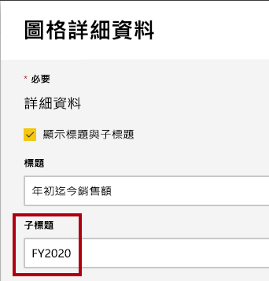

3. 按一下 [套用]。

    

4. 請注意，[年初迄今的銷售額] 圖格會顯示子標題。

    

5. 編輯 [銷售額、獲利率] 圖格的圖格詳細資料。

6. 在 [圖格詳細資料] 窗格的 [功能] 區段中，核取 [顯示上次重新整理時間]。

    

7. 按一下 [套用]。

    

8. 請注意，該圖格會說明上次的重新整理時間 (其是在 Power BI Desktop 中載入資料模型時執行)。

    *在下一個練習中，您將重新整理資料集。一般而言，您應該使用排程的重新整理來達成此目的，在此情況下，Power BI 會使用閘道連線到 SQL Server 資料庫。不過，由於教室設定的條件約束，我們沒有閘道可用。因此，您會開啟 Power BI Desktop、執行手動的資料重新整理，然後將檔案上傳到工作區。*

## **練習 2：重新整理資料集**

在此練習中，您會先將 2020 年 6 月的銷售訂單資料載入 **AdventureWorksDW2020** 資料庫。 接著，您將會開啟 Power BI Desktop 檔案、執行資料重新整理，然後將檔案上傳到工作區。

### **工作 1：更新實驗室資料庫**

在此工作中，您將執行 PowerShell 指令碼，以更新 **AdventureWorksDW2020** 資料庫中的資料。

1. 在 [檔案總管] 中的 **D:\PL300\Setup** 資料夾內，以滑鼠右鍵按一下 **UpdateDatabase-2-AddSales.ps1** 檔案，然後選取 [用 PowerShell 執行]。

    

2. 如果系統提示您變更執行原則，請按 **A**。

3. 當系統提示您按任意鍵以關閉時，請再次按 **Enter**。

    ***AdventureWorksDW2020** 資料庫現在包括在 2020 年 6 月下訂的銷售訂單。*

### **工作 2：重新整理 Power BI Desktop 檔案**

在此工作中，您將開啟 **Sales Analysis** Power BI Desktop 檔案、執行資料重新整理，然後將檔案上傳到您的 [Sales Analysis] 工作區。

1. 在 Power BI Desktop 檔案的 [欄位] 窗格中，以滑鼠右鍵按一下 [Sales] 資料表，然後選取 [重新整理資料]。

    

2. 當重新整理完成時，請儲存 Power BI Desktop 檔案。

3. 若要將檔案發佈到您的工作區，請在 [首頁] 功能區索引標籤的 [共用] 群組內，按一下 [發佈]，然後按一下 [選取] 來發佈。

    

4. 當系統提示您取代資料集時，請按一下 [取代]。

    

    *Power BI 服務中的資料集現在有 2020 年 6 月的銷售資料。*

5. 關閉 Power BI Desktop。

## **練習 3：檢閱儀表板**

在此練習中，您將檢閱儀表板以注意更新的銷售額。

### **工作 1：檢閱儀表板**

在此工作中，您將檢閱儀表板以注意更新的銷售額。

1. 在 Microsoft Edge 瀏覽器視窗中，從 Power BI 服務檢閱 [銷售監視] 儀表板。

2. 在 [銷售額、獲利率] 圖格的子標題中，請注意資料已於 **現在** 重新整理。

3. 另外也請注意，現在有一個 **2020 年 6 月** 的直條。

    *如果您沒有看到 2020 年 6 月的資料，則可能需要按 **F5** 以重新載入網頁瀏覽器。*

    

    

4. 若要關閉窗格，請按一下 [關閉]。
