---
lab:
  title: 在 Power BI 中執行資料分析
  module: 8 - Identify Patterns and Trends
---

# **在 Power BI 中執行資料分析**

**完成實驗室的估計時間為 45 分鐘**

在本實驗室中，您將建立 **Sales Exploration** 報表。

在此實驗室中，您將了解如何：

- 建立動畫散佈圖

- 使用視覺效果來預測值

### **實驗室案例**

此實驗室為一系列實驗室的其中之一，其設計用意是完整呈現資料準備到報表和儀表板發行的整個過程。 您可以依照任何順序完成實驗室。 然而，若您想要逐步完成多個實驗室，建議您依照下列順序加以完成：

1. 在 Power BI Desktop 中準備資料

2. 在 Power BI Desktop 中載入資料

3. 在 Power BI Desktop 中設計資料模型

5. 在 Power BI Desktop 中建立 DAX 計算，第 1 部分

6. 在 Power BI Desktop 中建立 DAX 計算，第 2 部分

7. 在 Power BI Desktop 中設計報表，第 1 部分

8. 在 Power BI Desktop 中設計報表，第 2 部分

8. **在 Power BI 中執行資料分析**

9. 建立 Power BI 儀表板

11. 強制執行資料列層級安全性

## **練習 1：建立報表**

在本練習中，您將建立**銷售探索**報表。

### **工作 1：開始使用 - 登入**

在此工作中，您將登入 Power BI 以設定實驗室的環境。

*重要：如果您已在上一個實驗室中登入 Power BI，請繼續進行下一個工作。*

1. 若要開啟 Microsoft Edge，請按一下工作列上的 [Microsoft Edge] 程式捷徑。

    

1. 在 Microsoft Edge 瀏覽器視窗中，瀏覽至 **https://powerbi.microsoft.com**。

    *提示：您也可以使用 Microsoft Edge [我的最愛] 列上的 [Power BI 服務] 我的最愛項目。*

1. 按一下 [登入] (位於右上角)。

    

1. 輸入提供給您的帳戶詳細資料。

1. 若系統提示您更新密碼，請重新輸入提供的密碼，然後輸入並確認新密碼。

    *重要：請務必記錄您的新密碼。*

1. 完成登入程序。

1. 若 Microsoft Edge 提示您保持登入，請按一下 [是]。

1. 在 Microsoft Edge 瀏覽器視窗中，從 Power BI 服務的 [瀏覽] 窗格，展開 [我的工作區]。

    

1. 讓 Microsoft Edge 瀏覽器視窗保持開啟。

### **工作 2：開始使用 - 建立資料集**

在此工作中，您將建立資料集以設定實驗室的環境。

*重要：如果您已在《建立 Power BI 儀表板》實驗室中發佈資料集，請繼續進行下一個工作。*

1. 在 Microsoft Edge 瀏覽器視窗中，從 Power BI 服務的 [瀏覽] 窗格，按一下底部的 [取得資料]。

    

2. 在 [檔案] 圖格中，按一下 [取得]。

    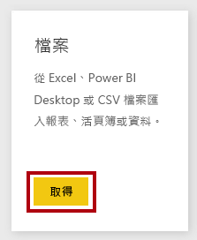

3. 按一下 [本機檔案] 圖格。

    

4. 在 [開啟] 視窗中，瀏覽至 **D:\PL300\Labs\08-perform-data-analysis-in-power-bi-desktop\Starter** 資料夾。

5. 選取 **Sales Analysis.pbix** 檔案，然後按一下 [開啟]。

6. 若系統提示您取代資料集，請按一下 [取代它]。

### **工作 3：建立報表**

在此工作中，您將建立**銷售探索**報表。

1. 若要開啟 Power BI Desktop，請在工作列上按一下 [Microsoft Power BI Desktop] 捷徑。

    *重要：如果您已開啟 (來自先前實驗室的) Power BI Desktop，請關閉該執行個體。*

    

2. 若要關閉 [開始使用] 視窗，請按一下視窗左上角的 [X]。

    

3. 如果 Power BI Desktop 未登入 Power BI 服務，請按一下右上方的 [登入]。

    

4. 使用您用來登入 Power BI 服務的相同帳戶以完成登入程序。

5. 若要儲存檔案，請按一下 [檔案] 功能區索引標籤，以開啟 Backstage 檢視。

6. 選取 [儲存]。

    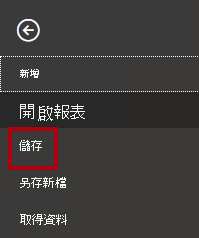

7. 在 [另存新檔] 視窗中，瀏覽至 **D:\PL300\MySolution** 資料夾。

8. 在 [檔案名稱] 方塊中，輸入 **Sales Exploration**，然後按一下 [儲存]。

    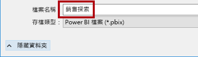

9. 若要建立對 **Sales Analysis** 資料集的即時連線，請在 [首頁] 功能區索引標籤上，按一下 [資料] 群組內的 [Power BI 資料集]。

    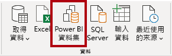

10. 在 [選取資料集以建立報表] 視窗中，選取 [銷售分析] 資料集。

11. 按一下 [建立]。

    

12. 儲存 Power BI Desktop 檔案。

    *您現在將會建立兩個報表頁面，並在每個頁面上使用不同的視覺效果來分析及探索資料。*

## **練習 2：建立散佈圖**

在此練習中，您將建立能夠以動畫方式顯示的散佈圖。

### **工作 1：建立動畫散佈圖**

在本工作中，您將建立能夠以動畫方式顯示的散佈圖。

1. 將**第 1 頁**重新命名為**散佈圖**。

    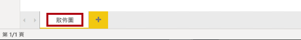

2. 將 [散佈圖] 視覺效果新增至報表頁面，然後調整視覺效果的位置及大小，使其填滿整個頁面。

    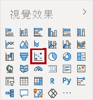

    

3. 將下列欄位新增至視覺效果區域：

    實驗室使用速記標記法來參考欄位。 其看起來將會像下面這樣：**Reseller** **\|** **Business Type**。 在本範例中，**轉銷商**是資料表名稱，而**商務類型**是欄位名稱。

    

    - X 軸：**Sales \| Sales** 

    - Y 軸：**Sales \| Profit Margin**

    - 圖例：**Reseller \| Business Type**

    - 大小：**Sales \| Quantity**

    - 播放軸：**Date \| Quarter**

    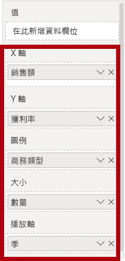

    *將欄位新增至 [播放軸] 區域時，此圖表就能以動畫方式顯示。*

4. 在 [篩選] 窗格中，將 [Product \| Category] 欄位新增至 [此頁面上的篩選] 區域。

5. 在篩選卡片中，依 [自行車] 進行篩選。

    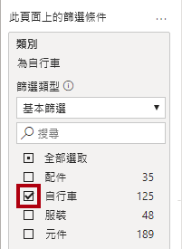

6. 若要以動畫方式顯示圖表，請在左下角按一下 [播放]。

    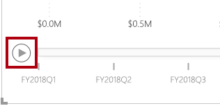

7. 監看從 **FY2018 Q1** 到 **FY2020 Q4** 的整個動畫週期。

    *散佈圖可供同時了解量值：在本案例中為訂單數量、銷售營收和獲利率。*

    *每個泡泡都代表轉銷商商務類型。泡泡大小變化則反映增加或減少的訂單數量。水平移動表示銷售營收增加/減少，而垂直移動表示獲利率增加/減少。*

8. 當動畫停止時，按一下其中一個泡泡可顯示一段時間的追蹤。

9. 將游標暫留在任何泡泡上方，以顯示工具提示，描述該時間點的轉銷商類型量值。

10. 在 [篩選] 窗格中，僅依 [服裝] 進行篩選，請注意其產生的結果完全不同。

11. 儲存 Power BI Desktop 檔案。

## **練習 3：建立預測**

在此練習中，您將建立預測來判斷可能的未來銷售營收。

### **工作 1：建立預測**

在本工作中，您將建立預測來判斷可能的未來銷售營收。

1. 新增頁面，然後將此頁面重新命名為**預測**。

    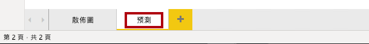

2. 將 [折線圖] 視覺效果新增至報表頁面，然後調整視覺效果的位置及大小，使其填滿整個頁面。

    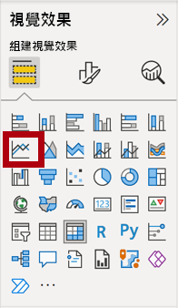

    

  

3. 將下列欄位新增至視覺效果區域：

    - X 軸：**Date \| Date**

    - Y 軸：**Sales \| Sales** 

    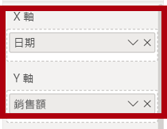

4. 在 [篩選] 窗格中，將 [Date \| Year] 欄位新增至 [此頁面上的篩選] 區域。

5. 在篩選卡片中，依兩年進行篩選：**FY2019** 和 **FY2020**。

    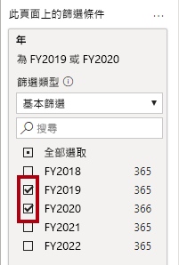

    *在預測時間線時，至少需要兩個週期 (年) 的資料，才能產生精確與穩定的預測。*

  

6. 同時將 [Product \| Category] 欄位新增至 [此頁面上的篩選] 區域，並依 [Bikes] 進行篩選。

    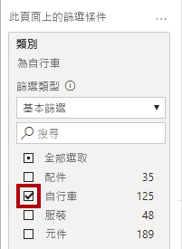

7. 若要新增預測，請在 [視覺效果] 窗格底下，選取**分析**窗格。

    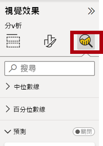

8. 展開 [預測] 區段。

    *如果 [預測] 區段無法使用，其可能是因為視覺效果的設定不正確。只有在符合下列兩個條件時，才能使用預測：軸具有類型為日期的單一欄位，且只有一個值欄位。*

9. 將 [預測] 選項切換為 [開啟]。

    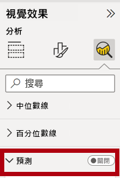

10. 設定下列預測屬性：

    - 單位：月

    - 預測長度：1 個月

    - 季節性：365
    
    - 信賴區間：80%

11. 按一下 [套用]。

    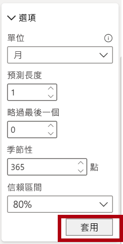

12. 在折線圖視覺效果中，請注意，預測已超出歷程記錄資料一個月。

    *灰色區域代表信賴度。信賴度越廣，穩定性就越差，因此預測的準確性可能會越差。*

    *當知道週期的長度時 (在本案例中為年度)，則應該輸入季節性點。有時可能是每週 (7)，有時可能是每月 (30)。*

13. 在 [篩選] 窗格中，僅依 [服裝] 進行篩選，請注意其將產生不同的結果。

14. 儲存 Power BI Desktop 檔案。

### **工作 2：完成**

在此工作中，您將完成實驗室。

1. 選取 [散佈圖] 頁面。

2. 儲存 Power BI Desktop 檔案。

3. 若要將檔案發佈到 [我的工作區]，請在 [首頁] 功能區索引標籤的 [共用] 群組內，按一下 [發佈]，然後按一下 [選取] 來發佈。

    

4.  關閉 Power BI Desktop。
