---
lab:
  title: 建立 Power BI 儀表板
  module: Create Dashboards
---

# **建立 Power BI 儀表板**

## **實驗室案例**

在此實驗室中，您將使用現有的報表，在Power BI 服務中建立**銷售監視**儀表板。

在此實驗室中，您將了解如何：

- 將視覺效果釘選到儀表板
- 使用問與答建立儀表板圖格

**此實驗室大約需要 45 分鐘的時間。**

## **開始使用 – 登入**

在這項工作中，您將藉由登入 Power BI 來設定實驗室的環境。

*注意：如果您已經登入 Power BI，請跳至下一個工作。*

1. 若要開啟 Microsoft Edge，請選取工作列上的 Microsoft Edge 程式捷徑。

     

1. 在 Microsoft Edge 瀏覽器視窗中，瀏覽至 **https://app.powerbi.com**。

    *提示：您也可以使用 Microsoft Edge [我的最愛] 列上的 [Power BI 服務] 我的最愛項目。*

1. 使用您的組織認證完成登入程式， (或提供給您) 。 如果 Microsoft Edge 提示您保持登入，請選取 [是]。

1. 在 Microsoft Edge 瀏覽器視窗中，從 Power BI 服務的 [瀏覽] 窗格，展開 [我的工作區]。 讓 Microsoft Edge 瀏覽器視窗保持開啟。

     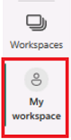

## **開始使用 – 開啟報表**

在這項工作中，您將開啟入門報表來設定實驗室的環境。

*重要事項：如果您繼續從先前的實驗室 (，且您已完成該實驗室已成功) ，請勿完成這項工作;相反地，請繼續下一個工作。*

1. 開啟 Power BI Desktop。
    
    *根據預設，[消費者入門] 對話方塊會在Power BI Desktop前面開啟。登入，然後關閉快顯。*

    

1. 若要開啟入門Power BI Desktop檔案，請選取 [檔案] **> [開啟報表] > [流覽報表**]。

1. 在 [ **開啟** ] 視窗中，流覽至 **D：\PL300\Labs\09-create-power-bi-dashboard\Starter** 資料夾，然後開啟 **Sales Analysis** 檔案。

1. 關閉任何可能開啟的資訊視窗。

1. 注意功能區下方的黃色警告訊息。 *此訊息會提醒您查詢尚未套用為模型資料表載入的事實。您稍後會在實驗室中套用查詢。*
    
    *若要關閉警告訊息，請在黃色警告訊息右邊選取 **[X**]。*

1. 若要建立檔案的複本，請移至 [ **檔案] > [另** 存新檔] 並儲存至 **D：\PL300\MySolution** 資料夾。

1. 如果系統提示您套用變更，請選取 [稍後套用]。

## **開始使用 – 發佈報表**

在這項工作中，您將藉由建立資料集來設定實驗室的環境。 *如果您已經發佈資料集，請移至下一個工作。*

1. 在 Microsoft Edge 瀏覽器視窗中的 [Power BI 服務] 中，流覽至 **[我的工作區**]。

1. 選取 **[上傳>流覽**]。

1. 流覽至 **D：\PL300\Labs\09-create-power-bi-dashboard\Starter** 資料夾。

1. 選取 **Sales Analysis.pbix** 檔案，然後選取 [開啟]。

*如果系統提示您取代資料集，請選取 [ **取代資料集**]。*

## **建立儀表板**

在此工作中，您將建立 **銷售監視** 儀表板。 您將從報表釘選一個視覺效果、根據影像資料 URI 新增一個圖格，並使用問與答建立一個圖格。

1. 在Power BI 服務中，開啟 **[銷售分析**] 報表。

1. 在[概觀]頁面中，將 年 [交叉分析篩選器] 設定為 **FY2020**。

    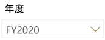

1. 將 [區域] 交叉分析篩選器設定為 [全選]。

    *釘選的視覺效果會在釘選時設定篩選內容。如果基礎視覺效果變更，您也必須更新儀表板磚。對於以時間為基礎的篩選，最好是使用相對日期交叉分析篩選器 (，或是使用相對時間型問題) 的 Q&A。*

1. 若要建立儀表板並釘選視覺效果，請將游標暫留在 [依月份 (資料行/行) 視覺效果的 **Sales and Profit Margin** 上，然後選取圖釘。

    

1. 在 [ **釘選到儀表板** ] 視窗的 [ **儀表板名稱]** 方塊中，輸入 **[銷售監視**]，然後選取 [ **釘選**]。

    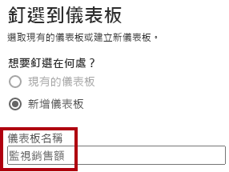

1. 開啟 **[我的工作區** ]，然後開啟 **[銷售監視]** 儀表板。

1. 注意儀表板只有一個圖格。

    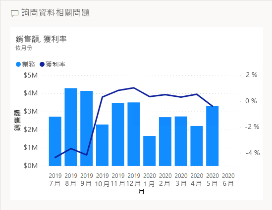

1. 若要根據問題新增圖格，請選取儀表板左上方的 [詢問一個與資料相關的問題]。
    
    *您可以使用問與答功能來詢問問題，Power BI 將會以視覺效果做出回應。*

    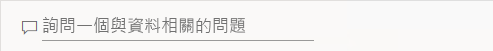

1. 選取 Q&A 方塊底下的任何建議問題，以藍色方塊選取，然後檢閱回應。

1. 從 [Q&A] 方塊中移除所有文字，然後輸入下列專案： **銷售 YTD**

1. 請注意 **(空白)** 的回應。
    
    *您可能會回想一下，您在**Power BI Desktop 實驗室中建立進階 DAX 計算**中新增**了 Sales YTD**量值。此量值是 Time Intelligence 運算式，因此需要**Date**資料表上的篩選才能產生結果。*

    

1. 使用下列方式擴充問題：**在 FY2020 年**。

1. 請注意，回應現在是 **$33M**。

    

1. 若要將回應釘選到儀表板，請在右上角選取 [ **釘選視覺效果**]。

    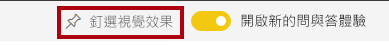

1. 當系統提示您將圖格釘選到儀表板時，請選取 [釘選]。

1. 若要返回儀表板，請在左上角選取 [ **結束 Q &amp; A**]。

1. 若要新增公司標誌，請在功能表列上選取 [ **編輯**]，然後選取 [ **新增磚**]。
    
    *使用這項技術新增儀表板磚可讓您使用媒體增強儀表板，包括 Web 內容、影像、格式豐富的文字方塊，以及使用 YouTube 或 Vimeo 連結) 的視訊 (。*

1. 在 [ **新增磚** ] 窗格中 (位於右側) ，選取 [ **影像** ] 圖格，然後選取 [ **下一步**]。

1. 在 [ **新增影像磚]** 窗格的 [ **URL** ] 方塊中，輸入 **D:\PL300\Resources\AdventureWorksLogo_DataURL.txt** 檔案中找到的完整 URL，然後 **套用**。
    
    *您可以使用影像的 URL 內嵌影像，也可以使用資料 URL 內嵌內容。*

1. 若要調整標誌圖格的大小，請拖曳右下角，並調整圖格的大小，使其變成一個單位寬和兩個單位高。
    
    *磚大小僅限於矩形圖形。*

1. 組織圖格，讓標誌出現在左上方，其下方則顯示 [年初迄今銷售額] 圖格，並在右側顯示 [銷售額、獲利率] 圖格。

    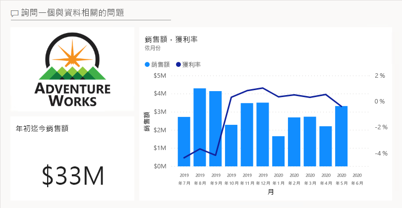

## **編輯圖格詳細資料**

在此工作中，您將編輯兩個磚的詳細資料。

1. 將滑鼠游標暫留在 [年初迄今的銷售額] 圖格上，然後選取圖格右上方的省略符號，再選取 [編輯詳細資料]。

    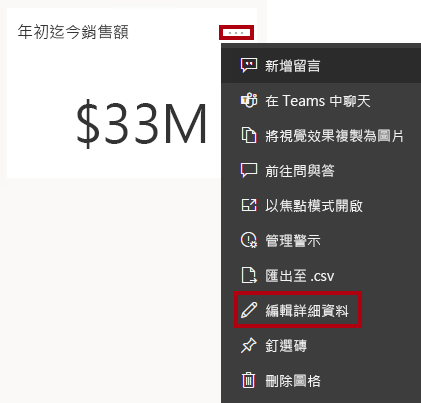

1. 在 [ **磚詳細資料]** 窗格中 (位於右側) 的 **[子標題** ] 方塊中，輸入 **FY2020**，然後選取 [ **套用**]。

1. 請注意，[年初迄今的銷售額] 圖格會顯示子標題。

    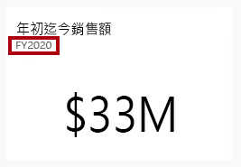

1. 編輯 [銷售額、獲利率] 圖格的圖格詳細資料。

1. 在 [ **磚詳細資料]** 窗格的 [ **功能** ] 區段中，核取 [ **顯示上次重新整理時間**]，然後 **[套用**]。

    

1. 請注意，該圖格會說明上次的重新整理時間 (其是在 Power BI Desktop 中載入資料模型時執行)。

*您將在下一個練習中重新整理資料集。視您的資料和報表而定，您可以隨時重新整理臨機運算元據或設定排程。不過，排定的重新整理需要無法為此實驗室設定的閘道。因此，從Power BI Desktop，您將執行手動資料重新整理，然後將檔案上傳至您的工作區。*

## **重新整理資料集**

在本練習中，您會先將 2020 年 6 月的銷售訂單資料載入到 **AdventureWorksDW2020** 資料庫中。 然後，您將開啟Power BI Desktop檔案、執行資料重新整理，然後將檔案上傳至您的工作區。

## **更新實驗室資料庫**

在此工作中，您將執行 PowerShell 指令碼，以更新 **AdventureWorksDW2020** 資料庫中的資料。

1. 在 [檔案總管] 中的 **D:\PL300\Setup** 資料夾內，以滑鼠右鍵按一下 **UpdateDatabase-2-AddSales.ps1** 檔案，然後選取 [用 PowerShell 執行]。

    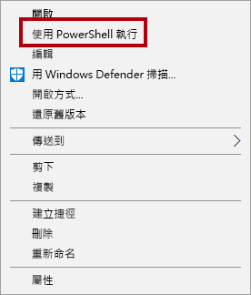

1. 如果系統提示您變更執行原則，請按 **A**。

1. 當系統提示您按任意鍵以關閉時，請再次按 **Enter**。

***AdventureWorksDW2020** 資料庫現在包括在 2020 年 6 月下訂的銷售訂單。*

## **重新整理 Power BI Desktop 檔案**

在此工作中，您將開啟**Sales Analysis** Power BI Desktop 檔案、執行資料重新整理，然後將檔案上傳至**您的 Sales Analysis**工作區。

1. 在 Power BI Desktop 檔案的 [**資料**] 窗格中，以滑鼠右鍵按一下 **[銷售**] 資料表，然後選取 [**重新整理資料**]。

    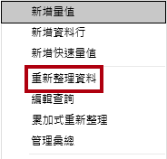

1. 當重新整理完成時，請儲存 Power BI Desktop 檔案。

1. 若要將檔案發佈至工作區，請在 [ **首頁** ] 功能區索引標籤的 **[共用** ] 群組內選取 [ **發佈** ]，然後選取 [ **選取** 發佈]。

    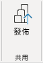

1. 當系統提示您取代資料集時，請選取 [取代]。

1. 關閉 Power BI Desktop。

*Power BI 服務中的資料集現在有 2020 年 6 月的銷售資料。*

### **檢閱儀表板**

在此工作中，您將檢閱儀表板，以注意已更新的銷售量。

1. 在 Microsoft Edge 瀏覽器視窗中，開啟 [Power BI 服務]，然後檢閱 **[我的工作區**] 中的 **[銷售監視**] 儀表板。

2. 在 [ **銷售] 的 [收益邊界** ] 圖格中，與子標題一起顯示，請注意資料已 **重新整理：NOW**。

3. 另請注意，現在有 **2020 年 6 月**的資料行。
    
    *如果您沒有看到 2020 年 6 月的資料，則可能需要按 **F5** 以重新載入網頁瀏覽器。*

    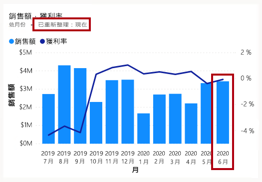

### **完成**

在此工作中，您將完成實驗室。

1. 儲存報表並關閉瀏覽器。
