---
lab:
  title: 強制執行資料列層級安全性
  module: Module 12 - Row-Level Security
ms.openlocfilehash: 6ccc19e9835dca06ec613e386c82fb0270a28ed5
ms.sourcegitcommit: 51f448b208842f1333cb683b7775618edb41c126
ms.translationtype: HT
ms.contentlocale: zh-TW
ms.lasthandoff: 04/09/2022
ms.locfileid: "145196614"
---
# **強制執行資料列層級安全性**

**完成實驗室的估計時間為 45 分鐘**

在此實驗室中，您將在 **Salesperson** 資料表與 **Sales** 資料表之間建立多對多關聯性。 您也會強制執行資料列層級安全性，以確保銷售人員只能分析其獲指派區域的銷售資料。

在此實驗室中，您將了解如何：

- 設定多對多關聯

- 實施資料列層級安全性

### **實驗室案例**

此實驗室為一系列實驗室的其中之一，其設計用意是完整呈現資料準備到報表和儀表板發行的整個過程。 您可以依照任何順序完成實驗室。 然而，若您想要逐步完成多個實驗室，建議您依照下列順序完成前 10 個實驗室：

1. 在 Power BI Desktop 中準備資料

2. 在 Power BI Desktop 中載入資料

3. 在 Power BI Desktop 中設計資料模型

5. 在 Power BI Desktop 中建立 DAX 計算，第 1 部分

6. 在 Power BI Desktop 中建立 DAX 計算，第 2 部分

7. 在 Power BI Desktop 中設計報表，第 1 部分

8. 在 Power BI Desktop 中設計報表，第 2 部分

9. 建立 Power BI 儀表板

10. 在 Power BI Desktop 中執行資料分析

11. **強制執行資料列層級安全性**

## **練習 1：強制執行資料列層級安全性**

在此練習中，您將實施資料列層級安全性，以確保銷售人員只會看到其獲指派區域中的銷售額。

### **工作 1：開始作業**

在此工作中，您將會設定實驗室的環境。

*重要：若您是從上一個實驗室繼續進行 (且已成功完成該實驗室)，請不要完成此工作；相反地，請從下一個工作繼續。*

1. 若要開啟 Power BI Desktop，請在工作列上按一下 [Microsoft Power BI Desktop] 捷徑。

    

1. 若要關閉 [開始使用] 視窗，請按一下視窗左上角的 [X]。

    

1. 若要開啟 Power BI Desktop 入門檔案，請按一下 [檔案] 功能區索引標籤以開啟 Backstage 檢視。

1. 選取 [開啟報表]。

    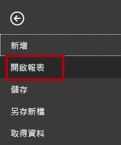

1. 按一下 [瀏覽報表]。

    

1. 在 [開啟] 視窗中，瀏覽至 **D:\PL300\Labs\10-row-level-security\Starter** 資料夾。

1. 選取 **Sales Analysis** 檔案。

1. 按一下 [開啟]。

    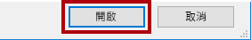

1. 關閉任何可能開啟的資訊視窗。

1. 若要建立檔案的複本，請按一下 [檔案] 功能區索引標籤，以開啟 Backstage 檢視。

1. 選取 [另存新檔]。

    

1. 若系統提示您套用變更，請按一下 [套用]。

    

1. 在 [另存新檔] 視窗中，瀏覽至 **D:\PL300\MySolution** 資料夾。

1. 按一下 [檔案] 。

    

### **工作 2：強制執行資料列層級安全性**

在此工作中，您將實施資料列層級安全性，以確保銷售人員只會看到其獲指派區域中的銷售額。

1. 切換至 [資料] 檢視。

    

2. 在 [欄位] 窗格中，選取 [Salesperson (Performance)] 資料表。

3. 檢閱資料，請注意 Michael Blythe (EmployeeKey 281) 具有以下 UPN 值： **michael-blythe@adventureworks.com**

    *還記得 Michael Blythe 獲指派三個銷售領域：美國東北部、美國中部和美國東南部。*

4. 切換至 [報表] 檢視。

5. 在 [模型] 功能區索引標籤上，從 [安全性] 群組內，按一下 [管理角色]。

    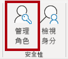

6. 在 [管理角色] 視窗中，按一下 [建立]。

    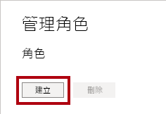

7. 在方塊中，將選取的文字取代為角色的名稱：**Salespeople**，然後按 **Enter**。

    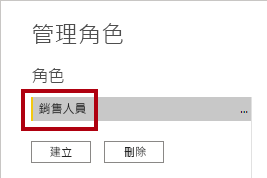

8. 若要為 [Salesperson (Performance)] 資料表指派篩選，請按一下省略符號 (...) 字元，然後選取 [新增篩選 \| UPN]。

    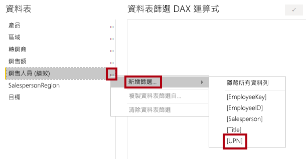

9. 在 [資料表篩選 DAX 運算式] 方塊中，將[值] 取代為 **USERPRINCIPALNAME()** 以修改運算式。

    

    *USERPRINCIPALNAME() 是 Data Analysis Expressions (DAX) 函式，會傳回已驗證使用者的名稱。這表示 [Salesperson (Performance)] 資料表將依查詢模型之使用者的使用者主體名稱 (UPN) 篩選。*

10. 按一下 [檔案] 。

    

11. 若要測試安全性角色，請在 [模型] 功能區索引標籤上，從 [安全性] 群組內，按一下 [檢視身分]。

    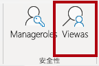

12. 在 [以角色身分檢視] 視窗中，選取 [其他使用者] 項目，然後在對應的方塊中輸入： **michael-blythe@adventureworks.com**

13. 選取 [Salespeople] 角色。

    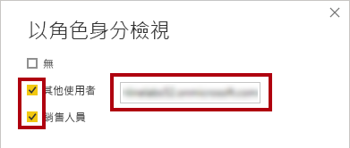

    *此設定會導致使用 [Salespeople] 角色，並以 Michael Blythe 的姓名模擬使用者。*

14. 按一下 [確定]。

    

15. 請注意報表頁面上方的黃色橫幅，其中描述測試安全性內容。

    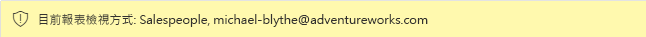

16. 在資料表視覺效果中，請注意只會列出銷售人員 **Michael Blythe**。

    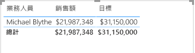

17. 若要停止測試，請按一下黃色橫幅右側的 [停止檢視]。

    

    *將 Power BI Desktop 檔案發佈到 Power BI 服務之後，您必須完成發佈後工作，以將安全性主體對應至 [Salespeople] 角色。您不會在此實驗室中執行該項工作。*

18. 若要刪除角色，請在 [模型] 功能區索引標籤上，從 [安全性] 群組內，按一下選取 [管理角色]。

    

19. 在 [管理角色] 視窗中，按一下 [刪除]。

    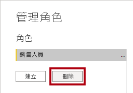

20. 當系統提示您確認刪除時，請按一下 [是，刪除]。

21. 按一下 [檔案] 。

    

### **工作 3：完成作業**

在此工作中，您將完成實驗室。

1. 儲存 Power BI Desktop 檔案。
