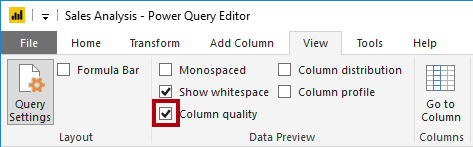
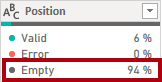

---
lab:
  title: 在 Power BI 中取得資料
  module: Get data in Power BI
---

# 在 Power BI 中取得資料

## 實驗室案例

此實驗室旨在介紹 Power BI Desktop 應用程式、如何連線到資料、以及如何使用資料預覽技術來瞭解來源資料的特性和品質。

在此實驗室中，您會了解如何：

- 開啟 Power BI Desktop。
- 連線到不同的資料來源。
- 使用 Power Query 預覽來源資料。
- 使用 Power Query 中的資料分析功能。

**此實驗室大約需要 30 分鐘。**

## 開始使用 Power BI Desktop

若要完成本練習，請先開啟網頁瀏覽器，然後輸入下列 URL 以下載 zip 資料夾：

`https://github.com/MicrosoftLearning/PL-300-Microsoft-Power-BI-Data-Analyst/raw/Main/Allfiles/Labs/01-get-data-in-power-bi/01-get-data.zip`

將資料夾解壓縮至**C：\Users\Student\Downloads\01-get-data** 資料夾。

開啟**01-Starter-Sales Analysis.pbix** 檔案。

- 此入門檔案已特別設定，可協助您完成實驗室。 已在入門檔案中停用下列報表層級設定：

  - 資料載入 > 第一次載入時從資料來源匯入關係
  - 資料載入 > 載入資料後自動偵測新關係

## 從 SQL Server 取得資料

這項工作會教導您如何連線到 SQL Server 資料庫並匯入資料表，以在 Power Query 中建立查詢。

1. 在 [首頁]**** 功能區索引標籤上，從 [資料]**** 群組內選取 [SQL Server]****。

     

1. 在 [SQL Server 資料庫]**視窗的 [伺服器 **]** 方塊中，輸入**localhost** 並將 [資料庫]** 保留**空白，然後選取 [****確定**]。

    > ***附註**： 在本實驗室中，您將使用 localhost** 連線**到 SQL Server 資料庫。 雖然這對實驗室來說很好，但它不被認為是實際解決方案的最佳實踐。

1. 如果系統提示輸入認證，請選取 [Windows] > [使用我目前的認證 **]，然後**選取**[連線]。**

1. 如果您收到無法建立加密連線的警告，請選取 **[確定** ]。

1. 在 [導覽器 **]** 窗格中，展開 **[AdventureWorksDW2020**] 資料庫。

    > ***附註**：**AdventureWorksDW2020** 資料庫是以 AdventureWorksDW2017** 範例資料庫為基礎**。 它已進行修改以支援課程實驗室的學習目標。

1. 選取**DimEmployee** 資料表，並注意資料表資料的預覽。

     

    > ***注意**：預覽資料可讓您查看欄和列範例。

1. 勾選下列表格名稱旁邊的方塊 **，以**選取下列表格。

    - DimEmployee
    - DimEmployeeSalesTerritory
    - DimProduct
    - DimReseller
    - DimSalesTerritory
    - FactResellerSales

1. 選取 **[轉換資料**] 來完成此工作，這會開啟 Power Query 編輯器 - 讓下一個工作保持開啟狀態。

您現在已連線到 SQL Server 資料庫中的六個資料表。

## 在 Power Query 編輯器中預覽資料

此工作會引進 Power Query 編輯器，並可讓您檢閱和分析資料。 這可協助您決定稍後如何清理和轉換資料。 您也會檢閱以「Dim」為前置詞的維度資料表，以及以「Fact」為前置詞的事實資料表。

1. 在 [Power Query 編輯器]**** 視窗中的左側，注意 [查詢]**** 窗格。 [查詢]**** 窗格針對每個選取的資料表皆包含一個查詢。

     

1. 選取**DimEmployee** 查詢。

    > ***SQL Server 資料庫中的 DimEmployee** 資料表會為每位員工儲存一列。此表格中資料列的子集代表銷售人員，這將與您將開發的模型相關。*

1. 在狀態列的左下角，會提供一些表格統計資料，表格有 33 欄和 296 列。

     

1. 在資料預覽窗格中，水平捲動以檢閱所有資料行。 請注意，最後五個資料行包含**資料表**或**值**連結。

    > *這五個資料行代表與資料庫中其他資料表的關係。它們可用來將表格連接在一起。您稍後將在 Power BI Desktop** 實驗室中**載入轉換的資料中聯結這些資料表。*

1. 若要評估資料行品質，請在 [檢視]**** 功能區索引標籤上，從 [資料預覽]**** 群組內，選取 [資料行品質]****。 資料行品質功能可讓您輕鬆地判斷資料行中有效、錯誤或空白值的百分比。

     

1. 請注意，**Position** 資料行有 94% 的空白 （Null） 資料列。

     

1. 若要評估資料行散發，請在 [檢視]**** 功能區索引標籤上，從 [資料預覽]**** 群組內部，檢查 [資料行散發]****。

1. 再次檢閱 [職位]**** 資料行，並注意有四個相異值與一個唯一值。

1. 檢閱 EmployeeKey** 資料行的資料**行分佈 - 有 296 個相異值和 296 個唯一值。

     

    > ***附註**： 當相異和唯一計數相同時，表示該欄包含唯一值。 建立模型時，某些模型資料表必須包含唯一資料行。 這些唯一資料行可用來建立一對多關聯性，您將在 Power BI Desktop** 中的模型資料實驗室中**執行此動作。

1. 在 [查詢]**** 窗格中，選取**DimProduct** 查詢。

    > ***DimProduct** 資料表包含公司銷售的每個產品一列。*

1. 在 [查詢]**** 窗格中，選取**DimReseller** 查詢。

    > ***DimReseller** 資料表包含每個經銷商一個資料列。經銷商銷售、分發 Adventure Works 產品或為 Adventure Works 產品增值。*

1. 若要檢視資料行值，請在 [檢視]**** 功能區索引標籤上，從 [資料預覽]**** 群組內部，檢查 [資料行設定檔]****。

1. 選取 [BusinessType **]** 資料行標頭，並注意資料預覽窗格下方的新窗格。 檢閱資料預覽窗格中的資料行統計資料和值分布。

    > *請注意資料品質問題：倉庫有兩個標籤（**倉庫**和拼錯的**Ware House**）。*

     

1. 將游標停在 [Ware House]**** 列上方，並注意有五個具有此值的資料列。

1. 在 [查詢]**** 窗格中，選取**DimSalesTerritory** 查詢。  

    > ***DimSalesTerritory** 資料表包含每個銷售區域的一列，包括**公司總部** （總部）。區域會指派給國家/地區，而國家/地區會指派給群組。在 Power BI Desktop** 中的模型資料實驗室**中，您將建立階層，以支援區域、國家/地區或群組層級的分析。*

1. 在 [查詢]**** 窗格中，選取**FactResellerSales** 查詢。

    > ***FactResellerSales** 資料表包含每個銷售訂單明細一列，銷售訂單包含一或多個明細項目。*

1. 檢閱**TotalProductCost** 資料行的資料行品質，並注意有 8% 的資料列為空白。

    > *缺少 TotalProductCost** 資料行值是**資料品質問題。*

## 從 CSV 檔案取得資料

在此工作中，您將根據 CSV 檔案建立新的查詢。

1. 若要新增查詢，請在 [Power Query 編輯器]**** 視窗的 [首頁]**** 功能區索引標籤上，從 [新增查詢]**** 群組內選取 [新增來源]**** 向下箭號，然後選取 [文字/CSV]****。

1. 導覽至**您先前擷取的 [下載] 資料夾> 01-get-data** 資料夾，然後選取**ResellerSalesTargets.csv** 檔案。 選取 [開啟]****。

1. 在 [ResellerSalesTargets.csv]**** 視窗中，檢閱預覽資料。 選取 [確定]。

1. 在 [查詢]**** 窗格中，注意**ResellerSalesTargets** 查詢的加入。

    > ***ResellerSalesTargets** CSV 檔案包含每個銷售人員每年一列。每列會記錄 12 個每月銷售目標 （以千表示）。Adventure Works 公司的營業年度於 7 月 1 日開始。*

1. 請注意，沒有任何資料行包含空白值。  如果缺少每月銷售目標，欄會改為顯示連字號。

1. 檢閱每個資料行標頭中的圖示 (在資料行名稱的左側)。 圖示代表資料行資料類型。 **123** 是整數，而**ABC** 是文字。

     

1. 重複這些步驟，以根據ColorFormats.csv**檔案建立**查詢。

    > *ColorFormats** CSV 檔案包含**每種產品顏色一列。每一行都會記錄十六進制代碼，以格式化背景和字型顏色。*

您現在應該有兩個新查詢：**ResellerSalesTargets** 和**ColorFormats**。

 

## 實驗室完成

您可以選擇儲存 Power BI 報表，但此實驗室不需要儲存。 在下一個練習中，您將使用預先製作的入門檔案。

1. 導航至**左上角的“文件”** 菜單，然後選擇 **“另存為”**。 
1. 選取 [瀏覽此裝置]****。
1. 選取您要儲存檔案的資料夾，並為其指定描述性名稱。 
1. 選取 [儲存]**** 按鈕，將報表儲存為 .pbix 檔案。 
1. 如果出現對話方塊，提示您套用擱置的查詢變更，請選取 [**套用**]。
1. 關閉 Power BI Desktop。