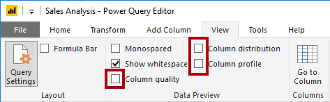

---
lab:
  title: 在 Power BI Desktop 中取得資料
  module: Get Data in Power BI
---

# 在 Power BI Desktop 中取得資料

## **實驗室案例**

此實驗室的設計目的是要介紹Power BI Desktop應用程式，以及如何連線到資料，以及如何使用資料預覽技術來瞭解來源資料的特性和品質。 學習目標如下：

- 開啟 Power BI Desktop
- 連線到不同的資料來源
- 使用 Power Query 預覽來源資料
- 在 Power Query 中使用資料分析功能

**此實驗室大約需要 30 分鐘的時間。**

## **開始使用 Power BI Desktop**

在此工作中，您會從開啟入門 Power BI (.pbix) 檔案開始。 入門檔案不包含任何資料，但已特別設定為協助您完成實驗室。 入門檔案中已停用下列報表層級設定：

- 資料載入 > 第一次載入時從資料來源匯入關聯性
- 資料載入 > 載入資料之後自動偵測新的關聯性

*注意：雖然在開發資料模型時啟用這兩個選項很有説明，但您稍早停用它們以支援實驗室體驗。當您在 Power BI Desktop 實驗室的**載入資料中**建立關聯性時，您將瞭解為何要新增每個關聯性。*

1. 開啟 Power BI Desktop。

    

    *提示：根據預設，[消費者入門] 對話方塊會在Power BI Desktop前面開啟。您可以選擇登入，然後關閉快顯。*

1. 若要開啟入門Power BI Desktop檔案，請選取 [檔案] **> [開啟報表] > [流覽報表**]。

1. 在 [ **開啟** ] 視窗中，流覽至 **D：\PL300\Labs\01-prepare-data-with-power-query-in-power-bi-desktop\Starter** 資料夾。

1. 選取 **Sales Analysis** 檔案。

1. 將具有另存 **新** 檔的檔案複本儲存至 **D：\PL300\MySolution** 資料夾。

## **從SQL Server取得資料**

這項工作會教導您如何連線到SQL Server資料庫並匯入資料表，以在Power Query中建立查詢。

1. 在 [**首頁**] 功能區索引標籤的 [**資料**] 群組內，選取 **[SQL Server**]。

     

1. 在 **[SQL Server資料庫]** 視窗中的 [**伺服器**] 方塊中，輸入**localhost**，然後選取 [**確定**]。

    *注意：在此實驗室中，您將使用**localhost**連線到SQL Server資料庫，因為閘道資料來源無法解析**localhost**。建立您自己的解決方案時，這不是建議的做法。*

1. 如果系統提示您輸入認證，請在 **[SQL Server資料庫]** 視窗中，選取 **[使用我目前的認證**]，然後選取 [**連線**]。

1. 在 [導覽器] 視窗中，展開左側的 **AdventureWorksDW2020** 資料庫。

    *注意： **AdventureWorksDW2020** 資料庫是以 **AdventureWorksDW2017** 範例資料庫為基礎。已修改以支援課程實驗室的學習目標。*

1. 選取 - 但不檢查 - **DimEmployee** 資料表

     

1. 在右窗格中，請注意資料表資料的預覽。 預覽資料可讓您查看資料行和資料列範例。

1. 若要建立查詢，請選取下列六個資料表旁邊的核取方塊：

    - DimEmployee
    - DimEmployeeSalesTerritory
    - DimProduct
    - DimReseller
    - DimSalesTerritory
    - FactResellerSales

1. 按一下 [**轉換資料**] 以完成這項工作，這會開啟Power Query 編輯器。
    1. *此實驗室僅供連線及分析資料，但無法 **轉換資料**。*

## **預覽Power Query 編輯器中的資料**

這項工作會介紹Power Query 編輯器，並可讓您檢閱和分析資料。 這可協助您判斷稍後如何清除和轉換資料。

1. 在 [Power Query 編輯器] 視窗中的左側，注意 [查詢] 窗格。 [查詢] 窗格針對每個選取的資料表皆包含一個查詢。

     

1. 選取第一個查詢：[DimEmployee]。

    *SQL Server資料庫中的**DimEmployee**資料表會為每個員工儲存一個資料列。此資料表中資料列的子集代表銷售人員，這會與您將開發的模型相關。*

1. 在狀態列的左下角，會提供一些資料表統計資料—資料表有 33 個數據行和 296 個數據列。

     

1. 在資料預覽窗格中，水平捲動以檢閱所有資料行。 請注意，最後五個資料行包含**資料表**或**值**連結。

    *這五個數據行代表資料庫中其他資料表的關聯性。它們可用來將資料表聯結在一起。您將在 Power BI Desktop 實驗室的**載入資料**中聯結資料表。*

1. 若要評估資料行品質，請在 [檢視] 功能區索引標籤上，從 [資料預覽] 群組內，選取 [資料行品質]。 資料行品質功能可讓您輕鬆地判斷資料行中有效、錯誤或空白值的百分比。

     

1. 請注意， **Position** 資料行有 94% 空白 (null) 資料列。

     

1. 若要評估資料行散發，請在 [檢視] 功能區索引標籤上，從 [資料預覽] 群組內部，檢查 [資料行散發]。

1. 再次檢閱 [職位] 資料行，並注意有四個相異值與一個唯一值。

1. 檢閱 **EmployeeKey** 資料行的資料行分佈—有 296 個相異值，以及 296 個唯一值。

    *當相異和唯一計數相同時，表示資料行包含唯一值。模型化時，某些模型資料表必須有唯一的資料行。這些唯一資料行可用來建立一對多關聯性，您將在**Power BI Desktop 實驗室的模型資料中**執行。*

     

1. 在 [查詢] 窗格中，選取 **DimEmployeeSalesTerritory** 查詢。

    ***DimEmployeeSalesTerritory**資料表會為每個員工和他們管理的銷售領域區域儲存一個資料列。資料表支援將許多區域與單一員工建立關聯。有些員工管理一個、兩個或更多區域。當您建立此資料的模型時，您必須定義多對多關聯性。*

1. 在 [查詢] 窗格中，選取 **DimProduct** 查詢。 **DimProduct** 資料表會針對由公司銷售的每個產品，各包含一個資料列。

1. 水平捲動以顯示後面的資料行。 請注意 **DimProductSubcategory** 資料行。

    *當您在 Power BI Desktop 實驗室的**載入資料**中將轉換新增至此查詢時，您將使用**DimProductSubcategory 資料行**來聯結資料表。*

1. 在 [查詢] 窗格中，選取 **DimReseller** 查詢。

    ***DimReseller**資料表包含每個轉銷商一個資料列。轉銷商會銷售、散發或價值，以新增至 Adventure Works 產品。*

1. 若要檢視資料行值，請在 [檢視] 功能區索引標籤上，從 [資料預覽] 群組內部，檢查 [資料行設定檔]。

1. 選取 **BusinessType** 資料行標頭，並注意資料預覽窗格下方的新窗格。

1. 檢閱資料預覽窗格中的資料行統計資料和值分布。

    *請注意資料品質問題：倉儲 (**倉儲**有兩個標籤，以及拼錯的 **Ware House**) 。*

     

1. 將游標停在 [Ware House] 列上方，並注意有五個具有此值的資料列。

    *您將套用轉換，以在 Power BI Desktop 實驗室載入資料中重新標記這五個**資料**列。*

1. 在 [查詢] 窗格中，選取 **DimSalesTerritory** 查詢。  

    ***DimSalesTerritory**資料表包含每個銷售領域的一個資料列，包括**公司 HQ** (總部) 。區域會指派給國家/地區，而國家/地區則會指派給群組。在**Power BI Desktop實驗室的模型資料中**，您將建立階層，以支援區域、國家/地區或群組層級的分析。*

1. 在 [查詢] 窗格中，選取 **FactResellerSales** 查詢。

    ***FactResellerSales**資料表包含每個銷售訂單明細的一個資料列，銷售訂單包含一或多個明細專案。*

1. 檢閱 **TotalProductCost** 資料行的資料行品質，並注意有 8% 的資料列是空的。

    *遺漏**TotalProductCost**資料行值是資料品質問題。若要解決此問題，請在**Power BI Desktop 實驗室的載入資料**中，使用儲存在相關**DimProduct**資料表中的產品標準成本，套用轉換以填入遺漏的值。*

## **從 CSV 檔案取得資料**

在這項工作中，您將根據 CSV 檔案建立新的查詢。

1. 若要新增查詢，請在**Power Query 編輯器 [** 首頁] 功能區索引標籤的 [**首頁**] 功能區索引標籤上，從 [**新增**來源] 向下箭號選取 [**新增來源**] 向下箭號，然後選取 **[文字/CSV**]。

1. 在 [開啟] 視窗中，瀏覽至 **D:\PL300\Resources** 資料夾，然後選取 **ResellerSalesTargets.csv** 檔案。 選取 [開啟]。

1. 在 [ResellerSalesTargets.csv] 視窗中，檢閱預覽資料。 選取 [確定]。

1. 在 [查詢] 窗格中，注意 **ResellerSalesTargets** 查詢的加入。

    ***ResellerSalesTargets** CSV 檔案每年包含每個銷售人員一個資料列。每個資料列都會記錄 12 個每月銷售目標， (以千) 表示。Adventure Works 公司的商務年度將于 7 月 1 日開始。*

1. 請注意，沒有任何資料行包含空白值。  當沒有每月銷售目標時，會改為儲存連字號字元。

1. 檢閱每個資料行標頭中的圖示 (在資料行名稱的左邊)。 圖示代表資料行資料類型。 **123** 是整數，而 **ABC** 是文字。

     

1. 重複這些步驟，根據 **D:\PL300\Resources\ColorFormats.csv** 檔案建立查詢。

    ***ColorFormats** CSV 檔案包含每個產品色彩一個資料列。每個資料列都會記錄 HEX 代碼，以格式化背景和字型色彩。*

*您現在應該會有兩個新的查詢 **ResellerSalesTargets** 和 **ColorFormats**。*

 

### **完成**

在此工作中，您將完成實驗室。

1. 在 [檢視] 功能區索引標籤上，從 [資料預覽] 群組內，取消選取先前在此實驗室中啟用的三個資料預覽選項：

    - 資料行品質
    - 資料行散發
    - 資料行設定檔

     

1. **儲存**Power BI Desktop檔案。 當系統提示您套用擱置的變更時，請選取 [ **稍後套用**]。

    *提示：套用查詢會將其資料載入資料模型。您尚未準備好這麼做，因為必須先套用許多轉換。*
