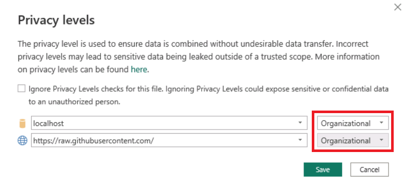
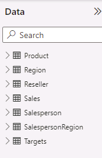

---
lab:
  title: 在 Power BI Desktop 中載入轉換的數據
  module: 'Clean, Transform, and Load Data in Power BI'
---

# 在 Power BI Desktop 中載入轉換的數據

## 實驗室案例

在此實驗室中，您將使用數據清理和轉換技術開始塑造數據模型。 接著，您將會把每項查詢載入為資料模型的資料表。

在此實驗室中，您將了解如何：

- 套用各種轉換
- 將查詢載入資料模型

**此實驗室大約需要45分鐘的時間。**

## 開始使用

若要完成此練習，請先開啟網頁瀏覽器，然後輸入下列 URL 以下載 zip 資料夾：

`https://github.com/MicrosoftLearning/PL-300-Microsoft-Power-BI-Data-Analyst/raw/Main/Allfiles/Labs/02-load-data-with-power-query-in-power-bi-desktop/02-load-data.zip`

將資料夾解壓縮至 **C：\Users\Student\Downloads\02-load-data** 資料夾。

**開啟 02-Starter-Sales Analysis.pbix** 檔案。

> ***注意**：您可以選取 **[取消**] 來關閉登入。 關閉任何其他信息視窗。 如果系統提示您套用變更，請選取 **[稍後**套用]。

## 設定 Salesperson 查詢

在這項工作中，您將使用 Power Query 編輯器 來設定 **Salesperson** 查詢。

> ***重要**：當指示重新命名數據行時，請務必完全如所述重新命名數據行。*

1. 若要開啟 [Power Query 編輯器]**** 視窗，請在 [首頁]**** 功能區索引標籤上，從 [查詢]**** 群組中選取**轉換資料**圖示。

     

1. 在 [Power Query 編輯器]**** 視窗的 [查詢]**** 窗格中，選取 [DimEmployee]**** 查詢。

     

1. 若要重新命名查詢，請在 [查詢設定]**** 窗格 (位於右側) 的 [名稱]**** 方塊中，將文字取代為 **Salesperson**，然後按 **Enter**。 然後確認名稱已在 [查詢 **] 窗格中更新**。

    > *查詢名稱會決定模型數據表名稱。建議您定義簡潔且易記的名稱。*

1. 若要找出特定數據行，請在 [ **首頁** ] 功能區索引標籤上，選取 **[管理** 數據行] 向下箭號，選取 **[選擇** 數據行向下箭號]，然後選取 **[移至數據行**]。

    > *移至 [資料行] 是許多數據行的實用功能。否則，您可以水平捲動尋找數據行。*

     

1. 在 [**移至數據行**] 視窗中，若要依數據行名稱排序列表，請選取 **[AZ** 排序] 按鈕，然後選取 [名稱 **] 和 **[** SalesPersonFlag**]。 按一下 [確定]****。

     

1. **找出 SalesPersonFlag** 數據行，然後篩選數據行，只選取 Salespeople （也就是 **TRUE**），然後按兩下 [**確定**]。

1. 在 [查詢設定]**** 窗格的 [套用的步驟]**** 清單中，注意新增的 [已篩選資料列]**** 步驟。

    > *您建立的每個轉換都會產生另一個步驟邏輯。可以編輯或刪除步驟。您也可以選取步驟，在查詢轉換的該階段預覽查詢結果。*

     

1. 若要移除數據行，請在 [ **首頁** ] 功能區索引標籤上，選取 **[管理數據** 行] 群組，選取 [ **選擇數據行** ] 圖示。

1. 在 [選擇資料行]**** 視窗中，若要取消選取所有資料行，請取消選取 [(選取所有資料行)]**** 項目。

1. 若要包含資料行，請核取下列六個資料行：

    - EmployeeKey
    - EmployeeNationalIDAlternateKey
    - FirstName
    - LastName
    - Title
    - EmailAddress

1. 在 [套用的步驟]**** 清單中，請注意新增的另一個查詢步驟。

     

1. 若要建立單一名稱資料行，請先選取 [FirstName]**** 資料行標頭。 按下 **Ctrl** 鍵的同時，選取 [LastName]**** 資料行。

     

1. 以滑鼠右鍵按一下其中一個選取的資料行標頭，然後在操作功能表中選取 [合併資料行]****。

    > *您可以在數據行標頭上點擊滑鼠右鍵，然後從操作選單選擇它們，以套用許多常見的轉換。不過請注意，功能區中有更多轉換可供使用。*

1. 在 [合併資料行]**** 視窗的 [分隔符號]**** 下拉式清單中，選取 [空格]****。

1. 在 [新資料行名稱]**** 方塊中，將文字取代為 **Salesperson**。

1. 若要重新命名 **EmployeeNationalIDAlternateKey 數據行，請按兩下 **EmployeeNationalIDAlternateKey**** 資料行標頭，並將文字取代為 **EmployeeID**，然後按 **Enter**。

1. 使用前面的步驟，將 **EmailAddress** 資料行重新命名為 **UPN**。

    > *UPN 是用戶主體名稱的縮寫。*

**在左下方的狀態列中，確認查詢有 5 個數據行和 18 個數據列。**

## **設定 SalespersonRegion 查詢**

在這項工作中，您將設定 **SalespersonRegion** 查詢。

1. 在 [查詢]**** 窗格中，選取 **DimEmployeeSalesTerritory** 查詢。

1. 在 [查詢設定]**** 窗格中，將查詢重新命名為 **SalespersonRegion**。

1. 若要移除最後兩個資料行，請先選取 **DimEmployee** 資料行標頭。

1. 按下 **Ctrl** 鍵時，請選取 **DimSalesTerritory** 資料行標頭。

1. 以滑鼠右鍵按一下其中一個選取資料行標頭，然後在操作功能表中選取 [移除資料行]****。

**在狀態列中，確認查詢有 2 個數據行和 39 個數據列。**

## 設定 Product 查詢

在這項工作中，您將設定 **Product** 查詢。

> ***重要**事項：提供詳細指示后，實驗室步驟將提供更簡潔的指示。 如果您需要詳細的指示，可以回到先前工作的步驟。*

1. **選取 DimProduct** 查詢，並將查詢重新命名為 **Product**。

1. 找出 **FinishedGoodsFlag** 資料行，然後篩選該資料行以擷取屬於成品 (亦即 TRUE) 的產品。

1. 移除所有資料列， **但下列專案除外** ：

    - ProductKey
    - EnglishProductName
    - StandardCost
    - Color
    - DimProductSubcategory

1. 請注意，**DimProductSubcategory** 資料行代表相關資料表 (其中包含 **Value** 連結)。

1. 在 [DimProductSubcategory]**** 資料行標頭中，選取資料行名稱右側的展開按鈕。

    

1. 請參閱資料行的完整清單，然後選取 [ **選取所有數據** 行] 方塊以取消選取所有數據行。

1. 選取 **[EnglishProductSubcategoryName** ] 和 **[DimProductCategory**]，然後取消核取 [ **使用原始數據行名稱做為前置詞** ] 複選框，然後選取 [ **確定**]。

    > *藉由選取這兩個數據行，將會套用轉換以聯結至 **DimProductSubcategory** 數據表，然後包含這些數據行。DimProductCategory 數據 **行** 實際上是數據源中另一個相關數據表。*
    >
    > *查詢數據行名稱必須一律是唯一的。如果選取左方，此複選框會在每個數據行前面加上展開的數據行名稱（在此案例**中為 DimProductSubcategory**）。由於已知選取的數據行名稱不會與 Product** 查詢中的數據**行名稱相撞，因此會取消選取選項。*

1. 請注意，轉換會導致新增兩個資料行，而且已移除 [DimProductSubcategory]**** 資料行。

1. 展開 **DimProductCategory** 資料行，然後只引進 **EnglishProductCategoryName** 資料行。

1. 將下列四個資料行重新命名：

    - 將 **EnglishProductName** 重新命名為 **Product**
    - 將 **StandardCost** 重新命名為 **Standard Cost** (包含空格)
    - 將 **EnglishProductSubcategoryName** 重新命名為 **Subcategory**
    - 將 **EnglishProductCategoryName** 重新命名為 **Category**

**在狀態列中，確認查詢有 6 個數據行和 397 個數據列。**

## 設定 Reseller 查詢

在這項工作中，您將設定 **Reseller** 查詢。

1. **選取 DimReseller** 查詢，然後重新命名為 **Reseller**。

1. 移除所有資料列， **但下列專案除外** ：

    - ResellerKey
    - BusinessType
    - ResellerName
    - DimGeography

1. **展開 DimGeography** 資料行，只**包含**下列三個數據行：

    - 縣/市
    - StateProvinceName
    - EnglishCountryRegionName

1. 在 [**商務類型**] 數據行標頭上，選取向下箭號，然後檢閱不同的數據行值，並注意 Warehouse** 和 **Ware House** 值**。

1. 以滑鼠右鍵按一下 **Business Type** 資料行標頭，然後選取 [取代值]****。

1. 在 [ **取代值]** 視窗中，設定下列值：

    - 在 [要尋找的值]**** 方塊中，輸入 **Ware House**
    - 在 [取代為]**** 方塊中，輸入 ****

     

1. 將下列四個資料行重新命名：

    - 將 **BusinessType** 重新命名為 **Business Type** (包含空格)
    - 將 **ResellerName** 重新命名為 **Reseller**
    - 將 **StateProvinceName** 重新命名為 **State-Province**
    - 將 **EnglishCountryRegionName** 重新命名為 **Country-Region**

**在狀態列中，確認查詢有 6 個數據行和 701 個數據列。**

## 設定 Region 查詢

在此工作中，您將設定 **Region** 查詢。

1. **選取 DimSalesTerritory** 查詢，並將查詢重新命名為 **Region**。

1. 將篩選套用至 **SalesTerritoryAlternateKey** 資料行，以移除值 0 (零)。

    > *這會移除一個數據列。*

1. 移除所有資料列， **但下列專案除外** ：

    - SalesTerritoryKey
    - SalesTerritoryRegion
    - SalesTerritoryCountry
    - SalesTerritoryGroup

1. 重新命名下列三筆資料行：

    - 將 **SalesTerritoryRegion** 重新命名為 **Region**
    - 將 **SalesTerritoryCountry** 重新命名為 **Country**
    - 將 **SalesTerritoryGroup** 重新命名為 **Group**

**在狀態列中，確認查詢有 4 個數據行和 10 個數據列。**

## 設定 Sales 查詢

在這項工作中，您將設定 **Sales** 查詢。

1. **選取 FactResellerSales** 查詢，並將其重新命名為 **Sales**。

1. 移除所有資料列， **但下列專案除外** ：

    - SalesOrderNumber
    - OrderDate
    - ProductKey
    - ResellerKey
    - EmployeeKey
    - SalesTerritoryKey
    - OrderQuantity
    - UnitPrice
    - TotalProductCost
    - SalesAmount
    - DimProduct

    > ***注意**：您可能會在Power BI Desktop** 實驗室的準備數據中**召回一小部分 **FactResellerSales 數據**列遺漏 **TotalProductCost** 值。 **已包含 DimProduct** 資料行以擷取產品標準成本數據行，以協助修正遺漏值。*

1. 展開 [DimProduct]**** 資料行、取消選取所有資料行，然後僅包括 [StandardCost]**** 資料行。

1. 若要建立自訂資料行，請在 [新增資料行]**** 功能區索引標籤上，從 [一般]**** 群組中選取 [自訂資料行]****。

     

1. 在 [自訂資料行]**** 視窗的 [新資料行名稱]**** 方塊中，將文字取代為 **Cost**。

1. 在 [ **自定義數據行公式] 方塊** 中，輸入下列表達式 （等於符號之後），然後儲存新的數據行：

   ` if [TotalProductCost] = null then [OrderQuantity] * [StandardCost] else [TotalProductCost] `

    > ***注意**：您可以從 02-load-data 資料夾中的 Snippets.txt** 檔案複製表達式**。*

    > *此表達式會測試 TotalProductCost** 值是否**遺失。如果遺漏，它會藉由將 OrderQuantity** 值乘**以 **StandardCost** 值來產生值，否則會使用現有的 **TotalProductCost** 值。*

1. 移除下列兩筆資料行：

    - TotalProductCost
    - StandardCost

1. 重新命名下列三筆資料行：

    - **OrderQuantity** 改為 **Quantity**
    - **UnitPrice** 改為 **Unit Price** (包含空格)
    - **SalesAmount** 改為 **Sales**

1. 若要修改資料行的資料類型，請在 [Quantity]**** 資料行標頭中，選取資料行名稱左側的 **1.2** 圖示，然後選取 [整數]****。

    > *設定正確的數據類型很重要。當數據行包含數值時，如果您預期要執行數學計算，也請務必選擇正確的類型。*

     

1. 將下列三個資料行資料類型修改為 [固定的小數位數]****。

    > *固定的十進位數數據類型允許19位數，並允許更精確，以避免四捨五入錯誤。請務必針對財務值或匯率（例如匯率）使用固定的十進位數類型。*

    - 單價
    - Sales
    - 成本

**在狀態列中，確認查詢有10個數據行和999個以上的數據列。** *每個查詢的預覽數據最多會載入 1000 個數據列。*

## 設定 Targets 查詢

在這項工作中，您將設定 **Targets** 查詢。

1. **選取 ResellerSalesTargets** 查詢，然後重新命名為 **[目標**]。

1. 若要取消 12 個月資料行 (**M01**-**M12**) 樞紐，請先複選 [Year]**** 和 [EmployeeID]**** 資料行標頭。

1. 以滑鼠右鍵按一下其中一個選取資料行標頭，然後在操作功能表中選取 [取消其他資料行樞紐]****。

1. 請注意，資料行名稱現在會顯示在 [Attribute]**** 資料行中，而值會出現在 [Value]**** 資料行中。

1. 將篩選套用至 [Value]**** 資料行，以移除連字號 (-) 值。

    > *您可能還記得來源 CSV 檔案中使用連字元字元來表示零 （0）。*

1. 重新命名下列兩筆資料行：

    - **MonthNumber** 的屬性** **（沒有空格）
    - **Value** 改為 **Target**

1. 若要準備 **MonthNumber** 資料行值，請以滑鼠右鍵按一下 [MonthNumber]**** 資料行標頭，然後選取 [取代值]****。

    > *您現在會套用轉換來產生日期資料行。日期會衍生自 **Year** 和 **MonthNumber** 數據行。您將使用 **[來自範例** 的數據行] 功能來建立數據行。*

1. 在 [取代值]** 視窗中的 [** 值到尋找 **] 方塊中**，輸入 **M**，並將 **[取代為**空白]。

1. 將 [MonthNumber]**** 資料行的資料類型修改為 [整數]****。

1. 在 [新增資料行]**** 功能區索引標籤上，從 [一般]**** 群組中選取**來自範例的資料行**圖示。

    

1. 請注意，第一個資料列是適用於 **2017** 年和 **7** 月。

1. 在 [Column1]**** 資料行的第一個格線儲存格中，開始輸入 **7/1/2017**，然後按 **Enter**。

    > ***注意**：虛擬機使用美國區域設定，因此此日期實際上是 2017 年 7 月 1 日。 其他區域設定可能需要 **日期之前的 0** 。*

1. 請注意，方格儲存格會使用預測的值更新。

    > *此功能已正確預測您正在結合Year**和 MonthNumber** 資料行的值****。*

1. 另請注意查詢方格上方顯示的公式。

     

1. 若要重新命名新的數據行，請按兩下 **[** 合併的數據行] 標頭，並將數據行重新命名為 **TargetMonth**。

1. 移除下列資料行：

    - Year
    - MonthNumber

1. 修改下列資料行的資料類型：

    - **Target** 為固定的小數位數
    - **TargetMonth** 為日期

1. 若要將 **Target** 值乘以 1000，請選取 [Target]**** 資料行標頭，然後在 [轉換]**** 功能區索引標籤上，從 [數字資料行]**** 群組中選取 [標準]****，然後選取 [乘]****。

    > *您可能會回想一下，目標值已儲存為數千個。*

     

1. 在 [**乘法**] 視窗中的 [值 **] 方塊中**，輸入 **1000**，然後選取 [**確定**]。

**在狀態列中，確認查詢有 3 個數據行和 809 個數據列。**

## 設定 ColorFormats 查詢

在這項工作中，您將設定 **ColorFormats** 查詢。

1. **選取 ColorFormats** 查詢，並注意第一個數據列包含數據行名稱。

1. 在 [首頁]**** 功能區索引標籤上，從 [轉換]**** 群組中選取 [使用第一個資料列作為標頭]****。

     

**在狀態列中，確認查詢有 3 個數據行和 10 個數據列。**

## 更新 Product 查詢

在這項工作中，您將藉由合併 **ColorFormats** 查詢來更新 **Product** 查詢。

1. 選取 [Product]**** 查詢。

1. 若要合併 ColorFormats** 查詢，請在 [**首頁**] 功能區索引標籤上，選取 **[合併**向下箭號]，然後選取 [**合併查詢**]。**

    > *合併查詢允許整合資料，在此案例中是來自不同資料來源 (SQL Server 和 CSV 檔案) 的資料。*

     

1. 在 [合併]**** 視窗的 [Product]**** 查詢格線中，選取 [Color]**** 資料行標頭。

     

1. 在 [Product]**** 查詢格線下的下拉式清單中，選取 [ColorFormats]**** 查詢。

     

1. 在 [ColorFormats]**** 查詢格線中，選取 [Color]**** 資料行標頭。

1. 當 [**隱私權等級**] 視窗開啟時，針對這兩個數據源，在對應的下拉式清單中選取 [組織 **]，然後**選取 **[儲存**]。

    > *您可以為數據源設定隱私權層級，以判斷是否可以在來源之間共享數據。視需要將每個數據源設定為 **組織** ，即可共享數據。私人數據源永遠無法與其他數據源共用。這並不表示無法共用私人數據;這表示Power Query引擎無法在來源之間共享數據。*

     

1. 在 [ **合併** ] 視窗中，使用預設 **的 [聯結種類** - 維護左外部] 的選取範圍，然後選取 [ **確定**]。

1. 展開 [ColorFormats]**** 資料行，以包括下列兩個資料行：

    - 背景色彩格式
    - 字型色彩格式

**在狀態列中，確認查詢現在有8個數據行和397個數據列。**

## 更新 ColorFormats 查詢

在這項工作中，您將更新 **ColorFormats** 以停用載入。

1. 選取 [ColorFormats]**** 查詢。

1. 在 [查詢設定]**** 窗格中，選取 [所有屬性]**** 連結。

     

1. 在 [查詢屬性]**** 視窗中，取消選取 [啟用載入至報告]**** 核取方塊。

    > *停用載入表示不會將它當做數據表載入數據模型。這樣做是因為查詢已與 **Product 查詢合併，而 Product** 查詢會啟用以載入數據模型。*

     

### 檢閱最終產品

在 Power Query 編輯器 中，確認您有 **8 個查詢**，正確命名如下：

- 銷售員
- SalespersonRegion
- Products
- 轉售商
- 區域
- Sales
- 目標
- ColorFormats (不會載入至資料模型)

選取 [**關閉&amp;套用**] 以將數據載入模型，然後關閉 Power Query 編輯器 視窗。

您現在可以在Power BI Desktop 中看到畫布，右側有 [篩選]、[視覺效果] 和 [數據] 窗格。 在 [數據] 窗格中，請注意 **載入至數據模型的 7 個數據表** 。

## 實驗室完成