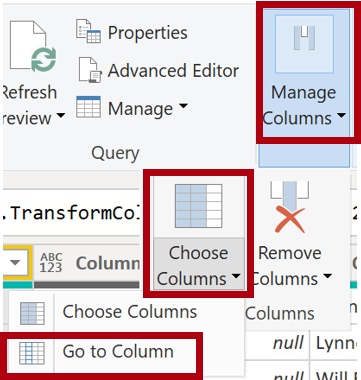
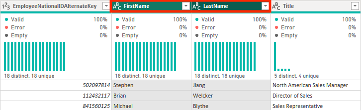

---
lab:
  title: 在 Power BI 中清理、轉換和載入資料
  module: 'Clean, transform, and load data in Power BI'
---

# 在 Power BI 中清理、轉換和載入資料

## 實驗室案例

在本實驗室中，您將使用資料清理和轉換技術來開始塑造您的資料模型。 然後，您將套用查詢，將每個查詢載入為資料表至語意模型。

在此實驗室中，您會了解如何：

- 套用各種資料轉換。
- 將查詢載入語意模型。

**此實驗室大約需要 45 分鐘。**

## 開始使用

若要完成本練習，請先開啟網頁瀏覽器，然後輸入下列 URL 以下載 zip 資料夾：

`https://github.com/MicrosoftLearning/PL-300-Microsoft-Power-BI-Data-Analyst/raw/Main/Allfiles/Labs/02-transform-data-power-bi/02-transform-data.zip`

將資料夾解壓縮至 **C：\Users\Student\Downloads\02-transform-data** 資料夾。

開啟 **02-Starter-Sales Analysis.pbix** 檔案。

> _**注意**：載入檔案時，您可能會看到登入對話方塊。選取 **[取消]** 以關閉登入對話方塊。關閉任何其他資訊視窗。如果系統提示套用變更，請選取 **[稍後套用]。**_

## 設定 Salesperson 查詢

在此工作中，您將使用 Power Query 編輯器來設定**銷售人員**查詢。

> ***重要事項**：當系統指示重新命名欄時，請務必完全按照說明重新命名欄。

1. 若要開啟 [Power Query 編輯器]**** 視窗，請在 [首頁]**** 功能區索引標籤上，從 [查詢]**** 群組中選取**轉換資料**圖示。

    

1. 在 [Power Query 編輯器]**** 視窗的 [查詢]**** 窗格中，選取 [DimEmployee]**** 查詢。

    

    > **附註：** 如果您收到警告訊息，要求指定如何連線，請選取 **編輯認證**，使用目前認證進行連線，然後選取 **確定** 以使用未加密的連線。
 
1. 若要重新命名查詢，請在 [查詢設定]**** 窗格 (位於右側) 的 [名稱]**** 方塊中，將文字取代為 **Salesperson**，然後按 **Enter**。 然後確認名稱已在 [查詢]** 窗格中**更新。

    > *查詢名稱會決定模型資料表名稱。建議定義簡潔且使用者友善的名稱。*

1. 若要尋找特定資料行，請在 [首頁]**** 功能區索引標籤上，從 [管理資料行]**** 群組中選取 [選擇資料行]**** 向下箭號，然後選取 [前往資料行]****。

    > _**轉到欄是一個** 有用的功能，有許多欄。否則，您可以水平捲動以尋找欄。_

    

1. 在 [移至資料行] **** 視窗中，若要依資料行名稱排序清單，請選取 **[可用區域**排序] 按鈕，然後選取 **[名稱**]。 

    

1. 找出 **SalesPersonFlag** 資料行，然後篩選資料行以只選取 Salespeople （也就是 **TRUE**），然後按一下 **[確定**]。

1. 在 [查詢設定]**** 窗格的 [套用的步驟]**** 清單中，注意新增的 [已篩選資料列]**** 步驟。

    > *您建立的每個轉換都會產生另一個步驟邏輯。您可以編輯或刪除步驟。您也可以選取步驟，在查詢轉換的該階段預覽查詢結果。*

    

1. 若要移除資料行，請在 [首頁]**** 功能區索引標籤上，從 [管理資料行]**** 群組中選取**選擇資料行**圖示。

1. 在 [選擇資料行]**** 視窗中，若要取消選取所有資料行，請取消選取 [(選取所有資料行)]**** 項目。

1. 若要包含資料行，請核取下列六個資料行：

    - EmployeeKey
    - EmployeeNationalIDAlternateKey
    - FirstName
    - LastName
    - Title
    - EmailAddress

1. 在 [套用的步驟]**** 清單中，請注意新增的另一個查詢步驟。

    

1. 若要建立單一名稱資料行，請先選取 [FirstName]**** 資料行標頭。 按下 **Ctrl** 鍵的同時，選取 [LastName]**** 資料行。

    

1. 以滑鼠右鍵按一下其中一個選取的資料行標頭，然後在操作功能表中選取 [合併資料行]****。

    > *許多常見的轉換可以透過以滑鼠右鍵按一下欄標題，然後從操作功能表中選擇它們來套用。請注意，功能區中提供了其他轉換。*

1. 在 [合併資料行]**** 視窗的 [分隔符號]**** 下拉式清單中，選取 [空格]****。

1. 在 [新資料行名稱]**** 方塊中，將文字取代為 **Salesperson**。

1. 若要重新命名 **EmployeeNationalIDAlternateKey** 資料行，請按兩下 **EmployeeNationalIDAlternateKey** 資料行標頭，並將文字取代為 **EmployeeID**，然後按 **Enter**。

1. 將 EmailAddress **** 資料行重新命名為 **UPN**。

    > *UPN 是使用者主體名稱的縮寫。*

**在 Power Query 編輯器左下角的狀態列中，確認查詢有 5 個資料行和 18 個資料列。**

## 設定 SalespersonRegion 查詢

在這項工作中，您將設定 **SalespersonRegion** 查詢。

1. 在 [查詢]**** 窗格中，選取 **DimEmployeeSalesTerritory** 查詢。

1. 在 [查詢設定]**** 窗格中，將查詢重新命名為 **SalespersonRegion**。

1. 若要移除最後兩個資料行，請先選取 **DimEmployee** 資料行標頭。

1. 按下 **Ctrl** 鍵時，請選取 **DimSalesTerritory** 資料行標頭。

1. 以滑鼠右鍵按一下其中一個選取資料行標頭，然後在操作功能表中選取 [移除資料行]****。

**在狀態列中，確認查詢有 2 個資料行和 39 個資料列。**

## 設定 Product 查詢

在這項工作中，您將設定 **Product** 查詢。

> ***重要事項**：如果已提供詳細指示，實驗室步驟會提供更簡潔的指示。 如果您需要詳細說明，可以參考先前任務的步驟。

1. 選取 **DimProduct** 查詢，並將查詢重新命名為 **Product**。

1. 找出 **FinishedGoodsFlag** 資料行，然後篩選該資料行以擷取屬於成品 (亦即 TRUE) 的產品。

1. 移除所有資料行， **但下列資料行除外** ：

    - ProductKey
    - EnglishProductName
    - StandardCost
    - Color
    - DimProductSubcategory

1. 請注意，**DimProductSubcategory** 資料行代表相關資料表 (其中包含 **Value** 連結)。

1. 在 [DimProductSubcategory]**** 資料行標頭中，選取資料行名稱右側的展開按鈕。

    

1. 查看欄的完整清單，然後選取 選取所有欄** 方塊**以取消選取所有欄。

1. 選取 [**EnglishProductSubcategoryName**] 和 **[DimProductCategory]**，然後取消核取 [使用原始資料行名稱作為前置詞 **] **複選框，然後再選取 **[確定**]。

    

    > *藉由選取這兩個資料行，將會套用轉換以聯結 **至 DimProductSubcategory** 資料表，然後包含這些資料行。 **DimProductCategory** 資料行實際上是資料來源中的另一個相關資料表。*

    > *查詢資料行名稱必須一律是唯一的。如果勾選，此核取方塊會在每個資料行前面加上展開的資料行名稱 （在此案例**中為 DimProductSubcategory**） 。因為已知選取的資料行名稱不會與產品**查詢中的**資料行名稱衝突，所以會取消選取此選項。*

1. 請注意，轉換會導致新增兩個資料行，而且已移除 [DimProductSubcategory]**** 資料行。

1. 展開 **DimProductCategory** 資料行，然後只引進 **EnglishProductCategoryName** 資料行。

1. 將下列四個資料行重新命名：

    - 將 **EnglishProductName** 重新命名為 **Product**
    - 將 **StandardCost** 重新命名為 **Standard Cost** (包含空格)
    - 將 **EnglishProductSubcategoryName** 重新命名為 **Subcategory**
    - 將 **EnglishProductCategoryName** 重新命名為 **Category**

**在狀態列中，確認查詢有 6 個資料行和 397 個資料列。**

## 設定 Reseller 查詢

在此工作中，您將設定 **經銷商** 查詢。

1. 選取 **DimReseller** 查詢，並將名稱重新命名為 **Reseller**。

1. 移除所有資料行， **但下列資料行除外** ：

    - ResellerKey
    - BusinessType
    - ResellerName
    - DimGeography

1. 展開 [DimGeography **] **資料行，以僅**包含**下列三個資料行：

    - 縣/市
    - StateProvinceName
    - EnglishCountryRegionName

1. 在 BusinessType 資料行標頭上 **，選取向下箭頭，然後檢閱不同的資料行值，並注意 Warehouse** 和 **Ware House** 這兩個值**。**

1. 以滑鼠右鍵按一下 [BusinessType] **資料行標頭，然後選取 **[取代值**]。**

1. 在 [取代值] **** 視窗中，設定下列值：

    - 在 [要尋找的值]**** 方塊中，輸入 **Ware House**
    - 在 [取代為]**** 方塊中，輸入 ****

    

1. 將下列四個資料行重新命名：

    - 將 **BusinessType** 重新命名為 **Business Type** (包含空格)
    - 將 **ResellerName** 重新命名為 **Reseller**
    - 將 **StateProvinceName** 重新命名為 **State-Province**
    - 將 **EnglishCountryRegionName** 重新命名為 **Country-Region**

**在狀態列中，確認查詢有 6 個資料行和 701 個資料列。**

## 設定 Region 查詢

在此工作中，您將設定 **Region** 查詢。

1. 選取 **DimSalesTerritory** 查詢，並將查詢重新命名為 **Region**。

1. 將篩選套用至 **SalesTerritoryAlternateKey** 資料行，以移除值 0 (零)。

    > *這將刪除一列。*

1. 移除所有資料行， **但下列資料行除外** ：

    - SalesTerritoryKey
    - SalesTerritoryRegion
    - SalesTerritoryCountry
    - SalesTerritoryGroup

1. 重新命名下列三筆資料行：

    - 將 **SalesTerritoryRegion** 重新命名為 **Region**
    - 將 **SalesTerritoryCountry** 重新命名為 **Country**
    - 將 **SalesTerritoryGroup** 重新命名為 **Group**

**在狀態列中，確認查詢有 4 個資料行和 10 個資料列。**

## 設定 Sales 查詢

在此工作中，您將設定 **Sales** 查詢。

1. 選取 **FactResellerSales** 查詢，並將它重新命名為 **Sales**。

1. 移除所有資料行， **但下列資料行除外** ：

    - SalesOrderNumber
    - OrderDate
    - ProductKey
    - ResellerKey
    - EmployeeKey
    - SalesTerritoryKey
    - OrderQuantity
    - UnitPrice
    - TotalProductCost
    - SalesAmount
    - DimProduct

    > ***附註**： 您可能還記得在 Power BI Desktop** 中準備資料實驗室中**，有一小部分 **FactResellerSales** 資料列遺漏 **TotalProductCost** 值。 **已包含 DimProduct** 欄，以擷取產品標準成本欄，以協助修正遺漏值。

1. 展開 [DimProduct]**** 資料行、取消選取所有資料行，然後僅包括 [StandardCost]**** 資料行。

1. 若要建立自訂資料行，請在 [新增資料行]**** 功能區索引標籤上，從 [一般]**** 群組中選取 [自訂資料行]****。

    

1. 在 [自訂資料行]**** 視窗的 [新資料行名稱]**** 方塊中，將文字取代為 **Cost**。

1. 在 [自訂欄公式 **] **方塊中，輸入下列運算式 （在等於符號之後），然後儲存新欄：

   ` if [TotalProductCost] = null then [OrderQuantity] * [StandardCost] else [TotalProductCost] `

    > ***附註**： 您可以從 02-transform-data 資料夾中的 Snippets.txt** 檔案複製**運算式。

    > *此運算式會測試 TotalProductCost** 值是否**遺漏。如果遺漏，它會將 OrderQuantity** 值乘以 **StandardCost** 值來**產生值;否則，它會使用現有**的 TotalProductCost** 值。*

1. 移除下列兩筆資料行：

    - TotalProductCost
    - StandardCost

1. 重新命名下列三筆資料行：

    - **OrderQuantity** 改為 **Quantity**
    - **UnitPrice** 改為 **Unit Price** (包含空格)
    - **SalesAmount** 改為 **Sales**

1. 若要修改資料行的資料類型，請在 [Quantity]**** 資料行標頭中，選取資料行名稱左側的 **1.2** 圖示，然後選取 [整數]****。

    > *配置正確的資料類型很重要。當資料行包含數值時，如果您想要執行數學計算，選擇正確的類型也很重要。*

    

1. 將下列三個資料行資料類型修改為 [固定的小數位數]****。

    > *固定十進制數資料類型允許 19 位數，並允許更高的精確度以避免舍入錯誤。請務必使用固定十進位數類型來表示財務價值或匯率 （例如匯率）。*

    - 單價
    - Sales
    - 成本

**在狀態列中，確認查詢有 10 個資料行和 999+ 資料列。** *每個查詢最多會載入 1000 列作為預覽資料。*

## 設定 Targets 查詢

在這項工作中，您將設定 **Targets** 查詢。

1. 選取 **ResellerSalesTargets** 查詢，並將名稱重新命名為 **Targets**。

    > **注意：** 如果您收到警告訊息，要求指定連線方式，請選取 **編輯認證**，然後使用匿名存取。

1. 若要取消 12 個月資料行 (**M01**-**M12**) 樞紐，請先複選 [Year]**** 和 [EmployeeID]**** 資料行標頭。

1. 以滑鼠右鍵按一下其中一個選取資料行標頭，然後在操作功能表中選取 [取消其他資料行樞紐]****。

1. 請注意，資料行名稱現在會顯示在 [Attribute]**** 資料行中，而值會出現在 [Value]**** 資料行中。

1. 將篩選套用至 [Value]**** 資料行，以移除連字號 (-) 值。

    > *您可能還記得，來源 CSV 檔案中使用了連字號字元來表示零 （0）。*

1. 重新命名下列兩筆資料行：

    - **屬性為** **MonthNumber** （沒有空格）
    - **Value** 改為 **Target**

1. 若要準備 **MonthNumber** 資料行值，請以滑鼠右鍵按一下 [MonthNumber]**** 資料行標頭，然後選取 [取代值]****。

    > *您現在將套用轉換來產生日期資料行。日期將衍生**自 Year** 和 **MonthNumber** 資料行。您將使用 [範例**中的欄] 功能來**建立欄。*

1. 在 [取代值] **視窗的 [要尋找**的值] **方塊中，輸入 **M** 並將 [取代為 **] 保留**** 空白。

1. 將 [MonthNumber]**** 資料行的資料類型修改為 [整數]****。

1. 在 [新增資料行]**** 功能區索引標籤上，從 [一般]**** 群組中選取**來自範例的資料行**圖示。

    

1. 請注意，第一個資料列是適用於 **2017** 年和 **7** 月。

1. 在 [Column1]**** 資料行的第一個格線儲存格中，開始輸入 **7/1/2017**，然後按 **Enter**。

    > ***附註**： 虛擬機器使用美國區域設定，因此此日期實際上是 2017 年 7 月 1 日。 其他區域設定可能需要在日期之前輸入 **0** 。

1. 請注意，方格儲存格會使用預測的值更新。

    > *此功能已準確預測您正在合併 Year 和 MonthNumber** 資料行中的**值。*****

1. 另請注意查詢方格上方顯示的公式。

    

1. 若要重新命名新欄，請按兩下 **[合併]** 欄標題，並將欄重新命名為 **TargetMonth**。

1. 移除下列資料行：

    - Year
    - MonthNumber

1. 修改下列資料行的資料類型：

    - **Target** 為固定的小數位數
    - **TargetMonth** 為日期

1. 若要將 **Target** 值乘以 1000，請選取 [Target]**** 資料行標頭，然後在 [轉換]**** 功能區索引標籤上，從 [數字資料行]**** 群組中選取 [標準]****，然後選取 [乘]****。

    > *您可能還記得，目標值儲存為數千個。*

    

1. 在 [乘法] **視窗的 [值] **** 方塊中，輸入 **1000**，然後選取 [**確定****]。

**在狀態列中，確認查詢有 3 個資料行和 809 個資料列。**

## 設定 ColorFormats 查詢

在這項工作中，您將設定 **ColorFormats** 查詢。

1. 選取 **ColorFormats** 查詢，並注意第一列包含資料行名稱。

1. 在 [首頁]**** 功能區索引標籤上，從 [轉換]**** 群組中選取 [使用第一個資料列作為標頭]****。

    

**在狀態列中，確認查詢有 3 個資料行和 10 個資料列。**

## 更新 Product 查詢

在這項工作中，您將藉由合併 **ColorFormats** 查詢來更新 **Product** 查詢。

1. 選取 [Product]**** 查詢。

1. 若要合併 **ColorFormats** 查詢，請在 [首頁]**** 功能區索引標籤上，從 [合併]**** 群組中選取 [合併查詢]****。

    > *合併查詢允許整合資料，在此案例中是來自不同資料來源 (SQL Server 和 CSV 檔案) 的資料。*

    

1. 在 [合併]**** 視窗的 [Product]**** 查詢格線中，選取 [Color]**** 資料行標頭。

    

1. 在 [Product]**** 查詢格線下的下拉式清單中，選取 [ColorFormats]**** 查詢。

    

1. 在 [ColorFormats]**** 查詢格線中，選取 [Color]**** 資料行標頭。

1. 當「隱私權層級」**** 視窗開啟時，針對兩個資料來源中的每一個，在對應的下拉式清單中，選取「組織」**，然後**選取**「儲存**」。

    > *您可以設定資料來源的隱私權層級，以判斷資料是否可以在來源之間共用。將每個資料來源設定為 **[組織]** 可讓他們視需要共用資料。專用資料來源永遠無法與其他資料來源共用。這並不意味著私人數據不能共享;這表示 Power Query 引擎無法在來源之間共用資料。*

    

1. 在 [合併] **** 視窗中，使用預設**的 [聯結種類** - 維護 左外部] 的選取，然後選取 **[確定**]。

1. 展開 [ColorFormats]**** 資料行，以包括下列兩個資料行：

    - 背景色彩格式
    - 字型色彩格式

**在狀態列中，確認查詢現在有 8 個資料行和 397 個資料列。**

## 更新 ColorFormats 查詢

在這項工作中，您將更新 **ColorFormats** 以停用載入。

1. 選取 [ColorFormats]**** 查詢。

1. 在 [查詢設定]**** 窗格中，選取 [所有屬性]**** 連結。

    

1. 在 [查詢屬性]**** 視窗中，取消選取 [啟用載入至報告]**** 核取方塊。

    > *停用載入表示它不會以資料表的形式載入資料模型。這樣做是因為查詢已與產品**查詢合併**，該產品已啟用以載入至資料模型。*

    

## 審查最終產品

1. 在 Power Query 編輯器中，確認您有 **8 個查詢**，其名稱正確如下：

    - 銷售員
    - SalespersonRegion
    - Products
    - 轉售商
    - 區域
    - Sales
    - 目標
    - ColorFormats (不會載入至資料模型)

1. 選取 **[關閉套用] &amp;** 以將資料載入模型，然後關閉 Power Query 編輯器視窗。

    

1. 您現在可以在 Power BI Desktop 中看到畫布，右側有 [篩選器]、[視覺效果] 和 [資料] 窗格。 在 [資料] 窗格中，請注意 **載入至資料模型的 7 個資料表** 。

    

## 實驗室完成

您可以選擇儲存 Power BI 報表，但此實驗室不需要儲存。 在下一個練習中，您將使用預先製作的入門檔案。

1. 導航至 **左上角的“文件”** 菜單，然後選擇 **“另存為”**。 
1. 選取 [瀏覽此裝置]****。
1. 選取您要儲存檔案的資料夾，並為其指定描述性名稱。 
1. 選取 [儲存] **** 按鈕，將報表儲存為 .pbix 檔案。 
1. 如果出現對話方塊，提示您套用擱置的查詢變更，請選取 [ **套用**]。
1. 關閉 Power BI Desktop。
