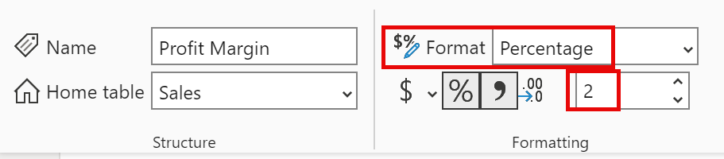
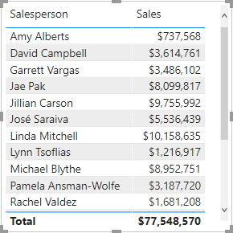
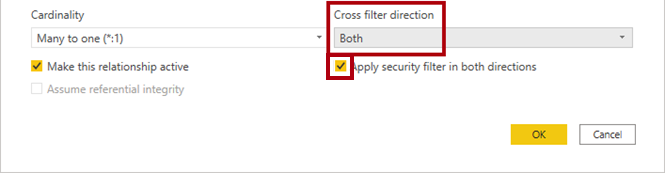

---
lab:
  title: 在 Power BI 中設計資料模型
  module: Design a Data Model in Power BI
---

# 在 Power BI 中設計資料模型

## 實驗室案例

在此實驗室中，您將開始開發數據模型。 這會牽涉到在資料表之間建立關聯性，然後設定資料表與資料行屬性，以改善資料模型的易懂性與可用性。 您也會建立階層並建立快速量值。

在此實驗室中，您將了解如何：

- 建立模型關聯性
- 設定資料表與資料行屬性
- 建立階層

**此實驗室大約需要45分鐘的時間。**

## 開始使用

若要完成此練習，請先開啟網頁瀏覽器，然後輸入下列 URL 以下載 zip 資料夾：

`https://github.com/MicrosoftLearning/PL-300-Microsoft-Power-BI-Data-Analyst/raw/Main/Allfiles/Labs/03-configure-data-model-in-power-bi-desktop/03-model-data.zip`

將資料夾解壓縮至 **C：\Users\Student\Downloads\03-model-data** 資料夾。

**開啟 03-Starter-Sales Analysis.pbix** 檔案。

> ***注意**：您可以選取 **[取消**] 來關閉登入。 關閉任何其他信息視窗。 如果系統提示您套用變更，請選取 **[稍後**套用]。

## 建立模型關聯性

在此工作中，您將建立模型關聯性。 檔案已設定為無法識別數據表之間的關聯性，這不是預設設定，但建議您避免為模型建立正確關聯性的額外工作。

> **重要**事項： *實驗室會使用速記表示法來參考欄位。看起來會像這樣： **產品 \| 類別**。在此範例中， **Product** 是數據表名稱，而 **Category** 是功能變數名稱。*

1. 在 Power BI Desktop 的左側，選取 **[報表檢視]** 圖示。

     

1. 若要檢視所有數據表字段，請在 [ **資料** ] 窗格中，以滑鼠右鍵按兩下空白區域，然後選取 [ **全部**展開]。

1. 若要建立數據表視覺效果，請在 **[數據**] 窗格中，從 [產品 **] 數據表內部**檢查 [**類別]** 字段。

1. 若要將另一個數據行新增至數據表，請在 [ **數據** ] 窗格中，檢查 [ **銷售 \| 銷售]** 字段。

1. 請注意，資料表視覺效果會列出四個產品類別，而且每個項目的銷售值與總計都是相同的。

     

     > *問題是數據表是以不同數據表的欄位為基礎。預期每個產品類別都會顯示該類別的銷售。不過，由於這些數據表之間沒有模型關聯性， **因此不會篩選 Sales** 數據表。您現在會新增關聯性，以在數據表之間傳播篩選。*

1. **從左側瀏覽窗格中選取 [模型**檢視] 圖示，然後選取 **[管理關聯性**]。

     

1. 在 **[管理關聯性]** 視窗中，請注意尚未定義任何關聯性。 若要建立關聯性，請選取 [ **新增關聯性**]。

1. 設定從 **Product** 數據表到 **Sales** 數據表的關聯性。 請注意，已自動設定下列元素：

    - **會選取**每個數據表中的 ProductKey 數據行。 *已選取資料行，因為它們共用相同的名稱和數據類型。您可能需要在實際資料中尋找具有不同名稱的相符數據行。*
    - **基數類型為一對多 （1：\*）** 。 *系統會自動偵測基數，因為Power BI瞭解 **Product資料表中的 **ProductKey**** 資料行包含唯一值。一對多關聯性是最常見的基數，而您在此實驗室中建立的所有關聯性都會是此類型。*
    - **交叉篩選方向類型為Single**。 *單一篩選方向表示篩選從「一端」傳播至「多端」。在此情況下，這表示套用至 Product** 數據表的篩選條件**會傳播至 **Sales** 數據表，但不會以相反的方向傳播。*
    - **核取 [讓此關聯性成為作用中**]。 *作用中關聯性傳播篩選條件。可以將關聯性標示為非使用中，因此篩選不會傳播。當數據表之間有多個關聯性路徑時，可能會有非作用中的關聯性。在此情況下，模型計算可以使用特殊函式來啟用它們。*

     

1. 選取 [**確定**]，請注意 **管理關聯性** 視窗中列出新的關聯性，然後選取 [**關閉**]。

     

請注意，兩個數據表之間現在有一個連接器（*如果數據表位於彼此*旁邊，則無關緊要）。
    - 您可以解譯以 1** 和 ***** 指標表示的**基數。
    - 篩選方向是以箭頭來表示。
    - 此外，實線代表作用中的關聯性；虛線代表非作用中的關聯性。
    - 將游標暫留在關聯性上方，以醒目提示相關的資料行。

### 建立其他關聯性

有比較簡單的方式可建立關聯性。 在模型圖表中，您可以拖放資料行建立新的關聯性。

1. 若要使用不同的技術建立新的關聯性，請從 **Reseller** 數據表拖曳 **ResellerKey** 數據行到 **Sales** 數據表的 **ResellerKey** 數據行。

    > ***提示**：有時候數據行不想拖曳。 如果發生這種情況，請選取不同的資料行，然後再次選取您想要拖曳的資料行，然後再試一次。 請確定您看到已新增至圖表的新關聯性。*

     

1. 使用這個新技巧來建立下列兩個模型關聯性：

     - [Region \| SalesTerritoryKey]**** 至 [Sales \| SalesTerritoryKey]****
     - [Salesperson \| EmployeeKey]**** 至 [Sales \| EmployeeKey]****

1. 在圖表中，請排列資料表，讓 [Sales]**** 資料表位於圖表中央，並將相關的資料表排列到其周圍。 將未連接的資料表置於一旁。

     

1. 在報表檢視中，請注意數據表視覺效果已更新，以顯示每個產品類別的不同值。

    > *套用至 [Product]**** 資料表的篩選現在會傳播至 [Sales]**** 資料表。*

     

1. **儲存** Power BI Desktop 檔案。

## 設定產品資料表

在這項工作中，您將使用階層和顯示資料夾來 **設定 Product** 數據表。

1. 如有必要，在 **[模型] 檢視> [數據] 窗格中**，展開 **[產品** ] 數據表以顯示所有字段。

1. 若要建立階層，請在 [數據] 窗格中，以滑鼠右鍵按兩下 **[類別** ] 資料行，然後選取 [ **建立階層**]。

1. 將名稱更新為 **[產品** ] （以滑鼠右鍵按兩下或按兩下以重新命名）。

1. 若要在階層中新增第二個層級，請在 [屬性]**** 窗格的 [階層]**** 下拉式清單中選取 [子類別]**** (您可能需要在窗格內向下捲動)。

1. 若要將第三個層級新增至階層，請在 [階層]**** 下拉式清單中，選取 [Product]****。

1. 若要完成階層設計，請選取 [套用層級變更]****。

     

1. 在 [ **數據]** 窗格中，注意 **[產品** ] 階層。 若要顯示階層層級，請展開 [Products]**** 階層。

     

1. 若要將資料行組織成顯示資料夾，請在 [ **資料** ] 窗格中，先選取 **[背景色彩格式** ] 資料行。

1. 按下 **Ctrl** 鍵的同時，選取 [字型色彩格式]**** 資料行。

1. 在 [屬性]**** 窗格的 [顯示資料夾]**** 方塊中，輸入**格式**。

     

1. 在 [ **資料** ] 窗格中，請注意，這兩個數據行現在位於資料夾內。

   > *顯示資料夾是組織數據表的絕佳方式，尤其是組成許多欄位的數據表。它們只是邏輯呈現。*

     

## 設定地區資料表

在這項工作中，您將使用階層和更新的類別來設定 **Region** 數據表。

1. 在 [Region]**** 資料表中，建立名為 [Regions]**** 的階層，其中包含下列三個層級：

     - 群組
     - Country
     - 區域

1. 選取 [Country]**** 資料行 (而不是 [Country]**** 階層層級)。

1. 在 [屬性]**** 窗格中，展開 [進階]**** 區段 (位於窗格底部)，然後在 [資料類別]**** 下拉式清單中選取 [國家/地區]****。

    

    > *數據分類可為報表設計師提供提示。在此情況下，將數據行分類為國家或地區會在呈現地圖視覺效果時，為 Power BI 提供更精確的資訊。*

## 設定轉銷商資料表

在這項工作中，您將設定 **Reseller** 資料表以新增階層並更新數據類別。

1. 在 [Reseller]**** 資料表中，建立名為 [Resellers]**** 的階層，其中包含下列兩個層級：

     - Business Type
     - 轉售商

1. 建立名為 [Geography]**** 的第二個階層，其具有下列四個層級：

     - Country-Region
     - State-Province
     - 縣/市
     - 轉售商

1. **設定下列資料行的數據類別**目錄（不在階層內）：

    - 國家/地區至 **國家/地區**
    - 州-省至 **州或省**
    - City** 至 **City**

## 設定銷售資料表

在這項工作中，您將使用更新的描述、格式和摘要來設定 **Sales** 數據表。

1. 在 [Sales]**** 資料表中，選取 [Cost]**** 資料行。

1. 在 [**屬性]** 窗格中的 [描述 **] 方塊中**，輸入：*根據標準成本*。

 > *描述可以套用至數據表、數據行、階層或量值。在 [ **數據** ] 窗格中，當報表作者將游標停留在欄位上方時，描述文字會顯示在工具提示中。*

1. 選取 [Quantity]**** 資料行。

1. 在 [屬性]**** 窗格中，從 [格式]**** 區段中，將 [千位分隔符號]**** 屬性滑動到 [是]****。

1. 選取 [Unit Price]**** 資料行。

1. 在 [屬性]**** 窗格中，從 [格式]**** 區段中，將 [小數位數]**** 屬性設定為 [2]****。

1. 在 [進階]**** 群組中 (您可能需要向下捲動捲動以找到它)，在 [摘要方式]**** 下拉式清單中，選取 [平均]****。

 > *根據預設，數值數據行會藉由加總值來摘要。此預設行為不適用於代表速率的數據行，例如 **單價**。將預設摘要設定為平均值會產生有意義的結果。*

## 大量更新屬性

在這項工作中，您將使用單一大量更新來更新多個數據行。 您將使用此方法來隱藏資料行，以及格式化數據行值。

1. 從 [**模型檢視數據]** > **** 窗格中，選取 **[Product \| ProductKey**] 數據行。

1. 按下 **Ctrl** 鍵時，選取下列 13 個資料行 (跨多個資料表)：

     - Region \| SalesTerritoryKey
     - Reseller \| ResellerKey
     - Sales \| EmployeeKey
     - Sales \| ProductKey
     - Sales \| ResellerKey
     - Sales \| SalesOrderNumber
     - Sales \| SalesTerritoryKey
     - Salesperson \| EmployeeID
     - Salesperson \| EmployeeKey
     - Salesperson \| UPN
     - SalespersonRegion \| EmployeeKey
     - SalespersonRegion \| SalesTerritoryKey
     - Targets \| EmployeeID

1. 在 [屬性]**** 窗格中，將 [已隱藏]**** 屬性滑動到 [是]****。

 > *資料行已隱藏，因為其是由關聯性使用，或是用於資料列層級安全性設定或計算邏輯。*

  *您將在 Power BI Desktop** 實驗室中**建立 DAX 計算中的計算中使用 **SalesOrderNumber**。*

1. 複選以下三個資料行：

     - Product \| Standard Cost
     - Sales \| Cost
     - Sales \| Sales

1. 在 [屬性]**** 窗格中，從 [格式]**** 區段中，將 [小數位數]**** 屬性滑動到 [0]**** \(零\)。

## 探索模型介面

在此工作中，您將切換至 [報表] 檢視、檢閱數據模型介面，以及設定自動日期/時間設定。

1. 切換至 [報表]**** 檢視。

1. 在 [ **資料** ] 窗格中，請注意下列事項：

     - 資料行、階層與其層級都是欄位，可以用來設定報表視覺效果
     - 只會顯示與報表製作相關的欄位
     - **無法看見 SalespersonRegion** 數據表，因為其所有字段都會隱藏
     - [Region]**** 與 [Reseller]**** 資料表中的空間欄位已使用空間圖示來裝置
     - 以 Sigma 符號 (Ʃ) 裝飾的欄位依預設會彙總
     - 將游標停留在 [Sales \| Cost]**** 欄位上方時會出現工具提示

1. 展開 [ **銷售 \| 訂單][日期** ] 字段，然後注意到它會顯示 **日期階層**。 [ **目標目標 \| 月]** 欄位會提供類似的階層。

      

> **重要**： *這些階層不是由您建立的。它們會自動建立為預設設定。然而，有一個問題。Adventure Works 財務年度將於每年 7 月 1 日開始。但是，在這些自動建立的日期階層中，每年 1 月 1 日開始日期階層年份。*

1. 若要關閉 [ **自動日期/時間]** 設定，請流覽至 **[檔案] > [選項] 和 [設定] > [選項**]。

1. 在 [ **目前檔案]** 區段底覽至 **[數據載入>時間智慧**]，然後取消核取 **[自動日期/時間**]。

    

1. 在 [ **數據** ] 窗格中，請注意日期階層已無法使用。

## 建立快速量值

在這項工作中，您將建立兩個快速量值來計算利潤和獲利率。 快速量值會為您建立計算公式。 建立方式非常簡單而快速，可進行簡易和一般的計算。

1. 在 [ **數據]** 窗格中，以滑鼠右鍵按兩下 **[銷售]** 資料表，然後選取 [ **新增快速量值**]。

     

1. 在 [快速量值]**** 視窗的 [計算]**** 下拉式清單中，從 [數學運算]**** 群組內選取 [減法]****。

     

1. 在 [快速量值] 視窗的 [**數據**]** 窗格中，展開 [**銷售]** 數據表。**

1. 將 [Sales]**** 欄位拖曳至 [基底值]**** 方塊中。

1. 將 [成本]** 欄位拖曳到 **[** 值至減去] 方塊**中，然後選取 [**新增**]。  

     

1. 在 [**數據]** 窗格中的 [Sales **] 資料表內**，請注意新的量值。 
    > *量值會以計算機圖示表示。*

     

1. 若要重新命名量值，請以滑鼠右鍵按兩下它，選取 **[重新命名**]，然後重新命名為 **Profit**。

    > *提示：若要重新命名字段，您也可以按兩下它，或選取它，然後按 **F2**。*

1. 在 [Sales]**** 資料表中，根據下列需求，新增另一個快速量值：

     - 使用 [除法]**** 數學運算
     - 將 [分子]**** 設定為 [Sales \| Profit]**** 欄位
     - 將 [分母]**** 設定為 [Sales \| Sales]**** 欄位
     - 將量值重新命名為 **Profit Margin**

1. 請確定已選取 [獲利率]**** 量值，然後在 [量值工具]**** 內容功能區上，將格式設定為 [百分比]****，並使用兩位小數。

     

1. 若要測試這兩個量值，請先選取 **[數據表** ] 視覺效果。

1. 在 [ **數據]** 窗格中，檢查這兩個量值。

     

1. 選取並拖曳右邊的輔助線，以擴大資料表視覺效果。

     

1. 確認量值能產生格式正確的合理結果。

     

## 建立多對多關聯

在這項工作中，您將建立 Salesperson** 數據表與 **Sales** 數據表之間的**多對多關聯性。

1. 在 Power BI Desktop 的 [報表檢視] 的 **[數據** ] 窗格中，檢查下列兩個字段來建立新的 **數據表** 視覺效果。

     - Salesperson \| Salesperson
     - Sales \| Sales

     

     > *數據表會顯示每個銷售人員所做的銷售。不過，銷售人員與銷售之間還有另一種關聯性。某些銷售人員屬於一、二或更多銷售區域。此外，銷售區域可以指派多個銷售人員給它們。*
     >
     > *從績效管理的觀點來看，必須分析銷售人員的銷售量，並與銷售目標進行比較。您將在下一個練習中建立關聯性以支援此分析。*

1. 請注意， **邁克爾·布萊特** 已經售出了近900萬美元。

1. 切換至 [模型] 檢視，然後將 SalespersonRegion 數據表拖曳**到 [區域 **] 和 **[Salesperson]** 數據表之間**。**

1. 使用拖放技術建立下列兩個模型關聯性：

     - [Salesperson \| EmployeeKey]**** 至 [SalespersonRegion \| EmployeeKey]****
     - [Region \| SalesTerritoryKey]**** 至 [SalespersonRegion \| SalesTerritoryKey]****

    > *[SalespersonRegion]**** 資料表可以視為橋接資料表。*

1. 切換至 [報表] 檢視，然後注意到視覺效果尚未更新—Michael Blythe 的銷售結果尚未變更。

1. 切換回 [模型] 檢視，然後遵循 **Salesperson** 資料表中的關聯性篩選方向 (箭頭)。

     > *請考慮 **Salesperson** 數據表會篩選 **Sales** 數據表。它也會篩選 **SalespersonRegion** 數據表，但不會繼續將篩選傳播至 **Region** 數據表（箭頭指向錯誤的方向）。*

     

1. 若要編輯 **Region** 和 **SalespersonRegion** 資料表之間的關聯性，請按兩下關聯性。

1. 在 [編輯關聯性]**** 視窗的 [交叉篩選方向]**** 下拉式清單中，選取 [兩者]****。

1. 核取 [雙向 **套用** 安全性篩選器] 複選框，然後選取 [確定]。

     

1. 請注意，關聯性現在有雙箭頭。

     

1. 切換至 [報表] 檢視，然後注意銷售值仍尚未變更。

    > *問題現在與 Salesperson** 和 **Sales** 數據表之間**有兩個可能的篩選傳播路徑有關。根據「最少的數據表數目」評估，在內部解析此模棱兩可。為了清楚起義，您不應該設計具有這種模棱兩可的模型，此問題將會在本實驗室稍後的一部分解決，以及完成**在 Power BI Desktop 實驗室**中建立 DAX 計算。*

1. 切換至 [模型] 檢視，以透過橋接數據表強制篩選傳播。 編輯 [Salesperson **] 和 **[Sales**] 數據表之間的**關聯性（按兩下）。

1. 在 [ **編輯關聯性]** 視窗中，取消核取 [ **啟用此關聯** 性] 複選框，然後選取 [ **確定**]。

    > *篩選傳播現在將會遵循唯一的作用中路徑。*

1. 請注意，在圖表中，非作用中的關聯性是以虛線表示。

     

1. 切換至 [報表] 檢視，然後注意到 Michael Blythe 的銷售額現在接近 2200 萬美元。

     

1. 另請注意，每個銷售人員的銷售額若相加，將會超過資料表總計。

     > *由於區域銷售結果的雙重、三倍等，所以對多對多關係的常見觀察。考慮 Brian Welcker，第二位列出的銷售人員。他的銷售金額等於總銷售額。這是正確的結果，因為他是銷售總監：他的銷售是由所有區域的銷售額來測量。*
     >
     > *雖然多對多關聯性目前正在運作，但現在無法分析銷售人員所做的銷售（因為關聯性為非作用中）。當您引進計算數據表時，您將能夠重新啟用關聯性，以允許在Power BI Desktop**實驗室中**建立DAX計算中，分析指派給銷售人員之銷售人員（用於效能分析）的銷售區域中的銷售量。*

1. 切換至 [模型] 檢視，然後在圖表中選取 **Salesperson** 數據表。

1. 在 [屬性]** 窗格中的 **[** 名稱**] 方塊中，將文字取代為 **Salesperson （Performance）**。

    > *重新命名的資料表現在會反映其用途：其是用來根據其獲指派銷售區域的銷售額來報告和分析銷售人員的績效。*

## 建立與 Targets 資料表的關聯性

在這項工作中，您將建立與 Targets** 數據表的**關聯性。

1. 建立從 [Salesperson (Performance) \| EmployeeID]**** 資料行到 [Targets \| EmployeeID]**** 資料行的關聯性。

1. 在 [報表] 檢視中，將 [Targets \| Target]**** 欄位新增至資料表視覺效果。

1. 調整資料表視覺效果的大小，讓所有資料行都可見。

     

 > *現在可以將銷售與目標可視化，但有兩個原因需要小心。首先，沒有時間週期的篩選條件，因此目標也會包含未來的目標數量。其次，目標不會加總，因此不應該顯示總計。您可以藉由格式化視覺效果或使用計算邏輯來移除視覺效果來停用它們。*

## 實驗室完成
