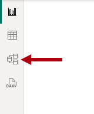
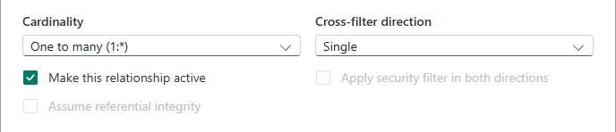
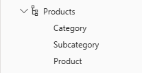
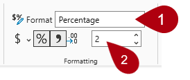

---
lab:
  title: 在 Power BI 中設定語意模型
  module: Configure a semantic model in Power BI
---

# 在 Power BI 中設定語意模型

## 實驗室案例

在本實驗室中，您將開始開發資料模型。 這會牽涉到在資料表之間建立關聯性，然後設定資料表與資料行屬性，以改善資料模型的易懂性與可用性。 您還將建立階層和快速量值。

在此實驗室中，您會了解如何：

- 建立模型關聯性。
- 設定資料表與資料行屬性。
- 建立階層。
- 建立快速量值。
- 設定多對多關係。

**此實驗室大約需要 45 分鐘。**

## 開始使用

若要完成此練習，請先開啟網頁瀏覽器，然後輸入下列 URL 以下載 zip 檔案：

`https://github.com/MicrosoftLearning/PL-300-Microsoft-Power-BI-Data-Analyst/raw/Main/Allfiles/Labs/03-configure-semantic-model/03-model-data.zip`

將檔案解壓縮至 **C：\Users\Student\Downloads\03-model-data** 資料夾。

開啟 **03-Starter-Sales Analysis.pbix** 檔案。

> _**注意**：載入檔案時，您可能會看到登入對話方塊。選取 **[取消]** 以關閉登入對話方塊。關閉任何其他資訊視窗。如果系統提示套用變更，請選取 **[稍後套用]。**_

## 建立模型關聯性

在此工作中，您將建立模型關聯性。 檔案已設定為不識別資料表之間的關聯性，這不是預設設定，但建議您避免額外的工作為您的模型建立正確的關聯性。

> 實驗室使用速記標記法來參考欄位。 顯示如下：`Product | Category`。 在此範例中， `Product` 是資料表名稱，是 `Category` 欄位名稱。

1. 在 Power BI Desktop 中，若要檢視所有資料表欄位，請在 [資料 **] **窗格中，以滑鼠右鍵按一下空白區域，然後選取 **[全部**展開]。

1. 若要建立資料表視覺效果，請在 [**資料**] 窗格中，從資料表`Category`內部`Product`檢查欄位。

1. 若要將另一個資料行新增至資料表，請在 [資料 **] **窗格中，檢查欄位`Sales | Sales`。

1. 請注意，資料表視覺效果會列出四個產品類別，而且每個項目的銷售值與總計都是相同的。

    

    > _問題是該表基於不同表中的字段。預期每個產品類別都會顯示該類別的銷售額。不過，由於這些資料表之間沒有模型關聯性， `Sales` 因此不會篩選資料表。您現在將新增關聯性，以在資料表之間傳播篩選器。_

1. 若要切換至模型設計工具，請選取左側的 模型 **檢視** 圖示。

    

1. 在 [首頁 **] **功能區上，選取 **[管理關聯性**]。

    

1. 在「**管理關聯性**」視窗中，請注意尚未定義任何關聯性。

1. 若要建立關聯性，請選取 **+ 新增關聯性**。

1. 若要設定資料表與`Sales`資料表之間的`Product`關聯性，請在 [ 從資料表** ] **下拉式清單中選取`Product`資料表，然後在 [ 至 資料表** ] **下拉式清單中，選取資料`Sales`表。

    

1. 請注意，已自動設定下列屬性：

    - **會選取**每個資料表中的 ProductKey 資料行。 _之所以選取這些欄，是因為它們共用相同的名稱和資料類型。您可能需要在實際資料中尋找具有不同名稱的相符列。_
    - **基數類型是一對多 （1：\*）。** _系統會自動偵測基數，因為 Power BI 瞭解 `ProductKey` 資料表中的 `Product` 資料行包含唯一值。一對多關聯性是最常見的基數，而您在此實驗室中建立的所有關聯性都會是這種類型。_
    - **「交叉篩選方向」類型為「單一**」。 _單一濾波器方向意味著濾波器從「單側」傳播到「多側」。在此情況下，這表示套用至資料表的 `Product` 篩選器會傳播到資料表， `Sales` 但不會以相反的方向傳播。_
    - **已核取** [讓此關係處於作用中狀態]。 _作用中關係會傳播過濾器。您可以將關係標示為非作用中，讓篩選器不會傳播。當資料表之間有多個關係路徑時，可能會存在非作用中關係。在這種情況下，模型計算可以使用特殊函數來啟動它們。_

    

1. 選取 [**儲存**]，請注意在 [ 管理關聯性** ] **視窗中列出新的關聯性，然後選取 [ 關閉 **]。**

1. 在模型圖表中，請注意兩個資料表之間現在有一個連接器 （您可以選擇重新定位資料表，以更清楚地查看關聯性）。

    

    > _您可以透過查看圖表中的關係線來解譯許多關係屬性：_
    >
    > - _基數由 1** 和 **（\*）** 指標表示**。_
    > - _篩選方向由箭頭表示。_
    > - _實線代表活躍的關係;虛線代表非作用中的關係。_
    >
    > 提示： 如果您將游標停留在關係上以突出顯示相關columns._

1. 切換至 **報表檢視**，然後注意資料表視覺效果已更新，以顯示每個產品類別的不同值。

    > _套用至表格的 `Product` 篩選器現在會傳播至 `Sales` 表格。_

    

## 建立其他關聯性

有比較簡單的方式可建立關聯性。 在模型圖表中，您可以拖放資料行建立新的關聯性。

1. 若要使用不同的技術建立新關係，請切換至 **模型檢視**。

1. 從表格中`Reseller`，將欄拖曳`ResellerKey`到表格的`Sales`欄上`ResellerKey`。

    > _**重要事項**：有時欄不想拖曳。如果發生這種情況，請選取不同的資料行，然後再次選取您要拖曳的資料行，然後再試一次。請確定您會看到新增至圖表的新關係。_

    

1. 在 [新增關聯性 **] **視窗中，檢閱設定，然後選取 [**儲存**]。

1. 使用這個新技巧來建立下列兩個模型關聯性：

     - 按 `Region | SalesTerritoryKey` 移至 `Sales | SalesTerritoryKey`
     - 按 `Salesperson | EmployeeKey` 移至 `Sales | EmployeeKey`

1. 在圖表中，排列表格，使 `Sales` 表格位於圖表的中心，相關表格圍繞它排列。 將未連接的資料表置於一旁。

    

1. 儲存 Power BI Desktop 檔案。

## 設定產品資料表

在此工作中，您將使用階層和顯示資料夾來設定 `Product` 表格。

1. 切換至 **模型檢視**。

1. 在 資料** 窗**格中，如有必要，展開`Product`表格以顯示所有欄位。

1. 在表格中 `Product` ，以滑鼠右鍵按一下資料 `Category` 行，然後選取 **建立階層**。

    

1. 在 [屬性] **** 窗格的 [名稱 **] **方塊中，將值取代為 _[產品_]。

    

1. 兩個將層級新增至階層，在階層下**** 拉式清單中，選取**子類別**，然後選取**產品，** 然後選取**套用層級變更**。

    

1. 在 [資料 **] **窗格中，請注意`Products`階層。 若要顯示階層層級，請展開它。

    

1. 若要將欄組織到顯示資料夾中，請在 [資料 **] **窗格中，先選取欄。`Background Color Format`

1. 按 **住 Ctrl** 鍵的同時，選取欄 `Font Color Format` 。

1. 在 [屬性]**** 窗格的 [顯示資料夾]**** 方塊中，輸入_格式_。

    

1. 在 [資料 **] **窗格中，請注意這兩個資料行現在位於資料夾內。

    

    > _顯示資料夾是組織表格的好方法，特別是對於包含許多欄位的表格。它們只是邏輯呈現。_

## 設定地區資料表

在此工作中，您將使用階層和更新的類別來設定 `Region` 資料表。

1. 在表格`Region`中，建立名為 Regions_ 的_階層，具有下列三個層級：

     - `Group`
     - `Country`
     - `Region`

1. 選取 `Country` 資料行 （而非 `Country` 階層層級）。

1. 在 [屬性] **窗格中，展開 [進階 **] **區段 （位於窗格底部），然後在 [資料類別 **] **下拉式清單中，選取 **[國家/地區**]。**

    

    > _資料分類可以為報表設計工具提供提示。在此情況下，將資料行分類為國家或地區，可在 Power BI 轉譯地圖視覺效果時，為 Power BI 提供更準確的資訊。_

## 設定轉銷商資料表

在此工作中，您將設定 `Reseller` 資料表以新增階層並更新資料類別。

1. 在資料`Reseller`表中，建立名為 Resellers_ 的_階層，具有下列兩個層級：

     - `Business Type`
     - `Reseller`

1. 建立名為 [Geography]__ 的第二個階層，其具有下列四個層級：

     - `Country-Region`
     - `State-Province`
     - `City`
     - `Reseller`

1. 設定下列資料行的資料類別 （不在階層內）：

    - `Country-Region` 至 **國家/地區**
    - `State-Province` 到 **州或省**
    - `City` 到 **城市**

## 設定銷售資料表

在此工作中，您將使用更新的描述、格式和摘要來設定 `Sales` 表格。

1. 在表格中 `Sales` ，選取資料 `Cost` 行。

1. 在 [屬性]**** 窗格的 [描述]**** 方塊中，輸入：_以標準成本為基礎_

    > _描述可以套用至表格、資料行、階層或量值。在 [資料 **] **窗格中，當報表作者將游標停留在欄位上時，描述文字會在工具提示中顯示。_

1. 選取欄 `Quantity` 。

1. 在 [屬性] **** 窗格的 [格式設定 **] **區段內，將 [千位分隔符號 **] **屬性設定為 _[是_]。

1. 選取欄 `Unit Price` 。

1. 在 [屬性]**** 窗格中，從 [格式]**** 區段中，將 [小數位數]**** 屬性設定為 [2]__。

1. 在 [進階]**** 群組中 (您可能需要向下捲動捲動以找到它)，在 [摘要方式]**** 下拉式清單中，選取 [平均]****。

    > _根據預設，數值資料行會透過將值加總在一起來摘要。此預設行為不適用於代表速率的 `Unit Price`直欄。將預設摘要設定為平均值將產生有意義的結果。_

## 大量更新屬性

在此工作中，您將使用單一大量更新來更新多個資料行。 您將使用此方法來隱藏資料行，並設定資料行值的格式。

1. 在 [資料 **] **窗格 （或模型圖表） 中，選取資料`Product | ProductKey`行。

1. 按下 **Ctrl** 鍵時，選取下列 13 個資料行 (跨多個資料表)：

     - `Region | SalesTerritoryKey`
     - `Reseller | ResellerKey`
     - `Sales | EmployeeKey`
     - `Sales | ProductKey`
     - `Sales | ResellerKey`
     - `Sales | SalesOrderNumber`
     - `Sales | SalesTerritoryKey`
     - `Salesperson | EmployeeID`
     - `Salesperson | EmployeeKey`
     - `Salesperson | UPN`
     - `SalespersonRegion | EmployeeKey`
     - `SalespersonRegion | SalesTerritoryKey`
     - `Targets | EmployeeID`

1. 在 [屬性] **** 窗格中，將 [**隱藏**] 屬性設定為 _[是_]。

    > _資料行已隱藏，因為它們要麼由關聯性使用，要麼用於資料列層級安全性設定或計算邏輯。_
    >
    > _您將在 Power BI Desktop** 中建立 DAX 計算實驗室**的計算中使用資料`SalesOrderNumber`行。_

1. 複選以下三個資料行：

     - `Product | Standard Cost`
     - `Sales | Cost`
     - `Sales | Sales`

1. 在 [屬性]**** 窗格中，從 [格式]**** 區段中，將 [小數位數]**** 屬性滑動到 [0]__ \(零\)。

## 探索模型介面

在此工作中，您將切換至 **[報表檢視**]、檢閱資料模型介面，並設定自動日期/時間設定。

1. 切換至 [報表]**** 檢視。

1. 在 [資料 **] **窗格中，請注意下列事項：

     - 資料行、階層及其層級是欄位，可用來設定報表視覺效果。
     - 只有與報表製作相關的欄位才會顯示。
     - 表格 `SalespersonRegion` 不可見，因為它的所有欄位都已隱藏。
     - 和 `Reseller` 表格中的`Region`空間欄位會以空間圖示裝飾。
     - 預設情況下，飾有西格瑪符號 （Ʃ） 的欄位將進行匯總。
     - 將游標懸停在欄位上 `Sales | Cost` 時，會出現工具提示。

1. 展開欄位 `Sales | OrderDate` ，然後注意它顯示 `Date Hierarchy`。 欄位 `Targets | TargetMonth` 提供類似的階層。

    

    > _**重要事項**：這些階層並非由您建立。它們會自動建立為預設設定。然而，有一個問題。Adventure Works 財政年度於每年 7 月 1 日開始。但是，在這些自動建立的日期階層中，日期階層年份從每年的 1 月 1 日開始。_

1. 若要關閉自動日期/時間設置，請導航至 **「檔案>選項」和「設定」>「選項」。**

1. 在 [選項] **** 視窗的 [目前檔案 **] **區段上，導覽至 **[資料載入] > [時間智慧**]，然後取消選取 **[自動日期/時間**]。

    

1. 在 [資料 **] **窗格中，請注意日期階層不再可用。

## 建立快速量值

在此工作中，您將建立兩個快速度量來計算利潤和利潤率。 快速量值會為您建立計算公式。 建立方式非常簡單而快速，可進行簡易和一般的計算。

1. 在 [資料] **窗格中，以滑鼠右鍵按一下`Sales`資料表，然後選取 **[新增快速量值**]。**

    

1. 在 [快速測量] **窗格的 [**選取計算**] 下拉式清單中，從 [數學運算 **] **群組內，選取 **[減法**]。**

    

1. 從「資料 **」** 窗格中，將`Sales | Sales`欄位拖曳至「基本值」**** 井中。

    

1. 將欄位拖曳`Sales | Cost`至 [要減去**的值] **方塊中。  

    

1. 選取 [新增]。

1. 在 [資料 **] **窗格中，在資料表內`Sales`，請注意該新量值。

    > _測量由計算器圖示指示。_

    

1. 若要重新命名量值，請以滑鼠右鍵按一下它，選取 **[重新命名**]，然後將名稱重新命名為 _[利潤]。_

    > _提示： 若要重新命名欄位，您也可以按兩下欄位，或選取欄位並按 **F2**。_

1. 在表格 `Sales` 中，根據下列需求新增第二個快速量值：

    > _**重要：** 如果建立快速測量的選項未出現在關聯式功能表中，請使用位於「首頁 **」** 功能區上的「計算 **」群組內**的命令。

    - 使用 **除法** 數學運算。
    - 將分子**設定**為欄位`Sales | Profit`。
    - 將 分母** 設定為`Sales | Sales`欄位**。
    - 將量值重新命名為 _Profit Margin_。

1. 請確定已選取量`Profit Margin`值，然後在 [量值工具 **] **內容功能區上，將格式設定為 **[百分比]**，並保留兩位小數。

    

1. 若要測試這兩個量值，請先選取頁面上現有的資料表視覺效果。

1. 在 [資料 **] **窗格中，核取 `Profit` 和 `Profit Margin` 量值以將它們新增至資料表。

    

1. 選取並拖曳右邊的輔助線，以擴大資料表視覺效果。

    

1. 確認量值能產生格式正確的合理結果。

    

## 建立多對多關聯

在此工作中，您將在資料表與`Sales`資料表之間`Salesperson`建立多對多關聯性。

1. 在 [報表檢視 **] 中**，選取報表頁面的空白區域。

1. 若要建立新的資料表視覺效果，請在 [資料 **] **窗格中，檢查下列兩個欄位：

     - `Salesperson | Salesperson`
     - `Sales | Sales`

    

    > _表格視覺效果會顯示每個銷售人員的銷售額。然而，銷售人員和銷售人員之間還有另一種關係。有些銷售人員屬於一個、兩個或更多的銷售區域。此外，銷售區域可以指派多個銷售人員。_
    >
    > _從績效管理的角度來看，需要對銷售人員的銷售額（基於其分配的地區）進行分析並與銷售目標進行比較。您將在下一個練習中建立關係來支援此分析。_

1. 請注意， _邁克爾·布萊斯 （Michael Blythe_ ） 的銷售額接近九百萬美元。

1. 切換至**模型檢視**，然後拖`SalespersonRegion`曳表格以將其放置在 和 表格`Salesperson`之間`Region`。

1. 使用拖放技術建立下列兩個模型關聯性：

    - 按 `Salesperson | EmployeeKey` 移至 `SalespersonRegion | EmployeeKey`
    - 按 `Region | SalesTerritoryKey` 移至 `SalespersonRegion | SalesTerritoryKey`

    > _該 `SalespersonRegion` 表可以被認為是一個橋接表。_

1. 切換至 **[報表檢視**]，然後注意視覺效果尚未更新，Michael Blythe 的銷售結果未變更。

1. 切換回 **模型檢視**，然後依照表格中的 `Salesperson` 關聯性篩選指示 （箭頭）。

    > _請考慮資料 `Salesperson` 表會 `Sales` 篩選資料表。它也會篩選 `SalespersonRegion` 表格，但不會透過將篩選器傳播到 `Region` 表格來繼續 （箭頭指向錯誤的方向）。_

    

1. 若要編輯 和 `Region` `SalespersonRegion` 表格之間的關聯性，請按兩下關聯性。

1. 在 [編輯關聯性]**** 視窗的 [交叉篩選方向]**** 下拉式清單中，選取 [兩者]__。

1. 選取 [雙向套用安全性篩選]**** 核取方塊。

    

1. 選取**儲存**。

1. 請注意，這種關係現在有一個雙箭頭。

    

1. 切換至 **報表檢視**，然後注意銷售值仍未變更。

    > _現在的問題與 和 表`Sales`之間`Salesperson`有兩個可能的過濾器傳播路徑有關。這種模糊性是根據「最少資料表數目」評估在內部解決的。為了清楚起見，您不應該設計具有這種類型模糊性的模型，此問題將在本實驗室稍後部分解決，並在完成**在 Power BI Desktop** 實驗室中建立 DAX 計算時解決。_

1. 切換至 **模型檢視**。

1. 若要透過橋接資料表強制篩選器傳播，請編輯 （按兩下） 和`Salesperson``Sales`資料表之間的關係。

1. 在 [編輯關聯性]**** 視窗中，取消選取 [將此關聯性設為作用中]**** 核取方塊。

    

1. 選取**儲存**。

    > _過濾器傳播現在將遵循唯一的作用中路徑。_

1. 在模型圖表中，請注意非作用中關係以虛線表示。

    

1. 切換到 **報告視圖**，然後注意到 Michael Blythe 的銷售額現在接近兩千二百萬美元。

1. 另請注意，每個銷售人員的銷售額若相加，將會超過資料表總計。

     > _這是由於區域銷售結果的雙倍、三倍等計算而產生的多對多關係的常見觀察。考慮一下列出的第二位銷售人員布萊恩·韋爾克 （Brian Welcker）。他的銷售金額等於總銷售金額。這是正確的結果，因為他是銷售總監;他的銷售額是通過所有地區的銷售額來衡量的。_
     >
     > _雖然多對多關係現在正在運作，但現在無法分析銷售人員的銷售 （因為關係處於非作用中狀態）。當您引進計算資料表時，您將能夠重新啟用關聯性，該資料表可讓您在 Power BI Desktop** 實驗室中**分析指派給銷售人員 （用於效能分析） 的銷售區域中的銷售額。_

1. 切換至 **模型檢視**，然後在模型圖表中選取 `Salesperson` 資料表。

1. 在 [屬性] **** 窗格的 [名稱 **] **方塊中，將文字取代為 _[銷售人員 （效能）]。_

    > _重新命名的資料表現在反映了其用途：它用於根據銷售人員指派的銷售區域的銷售額來報告和分析銷售人員的績效。_

## 建立與 Targets 資料表的關聯性

在此工作中，您將建立與資料表的 `Targets` 關聯性。

1. 從欄和`Targets | EmployeeID`欄建立`Salesperson (Performance) | EmployeeID`關聯性。

1. 在報表檢視**中**，將`Targets | Target`欄位新增至資料表視覺效果。

1. 調整資料表視覺效果的大小，讓所有資料行都可見。

    

 > _現在可以視覺化銷售額和目標，但現在要小心，原因有兩個。首先，沒有針對時間段的篩選器，因此目標也包括未來的目標金額。其次，目標不是累加的，因此不應顯示總計。您可以藉由格式化視覺效果來停用它們，或使用計算邏輯來移除它們。_

1. 儲存 Power BI Desktop 檔案。

## 實驗室完成

您可以選擇儲存 Power BI 報表，但此實驗室不需要儲存。 在下一個練習中，您將使用預先製作的入門檔案。

1. 導航至 **左上角的“文件”** 菜單，然後選擇 **“另存為”**。 
1. 選取 [瀏覽此裝置]****。
1. 選取您要儲存檔案的資料夾，並為其指定描述性名稱。 
1. 選取 [儲存] **** 按鈕，將報表儲存為 .pbix 檔案。 
1. 如果出現對話方塊，提示您套用擱置的查詢變更，請選取 [ **套用**]。
1. 關閉 Power BI Desktop。