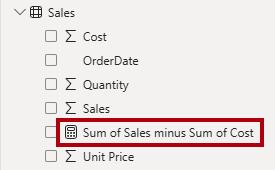

---
lab:
  title: 在 Power BI 中設定語意模型
  module: Configure a semantic model in Power BI
---

# 在 Power BI 中設定語意模型

## 實驗室案例

在此實驗室中，您將開始開發數據模型。 這會牽涉到在資料表之間建立關聯性，然後設定資料表與資料行屬性，以改善資料模型的易懂性與可用性。 您也會建立階層和快速量值。

在此實驗室中，您會了解如何：

- 建立模型關聯性。
- 設定數據表和數據行屬性。
- 建立階層。
- 建立快速量值。
- 設定多對多關聯性。

**此實驗室大約需要45分鐘的時間。**

## 開始使用

若要完成此練習，請先開啟網頁瀏覽器，然後輸入下列 URL 以下載 zip 檔案：

`https://github.com/MicrosoftLearning/PL-300-Microsoft-Power-BI-Data-Analyst/raw/Main/Allfiles/Labs/03-configure-semantic-model/03-model-data.zip`

將檔案解壓縮到 **C：\Users\Student\Downloads\03-model-data** 資料夾。

**開啟 03-Starter-Sales Analysis.pbix** 檔案。

> _**注意**：您可以選取 **[取消**] 來關閉登入。關閉任何其他信息視窗。如果系統提示您套用變更，請選取 [ **稍後**套用]。_

## 建立模型關聯性

在此工作中，您將建立模型關聯性。 檔案已設定為無法識別數據表之間的關聯性，這不是預設設定，但建議您避免為模型建立正確關聯性的額外工作。

> 實驗室使用速記標記法來參考欄位。 顯示如下：`Product | Category`。 在此範例中， `Product` 是數據表名稱，而 `Category` 是功能變數名稱。

1. 在 Power BI Desktop 中，若要檢視所有數據表欄位，請在 **[資料** ] 窗格中，以滑鼠右鍵單擊空白區域，然後選取 [ **全部**展開]。

1. 若要建立數據表視覺效果，請在 **[數據** ] 窗格中，從數據表內部 `Product` 檢查 `Category` 欄位。

1. 若要將另一個數據行新增至數據表，請在 [ **數據** ] 窗格中檢查 `Sales | Sales` 字段。

1. 請注意，資料表視覺效果會列出四個產品類別，而且每個項目的銷售值與總計都是相同的。

    

    > _問題是數據表是以不同數據表的欄位為基礎。預期每個產品類別都會顯示該類別的銷售。不過，由於這些數據表之間沒有模型關聯性， `Sales` 因此不會篩選數據表。您現在會新增關聯性，以在數據表之間傳播篩選。_

1. 若要切換至模型設計工具，請在左側選取 [模型檢視] 圖示。

    

1. 在 [**首頁]** 功能區上，選取 **[管理關聯性**]。

    

1. 在 **[管理關聯性**] 視窗中，請注意尚未定義任何關聯性。

1. 若要建立關聯性，請選取 **[+ 新增關聯性**]。

1. 若要設定數據表 `Product` 與 `Sales` 數據表之間的關聯性，請在 [ **從數據表** ] 下拉式清單中選取 `Product` 數據表，然後在 **[至數據表** ] 下拉式清單中選取 `Sales` 數據表。

    

1. 請注意，已自動設定下列屬性：

    - **會選取**每個數據表中的 ProductKey 數據行。 _已選取資料行，因為它們共用相同的名稱和數據類型。您可能需要在實際資料中尋找具有不同名稱的相符數據行。_
    - **基數類型為一對多 （1：\*）** 。 _系統會自動偵測基數，因為 Power BI 會了解 `ProductKey` 數據表中的數據 `Product` 行包含唯一值。一對多關聯性是最常見的基數，而您在此實驗室中建立的所有關聯性都會是此類型。_
    - **交叉篩選方向類型為Single**。 _單一篩選方向表示篩選從「一端」傳播至「多端」。在此情況下，這表示套用至數據表的篩選條件 `Product` 會傳播至 `Sales` 數據表，但不會以相反的方向傳播。_
    - **核取 [讓此關聯性成為作用中**]。 _作用中關聯性傳播篩選條件。可以將關聯性標示為非使用中，因此篩選不會傳播。當數據表之間有多個關聯性路徑時，可能會有非作用中的關聯性。在此情況下，模型計算可以使用特殊函式來啟用它們。_

    

1. 選取 [**儲存**]，請注意 **管理關聯性** 視窗中列出新的關聯性，然後選取 [**關閉**]。

1. 在模型圖表中，請注意，兩個數據表之間現在有一個連接器（您可以選擇重新定位數據表，以便更清楚地看到關聯性）。

    

    > _您可以藉由檢視圖表中的關聯線來解譯許多關聯性屬性：_
    >
    > - _基數是以 **1** 和 **（\*）** 指標表示。_
    > - _篩選方向是由箭頭表示。_
    > - _實線代表作用中關聯性;虛線代表非使用中關聯性。_
    >
    > 提示：如果您將游標暫留在關聯性上方，以反白顯示相關的columns._

1. 切換至 [報表] 檢視，然後注意數據表視覺效果已更新以顯示每個產品類別的不同值。

    > _套用至數據表的 `Product` 篩選現在會傳播至 `Sales` 數據表。_

    

### 建立其他關聯性

有比較簡單的方式可建立關聯性。 在模型圖表中，您可以拖放資料行建立新的關聯性。

1. 若要使用不同的技術建立新的關聯性，請切換至 [模型] 檢視。

1. `Reseller`從數據表中，將數據`ResellerKey`行拖曳至`ResellerKey`數據表的數據`Sales`行。

    > _**重要**：有時候數據行不想拖曳。如果發生這種情況，請選取不同的數據行，然後選取您想要再次拖曳的數據行，然後再試一次。請確定您看到新增至圖表的新關聯性。_

    

1. 在 [ **新增關聯性]** 視窗中，檢閱組態，然後選取 [ **儲存**]。

1. 使用這個新技巧來建立下列兩個模型關聯性：

     - 按 `Region | SalesTerritoryKey` 移至 `Sales | SalesTerritoryKey`
     - 按 `Salesperson | EmployeeKey` 移至 `Sales | EmployeeKey`

1. 在圖表中，排列數據表，讓 `Sales` 數據表位於圖表中央，並排列相關的數據表。 將未連接的資料表置於一旁。

    

1. 儲存 Power BI Desktop 檔案。

## 設定產品資料表

在這項工作中，您將使用階層和顯示資料夾來設定 `Product` 數據表。

1. 切換至 [模型] 檢視。

1. 如有必要，請在 [ **資料** ] 窗格中展開 `Product` 數據表以顯示所有欄位。

1. 在數據表中 `Product` ，以滑鼠右鍵按兩下數據 `Category` 行，然後選取 **[建立階層**]。

    

1. 在 [屬性]** 窗格的 **[** 名稱]** 方塊中，將值取代為 _Products_。

    

1. 在 [階層] 下拉式清單中，**選取 [子**類別]，然後選取 **[產品 **]，然後選取 **[**套用層級變更**]。**

    

1. 在 [ **數據]** 窗格中，注意 `Products` 階層。 若要顯示階層層級，請加以展開。

    

1. 若要將資料行組織成顯示資料夾，請先在 [ **資料** ] 窗格中選取資料 `Background Color Format` 行。

1. 按下 **Ctrl** 鍵時，選取數據 `Font Color Format` 行。

1. 在 [屬性]**** 窗格的 [顯示資料夾]**** 方塊中，輸入_格式_。

    

1. 在 [ **資料** ] 窗格中，請注意，這兩個數據行現在位於資料夾內。

    

    > _顯示資料夾是組織數據表的絕佳方式，尤其是組成許多欄位的數據表。它們只是邏輯呈現。_

## 設定地區資料表

在這項工作中，您將使用階層和更新的類別來 `Region` 設定數據表。

1. 在數據表中 `Region` ，使用下列三個層級建立名為 _Regions 的_階層：

     - `Group`
     - `Country`
     - `Region`

1. 選取數據 `Country` 行（而非 `Country` 階層層級）。

1. 在 [屬性] 窗格中，展開 [****進階**] 區段（位於窗格底部），然後在 **[數據類別**] 下拉式清單中，選取 **[國家/地區**]。**

    

    > _數據分類可為報表設計師提供提示。在此情況下，將數據行分類為國家或地區會在呈現地圖視覺效果時，為 Power BI 提供更精確的資訊。_

## 設定轉銷商資料表

在這項工作中，您將設定 `Reseller` 數據表以新增階層並更新數據類別。

1. 在數據表中 `Reseller` ，使用下列兩個層級建立名為 _Resellers 的_階層：

     - `Business Type`
     - `Reseller`

1. 建立名為 [Geography]__ 的第二個階層，其具有下列四個層級：

     - `Country-Region`
     - `State-Province`
     - `City`
     - `Reseller`

1. 設定下列資料行的數據類別目錄（不在階層內）：

    - `Country-Region` 至 **國家/地區**
    - `State-Province` 至 **州或省**
    - `City` 至 **城市**

## 設定銷售資料表

在這項工作中，您將 `Sales` 使用更新的描述、格式和摘要來設定數據表。

1. 在數據表中 `Sales` ，選取數據 `Cost` 行。

1. 在 [屬性]**** 窗格的 [描述]**** 方塊中，輸入：_以標準成本為基礎_

    > _描述可以套用至數據表、數據行、階層或量值。在 [ **數據** ] 窗格中，當報表作者將游標停留在欄位上方時，描述文字會顯示在工具提示中。_

1. 選取數據行 `Quantity` 。

1. 在 [屬性] 窗格中，從 [**格式化]** 區段內**，將 **[千位分隔符**] 屬性設定為 [_是_]。**

1. 選取數據行 `Unit Price` 。

1. 在 [屬性]**** 窗格中，從 [格式]**** 區段中，將 [小數位數]**** 屬性設定為 [2]__。

1. 在 [進階]**** 群組中 (您可能需要向下捲動捲動以找到它)，在 [摘要方式]**** 下拉式清單中，選取 [平均]****。

    > _根據預設，數值數據行會藉由加總值來摘要。此預設行為不適用於表示 `Unit Price`速率的數據行。將預設摘要設定為平均值會產生有意義的結果。_

## 大量更新屬性

在這項工作中，您將使用單一大量更新來更新多個數據行。 您將使用此方法來隱藏資料行，以及格式化數據行值。

1. 在 [ **數據** ] 窗格中（或模型圖表），選取數據 `Product | ProductKey` 行。

1. 按下 **Ctrl** 鍵時，選取下列 13 個資料行 (跨多個資料表)：

     - `Region | SalesTerritoryKey`
     - `Reseller | ResellerKey`
     - `Sales | EmployeeKey`
     - `Sales | ProductKey`
     - `Sales | ResellerKey`
     - `Sales | SalesOrderNumber`
     - `Sales | SalesTerritoryKey`
     - `Salesperson | EmployeeID`
     - `Salesperson | EmployeeKey`
     - `Salesperson | UPN`
     - `SalespersonRegion | EmployeeKey`
     - `SalespersonRegion | SalesTerritoryKey`
     - `Targets | EmployeeID`

1. 在 [**屬性] 窗格中，將 **[是隱藏**]** 屬性設定為 _[是_]。

    > _數據行已隱藏，因為它們是由關聯性使用，或將用於數據列層級安全性組態或計算邏輯。_
    >
    > _您將在 Power BI Desktop** 實驗室中**建立 DAX 計算中，使用`SalesOrderNumber`計算中的數據行。_

1. 複選以下三個資料行：

     - `Product | Standard Cost`
     - `Sales | Cost`
     - `Sales | Sales`

1. 在 [屬性]**** 窗格中，從 [格式]**** 區段中，將 [小數位數]**** 屬性滑動到 [0]__ \(零\)。

## 探索模型介面

在此工作中，您將切換至 [報表] 檢視、檢閱數據模型介面，以及設定自動日期/時間設定。

1. 切換至 [報表] 檢視。

1. 在 [ **資料** ] 窗格中，請注意下列事項：

     - 數據行、階層及其層級是字段，可用來設定報表視覺效果。
     - 只有與報表撰寫相關的欄位才會顯示。
     - 數據表 `SalespersonRegion` 不可見，因為其所有欄位都是隱藏的。
     - 和 `Reseller` 數據表中的`Region`空間欄位會以空間圖示裝飾。
     - 依預設，以 sigma 符號 （Ʃ） 裝飾的欄位將會摘要。
     - 將游標暫留在欄位上方 `Sales | Cost` 時，會出現工具提示。

1. `Sales | OrderDate`展開欄位，然後注意到它會顯示 `Date Hierarchy`。 欄位 `Targets | TargetMonth` 會提供類似的階層。

    

    > _**重要**：這些階層不是由您建立的。它們會自動建立為預設設定。然而，有一個問題。Adventure Works 財務年度將於每年 7 月 1 日開始。但是，在這些自動建立的日期階層中，每年 1 月 1 日開始日期階層年份。_

1. 若要關閉自動日期/時間設定，請流覽至 **[檔案] > [選項] 和 [設定] > [選項**]。

1. 在 [選項]** 視窗中的 **[** 目前檔案**] 區段上，流覽至 **[數據載入>時間智慧**]，然後取消核取 **[自動日期/時間**]。

    

1. 在 [ **數據** ] 窗格中，請注意日期階層已無法使用。

## 建立快速量值

在這項工作中，您將建立兩個快速量值來計算利潤和獲利率。 快速量值會為您建立計算公式。 建立方式非常簡單而快速，可進行簡易和一般的計算。

1. 在 [ **數據]** 窗格中，以滑鼠右鍵按兩下 `Sales` 數據表，然後選取[ **新增快速量值**]。

    

1. 在 [**快速量值]** 窗格的 **[選取計算**] 下拉式清單中，從 [數學運算 **] 群組內**選取 [**減法**]。

    

1. 從 [ **數據]** 窗格中，將 `Sales | Sales` 字段拖曳到 **[基底值** ] 中。

    

1. 將 `Sales | Cost` 字段拖曳到 [ **值至減去] 方塊** 中。  

    

1. 選取 [新增]。

1. 在資料表內的 `Sales` [**數據**] 窗格中，請注意新的量值。

    > _量值會以計算機圖示表示。_

    

1. 若要重新命名量值，請以滑鼠右鍵按兩下它，選取 **[重新**命名]，然後重新命名為 _Profit_。

    > _提示：若要重新命名字段，您也可以按兩下它，或選取它，然後按 **F2**。_

1. 在數據表中 `Sales` ，根據下列需求新增第二個快速量值：

    > _**重要**：如果建立快速量值的選項未出現在作功能表中，請使用位於 Home** 功能區上的**命令，從 [計算 **] 群組內**。

    - **使用除**法數學運算。
    - 將 **Numerator** 設定為 `Sales | Profit` 欄位。
    - 將 **[分母]** 設定為 `Sales | Sales` 欄位。
    - 將量值重新命名為 _Profit Margin_。

1. `Profit Margin`請確定已選取量值，然後在 [量值工具 **] 內容功能區上**，將格式設定為 **[百分比**]，並具有兩個小數字數。

    

1. 若要測試這兩個量值，請先選取頁面上的現有數據表視覺效果。

1. 在 [ **數據]** 窗格中，檢查 `Profit` 和 `Profit Margin` 量值以將它們新增至數據表。

    

1. 選取並拖曳右邊的輔助線，以擴大資料表視覺效果。

    

1. 確認量值能產生格式正確的合理結果。

    

## 建立多對多關聯

在這項工作中，您將建立數據表與`Sales`數據表之間的`Salesperson`多對多關聯性。

1. 在 [報表] 檢視中，選取報表頁面的空白區域。

1. 若要建立新的數據表視覺效果，請在 [ **數據** ] 窗格中檢查下列兩個字段：

     - `Salesperson | Salesperson`
     - `Sales | Sales`

    

    > _數據表視覺效果會顯示每個銷售人員所做的銷售。不過，銷售人員與銷售之間還有另一種關聯性。某些銷售人員屬於一、二或更多銷售區域。此外，銷售區域可以指派多個銷售人員給它們。_
    >
    > _從績效管理的觀點來看，必須分析銷售人員的銷售量，並與銷售目標進行比較。您將在下一個練習中建立關聯性以支援此分析。_

1. 請注意， _Michael Blythe_ 已產生近 900 萬美元的銷售額。

1. 切換至 [模型] 檢視，然後將數據表拖曳`SalespersonRegion`到 和 `Salesperson` 數據表之間`Region`。

1. 使用拖放技術建立下列兩個模型關聯性：

    - 按 `Salesperson | EmployeeKey` 移至 `SalespersonRegion | EmployeeKey`
    - 按 `Region | SalesTerritoryKey` 移至 `SalespersonRegion | SalesTerritoryKey`

    > _數據表 `SalespersonRegion` 可視為橋接數據表。_

1. 切換至 [報表] 檢視，然後注意到視覺效果尚未更新—Michael Blythe 的銷售結果尚未變更。

1. 切換回模型檢視，然後遵循數據表中的 `Salesperson` 關聯性篩選方向（箭頭）。

    > _請考慮數據表 `Salesperson` 會篩選 `Sales` 數據表。它也會篩選 `SalespersonRegion` 數據表，但不會繼續將篩選傳播至 `Region` 數據表（箭頭指向錯誤的方向）。_

    

1. 若要編輯 和 `SalespersonRegion` 數據表之間的`Region`關聯性，請按兩下關聯性。

1. 在 [編輯關聯性]**** 視窗的 [交叉篩選方向]**** 下拉式清單中，選取 [兩者]__。

1. 選取 [雙向套用安全性篩選]**** 核取方塊。

    

1. 選取**儲存**。

1. 請注意，關聯性現在有雙箭頭。

    

1. 切換至 [報表] 檢視，然後注意銷售值仍尚未變更。

    > _問題現在與 和數據表之間`Salesperson``Sales`有兩個可能的篩選傳播路徑有關。根據「最少的數據表數目」評估，在內部解析此模棱兩可。為了清楚起義，您不應該設計具有這種模棱兩可的模型，此問題將會在本實驗室稍後的一部分解決，以及完成**在 Power BI Desktop 實驗室**中建立 DAX 計算。_

1. 切換至 [模型] 檢視。

1. 若要透過橋接數據表強制篩選傳播，請編輯 和數據表之間的`Salesperson``Sales`關聯性（按兩下）。

1. 在 [編輯關聯性]**** 視窗中，取消選取 [將此關聯性設為作用中]**** 核取方塊。

    

1. 選取**儲存**。

    > _篩選傳播現在會遵循唯一的作用中路徑。_

1. 在模型圖表中，請注意非作用中的關聯性是以虛線表示。

    

1. 切換至 [報表] 檢視，然後注意到 Michael Blythe 的銷售額現在接近 2200 萬美元。

1. 另請注意，每個銷售人員的銷售額若相加，將會超過資料表總計。

     > _由於區域銷售結果的雙重、三倍等，所以對多對多關係的常見觀察。考慮 Brian Welcker，第二位列出的銷售人員。他的銷售金額等於總銷售額。這是正確的結果，因為他是銷售總監;他的銷售是由所有區域的銷售額來測量。_
     >
     > _雖然多對多關聯性目前正在運作，但現在無法分析銷售人員所做的銷售（因為關聯性為非作用中）。當您引進計算數據表時，您將能夠重新啟用關聯性，以允許在Power BI Desktop**實驗室中**建立DAX計算中，分析指派給銷售人員之銷售人員（用於效能分析）的銷售區域中的銷售量。_

1. 切換至 [模型] 檢視，然後在模型圖表中選取 `Salesperson` 數據表。

1. 在 [屬性]** 窗格中的 **[** 名稱**] 方塊中，將文字取代為 _Salesperson （Performance）_。

    > _重新命名的數據表現在會反映其用途：它用來根據其指派銷售區域的銷售額來報告和分析銷售人員的效能。_

## 建立與 Targets 資料表的關聯性

在此工作中，您將建立數據表的 `Targets` 關聯性。

1. 從 `Salesperson (Performance) | EmployeeID` 數據行和數據 `Targets | EmployeeID` 行建立關聯性。

1. 在 [報表] 檢視中，將 `Targets | Target` 字段新增至數據表視覺效果。

1. 調整資料表視覺效果的大小，讓所有資料行都可見。

    

 > _現在可以可視化銷售與目標，但目前有兩個原因需要注意。首先，沒有時間週期的篩選條件，因此目標也會包含未來的目標數量。其次，目標不會加總，因此不應該顯示總計。您可以藉由格式化視覺效果或使用計算邏輯來移除視覺效果來停用它們。_

1. 儲存 Power BI Desktop 檔案。

## 實驗室完成
