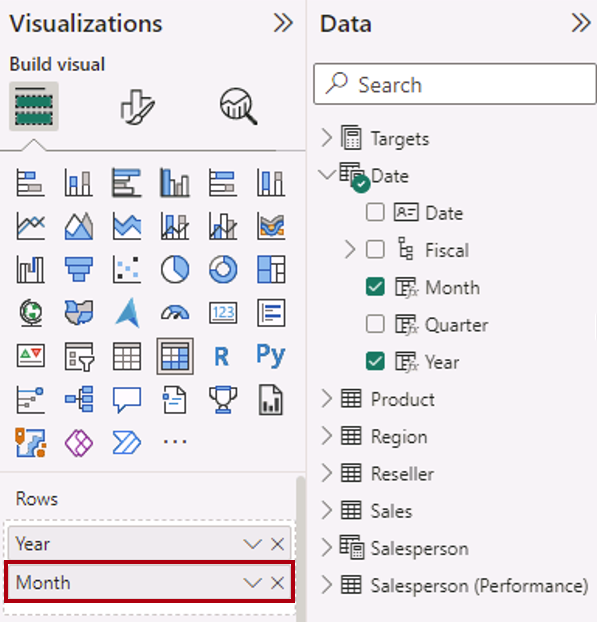
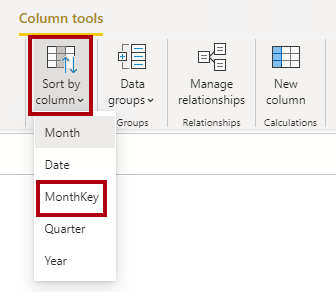
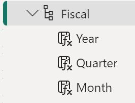
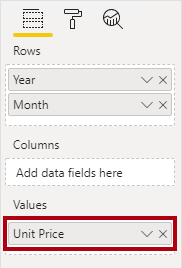

---
lab:
  title: 在 Power BI Desktop 中建立 DAX 計算
  module: Create Model Calculations using DAX in Power BI
---


# 在 Power BI Desktop 中建立 DAX 計算

## **實驗室案例**

在此實驗室中，您將使用資料分析運算式 (DAX) 建立匯出資料表、匯出資料行和簡單量值。

在此實驗中，您將了解如何：

- 建立導出資料表
- 建立計算結果欄
- 建立量值

**此實驗室大約需要 45 分鐘的時間。**

## **建立匯出資料表**

在此練習中，您要建立兩份導出資料表。 第一個是 [銷售人員] 資料表，以允許其與 [銷售] 資料表之間的直接關聯性。 第二個是 Date 資料表。

*重要事項：如果您繼續從先前的實驗室 (，且您已完成該實驗室已成功) ，請勿完成這項工作;相反地，請繼續下一個工作。*

1. 開啟 Power BI Desktop。

    

    *提示：根據預設，[消費者入門] 對話方塊會在Power BI Desktop前面開啟。您可以選擇登入，然後關閉快顯。*

1. 若要開啟入門Power BI Desktop檔案，請選取 [檔案] **> [開啟報表] > [流覽報表**]。

1. 在 [ **開啟** ] 視窗中，流覽至 **D：\PL300\Labs\04-create-dax-calculations-in-power-bi-desktop\Starter** 資料夾，然後開啟 **Sales Analysis** 檔案。

1. 關閉任何可能開啟的資訊視窗。

1. 注意功能區下方的黃色警告訊息。

    *此訊息會提醒您查詢尚未套用為模型資料表載入的事實。您稍後會在此實驗室中套用查詢。*

    *若要關閉警告訊息，請在黃色警告訊息右邊選取 **[X**]。*

1. 若要建立檔案的複本，請移至 [ **檔案] > [另** 存新檔] 並儲存至 **D：\PL300\MySolution** 資料夾。

1. 如果系統提示您套用變更，請選取 [稍後套用]。

## **建立 Salesperson 資料表**

在這項工作中，您將建立 **Salesperson** 匯出資料表， (與 **Sales**) 的直接關聯性。

建立導出資料表的方式是先輸入資料表名稱，後面接著等號 (=)，然後是傳回資料表的 DAX 公式。 資料表名稱不可已存在於資料模型中。

公式列支援輸入有效的 DAX 公式。 其中包含自動完成、Intellisense 和色彩編碼等功能，可讓您快速且正確地輸入公式。

1. 在 Power BI Desktop 的 [報表] 檢視中，從 [模型] 功能區的 [計算] 群組內，選取 [新增資料表]。

     

2. 在公式列 (在建立或編輯計算時直接在功能區下方開啟) 中，輸入 **Salesperson =**，按 **Shift+Enter**，輸入 **'Salesperson (Performance)'**，然後按 **Enter** 鍵。

    *為了方便起見，此實驗室中的所有 DAX 定義都可從程式碼片段檔案複製，位置為 **D:\PL300\Labs\04-create-dax-calculations-in-power-bi-desktop\Assets\Snippets.txt**。*

     

     *此資料表定義會建立 **Salesperson (Performance) ** 資料表的複本。它只會複製資料，但是不會複製模型屬性，例如可見度、格式等。*

     *提示：建議您輸入「空白字元」 (，也就是歸位字元和索引標籤) 以直覺且容易閱讀的格式撰寫公式，特別是當公式很長且複雜時。若要輸入歸位字元，請按 **Shift+Enter**。「空白字元」是選擇性的。*

1. 在 [ **資料** ] 窗格中，請注意資料表圖示是藍色的陰影， (表示匯出資料表) 。

    

    *注意：匯出資料表是使用會傳回資料表的 DAX 公式來定義。請務必瞭解計算資料表會增加資料模型的大小，因為它們會具體化和儲存值。每當重新整理公式相依性時，就會重新計算這些資料模型，如同新 (未來) 日期值載入資料表時，此資料模型的情況也一樣。*

    *不同於 Power Query 所產生的資料表，系統無法使用導出資料表來載入外部資料來源的資料。這些資料表只能根據已載入資料模型的資料來轉換資料。*

1. 切換至 [模型] 檢視，並注意到 **Salesperson** 資料表可供使用 (您可能需要重設檢視來尋找資料表) 。

1. 建立從 [銷售人員 \| EmployeeKey] 資料行到 [銷售額 \| EmployeeKey] 資料行的關聯性。

1. 以滑鼠右鍵按一下 [銷售人員 (效能)] 資料表與 [銷售] 資料表之間的非作用中關聯性，然後選取 [刪除]。 出現確認刪除的提示時，請選取 [ **是**]。

1. 在 [銷售人員] 資料表中，多重選取下列資料行，然後將這些資料行隱藏 (將 [隱藏] 屬性設為 [是])：

    - EmployeeID
    - EmployeeKey
    - UPN

1. 在模型圖表中，選取 [銷售人員] 資料表。

1. 在 [屬性] 窗格的 [描述] 方塊中，輸入：**與銷售額相關的銷售人員**
    
    *您可能會回想一下，當使用者將游標停留在資料表或欄位上時，描述會顯示為 **[資料** ] 窗格中的工具提示。*

1. 針對 [銷售人員 (效能)] 資料表，將描述設定為：**與區域相關的銷售人員**

*資料模型現在可在分析銷售人員時提供兩個替代選項。[銷售人員] 資料表可用來分析銷售人員所產生的銷售額，而 [銷售人員 (績效)] 資料表則可供分析指派給銷售人員之銷售區域的銷售額。*

## **建立日期資料表**

在此工作中，您將建立 [日期] 資料表。

1. 切換至 [資料] 檢視。 在 [常用] 功能區索引標籤上，從 [計算] 群組內選取 [新增資料表]。

    

1. 在公式列中，輸入下列內容：

    **DAX**

    ```
    Date =  
    CALENDARAUTO(6)
    ```

    


    *CALENDARAUTO() 函式會傳回由日期值組成的單一資料行資料表。「自動」行為會掃描資料模型的所有日期資料行，以判斷儲存在資料模型中的最舊和最新日期值。接著，系統會為此範圍內的每個日期建立資料列，並朝任一方向擴充範圍，以確保各個年度的所有資料都已確實儲存。*

    *此函式可採用開放自由選用的單一引數，也就是一年中的最後一個月份。若加以省略，其值將是 12，表示 12 月是一年的最後一個月。此案例中會輸入 6，表示 6 月是一年的最後一個月。*

1. 請注意日期值的資料行。

    

    *顯示的日期會使用美國地區設定 (即 mm/dd/yyyy) 加以格式化。*

5. 在左下角的狀態列中查看資料表統計資料，確認已產生 1826 個資料列，這代表五個完整年度的資料。

    

## **建立計算結果欄**

在此工作中，您將新增更多資料行，以依不同的時間週期啟用篩選和分組。 您也會建立一個計算結果欄，以控制其他資料行的排序順序。

*為了方便起見，此實驗室中的所有 DAX 定義都可從程式碼片段檔案複製，位置為 **D:\PL300\Labs\04-create-dax-calculations-in-power-bi-desktop\Assets\Snippets.txt**。*

1. 在 [資料表工具] 內容功能區中，從 [計算] 群組內選取 [新增資料行]。

    

1. 在公式列中輸入下列內容 (或從程式碼片段檔案複製)，然後按 **Enter**：


    **DAX**


    ```
    Year =
    "FY" & YEAR('Date'[Date]) + IF(MONTH('Date'[Date]) > 6, 1)
    ```


    *匯出資料行會先輸入資料行名稱，後面接著等號 (=) ，後面接著會傳回單一值結果的 DAX 公式。資料行名稱不存在於資料表中。*

    *此公式會使用日期的年度值，但如果月份落在六月之後，年度值就會加一。這是 Adventure Works 計算會計年度的方式。*

1. 確認已新增資料行。

    

1. 使用程式碼片段檔案定義，為 [日期] 資料表建立下列兩個計算結果欄：

    - 季
    - Month

    

1. 若要驗證計算，請切換至 [報表] 檢視。

1. 若要建立新的報表頁面，請選取第 1 頁旁的加號圖示。

    

1. 若要將矩陣視覺效果新增至新的報表頁面，請在 [視覺效果] 窗格中選取矩陣視覺效果類型。

    *提示：將游標停留在各個圖示上方，即可顯示說明視覺效果類型的工具提示。*

    

1. 在 [ **資料** ] 窗格中，從 **[日期** ] 資料表內，將 [ **年** ] 欄位拖曳至 [ **資料列** ] 區/區域。

    

1. 將 Month 欄位拖曳至 [資料列] 井/區域中，放在 Year 欄位的正下方。

    

1. 根據視覺效果) 的位置，在矩陣視覺效果的右上方 (或底部，選取分叉雙箭號圖示 (，這會向下展開一層) 。

    

1. 請注意，年度會展開為月份，而月份會依字母順序排序，而不是按時間順序。

    

    *根據預設，文字值會依字母順序排序，數字會由小至大排序，日期則會由舊至新排序。*

1. 若要自訂 Month 欄位的排序順序，請切換至 [資料] 檢視。

1. 將 **MonthKey** 資料行新增至 [日期] 資料表。


    **DAX**


    ```
    MonthKey =
    (YEAR('Date'[Date]) * 100) + MONTH('Date'[Date])
    ```


    *此公式會計算每個年度/月份組合的數值。*

1. 在 [資料] 檢視中，確認新資料行包含數值 (例如 201707 表示 2017 年 7 月等)。

    

1. 切換回 [報表] 檢視。 在 [ **資料** ] 窗格中，確定已選取 [ **月份** ] 欄位 (選取，它會有深灰色背景) 。

1. 在 [資料行工具] 內容功能區中，從 [排序] 群組內選取 [依資料行排序]，然後選取 [MonthKey]。

    

1. 在矩陣視覺效果中，您會發現月份此時依時間排序。

    

## **完成日期資料表**

在此工作中，您將隱藏資料行並建立階層，以完成 [日期] 資料表的設計。 接著，您會建立 [銷售] 和 [目標] 資料表的關聯性。

1. 切換至 [模型] 檢視。 在 [日期] 資料表中，將 [MonthKey] 資料行隱藏 (將 [隱藏] 設為 [是])。


1. 在 [ **資料** ] 右側窗格上，選取 **[日期** ] 資料表，以滑鼠右鍵按一下 [ **年** ] 資料行，然後選取 **[建立階層**]。 

1. 以滑鼠右鍵按一下 [重新命名] 和 [重新命名]，將新建立的階層**重新命名**為 **[會計**]。


1. 在 [**資料**] 窗格中選取下列兩個其餘欄位，以滑鼠右鍵按一下 [**新增至階層**會計]，將下列兩個其餘欄位新增至**會計**階層  ->  。

    - 季
    - Month

    

1. 建立下列兩個模型關聯性：

    - **日期 \| 日期**與**銷售額 \| OrderDate**
    - **日期 \| 日期**與**目標 \| TargetMonth**

1. 隱藏以下兩個資料行：

    - 銷售額 \| OrderDate
    - 目標 \| TargetMonth

## **標示日期資料表**

在此工作中，您會將 [日期] 資料表標示為日期資料表。

1. 切換至 [報表] 檢視。 在 [ **資料]** 窗格中，選取 [ **日期** ] 資料表 (不是 [ **日期** ] 欄位) 。

1. 在 [資料表工具] 內容功能區中，從 [日曆] 群組選取 [標示為日期資料表]，然後選取 [標示為日期資料表]。

    

1. 在 [標示為日期資料表] 視窗的 [日期資料行] 下拉式清單中，選取 [日期]。 選取 [確定]。

    

1. 儲存 Power BI Desktop 檔案。

    *Power BI Desktop現在瞭解此資料表定義日期 (時間) 。依賴時間智慧計算時，這很重要。您將在**Power BI Desktop 實驗室中建立進階 DAX 計算中**處理時間智慧計算。*

    *當您的資料來源中沒有日期資料表時，這個日期資料表的設計方法就很適合。如果您有資料倉儲，最好從其日期維度資料表載入日期資料，而不是在資料模型中「重新定義」日期邏輯。*

## **建立簡單量值**

在此工作中，您將建立簡單量值。 簡單量值會彙總資料表中單一資料行或計數資料列中的值。

1. 在 [報表] 檢視的第 **2 頁**的 [ **資料** ] 窗格中，將 **[銷售 \| 單位價格** ] 欄位拖曳至矩陣視覺效果。

    *實驗室使用速記標記法來參考欄位。其看起來將會像下面這樣：銷售額  單價。在此範例中，Sales (銷售額) 是資料表名稱，而 Unit Price (單價) 是欄位名稱。

    

    *您應該記得，您曾於 **在 Power BI Desktop 中設計資料模型**實驗室中設定 [單價] 資料行，以便依 [平均] 彙總資料。您在矩陣視覺效果中看到的結果為每月平均單價 (單價值的總和除以單價的計數)。*

1. 在視覺效果欄位窗格 (位於 [視覺效果] 窗格底下) 的 [值] 井/區域中，您會看到畫面上已列出 [單價]。

    

1. 選取 **Unit Price** 的向下箭號，並留意可用的功能表選項。

    

    *可見數值資料行允許報表作者在報表設計階段決定資料行值如何摘要 (或未) 。這可能會導致不適當的報告。不過，有些資料模型工具不喜歡離開機會，並選擇隱藏這些資料行，並改為公開量值中定義的匯總邏輯。這是您現在將在此實驗室中採用的方法。*

1. 若要建立量值，請在 [ **資料** ] 窗格中，以滑鼠右鍵按一下 **[銷售** ] 資料表，然後選取 [ **新增量值**]。

1. 在公式列中，新增下列量值定義：


    **DAX**


    ```
    Avg Price =  
    AVERAGE(Sales[Unit Price])
    ```

1. 將 [平均價格] 量值新增至矩陣視覺效果。

1. 請注意，其產生的結果與 [單價] 資料行相同 (但格式不同)。

1. 在 [ **值** ] 中，開啟 **[平均價格** ] 欄位的操作功能表，並注意到無法變更匯總技術。

    

    *您無法修改量值的彙總行為。*

1. 使用程式碼片段檔案定義，為 [銷售] 資料表建立下列五個量值：

    - 中間價格
    - 最低價格
    - 最高價格
    - 訂單
    - 訂單明細

    *[訂單] 量值中使用的 DISTINCTCOUNT() 函式只會計算訂單一次 (忽略重複項目)。[訂單明細] 量值中使用的 COUNTROWS() 函式會對資料表進行運算。*

    *在此案例中，訂單數是透過計算相異的 **SalesOrderNumber** 資料行值所得出，而訂單明細的數目就是資料表資料列的數目 (每個資料列分別是訂單的一行)。*

10. 切換至 [模型] 檢視，然後複選四個價格量值：[平均價格]、[最高價格]、[中間價格] 和 [最低價格]。

11. 複選量值時，請設定下列需求：

    - 將格式設定為兩個小數位數

    - 指派給名為 **Pricing** 的顯示資料夾

    

12. 隱藏 [單價] 資料行。

    *報表建立者目前無法使用 [單價] 資料行，必須使用您所新增至模型的量值。這種設計方法可確保報表建立者不會以不適當的方式彙總價格，例如以加總方式來彙總。*

13. 複選 [訂單明細] 和 [訂單] 量值，並設定下列需求：

    - 設定使用千位分隔符號的格式

    - 指派給名為 **Counts** 的顯示資料夾

    

14. 在 [報表] 檢視中，在矩陣視覺效果的 [ **值** ] 區/區域中，針對 [ **單位價格** ] 欄位選取 **[X** ] 將其移除。

    

15. 增加矩陣視覺效果的大小，以符合頁面寬度和高度。

16. 將下列五個量值新增至矩陣視覺效果：

    - 中間價格
    - 最低價格
    - 最高價格
    - 訂單
    - 訂單明細

17. 確認結果看起來很合理，且格式正確。

    

## **建立其他量值**

在這項工作中，您將建立更多使用更複雜的公式的量值。

1. 在 [報表] 檢視中，選取 **[第 1 頁** ]，然後檢閱資料表視覺效果，並指出 **[目標** ] 資料行的總計。

    


1. 選取資料表視覺效果，然後在 [視覺效果] 窗格中，移除 [目標] 欄位。

1. 將 [目標 \| 目標] 資料行重新命名為 [目標 \| TargetAmount]。

    *提示：有數種方式可以在 [報表] 檢視中重新命名資料行：在 [ **資料** ] 窗格中，您可以用滑鼠右鍵按一下資料行，然後選取 [ **重新命名**]，或按兩下資料行，或按 **F2**。*

    *您即將建立名為「目標」的量值。在相同的資料表中，資料行和量值的名稱不得重複。*

1. 在 [目標] 資料表上建立下列量值：

    **DAX**


    ```
    Target =

    IF(

    HASONEVALUE('Salesperson (Performance)'[Salesperson]),

    SUM(Targets[TargetAmount])

    )
    ```

    *HASONEVALUE() 函式會測試是否在 [銷售人員] 資料行中篩選出單一值。若為 true，則運算式會傳回目標數量的總和 (僅針對該銷售人員)。若為 false，則會傳回空值。*

1. 將 [目標] 量值格式化為零個小數位數。

    *提示：您可以使用 [量值工具] 內容功能區。*

1. 隱藏 **TargetAmount** 資料行。

    *提示：您可以在 [資料] 窗格中以滑鼠右鍵按一下 **資料** 行，然後選取 [ **隱藏**]。*

1. 將 [目標] 量值新增至資料表視覺效果。

1. 請注意，[目標] 資料行的總計此時是空白的。

    

1. 使用程式碼片段檔案定義，為 [目標] 資料表建立下列兩個量值：

    - 變異數
    - 變異數邊界

1. 將 [變異數] 量值格式化為零個小數位數。

1. 將 [變異數邊界] 量值格式化為具有兩個小數位數的百分比。

1. 將 [變異數] 和 [變異數邊界] 量值新增至資料表視覺效果。

1. 調整資料表視覺效果的大小，以便看到所有資料行與資料列。

    

    *雖然所有銷售人員都未符合目標，但請記住，資料表視覺效果尚未依特定時間週期進行篩選。您將會產生銷售績效報告，以在Power BI Desktop實驗室中**設計報表**中依使用者選取的時間週期進行篩選。*

1. 在 [ **資料** ] 窗格的右上角折迭，然後展開開啟窗格。

    *折迭並重新開啟窗格會重設內容。*

1. 請注意，[目標] 資料表此時會出現在清單頂端。

    

    *僅包含可見量值的資料表，會自動列在清單頂端。*

### **完成**

儲存 Power BI Desktop 檔案。

*您將在**Power BI Desktop 實驗室的建立進階 DAX 計算中，使用 DAX**來增強資料模型與更進階的計算。*
