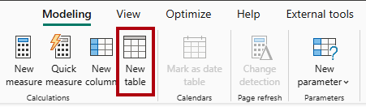
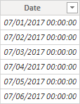
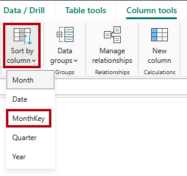

---
lab:
  title: 在語式模型中建立 DAX 計算
  module: Create DAX calculations in semantic models
---

# 在語式模型中建立 DAX 計算

## 實驗室案例

在此實驗室中，您將使用資料分析運算式 （DAX） 來建立計算資料表、計算資料行和簡單量值。

在此實驗室中，您會了解如何：

- 建立計算資料表。
- 建立計算結果欄。
- 建立量值。

**此實驗室大約需要 45 分鐘。**

## 開始使用

若要完成此練習，請先開啟網頁瀏覽器，然後輸入下列 URL 以下載 zip 檔案：

`https://github.com/MicrosoftLearning/PL-300-Microsoft-Power-BI-Data-Analyst/raw/Main/Allfiles/Labs/04-create-dax-calculations\04-dax-calculations.zip`

將檔案解壓縮至 **C：\Users\Student\Downloads\04-dax-calculations** 資料夾。

開啟 **04-Starter-Sales Analysis.pbix** 檔案。

> _**注意**：載入檔案時，您可能會看到登入對話方塊。選取 **[取消]** 以關閉登入對話方塊。關閉任何其他資訊視窗。如果系統提示套用變更，請選取 **[稍後套用]。**_

## 建立 Salesperson 計算資料表

在此工作中，您將建立 `Salesperson` 計算資料表 （與資料表有 `Sales` 直接關聯性）。

建立導出資料表的方式是先輸入資料表名稱，後面接著等號 (=)，然後是傳回資料表的 DAX 公式。 資料表名稱不可已存在於資料模型中。

您可以在編輯列_中_輸入有效的 DAX 公式。 公式列包括自動完成、Intellisense 和顏色編碼等功能，可讓您快速準確地輸入公式。

1. 在 Power BI Desktop 的 [報表檢視] 中 **，在 [**模型化**] 功能區的 [計算]** 群組內**，選取 [**新增資料表]。****

    

1. 在編輯列中 （當您建立或編輯計算時，會在功能區正下方開啟） 中，輸入 `Salesperson =`，按 **Shift+Enter，** 輸入 `'Salesperson (Performance)'`，然後按 **Enter**。

    > _**附註**： 為了方便起見，本實驗室中的所有 DAX 定義都可以從位於 04-dax-calculations\Snippets.txt** 檔案中的**程式碼片段檔案複製。_

    

    > _此表格定義會建立表格的 `Salesperson (Performance)` 副本。它只會複製資料，但不會複製可見度、格式設定等模型屬性。_

1. 在 [資料 **] **窗格中，請注意，新資料表的圖示前面有一個額外的計算機 （表示計算資料表）。

    

    > _**附註**： 計算資料表是使用傳回資料表的 DAX 公式來定義。請務必瞭解計算資料表會增加資料模型的大小，因為它們會具體化並儲存值。此外，每當重新整理公式相依性時，都會重新計算它們，就像將新 （未來） 日期值載入資料表時，此資料模型的情況一樣。_
    >
    > _不同於 Power Query 來源的資料表，計算資料表無法用來從外部資料來源載入資料。他們只能根據已載入到資料模型中的內容來轉換資料。_

1. 切換至 **模型檢視**，並注意該 `Salesperson` 表格可用。

1. 建立從資料行到`Sales | EmployeeKey`資料行的`Salesperson | EmployeeKey`關聯性。

    > _實驗室使用速記符號來引用字段。它看起來像這樣： `Salesperson | EmployeeKey`。在此範例中， `Salesperson` 是資料表名稱，是 `EmployeeKey` 資料行名稱。_

1. 以滑鼠右鍵按一下 和`Sales`資料表之間的`Salesperson (Performance)`非作用中關聯性 （虛線），然後選取 **[刪除]。** 當系統提示確認刪除時，請選取 [ **是**]。

1. 在表格中 `Salesperson` ，選取下列欄，然後隱藏它們 （將 [ **隱藏** ] 屬性設定為 _[是]_）：

    - `EmployeeID`
    - `EmployeeKey`
    - `UPN`

1. 在模型圖表中，選取 `Salesperson` 資料表。

1. 在 [屬性] **** 窗格的 [描述] **** 方塊中，輸入：_與銷售相關的銷售人員_

    > _您可能還記得，每當使用者將游標停留在資料表或欄位上時，描述就會在 [資料 **] **窗格中顯示為工具提示。_

1. 針對資料 `Salesperson (Performance)` 表，將描述設定為： _與區域相關的銷售人員_

> _資料模型現在在分析銷售人員時提供兩種替代方案。該 `Salesperson` 表允許分析銷售人員的銷售額，而該 `Salesperson (Performance)` 表允許分析分配給銷售人員的銷售區域的銷售額。_

## 建立日期資料表

在此工作中，您將建立 `Date` 資料表。

1. 切換至 **表格檢視**。 在 [常用]**** 功能區索引標籤上，從 [計算]**** 群組內選取 [新增資料表]****。

    

1. 在編輯列中，輸入下列 DAX：

    ```dax
    Date =  
    CALENDARAUTO(6)
    ```

    

    > _此 `CALENDARAUTO` 函數會傳回包含日期值的單欄資料表。「自動」行為會掃描所有資料模型日期欄，以判斷儲存在資料模型中的最早和最晚日期值。然後，它會為此範圍內的每個日期建立一列，並向任一方向擴展範圍，以確保儲存完整年份的資料。_
    >
    > _此函式可以採用單一選擇性引數，即一年的最後一個月數字。省略時，值為 12，表示 12 月是一年中的最後一個月。在此情況下，輸入 6，表示 6 是一年中的最後一個月。_

1. 請注意日期值的直欄，這些值可能會使用美國區域設定 （也就是 mm/dd/yyyy） 來格式化。

    

1. 在左下角的狀態列中，請注意表格統計資料，確認已產生 1826 列資料，代表整整五年的資料。

    

## 建立計算結果欄

在此工作中，您將新增更多資料行，以啟用依不同時段的篩選和分組。 您也會建立一個計算結果欄，以控制其他資料行的排序順序。

> _**附註**：為了方便起見，本實驗室中的所有 DAX 定義都可以從 Snippets.txt** 檔案複製**。_

1. 在 [資料表工具]**** 內容功能區中，從 [計算]**** 群組內選取 [新增資料行]****。

    > _計算資料行的建立方式是先輸入資料行名稱，然後輸入等於符號 （=），然後輸入傳回單一值結果的 DAX 公式。資料行名稱不能已存在於資料表中。_

    

1. 在公式列中輸入下列內容 (或從程式碼片段檔案複製)，然後按 **Enter**：

    > _公式會使用日期的年份值，但當月份在 6 月之後時，會將 1 新增至年份值。這就是 Adventure Works 會計年度的計算方式。_

   ```dax
   Year =
   "FY" & YEAR('Date'[Date]) + IF(MONTH('Date'[Date]) > 6, 1)
   ```

1. 使用程式碼片段檔案定義，為表格建立 `Date` 下列兩個計算欄：

    - `Quarter`
    - `Month`

1. 確認已新增資料行。

    

1. 若要驗證計算，請切換至 **「報表檢視**」。

1. 若要建立新的報表頁面，請選取第 1** 頁旁的**加號圖示。

    

1. 若要將矩陣視覺效果新增至新的報表頁面，請在 [視覺效果]**** 窗格中選取矩陣視覺效果類型。

    > _提示： 您可以將游標停留在每個圖示上，以顯示描述視覺類型的工具提示。_

    

1. 在 [資料 **] **窗格中，從表格內部`Date`，將欄位拖曳`Year`到 [列] **** 井中。

    

1. 將欄位拖曳`Month`到欄位正下方`Year`的「排」**井中**。

1. 在矩陣視覺效果的右上角 （或底部，視視覺效果的位置而定），選取分叉雙箭頭圖示 （這會向下展開所有年份）。

    

1. 請注意，年度會展開為月份，而月份會依字母順序排序，而不是按時間順序。

    

    > _依預設，文字值會依字母順序排序，數字會從最小到最大排序，日期會從最早到最新排序。_

1. 若要自訂 `Month` 欄位排序順序，請切換至 **表格檢視**。

1. 將資料 `MonthKey` 行 `Date` 新增至資料表。

    ```dax
    MonthKey =
    (YEAR('Date'[Date]) * 100) + MONTH('Date'[Date])
    ```

    > _此公式會計算每個年/月組合的數值。_

1. 在 [表格檢視 **] 中**，確認新資料行包含數值 （例如，2017 年 7 月的201707等）。

    

1. 切換回 **報表檢視**。

1. 在 [資料 **] **窗格中，選取欄位`Month`。

1. 在 [資料行工具]**** 內容功能區中，從 [排序]**** 群組內選取 [依資料行排序]****，然後選取 [MonthKey]****。

    

1. 在矩陣視覺效果中，您會發現月份此時依時間排序。

    

## 完成日期資料表

在此工作中，您將透過隱藏資料行並建立階層來完成資料表的設計 `Date` 。 然後，您將建立與 和 `Sales` `Targets` 資料表的關聯性。

1. 切換至 **模型檢視**。

1. 在表格中 `Date` ，隱藏欄 `MonthKey` （將 **隱藏 設定** 為 _是_）。

1. 在 [資料] 窗格中，選取`Date`資料表，以滑鼠右鍵按一下`Year`資料行，然後選取 **[建立階層**]。****

    

1. 在 [屬性] **** 窗格的 [名稱 **] **方塊中，將值取代為 _Fiscal_。

    

1. 兩個將層級新增至階層，在 [階層] **** 下拉式清單中，選取 **[季度]**，然後選取 **[月份]**，然後選取 **[套用層級變更**]。

    

1. 建立下列兩個模型關聯性：

    - 按 `Date | Date` 移至 `Sales | OrderDate`
    - 按 `Date | Date` 移至 `Targets | TargetMonth`

1. 隱藏以下兩個資料行：

    - `Sales | OrderDate`
    - `Targets | TargetMonth`

## 標示日期資料表

在此工作中，您會將資料 `Date` 表標示為日期資料表。

1. 切換至 [報表]**** 檢視。

1. 在 [資料 **] **窗格中，選取`Date`資料表 （而非`Date`欄位）。

1. 在 [表格工具] **內容功能區的 [行事曆 **] **群組內，選取 **[標示為日期表格**]。**

    

1. 在 [標示為日期表] **視窗中，將 [標示為日期表 **] **屬性滑動至 _[開啟_]。**

1. 在 [選擇日期欄 **] **下拉式清單中，選取 [**日期**]。

    

1. 選取**儲存**。

1. 儲存 Power BI Desktop 檔案。

> _Power BI Desktop 現在瞭解此資料表會定義日期 （時間）。_
>
> _當您的資料來源中沒有日期資料表時，此日期資料表的設計方法適用。如果您有資料倉儲，則適合從其日期維度資料表載入日期資料，而不是在資料模型中「重新定義」日期邏輯。_

## 建立簡單量值

在此工作中，您將建立簡單量值。 簡單量值會彙總資料表中單一資料行或計數資料列中的值。

1. 在報表檢視**的**第 2** 頁上**，從 [資料 **] **窗格，將欄位拖曳`Sales | Unit Price`到矩陣視覺效果中。

    

1. 在視覺欄位窗格 （位於 [ **視覺效果]** 窗格中） 的 [ **值** ] 井中，請注意該 `Unit Price` 欄位已設定為 **[平均單價**]。

    

1. 選取 [Average of Unit Price]** 的**向下箭號，然後注意可用的功能表選項。

    > _可見的數值欄可讓報表作者在報表設計階段決定欄值的摘要方式 （或不摘要）。但是，這可能會導致不適當的報告。_
    >
    > _某些資料建模者不喜歡讓事情碰運氣，因此他們選擇隱藏這些資料行，並改為公開量值中定義的彙總邏輯。這是您現在將在這個實驗室中採用的方法。_

1. 若要建立量值，請在 [資料 **] **窗格中，以滑鼠右鍵按一下`Sales`資料表，然後選取 **[新增量值]。**

1. 在公式列中，新增下列量值定義：

    ```DAX
    Avg Price =  
    AVERAGE(Sales[Unit Price])
    ```

1. 將量值 `Avg Price` 新增至矩陣視覺效果，並注意它會產生與資料行相同的 `Unit Price` 結果 （但格式不同）。

1. 在 [值] **** 井中，開啟欄位的內容`Avg Price`功能表，並注意無法變更彙總技術。

    

    > _無法修改量值的彙總行為。_

1. 使用程式碼片段檔案定義，為表格建立 `Sales` 下列五個量值：

    - `Median Price`
    - `Min Price`
    - `Max Price`
    - `Orders`
    - `Order Lines`

    > _`DISTINCTCOUNT`量值中使用的`Orders`函數只會計算訂單一次（忽略重複項）。`COUNTROWS`量值中使用的`Order Lines`函式會針對資料表進行作業。_
    >
    > _在這種情況下，訂單數量是通過計算不同的 `SalesOrderNumber` 列值來計算的，而訂單行數只是表格行數（每一行是訂單的一行）。_

1. 切換至 **[模型] 檢視**，然後選取四個價格量值： `Avg Price`、 `Max Price`、 `Median Price`和 `Min Price`。

1. 複選量值時，請設定下列需求：

    - 將格式設定為小數位後兩位。
    - 指派給名為 _Pricing_ 的顯示資料夾 （使用 **[屬性]** **窗格中的 [顯示資料夾**] 屬性）。

    

1. 隱藏欄 `Unit Price` 。

    > _報表作者不再可以使用該 `Unit Price` 欄。他們必須使用您新增至模型的定價量值。此設計方法可確保報表作者不會不當地彙總價格，例如，將價格加總。_

1. 多選 和 `Order Lines` `Orders` 量值，然後設定下列需求：

    - 使用千位分隔符設定格式。
    - 指派給名為 Counts_ 的_顯示資料夾。

    

1. 在 [報表] 檢視**中**，在矩陣視覺效果的 [**值]** 井中，針對 [單價**平均值]，** 選取 [X **] 以**將其移除。

    

1. 增加矩陣視覺效果的大小，以符合頁面寬度和高度。

1. 將下列五個量值新增至矩陣視覺效果：

    - `Median Price`
    - `Min Price`
    - `Max Price`
    - `Orders`
    - `Order Lines`

1. 確認結果看起來很合理，且格式正確。

    

## 建立其他量值

在此工作中，您將建立更多使用更複雜公式的量值。

1. 在 [報表檢視 **] 中**，選取 **[第 1** 頁]，然後檢閱銷售人員的資料表視覺效果 （位於右側），注意 [目標總和] **** 資料行的總計。

    

1. 選取資料表視覺效果，然後在 [ **視覺效果** ] 窗格中，移除 **[目標**總和]。

1. 將資料 `Targets | Target` 行重新命名為 _TargetAmount_。

    > _提示： 有數種方式可在 [報表] 檢視中**重新命名資料行：在 [資料 **] **窗格中，您可以以滑鼠右鍵按一下資料行，然後選取 **[重新命名**]，或按兩下資料行，或按 **F2**。**_

1. 在資料表上 `Targets` 建立下列量值：

    ```dax
    Target =
    IF(
        HASONEVALUE('Salesperson (Performance)'[Salesperson]),
        SUM(Targets[TargetAmount])
    )
    ```

    > _函式會 `HASONEVALUE` 測試是否已篩選資料行中的 `Salesperson` 單一值。當 true 時，運算式會傳回目標金額的總和 （僅針對該銷售人員）。當 false 時， `BLANK` 會傳回。_

1. 將量值格式化 `Target` 為小數位數後零位。

    > _提示： 您可以使用 **「測量工具」** 前後關聯功能區。_

1. 隱藏欄 `TargetAmount` 。

    > _提示： 您可以以滑鼠右鍵按一下 [資料 **] **窗格中的欄，然後選取 **[隱藏]。**_

1. 請注意，表格 `Targets` 現在會出現在清單頂端。

    

    > _僅包含可見量值的表格會自動列在清單頂端。_

1. 將量值 `Target` 新增至資料表視覺效果。

1. 請注意， **目標** 欄總計現在 `BLANK`是 。

    

1. 使用程式碼片段檔案定義，為表格建立下列兩個量值 `Targets` ：

    - `Variance`
    - `Variance Margin`

1. 將量值格式化 `Variance` 為小數位數後零位。

1. 將量值 `Variance Margin` 格式化為小數點後兩位的百分比。

1. 將 和 `Variance Margin` 量`Variance`值新增至資料表視覺效果。

1. 調整資料表視覺效果的大小，以便看到所有資料行與資料列。

    

    > _雖然所有銷售人員似乎都未達到目標，但請記住，資料表視覺效果尚未依特定時段進行篩選。您將在 Power BI Desktop** 中設計報表實驗室**中，產生依使用者選取的時段篩選的銷售績效報表。_

1. 儲存 Power BI Desktop 檔案。

## 實驗室完成

您可以選擇儲存 Power BI 報表，但此實驗室不需要儲存。 在下一個練習中，您將使用預先製作的入門檔案。

1. 導航至 **左上角的“文件”** 菜單，然後選擇 **“另存為”**。 
1. 選取 [瀏覽此裝置]****。
1. 選取您要儲存檔案的資料夾，並為其指定描述性名稱。 
1. 選取 [儲存] **** 按鈕，將報表儲存為 .pbix 檔案。 
1. 如果出現對話方塊，提示您套用擱置的查詢變更，請選取 [ **套用**]。
1. 關閉 Power BI Desktop。