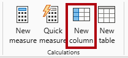
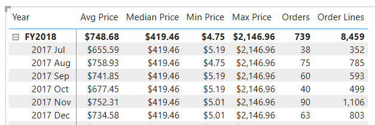
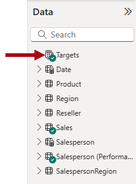

---
lab:
  title: 在語意模型中建立DAX計算
  module: Create DAX calculations in semantic models
---

# 在語意模型中建立DAX計算

## 實驗室案例

在此實驗室中，您將使用數據分析表達式 （DAX） 建立匯出數據表、計算結果列和簡單量值。

在此實驗室中，您會了解如何：

- 建立計算資料表。
- 建立計算結果欄。
- 建立量值。

**此實驗室大約需要45分鐘的時間。**

## 開始使用

若要完成此練習，請先開啟網頁瀏覽器，然後輸入下列 URL 以下載 zip 檔案：

`https://github.com/MicrosoftLearning/PL-300-Microsoft-Power-BI-Data-Analyst/raw/Main/Allfiles/Labs/04-create-dax-calculations\04-dax-calculations.zip`

將檔案解壓縮到 **C：\Users\Student\Downloads\04-dax-calculations** 資料夾。

**開啟 04-Starter-Sales Analysis.pbix** 檔案。

> _**注意**：您可以選取 **[取消**] 來關閉登入。關閉任何其他信息視窗。如果系統提示您套用變更，請選取 [ **稍後**套用]。_

## 建立 Salesperson 匯出數據表

在這項工作中，您將建立 `Salesperson` 匯出數據表（其與數據表有直接關聯性 `Sales` ）。

建立導出資料表的方式是先輸入資料表名稱，後面接著等號 (=)，然後是傳回資料表的 DAX 公式。 資料表名稱不可已存在於資料模型中。

您可以在公式列中_輸入有效的 DAX 公式_。 公式列包含自動完成、Intellisense 和色彩編碼等功能，可讓您快速且準確地輸入公式。

1. 在 Power BI Desktop 的 [報表] 檢視中，從 [模型]**** 功能區的 [計算]**** 群組內，選取 [新增資料表]****。

    

1. 在公式列中（當您建立或編輯計算時直接在功能區下方開啟），輸入 `Salesperson =`、按 **Shift+Enter**、輸入 `'Salesperson (Performance)'`，然後按 **Enter**。

    > _**注意**：為了方便起見，此實驗室中的所有DAX定義都可以從位於 **04-dax-calculations\Snippets.txt** 檔案的代碼段檔案複製。_

    

    > _此數據表定義會建立資料表的 `Salesperson (Performance)` 複本。它只會複製數據，但是不會複製模型屬性，例如可見度、格式設定和其他屬性。_

1. 在 [ **數據** ] 窗格中，請注意，新數據表的圖示前面有額外的計算機（表示匯出數據表）。

    

    > _**注意**：匯出數據表是使用會傳回數據表的DAX公式來定義。請務必瞭解計算數據表會增加數據模型的大小，因為它們具體化和儲存值。此外，每當重新整理公式相依性時，就會重新計算，當新的 （future） 日期值載入數據表時，此數據模型的情況也會如此。_
    >
    > _不同於 Power Query 來源數據表，匯出數據表無法用來從外部數據源載入數據。他們只能根據已載入數據模型的內容來轉換數據。_

1. 切換至 [模型] 檢視，並注意 `Salesperson` 數據表可供使用。

1. 從 `Salesperson | EmployeeKey` 數據行到數據行建立關聯性 `Sales | EmployeeKey` 。

    > _實驗室會使用速記表示法來參考欄位。看起來會像這樣： `Salesperson | EmployeeKey`。在此範例中， `Salesperson` 是數據表名稱，而 `EmployeeKey` 是數據行名稱。_

1. 以滑鼠右鍵按兩下和 `Sales` 資料表之間的`Salesperson (Performance)`非使用中關聯性（虛線），然後選取 [**刪除**]。 當系統提示您確認刪除時，請選取 [ **是**]。

1. 在資料表中`Salesperson`，多重選取下列數據行，然後隱藏它們（將Is Hidden** 屬性設定**為 _[是_] ：

    - `EmployeeID`
    - `EmployeeKey`
    - `UPN`

1. 在模型圖表中，選取 `Salesperson` 數據表。

1. 在 [屬性]** 窗格中的 [** 描述 **] 方塊中**，輸入：_與銷售相關的 Salesperson_

    > _每當使用者將游標停留在 **資料表或欄位上時，您可能會記得，描述會顯示為 [資料** ] 窗格中的工具提示。_

1. `Salesperson (Performance)`針對數據表，將描述設定為：_與 region（s） 相關的 Salesperson_

> _數據模型現在會在分析銷售人員時提供兩個替代方案。數據表 `Salesperson` 允許分析銷售人員所做的銷售，而 `Salesperson (Performance)` 數據表允許分析指派給銷售人員之銷售區域中的銷售量。_

## 建立日期資料表

在此工作中，您將建立 `Date` 數據表。

1. 切換至 [數據表] 檢視。 在 [常用]**** 功能區索引標籤上，從 [計算]**** 群組內選取 [新增資料表]****。

    

1. 在公式列中，輸入下列 DAX：

    ```dax
    Date =  
    CALENDARAUTO(6)
    ```

    

    > _函 `CALENDARAUTO` 式會傳回由日期值組成的單一數據行數據表。「自動」行為會掃描所有數據模型日期數據行，以判斷儲存在數據模型中的最早和最新的日期值。然後，它會在此範圍內為每個日期建立一個數據列，以任一方向擴充範圍，以確保儲存整年的數據。_
    >
    > _此函式可以採用單一選擇性自變數，也就是一年的最後一個月數目。省略時，此值為12，表示12月是年度的最後一個月。在此案例中，輸入 6，表示 6 月是年度的最後一個月。_

1. 請注意日期值的數據行，這些值可能使用美國地區設定來格式化（也就是mm/dd/yyyyy）。

    

1. 在左下角的狀態欄中，請注意數據表統計數據，確認已產生 1826 個數據列，這代表五年的數據。

    

## 建立計算結果欄

在這項工作中，您將新增更多數據行，以啟用依不同時段的篩選和分組。 您也會建立一個計算結果欄，以控制其他資料行的排序順序。

> _**注意**：為了方便起見，此實驗室中的所有DAX定義都可以從 **Snippets.txt** 檔案複製。_

1. 在 [資料表工具]**** 內容功能區中，從 [計算]**** 群組內選取 [新增資料行]****。

    > _計算結果列的建立方式是先輸入數據行名稱，後面接著等於符號 （=），後面接著會傳回單一值結果的DAX公式。數據表中還不能有數據行名稱。_

    

1. 在公式列中輸入下列內容 (或從程式碼片段檔案複製)，然後按 **Enter**：

    > _公式會使用日期的年份值，但在當月份在 6 月之後時，將一個新增至年份值。這就是 Adventure Works 的會計年度計算方式。_

   ```dax
   Year =
   "FY" & YEAR('Date'[Date]) + IF(MONTH('Date'[Date]) > 6, 1)
   ```

1. 使用代碼段檔案定義來建立資料表的下列兩個匯出 `Date` 資料列：

    - `Quarter`
    - `Month`

1. 確認已新增數據行。

    

1. 若要驗證計算，請切換至 [報表] 檢視。

1. 若要建立新的報表頁面，請選取第 1** 頁旁**的加號圖示。

    

1. 若要將矩陣視覺效果新增至新的報表頁面，請在 [視覺效果]**** 窗格中選取矩陣視覺效果類型。

    > _提示：您可以將游標暫留在每個圖示上，以顯示描述視覺效果類型的工具提示。_

    

1. 在 [**數據] 窗格中，從數據表內部`Date`，將字段拖曳`Year`到 [**數據**列**] 中。

    

1. 將`Month`欄位拖曳到 **** [數據列] 中，直接拖曳到`Year`字段下方。

1. 在矩陣視覺效果的右上方（或底部，視視覺效果的位置而定），選取分叉雙箭號圖示（這會向下展開所有年份一個層級）。

    

1. 請注意，年度會展開為月份，而月份會依字母順序排序，而不是按時間順序。

    

    > _根據預設，文字值會依字母順序排序、數位從最小到最大排序，而日期會從最早排序到最新。_

1. 若要自定義 `Month` 欄位排序順序，請切換至 [資料表檢視]。

1. 將數據 `MonthKey` 行新增至 `Date` 數據表。

    ```dax
    MonthKey =
    (YEAR('Date'[Date]) * 100) + MONTH('Date'[Date])
    ```

    > _此公式會計算每年/月組合的數值。_

1. 在 [數據表] 檢視中，確認新的數據行包含數值（例如，2017 年 7 月的 201707 等等）。

    

1. 切換回 [報表] 檢視。

1. 在 [ **數據]** 窗格中，選取 `Month` 欄位。

1. 在 [資料行工具]**** 內容功能區中，從 [排序]**** 群組內選取 [依資料行排序]****，然後選取 [MonthKey]****。

    

1. 在矩陣視覺效果中，您會發現月份此時依時間排序。

    

## 完成日期資料表

在這項工作中，您將隱藏數據行並建立階層，以完成數據表的設計 `Date` 。 接著，您將建立 與和 `Targets` 數據表的`Sales`關聯性。

1. 切換至 [模型] 檢視。

1. 在資料表中`Date`，隱藏資料`MonthKey`行（將 [隱藏 **] 設定**為 _[是_]。

1. 在 [ **數據** ] 窗格中，選取 `Date` 數據表，以滑鼠右鍵按兩下 `Year` 數據行，然後選取 [ **建立階層**]。

    

1. 在 [屬性]** 窗格中的 **[** 名稱]** 方塊中，將值取代為 _Fiscal_。

    

1. 在 [階層] 下拉式清單中，**選取 [四分之一 **]，然後選取 **[月份 **]，然後選取 **[**套用層級變更**]。**

    

1. 建立下列兩個模型關聯性：

    - 按 `Date | Date` 移至 `Sales | OrderDate`
    - 按 `Date | Date` 移至 `Targets | TargetMonth`

1. 隱藏以下兩個資料行：

    - `Sales | OrderDate`
    - `Targets | TargetMonth`

## 標示日期資料表

在此工作中，您會將 `Date` 數據表標示為日期數據表。

1. 切換至 [報表] 檢視。

1. 在 [ **數據]** 窗格中，選取 `Date` 數據表（而非 `Date` 欄位）。

1. 在 [數據表工具 **] 內容功能區上，從 [** 行事曆]** 群組內部**，選取 [**標示為日期數據表**]。

    

1. 在 [ **標示為日期數據表** ] 視窗中，將 **[標示為日期數據表** ] 屬性投影片到 _[是_]。

1. 在 [ **選擇日期數據行** ] 下拉式清單中，選取 [ **日期**]。

    

1. 選取**儲存**。

1. 儲存 Power BI Desktop 檔案。

> _Power BI Desktop 現在瞭解此數據表會定義日期（時間）。_
>
> _當您的數據源中沒有日期數據表時，適用於日期數據表的設計方法。如果您有數據倉儲，則適合從其日期維度數據表載入日期數據，而不是在數據模型中「重新定義」日期邏輯。_

## 建立簡單量值

在此工作中，您將建立簡單量值。 簡單量值會彙總資料表中單一資料行或計數資料列中的值。

1. 在 [報表] 檢視中****，從 **[數據**] 窗格將字段拖曳`Sales | Unit Price`至矩陣視覺效果。

    

1. 在視覺效果欄位窗格 （位於 **[視覺效果**] 窗格的 [值 **] 中，** 請注意`Unit Price`欄位已設定為 **[單價**平均值]。

    

1. 選取 [單價**平均值] 的向下箭號**，然後注意可用的功能表選項。

    > _可見的數值數據行允許報表作者在報表設計時間決定數據行值如何摘要（或不摘要）。不過，這可能會導致不適當的報告。_
    >
    > _有些數據模型工具不喜歡讓事情有機會，因此他們選擇隱藏這些數據行，而是公開量值中定義的匯總邏輯。這是您現在在此實驗室中採用的方法。_

1. 若要建立量值，請在 [ **數據** ] 窗格中，以滑鼠右鍵按兩下 `Sales` 數據表，然後選取[ **新增量值**]。

1. 在公式列中，新增下列量值定義：

    ```DAX
    Avg Price =  
    AVERAGE(Sales[Unit Price])
    ```

1. 將 `Avg Price` 量值新增至矩陣視覺效果，並注意到它會產生與 `Unit Price` 數據行相同的結果（但格式不同）。

1. 在 [ **值** ] 中，開啟字段的作功能表 `Avg Price` ，並注意無法變更匯總技術。

    

    > _無法修改量值的匯總行為。_

1. 使用代碼段檔案定義來建立資料表的下列五個 `Sales` 量值：

    - `Median Price`
    - `Min Price`
    - `Max Price`
    - `Orders`
    - `Order Lines`

    > _`DISTINCTCOUNT`量值中使用的`Orders`函式只會計算一次（忽略重複專案）。`COUNTROWS`量值中使用的`Order Lines`函式會在數據表上運作。_
    >
    > _在此情況下，訂單數目是藉由計算相異 `SalesOrderNumber` 數據行值來計算，而訂單行數目只是數據表數據列的數目（每個數據列都是訂單的一行）。_

1. 切換至 [模型] 檢視，然後多重選取四個價格量值： `Avg Price`、 `Max Price`、 `Median Price`和 `Min Price`。

1. 複選量值時，請設定下列需求：

    - 將格式設定為兩個小數位數。
    - 指派給名為 _Pricing_ 的顯示資料夾（使用 **[屬性] 窗格中的 **[顯示資料夾**]** 屬性）。

    

1. 隱藏數據行 `Unit Price` 。

    > _報表作者無法再使用數據 `Unit Price` 行。他們必須使用您已新增至模型的定價量值。此設計方法可確保報表作者不會藉由加總來不適當地匯總價格。_

1. 多重選取 `Order Lines` 和 `Orders` 量值，然後設定下列需求：

    - 設定格式會使用千位分隔符。
    - 指派給名為 _Counts 的_顯示資料夾。

    

1. 在 [報表] 檢視中 **，在矩陣視覺效果的 [值** ] 中，針對 **[單位價格**平均值] 選取 [ **X** ] 將其移除。

    

1. 增加矩陣視覺效果的大小，以符合頁面寬度和高度。

1. 將下列五個量值新增至矩陣視覺效果：

    - `Median Price`
    - `Min Price`
    - `Max Price`
    - `Orders`
    - `Order Lines`

1. 確認結果看起來很合理，且格式正確。

    

## 建立其他量值

在這項工作中，您將建立更多使用複雜公式的量值。

1. 在 [報表] 檢視中，選取 **[第 1** 頁]，然後檢閱銷售人員 （右側） 的數據表視覺效果，並 **注意到 [目標** 總和] 數據行的總和。

    

1. 選取數據表視覺效果，然後在 [ **視覺效果** ] 窗格中，移除 **[目標**總和]。

1. 將數據 `Targets | Target` 行重新命名為 _TargetAmount_。

    > _提示：在 [報表] 檢視中重新命名數據行的方法有數種：在 **[數據** ] 窗格中，您可以以滑鼠右鍵按兩下數據行，然後選取 **[重新命名**]，或按兩下資料行，或按 **F2**。_

1. 在 `Targets` 資料表上建立下列量值：

    ```dax
    Target =
    IF(
        HASONEVALUE('Salesperson (Performance)'[Salesperson]),
        SUM(Targets[TargetAmount])
    )
    ```

    > _函式 `HASONEVALUE` 會測試是否篩選數據行中的 `Salesperson` 單一值。若為 true，表達式會傳回目標金額的總和（僅針對該銷售人員）。當為 false 時， `BLANK` 會傳回 。_

1. 格式化零小數字數的 `Target` 量值。

    > _提示：您可以使用 **量值工具** 內容相關功能區。_

1. 隱藏數據行 `TargetAmount` 。

    > _提示：您可以在 [數據 **] 窗格中以滑鼠右鍵按兩下數據行**，然後選取 [**隱藏**]。_

1. 請注意， `Targets` 數據表現在會出現在清單頂端。

    

    > _只包含可見量值的數據表會自動列在清單頂端。_

1. 將 `Target` 量值新增至數據表視覺效果。

1. 請注意，目標**資料**行總計現在是 `BLANK`。

    

1. 使用代碼段檔案定義來建立資料表的下列兩個量值 `Targets` ：

    - `Variance`
    - `Variance Margin`

1. 格式化零小數字數的 `Variance` 量值。

1. 將 `Variance Margin` 量值格式化為具有兩個小數字數的百分比。

1. 將 `Variance` 和 `Variance Margin` 量值新增至數據表視覺效果。

1. 調整資料表視覺效果的大小，以便看到所有資料行與資料列。

    

    > _雖然所有銷售人員都不符合目標，但請記住，數據表視覺效果尚未依特定時段進行篩選。您將產生銷售績效報告，以在Power BI Desktop**實驗室中**依使用者選取的時間週期進行篩選。_

1. 儲存 Power BI Desktop 檔案。

## 實驗室完成
