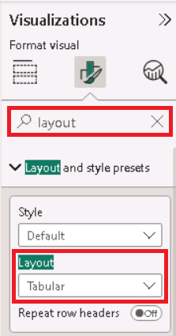
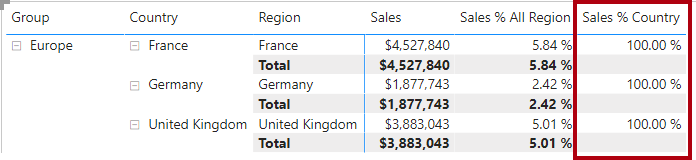

---
lab:
  course: PL-300
  title: 在 Power BI Desktop 中建立進階 DAX 計算
  module: Create Model Calculations using DAX in Power BI
---


# 在 Power BI Desktop 中建立進階 DAX 計算

## **實驗室案例**

在此實驗室中，您將使用涉及篩選內容操作的 DAX 運算式來建立量值。

在此實驗室中，您將了解如何：

- 使用 CALCULATE() 函式來操作篩選內容
- 使用時間智慧函式

**此實驗室大約需要45分鐘的時間。**

## **使用篩選內容**

*重要事項：如果您繼續執行先前的實驗室（且您已成功完成該實驗室），請勿完成這項工作;相反地，請從下一個工作繼續。*

1. 開啟 Power BI Desktop。

    

1. 若要開啟入門 Power BI Desktop 檔案，請選取 **[開啟>瀏覽此裝置**。

1. 在 [ **開啟]** 視窗中，流覽至 **D：\Allfiles\Labs\05-create-dax-calculations-in-power-bi-desktop-advanced\Starter**  資料夾，然後開啟 **[銷售分析** ] 檔案。

   *注意：此時，如果您尚未登入，Power BI 會要求您登入。您可以登入或選取 [ **取消** ]，然後繼續實驗室。*

1. 關閉任何可能開啟的資訊視窗。

1. 請注意功能區下方的警告訊息。 

    *此訊息會提醒您查詢尚未套用為模型數據表載入的事實。您稍後會在此實驗室中套用查詢。*
    
    *若要關閉警告訊息，請在警告訊息右側選取 **[X**]。*

1. 若要建立檔案的複本，請移至 [檔案] > [ **另存新** 檔]，然後儲存至 **D：\Allfiles\MySolution** 資料夾。

1. 如果系統提示您套用變更，請選取 [稍後套用]****。

## **建立矩陣視覺效果**

在這項工作中，您將建立矩陣視覺效果，以支持測試新的量值。

1. 在 Power BI Desktop 的 [報表] 檢視中，建立新的報表頁面。

1. 在 [第 3 頁]**** 上，新增矩陣視覺效果。

    

1. 調整矩陣視覺效果的大小，以填滿整個頁面。

1. 若要設定矩陣視覺效果字段，請從 [ **資料** ] 窗格拖曳 **[區域 \| 區域** ] 階層，然後將它放在視覺效果內。
    
    *實驗室會使用速記表示法來參考欄位或階層。看起來會像這樣：**區域\|區域**。在此範例中，**Region 是數據表名稱，而 **Regions**** 是階層名稱。*

1. 同時請新增 [Sales \| Sales]**** 欄位。

1. 若要展開整個階層，請在矩陣視覺效果的右上方，選取分叉雙箭號圖示兩次。
    
    *您應該記得，[Regions]**** 階層具有 [Group]****、[Country]**** 和 [Region]**** 層級。*

    

1. 若要將視覺效果格式化，請在 [視覺效果]**** 窗格中選取 [格式]**** 窗格。

    

1. 在 [搜尋]**** 方塊中，輸入**分層式**。

1. 將 [分層式配置]**** 屬性設定為 [關閉]****。

    

1. 確認矩陣視覺效果有四個資料行標頭。

    

    *在 Adventure Works 中，銷售區域會組織成群組、國家/地區和區域。除了 美國 以外的所有國家/地區，只有一個區域，以國家/地區命名。由於 美國 是如此龐大的銷售領域，它分為五個銷售區域。*

    *您將在此練習中建立數個量值，然後將量值新增至矩陣視覺效果以進行測試。*

## **操作篩選內容**

在這項工作中，您將使用 CALCULATE（） 函式來操作篩選內容，使用 DAX 運算式建立數個量值。

1. 根據下列運算式，將量值新增至 [Sales]**** 資料表：
    
     *為了方便起見，此實驗室中的所有DAX定義都可以從 **D：\Allfiles\Labs\05-create-dax-calculations-in-power-bi-desktop-advanced\Assets\Snippets.txt** 檔案複製。*


    **DAX**


    ```
    Sales All Region =

    CALCULATE(SUM(Sales[Sales]), REMOVEFILTERS(Region))
    ```


    *CALCULATE（） 函式是一個功能強大的函式，可用來操作篩選內容。第一個自變數會採用表達式或量值（量值只是具名運算式）。後續自變數允許修改篩選內容。*

    *REMOVEFILTERS（） 函式會移除使用中的篩選。它不可以接受任何自變數，或數據表、數據行或多個數據行作為其自變數。*

    *在此公式中，量值會在修改過的篩選內容中評估 [Sales]**** 資料行的總和，該內容會移除套用至 [Region]**** 資料表之資料行的任何篩選。*

1. 將 [Sales All Region]**** 量值新增至矩陣視覺效果。

    

1. 請注意，[所有區域的銷售]**** 量值會計算每個區域、國家/地區 (小計) 和群組 (小計) 的所有地區銷售額的總計。

    *新的量值尚未提供有用的結果。當群組、國家/地區的銷售除以此值時，其會產生稱為「總計百分比」的實用比率。*

1. 在 [ **數據** ] 窗格中，確定 **已選取 [銷售所有區域** ] 量值（選取時，它會有深灰色背景），然後在公式列中，以下列公式取代量值名稱和公式：

    *提示：若要取代現有的公式，請先複製代碼段。然後，在公式列內選取 ，然後按 **Ctrl+A** 以選取所有文字。然後，按 **Ctrl+V** 貼上代碼段以覆寫選取的文字。 **然後按 Enter** 鍵。*


    **DAX**


    ```
    Sales % All Region =  
    DIVIDE(  
     SUM(Sales[Sales]),  
     CALCULATE(  
     SUM(Sales[Sales]),  
     REMOVEFILTERS(Region)  
     )  
    )
    ```

    *量值已重新命名，以正確反映更新的公式。DIVIDE（） 函式會將 **Sales 量值（未由篩選內容修改）除以**已修改內容中的 Sales**** 量值，這會移除套用至 **Region** 數據表的任何篩選。*

1. 在矩陣視覺效果中，請注意量值已重新命名，而且每個群組、國家/地區現在都會顯示不同的值。

1. 將 [所有區域的銷售百分比]**** 量值格式化為具有兩個小數位數的百分比。

1. 在矩陣視覺效果中，檢閱 [所有區域的銷售百分比]**** 量值。

    

1. 根據下列運算式將另一個量值新增至 [銷售]**** 資料表，並格式化為百分比：


    **DAX**

    ```
    Sales % Country =  
    DIVIDE(  
     SUM(Sales[Sales]),  
     CALCULATE(  
     SUM(Sales[Sales]),  
     REMOVEFILTERS(Region[Region])  
     )  
    )
    ```

1. 請注意，[國家/地區的銷售百分比]**** 量值公式與 [所有區域的銷售百分比]**** 量值公式略有不同。

    *差異在於分母藉由移除 Region 數據表之 **Region** **數據行上的篩選，而非 Region**** 數據表的所有**數據行，來修改篩選內容。這表示會保留套用至群組或國家/地區數據行的任何篩選。其會達成以國家/地區百分比表示銷售的結果。*

1. 將 [國家/地區的銷售百分比]**** 量值新增至矩陣視覺效果。

1. 請注意，只有 美國 的區域會產生不是 100% 的值。
    
    *您可能會記得，只有 美國 有多個區域。所有其他國家/地區都組成單一區域，這解釋了為何全部為100%。*

    

    

1. 若要在視覺效果中改善此量值的可讀性，請使用此改良的公式來覆寫 [國家/地區的銷售百分比]**** 量值。


    **DAX**


    ```
    Sales % Country =  
    IF(  
     ISINSCOPE(Region[Region]),  
     DIVIDE(  
     SUM(Sales[Sales]),  
     CALCULATE(  
     SUM(Sales[Sales]),  
     REMOVEFILTERS(Region[Region])  
     )  
     )  
    )
    ```


    *IF（） 函式會使用 ISINSCOPE（） 函式來測試區域資料行是否為層級階層中的層級。若為 true，則會評估 DIVIDE（） 函式。若為 false，則會傳回空白值，因為區域數據行不在範圍內。*

1. 請注意，就目前而言，只有區域位於範圍內時，[國家/地區的銷售百分比]**** 量值才會傳回值。

    

1. 根據下列運算式將另一個量值新增至 [銷售]**** 資料表，並格式化為百分比：


    **DAX**


    ```
    Sales % Group =  
    DIVIDE(  
     SUM(Sales[Sales]),  
     CALCULATE(  
     SUM(Sales[Sales]),  
     REMOVEFILTERS(  
     Region[Region],  
     Region[Country]  
     )  
     )  
    )
    ```


    *若要以群組的百分比達成銷售額，可以套用兩個篩選，以有效地移除兩個數據行上的篩選。*

1. 將 [群組的銷售百分比]**** 量值新增至矩陣視覺效果。

1. 若要在視覺效果中改善此量值的可讀性，請使用此改良的公式來覆寫 [群組的銷售百分比]**** 量值。


    **DAX**


    ```
    Sales % Group =  
    IF(  
     ISINSCOPE(Region[Region])  
     || ISINSCOPE(Region[Country]),  
     DIVIDE(  
     SUM(Sales[Sales]),  
     CALCULATE(  
     SUM(Sales[Sales]),  
     REMOVEFILTERS(  
     Region[Region],  
     Region[Country]  
     )  
     )  
     )  
    )
    ```


1. 請注意，就目前而言，只有區域或國家/地區位於範圍內時，[群組的銷售百分比]**** 量值才會傳回值。

1. 在 [模型] 檢視中，將三個新的量值放入名為 **Ratios** 的顯示資料夾中。

    

1. 儲存 Power BI Desktop 檔案。

*新增至 Sales** 資料表的**量值已修改篩選內容，以達成階層式導覽。請注意，若要達到小計計算的模式，需要從篩選內容中移除某些數據行，而且必須移除所有數據行總計。*

## **使用時間智慧**

在此練習中，您將建立銷售年度（YTD）量值和銷售額逐年 （YoY） 成長量值。

## **建立YTD量值**

在這項工作中，您將建立銷售 YTD 量值。

1. 在 [報表] 檢視的 [第 2 頁]**** 上，請注意矩陣視覺效果顯示了在資料列上對年度和月份進行分組的各種量值。

2. 根據下列運算式將量值新增至 [銷售]**** 資料表，並格式化為零個小數位數：


    **DAX**


    ```
    Sales YTD =  
    TOTALYTD(SUM(Sales[Sales]), 'Date'[Date], "6-30")
    ```


    *TOTALYTD（） 函式會評估特定日期數據行的 **Sales** 數據行總和，在此案例中為表達式。日期數據行必須屬於標示為日期數據表的日期數據表，如在 **Power BI Desktop** 實驗室中建立DAX計算所完成。*

    *函式也可以採用第三個選擇性自變數，代表一年的最後一個日期。沒有這個日期表示 12 月 31 日是年份的最後一個日期。對於 Adventure Works，6 月在他們一年中的最後一個月，因此會使用 “6-30”。*

3. 將 [銷售]**** 欄位和 [銷售 YTD]**** 量值新增至矩陣視覺效果。

4. 請注意年度內銷售值的累積。

    

    *TOTALYTD（） 函式會執行篩選操作，特別是時間篩選操作。例如，若要計算 2017 年 9 月的 YTD 銷售額（會計年度的第三個月），Date** 數據表上**的所有篩選都會移除，並取代為從年初開始的新日期篩選（2017 年 7 月 1 日），並延伸至內容日期期間的最後一個日期（9 月 30 日， 2017).*

    *DAX 提供許多 Time Intelligence 函式，以支援常見的時間篩選操作。*

## **建立 YoY 成長量值**

在這項工作中，您將建立銷售 YoY 成長量值。

1. 根據下列表達式，將另一個量值新增至 **Sales** 數據表：


    **DAX**


    ```
    Sales YoY Growth =  
    VAR SalesPriorYear =  
     CALCULATE(  
     SUM(Sales[Sales]),  
     PARALLELPERIOD(  
     'Date'[Date],  
     -12,  
     MONTH  
     )  
     )  
    RETURN  
     SalesPriorYear
    ```


    ***Sales YoY Growth** 量值會使用變數。變數可協助您簡化公式，並在公式內多次使用邏輯時更有效率。*

    *變數會以唯一的名稱宣告，然後必須在 RETURN** 關鍵詞之後**輸出量值表達式。與其他編碼語言變數不同的是，DAX 變數只能在單一公式中使用。*

    ***SalesPriorYear** 變數會指派運算式，以計算已修改內容中 Sales** 數據行的總**和，該運算式會使用 PARALLELPERIOD（） 函式，從篩選內容中的每個日期移回 12 個月。*

1. 將 [銷售 YoY 成長]**** 量值新增至矩陣視覺效果。

1. 請注意，新的量值針對前 12 個月會傳回空值 (因為在會計年度 2017 之前沒有任何銷售記錄)。

1. 請注意，[2018 Jul]**** 的 [Sales YoY Growth]**** 值為 [2017 Jul]**** 的 [Sales]**** 值。

    

    *既然公式的「困難部分」已經過測試，您可以使用計算成長結果的最終公式來覆寫量值。*

1. 若要完成量值，請使用此公式覆寫 [銷售 YoY 成長]**** 量值，並將其格式化為兩個小數位數的百分比：


    **DAX**


    ```
    Sales YoY Growth =  
    VAR SalesPriorYear =  
     CALCULATE(  
     SUM(Sales[Sales]),  
     PARALLELPERIOD(  
     'Date'[Date],  
     -12,  
     MONTH  
     )  
     )  
    RETURN  
     DIVIDE(  
     (SUM(Sales[Sales]) - SalesPriorYear),  
     SalesPriorYear  
     )
    ```


1. 在公式的 **RETURN** 子句中，請注意變數會被參考兩次。

1. 確認 **2018 年 7 月**的 YoY 成長為 **392.83%**。

    

    *YoY 增長量值指出，上一年同期銷售額增長近 400% （或 4 倍）。*

1. 在 [模型] 檢視中，將兩個新的量值放入名為 **Time Intelligence** 的顯示資料夾中。

    

### **完成時間**

在此工作中，您將完成實驗室。

1. 若要清除準備用於報表開發的方案，請在左下角以滑鼠右鍵按一下 [第 2 頁]**** 索引標籤，然後選取 [刪除頁面]****。 當系統提示您刪除頁面時，請選取 [ **刪除**]。

1. 請一併刪除 [第 3 頁]****。

1. 在剩餘的頁面中，若要清除頁面，請選取資料表視覺效果，然後按下 **Delete** 鍵。

1. 儲存 Power BI Desktop 檔案。

1. 若您想要開始下一個實驗室，請將 Power BI Desktop 保持開啟狀態。

*您將根據Power BI Desktop** 實驗室中**設計報表中的數據模型來建立報表。*
