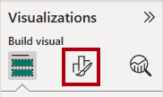
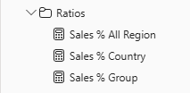

---
lab:
  title: 修改 Power BI 中的 DAX 篩選內容
  module: Modify DAX filter context in Power BI
---

# 修改 Power BI 中的 DAX 篩選內容

## 實驗室案例

在此實驗室中，您將使用涉及篩選內容操作的 DAX 運算式建立量值。

您將學習如何：

 - 使用函數`CALCULATE` 來操作過濾器上下文。

**此實驗室大約需要 30 分鐘。**

## 開始使用

若要完成此練習，請先開啟網頁瀏覽器，然後輸入下列 URL 以下載 zip 檔案：

`https://github.com/MicrosoftLearning/PL-300-Microsoft-Power-BI-Data-Analyst/raw/Main/Allfiles/Labs/05-modify-dax-filter-context/05-modify-dax-filter-context.zip`

將檔案解壓縮至**C：\Users\Student\Downloads\05-modify-dax-filter-context** 資料夾。

開啟**05-Starter-Sales Analysis.pbix** 檔案。

> _**注意**：載入檔案時，您可能會看到登入對話方塊。選取 **[取消]** 以關閉登入對話方塊。關閉任何其他資訊視窗。如果系統提示套用變更，請選取 **[稍後套用]。**_

## 建立矩陣視覺效果

在此工作中，您將建立矩陣視覺效果，以支援測試新量值。

1. 在 Power BI Desktop 中，建立新的報表頁面。

1. 在 [第 3 頁]**** 上，新增矩陣視覺效果。

    

1. 調整矩陣視覺效果的大小，以填滿整個頁面。

1. 若要設定矩陣視覺欄位，請從 [資料 **]** 窗格中，將`Region | Regions`階層拖放到視覺效果內。

    > 實驗室使用速記標記法來參考欄位或階層。 顯示如下：`Region | Regions`。 在此範例中，`Region` 是資料表名稱，是`Regions` 階層name._

1. 將欄位新增至`Sales | Sales` [值]**** 井。

1. 若要展開整個階層，請在矩陣視覺效果的右上方，選取分叉雙箭號圖示兩次。

    

1. 若要將視覺效果格式化，請在 [視覺效果]**** 窗格中選取 [格式]**** 窗格。

    

1. 在 [搜尋]**方塊中，輸入 _[版面配置_]。**

1. 將 [版面配置]**** 屬性設定為 _[表格式_]。

    

1. 確認矩陣視覺效果現在有 4 個資料行標頭。

    

    > _在 Adventure Works，銷售區域會組織成群組、國家和地區。除美國外，所有國家/地區都只有一個地區，該區域以該國家/地區命名。由於美國是一個如此大的銷售區域，因此分為五個銷售區域。_

您將在本練習中建立各種量值，然後將它們新增至矩陣視覺效果來測試它們。

## 操作篩選內容

在此工作中，您將使用 DAX 運算式建立數個量值，這些運算式會使用函`CALCULATE` 式來操作篩選內容。

> _此`CALCULATE` 函式是可用來操作篩選環境定義的強大函式。第一個引數採用運算式或量值 （量值只是具名運算式）。後續引數允許修改過濾器內容。_

1. 根據下列運算式，將量值`Sales` 新增至資料表：

    > _**附註**： 為了您的方便，本實驗室中的所有 DAX 定義都可以從 C：\Users\Student\Downloads\05-modify-dax-filter-context\Snippets.txt** 檔案複製**。_

    ```dax
    Sales All Region =
    CALCULATE(
        SUM(Sales[Sales]),
        REMOVEFILTERS(Region)
    )
    ```

    > _此功能`REMOVEFILTERS` 會移除作用中過濾器。它可以不採用任何引數，或取一個表格、一個資料行或多個資料行作為其引數。_
    >
    > _在此公式中，量值會評估已修改篩選內容中資料`Sales` 行的總和，這會移除套用至資料表資料行`Region` 的任何篩選條件。_

1. 將量值`Sales All Region` 新增至矩陣視覺效果。

    

1. 請注意，量值會計算每個區域、國家/地區 （小計） 和群組 （小計） 的所有區域銷售總計。

    > _新措施尚未取得有用的結果。當群組、國家或地區的銷售額除以此值時，會產生稱為「總計百分比」的有用比率。_

1. 在 [資料 **]** 窗格中，確定`Sales All Region`已選取量值 （選取時，它會具有深灰色背景），然後在資料編輯列中，將量值名稱和公式取代為下列公式：

    > _提示： 若要取代現有公式，請先複製程式碼片段。然後，在公式欄內選擇並按**Ctrl+A** 選擇所有文本。然後，按**Ctrl+V** 貼上片段以覆蓋所選文字。然後按**Enter 鍵**。_

    ```dax
    Sales % All Region =
    DIVIDE(
        SUM(Sales[Sales]),
        CALCULATE(
            SUM(Sales[Sales]),
            REMOVEFILTERS(Region)
        )
    )
    ```

    > _該措施已重新命名，以準確反映更新的公式。此`DIVIDE` 函數會將資料行的`Sales` 總和 （未由篩選內容修改） 除以已修改內容中的資料`Sales` 行總和，這會移除套用至資料表的任何`Region` 篩選條件。_

1. 在矩陣視覺效果中，請注意量值已重新命名，而且每個群組、國家和地區現在都會顯示不同的值。

1. 將量值`Sales % All Region` 格式化為具有兩位小數位數的百分比。

1. 在矩陣視覺效果中，檢閱`Sales % All Region` 量值。

    

1. 根據下列運算式，將另一個量值`Sales` 新增至表格，並格式化為百分比：

    ```dax
    Sales % Country =
    DIVIDE(
        SUM(Sales[Sales]),
        CALCULATE(
            SUM(Sales[Sales]),
            REMOVEFILTERS(Region[Region])
        )
    )
    ```

1. 請注意，`Sales % Country` 量值公式與量值公式略`Sales % All Region` 有不同。

    > _差異在於分母會移除資料表資料行`Region`上的`Region`篩選器，而不是資料表的所有`Region`資料行，以修改篩選器內容。這表示會保留套用至群組或國家/地區資料行的任何篩選器。它將獲得代表銷售額佔國家/地區百分比的結果。_

1. 將量值`Sales % Country` 新增至矩陣視覺效果。

1. 請注意，只有美國的地區會產生不是 100% 的值。

    

    > _您可能還記得，只有美國有多個地區。所有其他國家/地區都由一個區域組成，這解釋了為什麼它們都是 100%。_

1. 若要改善此量值在視覺中的可讀性，請使用下列改善的公式覆寫量`Sales % Country` 值。

    ```dax
    Sales % Country =
    IF(
        ISINSCOPE(Region[Region]),
        DIVIDE(
            SUM(Sales[Sales]),
            CALCULATE(
                SUM(Sales[Sales]),
                REMOVEFILTERS(Region[Region])
            )
        )
    )
    ```

    > _函`IF` 式會使用函`ISINSCOPE` 式來測試區域資料行是否為層級階層中的層級。當 true 時，`DIVIDE` 會評估函數。當 false 時，`BLANK` 會傳回，因為區域資料行不在範圍內。_

1. 請注意，量`Sales % Country` 值現在只會在區域在範圍內時傳回值。

    

1. 根據下列運算式，將另一個量值`Sales` 新增至表格，並格式化為百分比：

    ```dax
    Sales % Group =
    DIVIDE(
        SUM(Sales[Sales]),
        CALCULATE(
            SUM(Sales[Sales]),
            REMOVEFILTERS(
                Region[Region],
                Region[Country]
            )
        )
    )
    ```

    > _若要將銷售額視為群組百分比，可以套用兩個篩選器來有效移除兩欄上的篩選器。_

1. 將量值`Sales % Group` 新增至矩陣視覺效果。

1. 若要改善此量值在視覺中的可讀性，請使用下列公式覆寫量`Sales % Group` 值。

    ```dax
    Sales % Group =
    IF(
        ISINSCOPE(Region[Region])
            || ISINSCOPE(Region[Country]),
        DIVIDE(
            SUM(Sales[Sales]),
            CALCULATE(
                SUM(Sales[Sales]),
                REMOVEFILTERS(
                    Region[Region],
                    Region[Country]
                )
            )
        )
    )
    ```

1. 請注意，量`Sales % Group` 值現在只會在區域或國家/地區在範圍內時傳回值。

1. 在「模型」檢視**中**，將三個新量值放入名為「比率」_的_顯示資料夾中。

    

1. 儲存 Power BI Desktop 檔案。

> _新增至表格的`Sales` 量值已修改篩選內容，以達到階層式導覽。請注意，實現小計計算的模式需要從篩選環境定義中刪除一些數據行，並且要獲得總計，必須刪除所有數據行。_

## 實驗室完成

您可以選擇儲存 Power BI 報表，但此實驗室不需要儲存。 在下一個練習中，您將使用預先製作的入門檔案。

1. 導航至**左上角的“文件”** 菜單，然後選擇 **“另存為”**。 
1. 選取 [瀏覽此裝置]****。
1. 選取您要儲存檔案的資料夾，並為其指定描述性名稱。 
1. 選取 [儲存]**** 按鈕，將報表儲存為 .pbix 檔案。 
1. 如果出現對話方塊，提示您套用擱置的查詢變更，請選取 [**套用**]。
1. 關閉 Power BI Desktop。