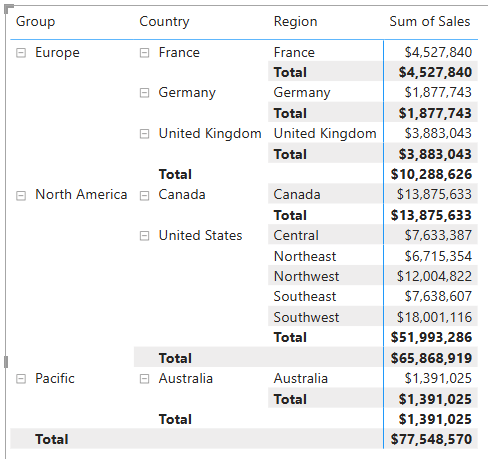

---
lab:
  title: 在 Power BI 中修改 DAX 篩選內容
  module: Modify DAX filter context in Power BI
---

# 在 Power BI 中修改 DAX 篩選內容

## 實驗室案例

在此實驗室中，您將使用包含篩選內容作的 DAX 運算式來建立量值。

您將學習如何：

 - 使用函 `CALCULATE` 式來作篩選內容。

**此實驗室大約需要30分鐘的時間。**

## 開始使用

若要完成此練習，請先開啟網頁瀏覽器，然後輸入下列 URL 以下載 zip 檔案：

`https://github.com/MicrosoftLearning/PL-300-Microsoft-Power-BI-Data-Analyst/raw/Main/Allfiles/Labs/05-modify-dax-filter-context/05-modify-dax-filter-context.zip`

將檔案解壓縮到 **C：\Users\Student\Downloads\05-modify-dax-filter-context** 資料夾。

**開啟 05-Starter-Sales Analysis.pbix** 檔案。

> _**注意**：您可以選取 **[取消**] 來關閉登入。關閉任何其他信息視窗。如果系統提示您套用變更，請選取 [ **稍後**套用]。_

## 建立矩陣視覺效果

在這項工作中，您將建立矩陣視覺效果，以支持測試新的量值。

1. 在 Power BI Desktop 中，建立新的報表頁面。

1. 在 [第 3 頁]**** 上，新增矩陣視覺效果。

    

1. 調整矩陣視覺效果的大小，以填滿整個頁面。

1. 若要設定矩陣視覺效果字段，請從 [ **數據** ] 窗格拖曳 `Region | Regions` 階層，然後將它放在視覺效果內。

    > 實驗室使用速記標記法來參考欄位或階層。 顯示如下：`Region | Regions`。 在此範例中， `Region` 是數據表名稱，而 `Regions` 是階層name._

1. 將 `Sales | Sales` 欄位新增至 **[值** ]。

1. 若要展開整個階層，請在矩陣視覺效果的右上方，選取分叉雙箭號圖示兩次。

    

1. 若要將視覺效果格式化，請在 [視覺效果]**** 窗格中選取 [格式]**** 窗格。

    

1. 在 [ **搜尋]** 方塊中，輸入 _[版面配置_]。

1. 將 **Layout 屬性設定為_表格式_**。

    

1. 確認矩陣視覺效果現在有 4 個數據行標頭。

    

    > _在 Adventure Works 中，銷售區域會組織成群組、國家/地區和區域。除了 美國 以外的所有國家/地區，只有一個區域，以國家/地區命名。由於 美國 如此龐大的銷售領域，它分為五個銷售區域。_

您將在此練習中建立各種量值，然後將量值新增至矩陣視覺效果以進行測試。

## 操作篩選內容

在這項工作中，您將使用DAX表達式建立數個量值，以使用函 `CALCULATE` 式來作篩選內容。

> _函 `CALCULATE` 式是一個功能強大的函式，可用來作篩選內容。第一個自變數會採用表達式或量值（量值只是具名運算式）。後續自變數允許修改篩選內容。_

1. 根據下列表達式，將量值新增至 `Sales` 數據表：

    > _**注意**：為了方便起見，此實驗室中的所有 DAX 定義都可以從 **C：\Users\Student\Downloads\05-modify-dax-filter-context\Snippets.txt** 檔案複製。_

    ```dax
    Sales All Region =
    CALCULATE(
        SUM(Sales[Sales]),
        REMOVEFILTERS(Region)
    )
    ```

    > _函式 `REMOVEFILTERS` 會移除使用中的篩選。它不可以接受任何自變數，或數據表、數據行或多個數據行作為其自變數。_
    >
    > _在此公式中，量值會評估已修改篩選內容中的數據行總和 `Sales` ，這會移除套用至 `Region` 數據表數據行的任何篩選。_

1. 將 `Sales All Region` 量值新增至矩陣視覺效果。

    

1. 請注意，量值會計算每個區域、國家/地區（小計）和群組（小計）的所有區域銷售總數。

    > _新的量值尚未提供有用的結果。當群組、國家/地區的銷售除以此值時，其會產生稱為「總計百分比」的實用比率。_

1. 在 [ **數據** ] 窗格中，確定 `Sales All Region` 已選取量值（選取時，它會有深灰色背景），然後在公式列中，以下列公式取代量值名稱和公式：

    > _提示：若要取代現有的公式，請先複製代碼段。然後，在公式列內選取 ，然後按 **Ctrl+A** 以選取所有文字。然後，按 **Ctrl+V** 貼上代碼段以覆寫選取的文字。 **然後按 Enter** 鍵。_

    ```dax
    Sales % All Region =
    DIVIDE(
        SUM(Sales[Sales]),
        CALCULATE(
            SUM(Sales[Sales]),
            REMOVEFILTERS(Region)
        )
    )
    ```

    > _量值已重新命名，以正確反映更新的公式。函 `DIVIDE` 式會將數據行的總 `Sales` 和（未由篩選內容修改）除以修改內容中的數據行總和 `Sales` ，這會移除套用至 `Region` 數據表的任何篩選。_

1. 在矩陣視覺效果中，請注意量值已重新命名，而且每個群組、國家/地區現在都會顯示不同的值。

1. 將 `Sales % All Region` 量值格式化為具有兩個小數字數的百分比。

1. 在矩陣視覺效果中，檢閱 `Sales % All Region` 量值。

    

1. 根據下列表達式，將另一個量值新增至 `Sales` 數據表，並將格式設定為百分比：

    ```dax
    Sales % Country =
    DIVIDE(
        SUM(Sales[Sales]),
        CALCULATE(
            SUM(Sales[Sales]),
            REMOVEFILTERS(Region[Region])
        )
    )
    ```

1. 請注意， `Sales % Country` 量值公式與 `Sales % All Region` 量值公式稍有不同。

    > _差異在於分母藉由移除數據表數據行上的`Region``Region`篩選，而非數據表的所有`Region`數據行來修改篩選內容。這表示會保留套用至群組或國家/地區數據行的任何篩選。其會達成以國家/地區百分比表示銷售的結果。_

1. 將 `Sales % Country` 量值新增至矩陣視覺效果。

1. 請注意，只有 美國 的區域會產生不是 100% 的值。

    

    > _您可能會記得只有 美國 有多個區域。所有其他國家/地區都組成了單一區域，這解釋了為何全部為100%。_

1. 若要在視覺效果中改善此量值可讀性，請使用下列改善的公式覆 `Sales % Country` 寫量值。

    ```dax
    Sales % Country =
    IF(
        ISINSCOPE(Region[Region]),
        DIVIDE(
            SUM(Sales[Sales]),
            CALCULATE(
                SUM(Sales[Sales]),
                REMOVEFILTERS(Region[Region])
            )
        )
    )
    ```

    > _函式會`ISINSCOPE`使用函`IF`式來測試區域數據行是否為層級階層中的層級。若為 true，則會評估函`DIVIDE`式。如果為 false，`BLANK`則會傳回 ，因為區域數據行不在範圍中。_

1. 請注意， `Sales % Country` 量值現在只會在區域處於範圍內時傳回值。

    

1. 根據下列表達式，將另一個量值新增至 `Sales` 數據表，並將格式設定為百分比：

    ```dax
    Sales % Group =
    DIVIDE(
        SUM(Sales[Sales]),
        CALCULATE(
            SUM(Sales[Sales]),
            REMOVEFILTERS(
                Region[Region],
                Region[Country]
            )
        )
    )
    ```

    > _若要以群組的百分比達成銷售額，可以套用兩個篩選，以有效地移除兩個數據行上的篩選。_

1. 將 `Sales % Group` 量值新增至矩陣視覺效果。

1. 若要在視覺效果中改善此量值的可讀性，請使用下列公式覆 `Sales % Group` 寫量值。

    ```dax
    Sales % Group =
    IF(
        ISINSCOPE(Region[Region])
            || ISINSCOPE(Region[Country]),
        DIVIDE(
            SUM(Sales[Sales]),
            CALCULATE(
                SUM(Sales[Sales]),
                REMOVEFILTERS(
                    Region[Region],
                    Region[Country]
                )
            )
        )
    )
    ```

1. 請注意， `Sales % Group` 量值現在只會在某個地區或國家/地區處於範圍內時傳回值。

1. 在 [模型] 檢視中，將三個新的量值放入名為 _Ratios_ 的顯示資料夾中。

    

1. 儲存 Power BI Desktop 檔案。

> _新增至數據表的 `Sales` 量值已修改篩選內容，以達到階層式導覽。請注意，若要達到小計計算的模式，需要從篩選內容中移除某些數據行，而且必須移除所有數據行總計。_

## 實驗室完成
