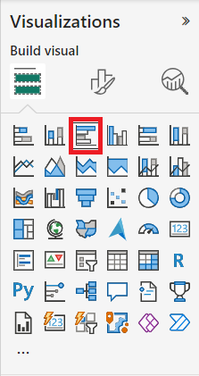

---
lab:
  title: 在 Power BI Desktop 中建立視覺計算
  module: Create Visual Calculations in Power BI Desktop
---

# 在 Power BI Desktop 中建立視覺計算

## **實驗室案例**

在此實驗室中，您將使用數據分析表達式 （DAX） 建立視覺計算。 

在此實驗室中，您將了解如何：

- 建立和編輯視覺計算
- 使用 PREVIOUS（）、RUNNINGSUM（） 和 MOVINGAVERAGE（） 函式來建立每個會計年度之間的比較計量
- 建立比較計量時，請使用選擇性的 Axis 參數。
- 使用選擇性 Reset 參數來自定義多層次座標軸中的累計計算。

**此實驗室大約需要30分鐘的時間。**

## 開始使用

若要完成此練習，請先開啟網頁瀏覽器，然後輸入下列 URL 以下載 zip 資料夾：

`https://github.com/MicrosoftLearning/PL-300-Microsoft-Power-BI-Data-Analyst/raw/Main/Allfiles/Labs/05b-create-visual-calculations-in-power-bi-desktop/05b-visual-calculations.zip`

將資料夾解壓縮到 **C：\Users\Student\Downloads\05b-visual-calculations** 資料夾。

**開啟 05b-Starter-Sales Analysis.pbix** 檔案。

> ***注意**：您可以選取 **[取消**] 來關閉登入。 關閉任何其他信息視窗。 如果系統提示您套用變更，請選取 **[稍後**套用]。

## 建立條形圖視覺效果

在這項工作中，您將建立條形圖，其中顯示銷售金額、產品總成本，以及依會計年度的利潤，並將比較計量當做工具提示。

1. 在 [ **視覺效果]** 窗格中，選取叢集條形圖視覺效果類型。

   

1. 在 [**數據] 窗格中，從 [日期]** 數據表內部 **，將 **[年**]** 字段拖曳到 **Y 軸**井/區域。

1. 將 **[銷售] 和 **[成本]** 字段從 **Sales**** 數據表拖曳到 **X 軸**井/區域。

    > 請注意，當您將 Sales 和 Cost 新增至視覺效果時，會自動計算每個欄位的總和。

1. 使用三點功能表，依年份**遞增排序產生的條形圖**，然後選取 [年份 **]，**然後選取 **[排序遞增**]：

   

    > 您現在有條形圖，顯示依年排序的銷售額和成本總和。

### 新增計算

1. 選取條形圖後，選取功能區中的 [ **新增視覺效果計算** ]：

   

1. 視覺效果計算編輯視窗隨即開啟。 在可視化矩陣上方的公式列中，輸入下列表達式，然後輸入 Enter 來認可計算：

    ```DAX
   Profit = [Sum of Sales] – [Sum of Cost]
    ```

1. 確認您現在會在畫面底部的視覺矩陣上看到 Profit 資料行：

   

1. 展開 [新增視覺效果計算 **] 底下的**功能表，然後從範本選項中選取 **[與先前**的比較]：

    > **與上** 一個比較值與前一個值，因此我們看到 [收益] 與去年的上一個值比較。

   

1. 在公式列中，將佔位符取代 `[Field]` 為 `[Profit]` 兩次，並認可計算。

1. 從範本功能表中選取 [ **執行總和** ]，並將佔位元元取代 `[Field]` 為 `[Profit]` ，並認可計算。

    > **執行總和** 會計算值的總和，並將目前的值新增至上述值，因此我們看到目前和前幾年的總和。

1. 從範本功能表中選取 [**移動平均**]，並將佔位元取代為 ，並將`WindowSize`佔位元`[Profit]`取代`[Field]`為 2。 您現在應該已設定下列專案：

    > **移動平均值** 會計算指定視窗中一組值的平均值，方法是將值的總和除以視窗的大小。 藉由將視窗大小設定為 2，我們會計算兩個連續值的平均值。 在此範例中，這些值是年度收益，因此我們看到 FY2019 的移動平均是 FY2018 和 FY2019 的利潤平均值。

   

1. 在 **X 軸** 井/區域底下，選取下列欄位的可見性圖示，以從視覺效果中隱藏它們：

    - 銷售的總和
    - 成本的總和
    - 收益

   

    > 請注意，您隱藏的欄位和計算現在不再顯示在視覺效果上。

1. 在 [**視覺效果]** 窗格中，將 [執行總和 **] 和 **[移動平均**] 拖曳**至 **[工具提示**] 區/區域。  

1. 確認視覺效果現在符合目標。 結束視覺效果計算編輯畫面到報表：

   

    > 您現在有一個條形圖，其中包含下列值：銷售總和、成本總和、收益和收益*與先前*的條形圖，以及利潤執行總*和和和收益*移動平均*的工具提示*。

## 建立矩陣視覺效果

在這項工作中，您將建立矩陣視覺效果，將每個類別的銷售量與下列每一年的第一個會計年度進行比較。

1. 在 **[報表] 檢視中**，建立新的報表頁面。

1. 在 **第 2** 頁，新增矩陣視覺效果。

1. 將下列欄位新增至視覺效果區域：

    - 數據列： **產品 \| 類別**
    - 數據行： **日期 \| 年份**
    - 值：**銷售 \| 銷售**

    > *實驗室會使用速記表示法來參考欄位。看起來會像這樣：**日期\|年**。在此範例中，**Date** 是數據表名稱，Year **** 是功能變數名稱。*

### 新增計算

1. 選取矩陣后，選取功能區中的 [ **新增視覺計算** ]。

1. 在視覺效果計算編輯視窗中，輸入並儲存下列計算：

    ```DAX
   Versus first = [Sum of Sales] - FIRST([Sum of Sales])
    ```

    > 請注意矩陣如何顯示每個類別與第一個類別的銷售金額差異。

1. 將 Axis 參數的 ROWS 值新增至 FIRST，選取 [**值 **] 欄位 [與第一個****] 區域中的 [比較]，然後更新計算：

    ```DAX
   Versus first = [Sum of Sales] - FIRST([Sum of Sales], ROWS)
    ```

    > 請注意，ROWS 如何變更為 Axis 參數的預設值。

1. 將 ROWS 取代為 COLUMNS，並觀察計算現在會比較每個類別的銷售量與第一個會計年度：

   

    > 請注意 Total Sales** 的 **** Vss 第一個**數據行如何傳回零，而不是與第一個會計年度的差異。 **總銷售額** 與年度總和不同，因此，視為該層級的第一個數據行。

1. 結束視覺效果計算編輯畫面到報表。

## 建立折線圖視覺效果

在這項工作中，您將建立折線圖，以顯示銷售的執行總和。 此總和將會在每個會計年度的開頭重設。

1. 在 **[報表] 檢視中**，建立新的報表頁面。

1. 在 **第 3** 頁，新增折線圖視覺效果。

1. 將下列欄位新增至視覺效果區域：

    - X 軸： **日期 \| 年** 和 **日期 \| 季**
    - Y 軸： **銷售 \| 銷售**

### 新增執行中總和

1. 選取折線圖后，展開 [新增視覺效果計算] 下的**功能表，然後從範本選項中選取 [**執行總和**]。**

1. 將 `[Field]` 佔位元取代為 `[Sum of Sales]` ，並認可變更。 視覺效果看起來應該如下所示：

   

### 更新執行總和，以在每個新的會計年度重新啟動

1. 在視覺計算編輯視窗中，選取 [Y 軸 **] 底下的 **[**執行總和**] 欄位，並新增 HIGHESTPARENT reset 參數並認可變更，以更新此計算的運算式：

    ```DAX
   Running sum = RUNNINGSUM([Sum of Sales], HIGHESTPARENT)
    ```

確認每個新會計年度的執行中總和確實會重新啟動：

   

## 實驗室完成
