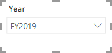
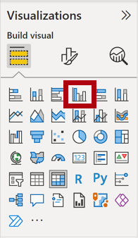
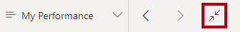

---
lab:
  title: 在 Power BI Desktop 中設計報表
  module: Create Reports in Power BI Desktop
---

# 在 Power BI Desktop 中設計報表

## 實驗室案例

在此實驗室中，您將會建立一份三頁報表。 接著，您會將它發佈至 Power BI，您將在其中開啟報表並與其互動。

在此實驗室中，您將了解如何：

- 設計報表
- 設定視覺效果欄位和格式屬性

**此實驗室大約需要45分鐘的時間。**

## 開始使用

若要完成此練習，請先開啟網頁瀏覽器，然後輸入下列 URL 以下載 zip 資料夾：

`https://github.com/MicrosoftLearning/PL-300-Microsoft-Power-BI-Data-Analyst/raw/Main/Allfiles/Labs/06-design-report-in-power-bi-desktop/06-design-report.zip`

將資料夾解壓縮到 **C：\Users\Student\Downloads\06-design-report** 資料夾。

**開啟 06-Starter-Sales Analysis.pbix** 檔案。

> ***注意**：您可以選取 **[取消**] 來關閉登入。 關閉任何其他信息視窗。 如果系統提示您套用變更，請選取 **[稍後**套用]。

## 設計第 1 頁

在此練習中，您將設計第一個報表頁面。 當您完成設計時，此頁面會如下所示：

1. 在 Power BI Desktop 中，若要重新命名頁面，請在左下方按鼠右鍵 **第 1** 頁，然後將 **頁面重新命名** 為 **[概觀**]。

    > *提示：您也可以按兩下頁面名稱來重新命名。*

1. 若要新增影像，請在 [插入]**** 功能區索引標籤上，從 [項目]**** 群組中選取 [影像]****。

    

1. 在 [ **開啟]** 視窗中，流覽至 **C：\Users\Student\Downloads\06-design-report** 資料夾。

1. 選取 **AdventureWorksLogo.jpg** 檔案，然後選取 [開啟]****。

1. 拖曳影像以將其放置在左上角，並拖曳輔助標記來調整其大小。

     

1. 若要新增交叉分析篩選器，請先按下報表頁面的空白區域來取消選取影像，然後在 [視覺效果] 窗格中選取**交叉分析篩選器****。**

     

1. 在 [**數據]** 窗格中，將 **[日期\|年份] 欄位（而非**階層的 [年****] 層級拖曳至 [視覺效果] 窗格中的交叉分析篩選器**欄位**。

    > *實驗室會使用速記表示法來參考欄位。看起來會像這樣：**日期\|年**。在此範例中，**Date** 是數據表名稱，Year **** 是功能變數名稱。*

1. 若要將交叉分析篩選器從清單轉換成下拉式清單，請流覽至 **[視覺效果] > [將視覺效果格式化] > [視覺效果] > [交叉分析篩選器設定] > [樣式**]，然後從下拉菜單中選取 **[下** 拉式清單]。

    

1. 調整交叉分析篩選器的大小與位置，使其位於影像下方，並且與影像同寬。

     

1. 在 [Year]**** 交叉分析篩選器中，開啟下拉式清單並選取 [FY2020]****，然後摺疊下拉式清單。
    > *報表頁面現在會依 **FY2020** 年進行篩選。*

     

1. 按一下報表頁面的空白區域，以取消選取交叉分析篩選器。

1. 根據 [Region \| Region]**** 欄位 (不是階層的 **Region** 層級) 建立第二個交叉分析篩選器。

1. 將交叉分析篩選器保留為清單，然後調整交叉分析篩選器的大小，並將其放置於 [Year]**** 交叉分析篩選器的下方。

     

1. 按一下報表頁面的空白區域，以取消選取交叉分析篩選器。

1. 若要將圖表新增至頁面，請在 [視覺效果]**** 窗格中，選取 [折線圖與堆疊直條圖]**** 視覺效果類型。

     

1. 調整視覺效果的大小和位置，使其位於標誌的右邊，並填滿報表頁面的寬度。

     

1. 將下列欄位拖曳至視覺效果：

     - **Date \| Month**
     - **Sales \| Sales**

1. 在視覺效果欄位窗格中（位於 [視覺效果 **] 窗格下方**），請注意，欄位會指派給 **X 軸和**數據行 y 軸**** 井/區域。

    > *藉由將欄位拖曳到視覺效果中，它們就會新增至默認井/區域。為了有效位數，您可以直接將字段拖曳到井/區域，就像您接下來所做的一樣。*

     

1. 從 [數據]** 窗格中，將 [**** 銷售\|獲利率]** 字段拖曳到 **[線條 y 軸**] 井/區域。

     

1. 請注意，視覺效果只有 11 個月。

    > *2020 年 6 月的當月，沒有任何銷售（尚未）。根據預設，視覺效果已消除空白銷售額的月份。您現在會將視覺效果設定為顯示所有月份。*

1. 在視覺效果欄位窗格的 **[X 軸** 井/區域] 中，針對 **[月份]** 欄位選取向下箭號，然後選取 **[顯示沒有數據**的專案]。

    > *請注意，2020 年 6 月**的月份**現在會出現。*

     

1. 按一下報表頁面的空白區域，以取消選取圖表。

1. 若要將圖表新增至頁面，請在 [ **視覺效果** ] 窗格中，選取 **[堆棧柱形圖]** 視覺效果類型。

     

1. 調整視覺效果的大小和位置，使其位於直條圖/折線圖底下，並填滿上面圖表的一半寬度。

     

1. 將下列欄位新增至視覺效果區域：

     - X 軸： **區域 \| 國家/地區**
     - Y 軸： **銷售 \| 銷售**
     - 圖例： **產品 \| 類別**

1. 按一下報表頁面的空白區域，以取消選取圖表。

1. 若要將圖表新增至頁面，請在 [視覺效果]**** 窗格中，按一下 [叢集長條圖]**** 視覺效果類型。

     

1. 調整視覺效果的大小和位置，使其填滿剩餘的報表頁面空間。

     

1. 將下列欄位新增至視覺效果區域：

     - Y 軸： **產品 \| 類別**
     - X 軸： **銷售 \| 數量**

1. 若要格式化視覺效果，請開啟 [格式]**** 窗格。

     

1. 展開 [列]**** 然後展開 [色彩]**** 群組，然後將 [預設色彩]**** 屬性設為適當的色彩 (來與直條/折線圖對比)。

1. 將 [資料標籤]**** 屬性設定為 [開啟]****。

     

1. 儲存 Power BI Desktop 檔案。

*第一頁的設計現在已完成。*

## 設計第 2 頁

在此練習中，您將設計第二個報表頁面。 當您完成設計時，此頁面會如下所示：

 

> ***重要**：實驗室中已提供詳細指示時，實驗室步驟將提供更簡潔的指示。 如果您需要詳細指示，您可以回到此實驗室中的其他工作。*

1. 若要建立新的頁面，請在左下方選取加號圖示，然後將新頁面重新命名為 **Profit**。

1. 根據 [Region \| Region]**** 欄位新增交叉分析篩選器。

1. 使用 [ **格式]** 窗格來啟用 [全選] 選項（在 **交叉分析篩選器設定>選取** 群組中）。

1. 調整交叉分析篩選器的大小和位置，使其位於報表頁面的左邊，大約佔頁面高度的一半。

     

1. 新增矩陣視覺效果，並調整其大小及位置，使其填滿報表頁面的剩餘空間

     

1. 將 [Date \| Fiscal]**** 階層新增至 [資料列]**** 矩陣的區域。

     

1. 將下列五個 [Sales]**** 資料表欄位新增至 [值]**** 區域：

     - **** 訂單 （來自 **Counts** 資料夾）
     - **銷售**
     - **成本**
     - **收益** （來自 **定價** 資料夾）
     - **獲利率** （來自 **定價** 資料夾）

     

1. 在 [篩選]**** 窗格中 (位於 [視覺效果]**** 窗格的左側)，注意到 [此頁面上的篩選]**** (您可能需要向下捲動)。

     

1. 從 [ **數據]** 窗格中，將 [ **產品 \| 類別]** 欄位拖曳到 **[在此頁面** 篩選] 區/區域。

    > *新增至 [篩選]** 窗格的**字段可以達到與交叉分析篩選器相同的結果。其中一個差異在於，它們不會佔用報表頁面上的空間。另一個差異是可以設定它們以達到更複雜的篩選需求。*

1. 在篩選器卡片內部，選取右上方的箭號以摺疊卡片。

1. 將下列每個 [Product]**** 資料表欄位直接新增至 [類別]**** 卡片底下的 [此頁面上的篩選]**** 區域，並將其全部摺疊：

     - **子類別**
     - **產品**
     - **色彩**

     

1. 儲存 Power BI Desktop 檔案。

*第二頁的設計現在已完成。*

## 設計第 3 頁

在此練習中，您將設計第三個報表頁面和最終報表頁面。 當您完成設計時，此頁面會如下所示：

 

1. 建立新的頁面，然後將其重新命名為「我的效能」****。

1. 若要模擬資料列層級安全性篩選的效能，請將 [Salesperson (Performance) \| Salesperson]**** 欄位拖曳至篩選窗格中的頁面層級篩選。

     ![篩選窗格中 [Salesperson] 欄位的影像。](Linked_image_Files/07-design-report-in-power-bi-desktop_image999.png)

1. 選取 [Michael Blythe]****。 [我的績效]**** 報表頁面上的資料現在會經過篩選，只顯示 Michael Blythe 的資料。

1. 根據 [Date \| Year]**** 欄位來新增下拉式交叉分析篩選器，然後調整其大小，並將其放置於頁面左上角。

     

1. 在交叉分析篩選器中，將頁面設定為依 **FY2019** 進行篩選。

     

1. 新增 [多列卡片]**** 視覺效果，然後調整大小並重新置放，使其位於交叉分析篩選器的右邊並填滿頁面的剩餘寬度。

     

     

1. 將下列 4 個欄位新增至視覺效果：

     - **Sales \| Sales**
     - **目標目標\|**
     - **目標變異數\|**
     - **\|目標差異邊界**

1. 格式化視覺效果：

     - 在 [圖說文字值]**** 群組中，將 [文字大小]**** 屬性提高至 [28pt]****

     - 在 [ **一般>效果>背景** ] 群組中，將 **[色彩** ] 設定為淺灰色 （例如 “White， 20% 深色） 以給予對比

         

1. 新增 [群組橫條圖]**** 視覺效果，然後加以調整大小並放置，使其位於多列卡片視覺效果底下，並填滿頁面的剩餘高度及多列卡片視覺效果的一半寬度。

     

     

1. 將下列欄位新增至視覺效果區域：

     - Y 軸： **日期 \| 月份**
     - X 軸：**銷售\|銷售**與**目標目標\|**

         

1. 若要建立視覺效果的複本，請按 **Ctrl + C**，然後按 **Ctrl + V**。

1. 將新的視覺效果放在原始視覺效果的右邊。

     

1. 若要修改視覺效果類型，請在 [視覺效果]**** 窗格中，選取 [叢集直條圖]****。

     > *現在可以看到兩種不同視覺效果類型所表示的相同數據。*

     

 *最終頁面的設計已完成。*

## 發佈和探索報表

在此練習中，您將將報表發佈至 Power BI 服務，並探索已發佈的報表行為。

> **注意**：即使您無法存取在線 Power BI 服務 直接執行工作，您仍可檢閱練習的其餘部分。

1. 選取 [概 **觀]** 頁面，然後儲存 Power BI Desktop 檔案。

1. 在 [首頁]**** 功能區索引標籤上，從 [共用]**** 群組內選取 [發佈]****。

    > *如果您尚未登入 Power BI Desktop，您必須登入才能發佈。*

     

1. 請注意，在 [發佈至 Power BI]**** 視窗中已選取 [我的工作區]****。

    > *我們不會詳細討論此實驗室中 Power BI 服務 內的不同專案。*

1. 若要發佈報表，請選取 [ **選取**]。 這可能需要一些時間。

1. 當發佈成功時，請選取 [確認]****。

1. 開啟 Microsoft Edge 瀏覽器，然後在 登入 `https://app.powerbi.com`。

1. 在 Microsoft Edge 瀏覽器視窗中，在 Power BI 服務中的 [導覽]**** 窗格 (位於左側，且可能已摺疊) 展開 [我的工作區]****。

    

1. 檢閱工作區的內容。

    - 工作區中可以有四種類型的專案，而我們討論 **報表** 和 **語意模型**。

    - 如果看不到語意模型，您可能需要重新整理Microsoft Edge 瀏覽器。

    - 當您發行Power BI Desktop 檔案時，數據模型會發佈為語意模型。

1. 若要探索報表，請選取 **[銷售分析** ] 報表。

1. 在左側的 [頁面]**** 窗格中，選取 [概觀]**** 頁面。

1. 在 [區域]**** 交叉分析篩選器中，按下 **Ctrl** 鍵，然後選取多個區域。

1. 在直條圖/折線圖中，選取任何月份的資料行來交叉篩選頁面。

1. 按下 Ctrl** 鍵時**，請選取另一個月。

     > *注意：根據預設，交叉篩選會篩選頁面上所有其他視覺效果。*

1. 請注意，長條圖會經過篩選和醒目提示，而較粗的長條代表篩選的月份。

1. 將游標暫留在橫條圖視覺效果上，然後在右上方將游標暫留在篩選器圖示上。

    > *篩選圖示可讓您瞭解套用至視覺效果的所有篩選，包括來自其他視覺效果的交叉分析篩選器和交叉篩選。*

1. 將游標暫留在長條上，然後注意工具提示資訊。

1. 若要復原交叉篩選，請在直條圖/折線圖中選取視覺效果的空白區域。

1. 將游標暫留在堆疊柱形圖視覺效果上，然後在右上方選取 **[焦點模式** ] 圖示。

    > *焦點模式會將視覺效果縮放為完整頁面大小。*

     

1. 將游標停留在橫條圖的不同區段上方，以顯示工具提示。

1. 若要返回報表頁面，請在左上方選取 [返回報表]****。

     

1. 再次將游標停留在其中一個視覺效果上方，然後在右上方選取省略號 （...），然後注意功能表選項。 請嘗試每個選項，但共用**中的**選項除外。

     

1. 在左側的 [頁面]**** 窗格中，選取 [收益]**** 頁面。

     

1. 請注意，[Region]**** 交叉分析篩選器在 [概觀]**** 頁面的 [Region]**** 交叉分析篩選器上有不同選擇。

    > *交叉分析篩選器不會同步處理。您將修改報表設計，以確保它們會在Power BI Desktop**中增強報表實驗室中的**頁面之間進行同步處理。*

1. 在 [篩選器]**** 窗格中 (位於右側)，展開篩選卡片，然後套用一些篩選器。

    > *[篩選]**** 窗格可讓您定義更多篩選，超過符合頁面的交叉分析篩選器數量。*

1. 在矩陣視覺效果中，使用加號 (+) 按鈕，鑽研至 [會計]**** 階層。

1. 選取 [我的效能]**** 頁面。

     

1. 在功能表列的右上方選取 [檢視]****，然後選取 [全螢幕]****。

     

1. 藉由修改交叉分析篩選器與頁面進行互動，並交叉篩選頁面。

1. 請注意視窗下方用於變更頁面、在頁面之間往返巡覽，或是結束全螢幕模式的命令。

1. 選取右圖示以結束全螢幕模式。

     

## 實驗室完成
