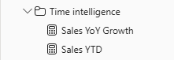

---
lab:
  title: 在 Power BI 中使用 DAX 時間智慧函式
  module: Use DAX time intelligence functions in Power BI
---

# 在 Power BI 中使用 DAX 時間智慧函式

## 實驗室案例

在此實驗室中，您將使用涉及時間智慧的 DAX 運算式建立量值。

在本實驗室中，瞭解如何：

 - 使用各種時間智慧函數來操作特定涉及日期的過濾器上下文。

**此實驗室大約需要 15 分鐘。**

## 開始使用

若要完成此練習，請先開啟網頁瀏覽器，然後輸入下列 URL 以下載 zip 檔案：

`https://github.com/MicrosoftLearning/PL-300-Microsoft-Power-BI-Data-Analyst/raw/Main/Allfiles/Labs/06-use-dax-time-intelligence/06-time-intelligence.zip`

將檔案解壓縮至**C：\Users\Student\Downloads\06-time-intelligence** 資料夾。

開啟**06-Starter-Sales Analysis.pbix** 檔案。

> _**注意**：載入檔案時，您可能會看到登入對話方塊。選取 **[取消]** 以關閉登入對話方塊。關閉任何其他資訊視窗。如果系統提示套用變更，請選取 **[稍後套用]。**_

## 建立 YTD 量值

在此工作中，您將使用時間智慧函數建立銷售年初至今 （YTD） 量值。

1. 在 Power BI Desktop 的 [報表] 檢視**中**，在第 2** 頁上**，請注意矩陣視覺效果，其中顯示各種量值，並在列上分組年份和月份。

2. 根據下列運算式將量值`Sales` 新增至表格，並格式化為零小數位：

    ```dax
    Sales YTD =
    TOTALYTD(
        SUM(Sales[Sales]),
        'Date'[Date],
        "6-30"
    )
    ```

    > _函數會`TOTALYTD` 評估指定日期資料行的運算式 （在此案例中為資料行的`Sales` 總和）。日期直欄必須屬於標示為日期表格的日期表格。_
    >
    > _函式也可以採用代表一年最後日期的第三個選擇性引數。沒有這個日期意味著 12 月 31 日是一年中的最後一天。對於 Adventure Works，6 月是一年中的最後一個月，因此使用“6-30”。_

3. 將欄位和`Sales YTD`量值新增至`Sales`矩陣視覺效果。

4. 請注意年度內銷售值的累積。

    

> _函式會`TOTALYTD` 執行篩選器操作，特別是時間篩選器操作。例如，若要計算 2017 年 9 月 （會計年度的第三個月） 的 YTD 銷售額，會移除表格上`Date` 的所有篩選器，並取代為從年初 （2017 年 7 月 1 日） 開始並延伸到內容內日期期間的最後日期 （2017 年 9 月 30 日） 的新日期篩選器。_
>
> _DAX 中有許多[時間智慧函數](/dax/time-intelligence-functions-dax/?azure-portal=true) ，可支援常見的時間篩選操作。_

## 建立 YoY 成長量值

在此工作中，您將使用變數建立銷售額 YoY 成長量值。

> 變數可協助您簡化公式，如果在公式中多次使用邏輯，則更有效率。 變數會以唯一的名稱宣告，然後必須在關鍵字之後輸出`RETURN` 量值運算式。 不同於其他一些編碼語言變數，DAX 變數只能在單一formula._內使用

1. 根據下列運算式，將另一個量值`Sales` 新增至資料表：

    ```dax
    Sales YoY Growth =
    VAR SalesPriorYear =
        CALCULATE(
            SUM(Sales[Sales]),
            PARALLELPERIOD(
                'Date'[Date],
                -12,
                MONTH
            )
        )
    RETURN
        SalesPriorYear
    ```

    > _`SalesPriorYear`變數會指派一個運算式，以計算已修改環境定義中直`Sales`欄的總和。該上下文使用該`PARALLELPERIOD`函數從過濾器上下文中的每個日期向後移動 12 個月。_

1. 將量值`Sales YoY Growth` 新增至矩陣視覺效果。

1. 請注意，新量值會在前 12 個月傳回`BLANK` （因為在 2017 會計年度之前沒有記錄任何銷售額）。

1. 請注意，`Sales YoY Growth`2018 年 7 月_的_量值是 2017 年 7 月_的_銷售值。

    

    > _現在公式的「困難部分」已經測試過，您可以使用計算成長結果的最終公式來覆寫測量。_

1. 若要完成量值，請使用此公式覆寫`Sales YoY Growth` 量值，並將其格式化為小數點後兩個位數的百分比：

    ```dax
    Sales YoY Growth =
    VAR SalesPriorYear =
        CALCULATE(
            SUM(Sales[Sales]),
            PARALLELPERIOD(
                'Date'[Date],
                -12,
                MONTH
            )
        )
    RETURN
        DIVIDE(
            (SUM(Sales[Sales]) - SalesPriorYear),
            SalesPriorYear
        )
    ```

1. 在公式的子`RETURN` 句中，請注意變數被引用兩次。

1. 驗證 2018 年 7 月_的_同比增長率為 392.83%。

    

    > _同比增長指標表明，去年同期銷售額增長了近 400%（或 4 倍）。_

1. 在「模型」檢視**中**，將兩個新量值放入名為 Time intelligence_ 的_顯示資料夾中。

    

1. 儲存 Power BI Desktop 檔案。

## 實驗室完成

您可以選擇儲存 Power BI 報表，但此實驗室不需要儲存。 在下一個練習中，您將使用預先製作的入門檔案。

1. 導航至**左上角的“文件”** 菜單，然後選擇 **“另存為”**。 
1. 選取 [瀏覽此裝置]****。
1. 選取您要儲存檔案的資料夾，並為其指定描述性名稱。 
1. 選取 [儲存]**** 按鈕，將報表儲存為 .pbix 檔案。 
1. 如果出現對話方塊，提示您套用擱置的查詢變更，請選取 [**套用**]。
1. 關閉 Power BI Desktop。