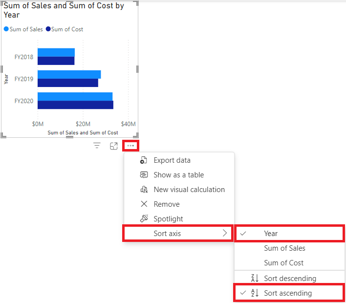

---
lab:
  title: 在 Power BI Desktop 中建立視覺計算
  module: Create visual calculations in Power BI Desktop
---

# 在 Power BI Desktop 中建立視覺計算

## 實驗室案例

在此實驗室中，您將使用資料分析運算式 （DAX） 建立視覺化計算。

在此實驗室中，您會了解如何：

- 建立和編輯視覺化計算。
- 使用 PREVIOUS（）、RUNNINGSUM（） 和 MOVINGAVERAGE（） 函數在每個會計年度之間建立比較指標。
- 建立比較指標時，請使用選用的 Axis 參數。
- 使用選用的重設參數，在多層軸中自訂累積計算。

**此實驗室大約需要 30 分鐘。**

## 開始使用

若要完成本練習，請先開啟網頁瀏覽器，然後輸入下列 URL 以下載 zip 資料夾：

`https://github.com/MicrosoftLearning/PL-300-Microsoft-Power-BI-Data-Analyst/raw/Main/Allfiles/Labs/07-create-visual-calculations/07-visual-calculations.zip`

將資料夾解壓縮至**C：\Users\Student\Downloads\07-visual-calculations** 資料夾。

開啟**07-Starter-Sales Analysis.pbix** 檔案。

> _**注意**：載入檔案時，您可能會看到登入對話方塊。選取 **[取消]** 以關閉登入對話方塊。關閉任何其他資訊視窗。如果系統提示套用變更，請選取 **[稍後套用]。**_

## 建立長條圖視覺效果

在此工作中，您將建立長條圖，按會計年度顯示銷售金額、總產品成本和利潤，並以比較量度作為工具提示。

1. 在 [視覺效果 **]** 窗格中，選取叢集長條圖視覺效果類型。

   

1. 在 [資料]**窗格中，從 [日期 **] 資料表內**，將 [年份]**** 欄位拖曳至 Y 軸井 **/區域。****

1. 將 [銷售]** 和 [成本]** 欄位從 [銷售]** 資料表拖**曳**到 X 軸井 **/區域。****

    > 請注意，當您將 Sales 和 Cost 新增至視覺效果時，會自動計算每個欄位的總和。

1. 使用三點功能表，然後選取 [年份]，然後**選取 **[遞**增**排序]，將產生的長條圖**** 排序：

   

    > 您現在有一個長條圖，顯示按時間順序排序的銷售總和和按年份排序的成本總和。

## 新增計算

1. 選取長條圖後，選取**功能區中的 [新增視覺效果計算** ]：

   

1. 視覺化計算編輯視窗隨即開啟。 在視覺化矩陣上方的編輯列中，輸入下列運算式，然後輸入 Enter 以認可計算：

    ```DAX
   Profit = [Sum of Sales] - [Sum of Cost]
    ```

1. 確認您現在在畫面底部的視覺矩陣上看到 [利潤] 欄：

   

1. 展開 [新增視覺計算 **] 底下**的功能表，然後從範本選項中選取 **[與先前**] ：

    > **與上一個** 值比較一個值與前一個值，因此我們看到與「年份」的先前值相比的利潤。

   

1. 在編輯列中，將預留位置`[Profit]`取代`[Field]`為 twice 並提交計算。

1. 從範本功能表中選取 **[執行總和** ]，並將預留位置取代`[Field]` 為`[Profit]` 並認可計算。

    > **執行總和** 會計算值的總和，將目前值加到前面的值中，因此我們會看到目前和前幾年的總和。

1. 從範本功能表中選取**移動平均** ，並將預留位置取代為`[Profit]` 2，`WindowSize`並將預留位置取代`[Field]`為 2。 您現在應該已設定下列專案：

    > **移動平均**：計算指定區間中一組值的平均值，將值的總和除以區間大小。 透過將視窗大小設定為 2，我們正在計算兩個連續值的平均值。 在此範例中，值是年度利潤，因此我們看到 2019 財年的移動平均值是 2018 財年和 2019 財年利潤的平均值。

   

1. 在 X 軸**井/區域下**，選取下列欄位的可見度圖示，以從視覺效果中隱藏它們：

    - 銷售的總和
    - 成本的總和
    - 收益

   

    > 請注意，您隱藏的欄位和計算現在不再顯示在視覺效果上。

1. 在 [視覺效果 **] 窗格中**，將 **[執行總和**] 和 **[移動平均值**] 拖曳至 [工具提示 **]** 井/區域。  

1. 確認視覺效果現在符合目標。 退出視覺化計算編輯畫面，查看報表：

   

    > 您現在有一個具有以下值的長條圖：銷售總和、成本總和、利潤和利潤*與上一個* ，以及利潤*運行總和* 和利潤*移動平均*的工具提示。

## 建立矩陣視覺效果

在此工作中，您將建立矩陣視覺效果，將每個類別的銷售金額與後續每年的第一個會計年度進行比較。

1. 在報表檢視**中**，建立新的報表頁面。

1. 在第 2** 頁上**，新增矩陣視覺效果。

1. 將下列欄位新增至視覺效果區域：

    - 列：**產品\| 類別**
    - 欄：**日期\| 年份**
    - 值：**銷售\| 銷售**

    > *實驗室使用速記符號來引用字段。它看起來像這樣：**日期\| 年份**。在此範例中，**Date** 是表格名稱，**而 Year** 是欄位名稱。*

## 新增計算

1. 選取矩陣後，選取**功能區中的 [新增視覺計算** ]。

1. 在視覺化計算編輯視窗中，輸入並儲存下列計算：

    ```DAX
   Versus first = [Sum of Sales] - FIRST([Sum of Sales])
    ```

    > 請注意矩陣如何顯示每個類別與第一個類別的銷售金額差異。

1. 選取 [值]**** 井/區域中的 [ Versus first **] 欄位**，並將 [軸] 參數的 [列] 值新增至 [ FIRST] 來更新您的計算：

    ```DAX
   Versus first = [Sum of Sales] - FIRST([Sum of Sales], ROWS)
    ```

    > 請注意，由於 ROWS 是 Axis 參數的預設值，因此沒有任何變更。

1. 將 ROWS 取代為 COLUMNS，並觀察計算現在會比較每個類別的銷售金額與第一個會計年度：

   

    > 請注意 [總銷售額 **]** 的 [與] 第一**欄會傳**回零，而不是與第一個會計年度的差異。 **總銷售額與** 年度總和處於不同的階層層級，因此被視為該層級上的第一欄。

1. 退出可視化計算編輯畫面以存取您的報表。

## 建立折線圖視覺效果

在此工作中，您將建立一個折線圖，顯示銷售額的累計總和。 該金額將在每個財政年度開始時重置。

1. 在報表檢視**中**，建立新的報表頁面。

1. 在第 3** 頁上**，新增折線圖視覺效果。

1. 將下列欄位新增至視覺效果區域：

    - X 軸：**日期\| 年份** 和**日期\| 季度**
    - Y軸：**銷售\| 銷售**

## 新增執行總和

1. 選取折線圖後，展開 [新增視覺化計算 **] 底下**的功能表，然後從範本選項中選取 **[執行總和**]。

1. 將預留位置取代`[Field]` 為`[Sum of Sales]` 並認可變更。 視覺效果應該如下所示：

   

## 更新執行總和以在每個新的會計年度重新啟動

1. 仍在視覺化計算編輯視窗中，選取**Y 軸**下的**[執行總和**] 欄位，並新增 HIGHESTPARENT 重設參數並認可變更，以更新此計算的運算式：

    ```DAX
   Running sum = RUNNINGSUM([Sum of Sales], HIGHESTPARENT)
    ```

確認每個新會計年度的執行總和確實重新啟動：

   

## 實驗室完成

您可以選擇儲存 Power BI 報表，但此實驗室不需要儲存。 在下一個練習中，您將使用預先製作的入門檔案。

1. 導航至**左上角的“文件”** 菜單，然後選擇 **“另存為”**。 
1. 選取 [瀏覽此裝置]****。
1. 選取您要儲存檔案的資料夾，並為其指定描述性名稱。 
1. 選取 [儲存]**** 按鈕，將報表儲存為 .pbix 檔案。 
1. 如果出現對話方塊，提示您套用擱置的查詢變更，請選取 [**套用**]。
1. 關閉 Power BI Desktop。