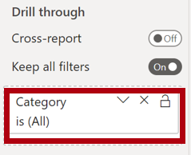
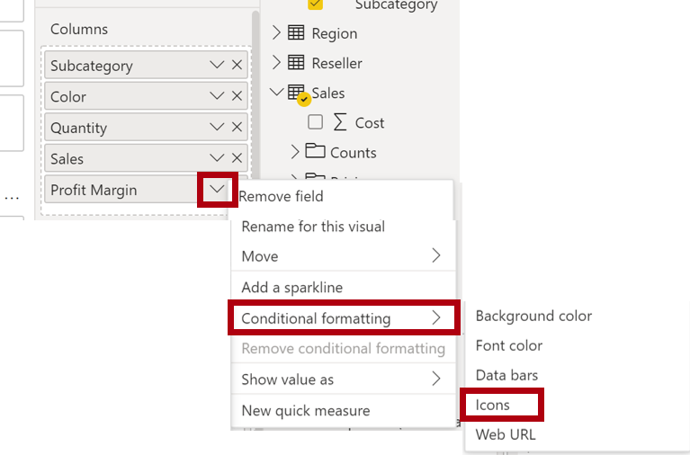
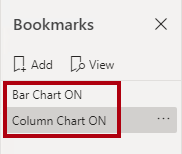

---
lab:
  title: 在 Power BI Desktop 中增強報表
  module: Create Reports in Power BI desktop
---

# 在 Power BI Desktop 中增強報表

## 實驗室案例

在此實驗室中，您將使用進階設計功能來增強 **銷售分析** 。

在此實驗室中，您將了解如何：

- 同步交叉分析篩選器
- 建立鑽研頁面
- 套用條件式格式設定
- 建立和使用書籤和按鈕

**此實驗室大約需要45分鐘的時間。**

## 開始使用

若要完成此練習，請先開啟網頁瀏覽器，然後輸入下列 URL 以下載 zip 資料夾：

`https://github.com/MicrosoftLearning/PL-300-Microsoft-Power-BI-Data-Analyst/raw/Main/Allfiles/Labs/07-design-report-in-power-bi-desktop-enhanced/07-enhanced-report.zip`

將資料夾解壓縮至 **C：\Users\Student\Downloads\07-enhanced-report** 資料夾。

**開啟 07-Starter-Sales Analysis.pbix** 檔案。

> ***注意**：您可以選取 **[取消**] 來關閉登入。 關閉任何其他信息視窗。 如果系統提示您套用變更，請選取 **[稍後**套用]。

## 同步交叉分析篩選器

在這項工作中 **，您將同步處理 Year** 和 **Region** 交叉分析篩選器，繼續開發在 Power BI Desktop** 實驗室中**設計報表中建立的報表。

1. 在 Power BI Desktop 的 [概觀]**** 頁面上，將 [年度]**** 交叉分析篩選器設定為 [FY2018]****。

1. 移至 [我的效能]**** 頁面，然後注意 [年度]**** 交叉分析篩選器是不同的值。

    > *當交叉分析篩選器未同步處理時，可能會造成報表用戶的數據歪曲和挫折。您現在會同步處理報表交叉分析篩選器。*

1. 返回 [概觀]**** 頁面，然後選取 [年度]**** 交叉分析篩選器。

1. 在 [檢視]**** 功能區索引標籤上，從 [顯示窗格]**** 群組中，選取 [同步交叉分析篩選器]****。

     

1. 在 [同步交叉分析篩選器]**** 窗格的 (位於 [視覺效果]**** 窗格的左側) 的第二個資料行 (代表同步處理) 中，勾選 [概觀]**** 和 [我的效能]**** 頁面的核取方塊。

     

1. 在 [概觀]**** 頁面上，選取 [區域]**** 交叉分析篩選器。

1. 同步處理交叉分析篩選器與 [概觀]**** 和 [利潤]**** 頁面。

     

1. 選取不同的篩選選項，然後驗證已同步的交叉分析篩選器是否依相同的選項篩選，以測試同步交叉分析篩選器。

1. 若要關閉 [**同步交叉分析篩選器**] 頁面，請選取**位於 [檢視 **] 功能區索引卷標上的 **[同步交叉分析篩選器**] 選項。

## 設定鑽研頁面

在此練習中，您將建立新的頁面，並將其設定為鑽研頁面。 當您完成設計時，此頁面會如下所示：

1. 新增名為 [產品詳細資料]**** 的新報告頁面。

1. 以滑鼠右鍵按一下 [產品詳細資料]**** 頁面索引標籤，然後選取 [隱藏頁面]****。

    > *報表用戶無法直接前往鑽研頁面。他們需要從其他頁面上的視覺效果存取它。您將瞭解如何在此實驗室的最後一個練習中鑽研至頁面。*

1. 在 [視覺效果]**** 窗格下方的 [鑽研]**** 區段中，將 [Product \| Category]**** 欄位新增至 [在此處新增鑽研欄位]**** 方塊。

    > *實驗室會使用速記表示法來參考欄位。看起來會像這樣： **產品 \| 類別**。在此範例中， **Product** 是數據表名稱，而 **Category** 是功能變數名稱。*

     

1. 若要測試鑽研頁面，請在鑽研篩選卡片中選取 [自行車]****。

     

1. 在報告頁面的左上方，注意箭號按鈕。

    > *當欄位新增至鑽研井/區域時，會自動新增箭頭按鈕。它可讓報表用戶巡覽回他們鑽研的頁面。*

1. 在頁面中新增 [卡片]**** 視覺效果，然後調整其大小和位置，使其位於按鈕的右邊並填滿頁面的剩餘寬度。

    

    

1. 將 [Product \| Category]**** 欄位拖曳到卡片視覺效果中。

1. 設定視覺效果的格式選項，然後將 [類別標籤]**** 屬性切換為 [關閉]****。

     

1. 將 **Effects > Background** 色彩屬性設定為淺灰色陰影，例如 *白色，20% 較*深。

     

1. 在頁面中新增 [資料表]**** 視覺效果，然後調整其大小和位置，使其位於卡片視覺效果的下方並填滿頁面的剩餘空間。

     

     

1. 將下列欄位新增至視覺效果：

     - **產品 \| 子類別**
     - **產品 \| 色彩**
     - **Sales \| Quantity**
     - **Sales \| Sales**
     - **Sales \| Profit Margin**

1. 設定視覺效果的格式選項，然後在 **[值** ] 和 **[資料行] 標頭** 區段中，將 **[文字大小** ] 屬性設定為 **20pt**。

*鑽研頁面的設計幾乎已完成。您將在下一個練習中使用條件式格式設定來增強頁面。*

## 新增條件式格式設定

在此練習中，您將使用條件式格式設定來增強鑽研頁面。 當您完成設計時，此頁面會如下所示：

1. 選取資料表視覺效果。 在視覺效果窗格中，選取 [利潤邊界] 值上的**向下箭號，然後選取 [**條件式格式設定\|圖示**]。**

    

1. 在 [圖示 – Profit Margin]**** 視窗的 [圖示版面配置]**** 下拉式清單中，選取 [資料右邊]****。

    

1. 若要刪除中間規則，請在黃色三角形右側選取 **[X**]。

    

1. 設定第一個規則 (紅色菱形)，如下所示：

    - 在第二個控制項中，移除此值
    - 在第三個控制項中，選取 [數字]****
    - 在第五個控制項中，輸入 **0**
    - 在第六個控制項中，選取 [數字]****

1. 設定第二個規則 （綠色圓形），如下所示，然後選取 [ **確定**]：

    > *規則可以解譯如下：如果獲利率值小於 0，則顯示紅色菱形;否則，如果值大於或等於零，則顯示綠色圓形。*

    - 在第二個控制項中，輸入 **0**
    - 在第三個控制項中，選取 [數字]****
    - 在第五個控制項中，移除此值
    - 在第六個控制項中，選取 [數字]****

    

1. 在數據表視覺效果中，確認已顯示正確的圖示。

    

1. 設定 [色彩]**** 欄位的背景色彩條件式格式設定。

1. 在 [背景色彩 – 色彩]**** 視窗的 [設定樣式格式]**** 下拉式清單中，選取 [欄位值]****。

1. 在 [**我們應該以此為基礎的哪些字段？**] 下拉式清單中，選取 [產品\|格式\|設定背景色彩格式 **]，然後選取 **[**確定**]。

    

1. 重複上述步驟，以使用 [Product \| 格式設定 \| 字型色彩格式]**** 欄位，設定 [色彩]**** 欄位的字型色彩條件式格式設定

*您可能還記得，背景和字型色彩是來自《在 Power BI Desktop 中準備資料》**** 實驗室的 **ColorFormats.csv** 檔案，再將其與《在 Power BI Desktop 中載入資料》**** 實驗室的 **Product** 查詢整合。*

## 新增書籤和按鈕

在此練習中，您將使用按鈕來增強 **[我的效能]** 頁面，讓報表用戶選取要顯示的視覺效果類型。 當您完成設計時，此頁面會如下所示：

1. 移至 [我的效能]**** 頁面。 在 [檢視]**** 功能區索引標籤上，從 [顯示窗格]**** 群組中，選取 [書籤]****。

    

1. 在 [檢視]**** 功能區索引標籤上，從 [顯示窗格]**** 群組中，選取 [選取範圍]****。

1. 在 [選取範圍]**** 窗格中，選取 [依月份的銷售額] 和 [依月份的目標]**** 項目旁邊的眼睛圖示，以隱藏視覺效果。

    

1. 在 [書籤]**** 窗格中，選取 [新增]****。

    > *若要重新命名書籤，請按兩下書籤。*

    

1. 如果可見的圖表是橫條圖，請將書籤重新命名為 [開啟橫條圖]****，否則將書籤重新命名為 [開啟直條圖]****。

1. 若要編輯書籤，請在 **[書籤** ] 窗格中，將游標暫留在書籤上方，選取省略號，然後選取 [ **數據**]。

    > *停用 [**數據]** 選項表示書籤不會使用目前的篩選狀態。這很重要，因為書籤會永久鎖定 Year** 交叉分析篩選器目前套用的**篩選。*

     

1. 若要更新書籤，請再次選取省略號，然後選取 [ **更新**]。

    > *在下列步驟中，您將建立並設定第二個書籤以顯示第二個視覺效果。*

1. 在 [選取範圍]**** 窗格中，切換 [依月份的銷售額] 和 [依月份的目標]**** 兩個項目的可見度。

    > *換句話說，讓可見的視覺效果隱藏，並讓隱藏的視覺效果可見。*

     

1. 建立第二個書籤並適當地命名 ([開啟直條圖]**** 或 [開啟橫條圖]**)**。

     

1. 設定第二個書籤以忽略篩選 ([資料]**** 選項關閉)，並更新書籤。

1. 在 [選取範圍]**** 窗格中，若要讓這兩個視覺效果均可見，只要顯示隱藏的視覺效果即可。

1. 調整這兩個視覺效果的大小和位置，使其填滿多張卡片視覺效果下方的頁面，且彼此完全重疊。

    *若要選取涵蓋的視覺效果，請在 [選取範圍 **] 窗格中加以選取**。*

    

1. 在 [書籤]**** 窗格中，選取每個書籤，並注意只有其中一個視覺效果看得見。

*下一個階段的設計是將兩個按鈕新增至頁面，這可讓報表用戶選取書籤。*

1. 在 [插入]**** 功能區中，從 [元素]**** 群組中，選取 [按鈕]****，然後選取 [空白]****。

     

1. 將此按鈕放置在 [年度]**** 交叉分析篩選器的正下方。

1. 選取按鈕，然後在 **[格式] 按鈕**窗格中，選取 **[按鈕**]，展開 **[樣式**] 區段，**然後將 [文字**] 屬性**** 開啟。

     

1. 展開 [**文字**] 區段，然後在 [文字]** 中**輸入**條形圖**。

1. **展開 [填滿]** 區段，然後使用互補色彩設定填滿色彩。

1. 選取 **[按鈕**]，**然後將 [動作**] 屬性**** 開啟。

    

1. 展開 [動作]**** 區段，然後將 [類型]**** 下拉式清單設定為 [書籤]****。

1. 在 [書籤]**** 下拉式清單中，選取 [開啟橫條圖]****。

    

1. 使用複製並貼上來建立按鈕的複本，然後設定新按鈕，如下所示：

    *提示：複製和貼上的快捷方式命令為 **Ctrl+C** ， **後面接著 Ctrl+V**。*

    - 將 [按鈕文字]**** 屬性設定為 [直條圖]****
    - 在 [動作]**** 區段中，將 [書籤]**** 下拉式清單設定為 [開啟直條圖]****

*銷售分析報表的設計現已完成。*

## 發佈和探索報表

在此練習中，您將將報表發佈至 Power BI 服務，並探索已發佈的報表行為。

> **注意**：即使您無法存取在線 Power BI 服務 直接執行工作，您仍可檢閱練習的其餘部分。

1. 選取 [概觀]**** 頁面。

1. 在 [年度]**** 交叉分析篩選器中，選取 [FY2020]****。

1. 在 [區域]**** 交叉分析篩選器中，選取 [全選]****。

1. 儲存 Power BI Desktop 檔案。

1. 在 [首頁]**** 功能區索引標籤上，從 [共用]**** 群組內選取 [發佈]****。

    > *如果您尚未登入 Power BI Desktop，您必須登入才能發佈。*

     

1. 請注意，在 [發佈至 Power BI]**** 視窗中已選取 [我的工作區]****。

1. 若要發佈報表，請選取 [ **選取**]。
    1. 如果系統提示您取代語意模型，請選取 **[取代**]。
    1. 當發佈成功時，請選取 [確認]****。

1. 關閉 Power BI Desktop。

1. 在 Microsoft Edge 瀏覽器視窗中，流覽至 [我的工作區 **] > Power BI 服務，** 然後選取 **[銷售分析**] 報表。

1. 若要測試鑽研功能，請流覽至 **** [概觀] 頁面，> **[依類別**排序的數量] 視覺效果。 然後以 **滑鼠右鍵按兩下 [服裝** ] 列，然後選取 **[鑽研 \| 產品詳細數據**]。

     

1. 請注意，[產品詳細資料]**** 頁面適用於 [服裝]****。

1. 若要返回來源頁面，請在頁面左上角選取箭號按鈕。

1. 選取 [我的效能]**** 頁面。

     > *選取每個按鈕，然後注意到會顯示不同的視覺效果。*

## 實驗室完成
