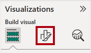
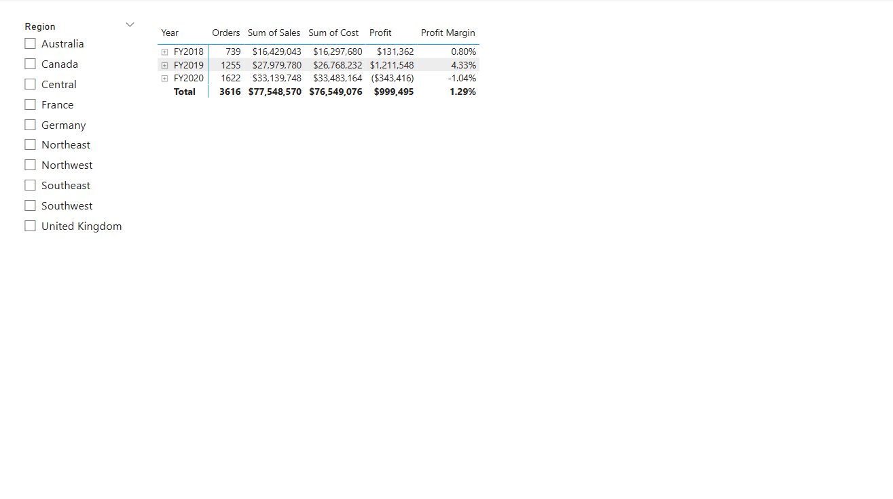
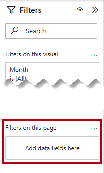
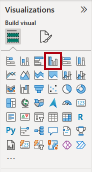

---
lab:
  title: 設計 Power BI 報表
  module: Design Power BI reports
---

# 設計 Power BI 報表

## 實驗室案例

在此實驗室中，您將會建立一份三頁報表。 接著，您會將它發佈至 Power BI 服務，您將在其中開啟報表並與其互動。

在此實驗室中，您會了解如何：

- 設計報表。
- 設定視覺效果欄位和格式屬性。
- 同步交叉分析篩選器。
- 將報表發佈到 Power BI 服務。
- 與報表及其視覺效果互動。

**此實驗室大約需要45分鐘的時間。**

## 開始使用

若要完成此練習，請先開啟網頁瀏覽器，然後輸入下列 URL 以下載 zip 檔案：

`https://github.com/MicrosoftLearning/PL-300-Microsoft-Power-BI-Data-Analyst/raw/Main/Allfiles/Labs/08-design-power-bi-reports/08-design-report.zip`

將檔案解壓縮到 **C：\Users\Student\Downloads\08-design-report** 資料夾。

**開啟 08-Starter-Sales Analysis.pbix** 檔案。

> _**注意**：您可以選取 **[取消**] 來關閉登入。關閉任何其他信息視窗。如果系統提示您套用變更，請選取 [ **稍後**套用]。_

## 設計第 1 頁

在此練習中，您將設計第一個報表頁面。 當您完成設計時，此頁面會如下所示：

1. 在 Power BI Desktop 中，若要重新命名頁面，請在左下方按兩下滑鼠右鍵 **第 1** 頁，然後選取 [ **重新命名**]。 將頁面重新命名為 _[概觀_]。

    > _提示：您也可以按兩下頁面名稱來重新命名。_

1. 若要新增影像，請在 [插入]**** 功能區索引標籤上，從 [項目]**** 群組中選取 [影像]****。

    

1. 在 [ **開啟]** 視窗中，流覽至 **C：\Users\Student\Downloads\08-design-report** 資料夾。

1. 選取 **AdventureWorksLogo.jpg** 檔案，然後選取 [開啟]****。

1. 拖曳影像以將其放置在左上角，並拖曳輔助標記來調整其大小。

    

1. 若要新增交叉分析篩選器，請先選取報表頁面的空白區域來取消選取影像，然後在 [視覺效果] 窗格中選取**交叉分析篩選器****。**

    

1. 在 [**數據]** 窗格中，將`Date | Year`字段（而非`Year`階層層級）拖曳至 [視覺效果 **] 窗格中的交叉分析篩選器**字段****。

    > _實驗室會使用速記表示法來參考欄位。看起來會像這樣： `Date | Year`。在此範例中， `Date` 是數據表名稱，而 `Year` 是功能變數名稱。_

1. 若要將交叉分析篩選器從清單轉換成下拉式清單，請在 **[視覺效果** ] 窗格中選取 [ **格式化視覺效果**]。 展開 [ **交叉分析篩選器設定**]，然後將 [ **樣式** ] 下拉式清單設定為 **[下拉式清單**]。

    

1. 調整交叉分析篩選器的大小與位置，使其位於影像下方，並且與影像同寬。

    

1. 在 [Year]**** 交叉分析篩選器中，開啟下拉式清單並選取 [FY2020]****，然後摺疊下拉式清單。

    > _報表頁面現在會依 **FY2020** 年進行篩選。_

    

1. 選取報表頁面的空白區域，以取消選取交叉分析篩選器。

1. 根據 `Region | Region` 欄位建立第二個交叉分析篩選器（而不是 `Region` 階層的層級）。

1. 將交叉分析篩選器保留為清單，然後調整交叉分析篩選器的大小，並將其放置於 [Year]**** 交叉分析篩選器的下方。

    

1. 選取報表頁面的空白區域，以取消選取交叉分析篩選器。

1. 若要將圖表新增至頁面，請在 [視覺效果]**** 窗格中，選取 [折線圖與堆疊直條圖]**** 視覺效果類型。

    

1. 調整視覺效果的大小和位置，使其位於標誌的右邊，並填滿報表頁面的寬度。

    

1. 將下列欄位拖曳至視覺效果：

     - `Date | Month`
     - `Sales | Sales`

1. 在視覺效果欄位窗格中（位於 **[視覺效果** ] 窗格中，請注意字段會指派給 **X 軸** 和 **數據行 y 軸** 井。

    > _藉由將字段拖曳到視覺效果中，它們就會新增至默認井。為了有效位數，您可以直接將字段拖曳到井中，就像您接下來所做的一樣。_

    

1. 從 [ **數據]** 窗格中，將 `Sales | Profit Margin` 字段拖曳至 **線條 y 軸** 。

    

1. 請注意，視覺效果只有 11 個月。

    > _2020 年 6 月的最後一個月還沒有銷售。根據預設，視覺效果已淘汰銷售月份 `BLANK` 。您現在會將視覺效果設定為顯示所有月份。_

1. 在視覺效果欄位窗格的 **[X 軸** ] 中，針對 **[月份]** 字段選取向下箭號，然後選取 **[顯示沒有數據**的專案]。

    

    > _請注意，2020 年 6 月**的月份**現在會出現。_

1. 選取報表頁面的空白區域，以取消選取圖表。

1. 若要將圖表新增至頁面，請在 [ **視覺效果** ] 窗格中，選取 **[堆棧柱形圖]** 視覺效果類型。

    

1. 調整視覺效果的大小和位置，使其位於直條圖/折線圖底下，並填滿上面圖表的一半寬度。

    

1. 將下列欄位新增至視覺效果區域：

     - X 軸：`Region | Group`
     - Y 軸： `Sales | Sales`
     - 傳說： `Product | Category`

1. 選取報表頁面的空白區域，以取消選取圖表。

1. 若要將圖表新增至頁面，請在 [視覺效果]**** 窗格中，選取 [堆疊橫條圖]**** 視覺效果類型。

    

1. 調整視覺效果的大小和位置，使其填滿剩餘的報表頁面空間。

    

1. 將下列欄位新增至視覺效果區域：

     - Y 軸： `Product | Category`
     - X 軸：`Sales | Quantity`

1. 若要格式化視覺效果，請開啟 [格式]**** 窗格。

    

1. 展開 [橫條]** 區段，然後在 [** 色彩] 群組中 **，將 Color**** 屬性設定**為適當的色彩（以補充柱形圖/折線圖）。

1. 將 [ **數據標籤** ] 區段設定為 **[開啟**]。

    

1. 儲存 Power BI Desktop 檔案。

    > _第一頁的設計現在已完成。_

## 設計第 2 頁

在此練習中，您將設計第二個報表頁面。 當您完成設計時，此頁面會如下所示：

> _**重要**：實驗室中已提供詳細指示時，實驗室步驟將提供更簡潔的指示。如果您需要詳細的指示，您可以回到此實驗室中的其他工作。_

1. 若要建立新的頁面，請在左下方選取加號圖示。 新增頁面時，請將其重新命名為 _Profit_。

1. 根據 `Region | Region` 欄位新增交叉分析篩選器。

1. 使用 [ **格式]** 窗格來顯示 [ _選取所有_ ] 選項（位於 **交叉分析篩選器設定>選取** 區段）。

1. 重設大小並放置交叉分析篩選器，使其位於報表頁面的左側，因此大約是頁面高度的一半。

    

1. 新增矩陣視覺效果，並調整其大小及位置，使其填滿報表頁面的剩餘空間

    

1. 將階層新增`Date | Fiscal`至矩陣**** 數據列。

    

1. 將下列五 `Sales` 個數據表欄位新增至 **[值** ]：

     - `Orders` （從 `Counts` 資料夾）
     - `Sales`
     - `Cost`
     - `Profit` （從 `Pricing` 資料夾）
     - `Profit Margin` （從 `Pricing` 資料夾）

    

1. 在 [**篩選]** 窗格 （位於 [視覺效果 **] 窗格左側**），請注意**此頁面**上的 [篩選] 區段 （您可能需要展開開啟窗格並向下捲動）。

    

1. 從 [ **數據]** 窗格中，將 `Product | Category` 字段拖曳至 **此頁面** 上的 [篩選]。

    > _新增至 [篩選]** 窗格的**字段可以達到與交叉分析篩選器相同的結果。其中一個差異在於，它們不會佔用報表頁面上的空間。另一個差異是可以設定它們以達到更複雜的篩選需求。_

1. 在篩選卡片的右上方，選取要折迭卡片的箭號。

1. 將下列 `Product` 每一個數據表欄位新增至 **此頁面** 上的 [篩選]，並直接折疊在 `Category` 欄位下方：

     - `Subcategory`
     - `Product`
     - `Color`

    

1. 儲存 Power BI Desktop 檔案。

    > _第二頁的設計現在已完成。_

## 設計第 3 頁

在此練習中，您將設計第三個報表頁面和最終報表頁面。 當您完成設計時，此頁面會如下所示：

1. 建立新的頁面，並將它重新命名為 _[我的效能_]。

1. 若要模擬數據列層級安全性篩選的效能，請將 `Salesperson (Performance) | Salesperson` 字段拖曳至篩選窗格中的頁面層級篩選。

    

1. 在篩選卡片中，選取 **[Michael Blythe**]。

    > _報表頁面上的數據現在會篩選為只顯示 Michael Blythe 的數據。_

1. 根據 `Date | Year` 欄位新增下拉式交叉分析篩選器，然後重設大小並放置它，使其位於頁面左上角。

    

1. 在交叉分析篩選器中，將頁面設定為依 **FY2019** 進行篩選。

    

1. **將多列卡片**視覺效果新增至頁面，然後重設大小並重新定位，使其位於交叉分析篩選器右側，並填滿頁面的剩餘寬度。

    

    

1. 將下列 4 個欄位新增至視覺效果：

     - `Sales | Sales`
     - `Targets | Target`
     - `Targets | Variance`
     - `Targets | Variance Margin`

1. 格式化視覺效果：

     - 在 [ **圖說文字值]** 區段中，將字型大小屬性 **增加到 28pt**。
     - 在 [一般 **] 索引標籤的 **[** 效果]** 區段中，將背景色彩屬性設定為淺灰色（例如_白色，10% 深色_）以提供對比。

        

1. **將叢集條形圖**視覺效果新增至頁面，然後重設大小並放置它，使其位於多列卡片視覺效果下方，並填滿頁面的剩餘高度，以及多列卡片視覺效果的一半寬度。

    

    

1. 將下列欄位新增至視覺效果區域：

     - Y 軸： `Date | Month`
     - X 軸： `Sales | Sales` 和 `Targets | Target`

        

1. 若要建立視覺效果的複本，請按 **Ctrl + C**，然後按 **Ctrl + V**。

1. 將新的視覺效果放在原始視覺效果的右邊。

    

1. 若要修改視覺效果類型，請在 [視覺效果]**** 窗格中，選取 [叢集直條圖]****。

    

     > _現在可以看到兩種不同視覺效果類型所表示的相同數據。最終頁面的設計已完成。_

## 同步交叉分析篩選器

在這項工作中，您將同步 _處理 Year_ 和 _Region_ 交叉分析篩選器。

1. 在 [概 _觀]_ 頁面上，將 _[年_ ] 交叉分析篩選器設定為 **FY2018**。

1. 移至 [ _我的效能]_ 頁面，然後注意 _Year_ 交叉分析篩選器有不同的值。

    > _當交叉分析篩選器未同步處理時，可能會造成報表用戶的數據歪曲和挫折。您現在會同步處理報表交叉分析篩選器。_

1. 返回 [概觀]__ 頁面，然後選取 [年度]__ 交叉分析篩選器。

1. 在 [檢視]**** 功能區索引標籤上，從 [顯示窗格]**** 群組中，選取 [同步交叉分析篩選器]****。

    

1. 在 [同步交叉分析篩選器]**** 窗格的 (位於 [視覺效果]**** 窗格的左側) 的第二個資料行 (代表同步處理) 中，勾選 [概觀]__ 和 [我的效能]__ 頁面的核取方塊。

    

1. 在 [概觀]__ 頁面上，選取 [區域]__ 交叉分析篩選器。

1. 同步處理交叉分析篩選器與 [概觀]__ 和 [利潤]__ 頁面。

    

1. 選取不同的篩選選項，然後驗證已同步的交叉分析篩選器是否依相同的選項篩選，以測試同步交叉分析篩選器。

1. 若要關閉 [同步交叉分析篩選器 **] 窗格，請選取**位於 [** 檢視 **] 功能區索引卷標上的 **[同步交叉分析篩選器**] 選項。

## 發佈和探索報表

在此練習中，您將將報表發佈至 Power BI 服務。 接著，您將探索已發佈的報表行為。

> _**注意**：即使您無法存取 Power BI 服務 直接執行工作，您仍可檢閱練習的其餘部分。_

1. 選取 [概 _觀]_ 頁面，然後儲存 Power BI Desktop 檔案。

1. 在 [首頁]**** 功能區索引標籤上，從 [共用]**** 群組內選取 [發佈]****。

    > _如果您尚未登入 Power BI Desktop，您必須先登入，才能發佈報表。_

    

1. 在 [ **發佈至 Power BI** ] 視窗中，請注意 _已選取 [我的工作區_ ]。

    > _此實驗室不會詳細說明 Power BI 服務 內的不同專案。_

1. 若要發佈報表，請選取 [ **選取**]。 等候發行集完成。

1. 當發行集成功時，請選取 [ **取得它**]。

1. 開啟 Microsoft Edge 瀏覽器，然後在 登入 `https://app.powerbi.com`。

1. 在瀏覽器視窗中，在 [Power BI 服務] **的 [流覽**] 窗格中，展開 [我的工作區 **] （位於左側，可以折迭**它）。

    

1. 檢閱工作區的內容。

    - 工作區中可以存在不同類型的專案，但與這個實驗室相關的項目是語意模型和報表。
    - 如果看不到語意模型，您可能需要重新整理瀏覽器。
    - 當您發行報表時，數據模型會發佈為語意模型。

1. 若要探索報表，請選取 _08-Starter-Sales 分析_ 報表。

1. 在左側的 [ **頁面** ] 窗格中，請注意 **已選取 [概觀** ] 頁面。

1. 在 [ _區域_ ] 交叉分析篩選器中 **，按下 Ctrl** 鍵時，選取多個區域。

1. 在直條圖/折線圖中，選取任何月份的資料行來交叉篩選頁面。

1. 按下 Ctrl** 鍵時**，請選取另一個月。

     > _根據預設，交叉篩選會篩選頁面上所有其他視覺效果。_

1. 請注意，長條圖會經過篩選和醒目提示，而較粗的長條代表篩選的月份。

1. 將游標停留在條形圖視覺效果上，然後在右上方將游標停留在 [篩選 **] 圖示上**。

    

    > _篩選圖示可讓使用者瞭解套用至視覺效果的所有篩選，包括來自其他視覺效果的交叉分析篩選器和交叉篩選。_

1. 將游標暫留在長條上，然後注意工具提示資訊。

1. 若要復原交叉篩選，請在直條圖/折線圖中選取視覺效果的空白區域。

1. 將游標暫留在堆疊柱形圖視覺效果上，然後在右上方選取 **[焦點模式** ] 圖示。

    > _焦點模式會將視覺效果縮放為完整頁面大小。_

    

1. 將游標停留在橫條圖的不同區段上方，以顯示工具提示。

1. 若要返回報表頁面，請在左上方選取 [返回報表]****。

    

1. 再次將游標停留在其中一個視覺效果上方，然後在右上方選取省略號 （...），然後注意功能表選項。 請嘗試每個選項，但共用**中的**選項除外。

    

1. 在左側的 [頁面]**** 窗格中，選取 [收益]**** 頁面。

    

1. 請注意，由於同步交叉分析篩選器，區域__ 交叉分析篩選器的選取範圍與 [_概觀_] 頁面上所做的選項相同。

1. 在 [篩選器]**** 窗格中 (位於右側)，展開篩選卡片，然後套用一些篩選器。

    > _[篩選]**** 窗格可讓您定義更多篩選，超過符合頁面的交叉分析篩選器數量。_

1. 在矩陣視覺效果中，使用加號 （+） 按鈕來鑽研階層 `Fiscal` 。

1. 選取 [我的效能]**** 頁面。

    

1. 在功能表列右上方，選取 [ **檢視**]，然後選取 [ **全螢幕**]。

    

1. 藉由修改交叉分析篩選器與頁面進行互動，並交叉篩選頁面。

1. 請注意視窗下方用於變更頁面、在頁面之間往返巡覽，或是結束全螢幕模式的命令。

1. 選取右圖示以結束全螢幕模式。

    

## 實驗室完成
