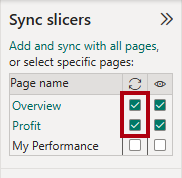

---
lab:
  title: 設計 Power BI 報表
  module: Design Power BI reports
---

# 設計 Power BI 報表

## 實驗室案例

在此實驗室中，您將會建立一份三頁報表。 然後，您會將它發佈至 Power BI 服務，您可以在其中開啟報表並與之互動。

在此實驗室中，您會了解如何：

- 設計報表。
- 設定視覺欄位和格式屬性。
- 同步交叉分析篩選器。
- 將報表發佈到 Power BI 服務。
- 與報表及其視覺效果互動。

**此實驗室大約需要 45 分鐘。**

## 開始使用

若要完成此練習，請先開啟網頁瀏覽器，然後輸入下列 URL 以下載 zip 檔案：

`https://github.com/MicrosoftLearning/PL-300-Microsoft-Power-BI-Data-Analyst/raw/Main/Allfiles/Labs/08-design-power-bi-reports/08-design-report.zip`

將檔案解壓縮到 **C：\Users\Student\Downloads\08-design-report** 資料夾。

開啟 **08-Starter-Sales Analysis.pbix** 檔案。

> _**注意**：載入檔案時，您可能會看到登入對話方塊。選取 **[取消]** 以關閉登入對話方塊。關閉任何其他資訊視窗。如果系統提示套用變更，請選取 **[稍後套用]。**_

## 設計第 1 頁

在此工作中，您將設計第一個報表頁面。 當您完成設計時，此頁面會如下所示：

1. 在 Power BI Desktop 中，若要重新命名頁面，請以滑鼠右鍵按一下 **左下角的 [頁面 1**]，然後選取 **[重新命名**]。 將頁面重新命名為 _概觀_。

    > _提示： 您也可以按兩下頁面名稱來重新命名。_

1. 若要新增影像，請在 [插入]**** 功能區索引標籤上，從 [項目]**** 群組中選取 [影像]****。

    

1. 在「開啟 **」** 視窗中，導覽至 **C：\Users\Student\Downloads\08-design-report** 資料夾。

1. 選取 **AdventureWorksLogo.jpg** 檔案，然後選取 [開啟]****。

1. 拖曳影像以將其放置在左上角，並拖曳輔助標記來調整其大小。

    

1. 若要新增交叉分析篩選器，請先選取報表頁面的空白區域來取消選取影像，然後在 [視覺效果]** 窗格中選取 **[交叉分析篩選器**]。**

    

1. 在 [資料 **] **窗格中，將`Date | Year`欄位 （不是`Year`階層層級） 拖曳至 [視覺效果]** 窗格中的**交叉分析篩選器 **[欄位**] 井。

    > _實驗室使用速記符號來引用字段。它看起來像這樣： `Date | Year`。在此範例中， `Date` 是資料表名稱，是 `Year` 欄位名稱。_

    

1. 若要將交叉分析篩選器從清單轉換成下拉式清單，請在 [視覺效果 **] **窗格中，選取 **[設定視覺效果**格式]。 展開 [ **交叉分析篩選器設定**]，然後將 [ 樣式** ] **下拉式清單設定為 **[下拉式]。**

    

1. 調整交叉分析篩選器的大小與位置，使其位於影像下方，並且與影像同寬。

    

1. 在 [Year]**** 交叉分析篩選器中，開啟下拉式清單並選取 [FY2020]****，然後摺疊下拉式清單。

    > _報表頁面現在會依 **FY2020** 年進行篩選。_

    

1. 選取報表頁面的空白區域，以取消選取交叉分析篩選器。

1. 根據欄位 （而不是`Region`階層的層級） 建立`Region | Region`第二個交叉分析篩選器。

1. 將交叉分析篩選器保留為清單，然後調整交叉分析篩選器的大小，並將其放置於 [Year]**** 交叉分析篩選器的下方。

    

1. 選取報表頁面的空白區域，以取消選取交叉分析篩選器。

1. 若要將圖表新增至頁面，請在 [視覺效果]**** 窗格中，選取 [折線圖與堆疊直條圖]**** 視覺效果類型。

    

1. 調整視覺效果的大小和位置，使其位於標誌的右邊，並填滿報表頁面的寬度。

    

1. 將下列欄位拖曳至視覺效果：

     - `Date | Month`
     - `Sales | Sales`

1. 在視覺欄位窗格 （位於 [視覺效果]** 窗格中**），請注意欄位已指派給 **X 軸**和**欄 y 軸**井。

    > _藉由將欄位拖曳到視覺效果中，它們會新增至預設井。為了精確起見，您可以將欄位直接拖曳到井中，如下所示。_

    

1. 從 [資料 **] **窗格中，將`Sales | Profit Margin`欄位拖曳至 [線條] **y 軸**井中。

    

1. 請注意，視覺效果只有 11 個月。

    > _今年的最後一個月，即 2020 年 6 月，還沒有任何銷售。根據預設，視覺效果已消除銷售月份 `BLANK` 。您現在將設定視覺效果以顯示所有月份。_

1. 在視覺欄位窗格的 X 軸**井中**，針對 [月份 **] **欄位，選取向下箭號，然後選取 [**顯示沒有資料**的項目]。

    

    > _請注意，現在會出現 2020 年 6 月****。_

1. 選取報表頁面的空白區域，以取消選取圖表。

1. 若要將圖表新增至頁面，請在 [**視覺效果**] 窗格中，選取 [ 堆疊直條圖** ] **視覺效果類型。

    

1. 調整視覺效果的大小和位置，使其位於直條圖/折線圖底下，並填滿上面圖表的一半寬度。

    

1. 將下列欄位新增至視覺效果區域：

     - X 軸：`Region | Group`
     - Y軸： `Sales | Sales`
     - 傳奇文學： `Product | Category`

1. 選取報表頁面的空白區域，以取消選取圖表。

1. 若要將圖表新增至頁面，請在 [視覺效果]**** 窗格中，選取 [堆疊橫條圖]**** 視覺效果類型。

    

1. 調整視覺效果的大小和位置，使其填滿剩餘的報表頁面空間。

    

1. 將下列欄位新增至視覺效果區域：

     - Y軸： `Product | Category`
     - X 軸：`Sales | Quantity`

1. 若要格式化視覺效果，請開啟 [格式]**** 窗格。

    

1. 展開 [**長條]** 區段，然後在 [色彩 **] **群組中，將 [色彩]** **屬性設定為適當的色彩 （以補充直條圖/折線圖）。

1. 將 資料標籤** 區**段設定為**開啟**。

    

1. 儲存 Power BI Desktop 檔案。

    > _第一頁的設計現已完成。_

## 設計第 2 頁

在此工作中，您將設計第二個報表頁面。 當您完成設計時，此頁面會如下所示：

> _**重要事項**：當實驗室中已提供詳細指示時，實驗室步驟將提供更簡潔的指示。如果您需要詳細指示，可以參考本實驗室中的其他工作。_

1. 若要建立新的頁面，請在左下方選取加號圖示。 新增頁面後，將其重新命名為 _Profit_。

1. 根據欄位新增 `Region | Region` 交叉分析篩選器。

1. 使用 [ **格式]** 窗格來顯示 [ _全_ 選] 選項 （位於 [ **交叉分析篩選器設定] > [選取範圍** ] 區段） 。

1. 調整交叉分析篩選器的大小並定位，使其位於報表頁面的左側，因此它大約是頁面高度的一半。

    

1. 新增矩陣視覺效果，並調整其大小及位置，使其填滿報表頁面的剩餘空間

    

1. 將階層新增至 `Date | Fiscal` 矩陣 **[列]** 井。

    

1. 將下列五個`Sales`資料表欄位新增至 [值] **** 井：

     - `Orders` （從文件夾中 `Counts` ）
     - `Sales`
     - `Cost`
     - `Profit` （從文件夾中 `Pricing` ）
     - `Profit Margin` （從文件夾中 `Pricing` ）

    

1. 在 [ **篩選]** 窗格 （位於 [ **視覺效果]** 窗格的左側） 中，請注意 [ **此頁面** 上的篩選] 區段 （您可能需要展開開啟窗格並向下捲動）。

    

1. 從 [資料 **] **窗格中，將`Product | Category`欄位拖曳至 [此頁面**上的篩選器] **井中。

    > _新增至 [ **篩選]** 窗格的欄位可以達到與交叉分析篩選器相同的結果。一個區別是它們不會佔用報告頁面上的空間。另一個區別是它們可以配置為實現更複雜的過濾要求。_

1. 在篩選卡內，選取右上角的箭頭以摺疊卡片。

1. 將下列 `Product` 每個表格欄位新增至 **[此頁面** 上的篩選器] 井中，並摺疊每個欄位，直接位於欄位 `Category` 下方：

     - `Subcategory`
     - `Product`
     - `Color`

    

1. 儲存 Power BI Desktop 檔案。

    > _第二頁的設計現已完成。_

## 設計第 3 頁

在此工作中，您將設計第三個也是最後一個報表頁面。 當您完成設計時，此頁面會如下所示：

1. 建立新頁面並將其重新命名為 _「我的績效」。_

1. 若要模擬資料列層級安全性篩選器的效能，請將 `Salesperson (Performance) | Salesperson` 欄位拖曳至篩選窗格中的頁面層級篩選器。

    

1. 在篩選器卡片中，選取 **Michael Blythe**。

    > _報告頁面上的資料現在將被過濾為僅顯示 Michael Blythe 的資料。_

1. 根據欄位新增 `Date | Year` 下拉式交叉分析篩選器，然後調整大小並定位它，使其位於頁面的左上角。

    

1. 在交叉分析篩選器中，將頁面設定為依 **FY2019** 進行篩選。

    

1. 將多列卡片**視覺效果新增至**頁面，然後調整大小並重新定位，使其位於交叉分析篩選器的右側，並填滿頁面的剩餘寬度。

    

    

1. 將下列 4 個欄位新增至視覺效果：

     - `Sales | Sales`
     - `Targets | Target`
     - `Targets | Variance`
     - `Targets | Variance Margin`

1. 格式化視覺效果：

     - 在 [圖說值 **] **區段中，將字型大小屬性增加到 **28pt**。
     - 在 [一般 **] **索引標籤的 [效果]** **區段中，將背景色彩屬性設定為淺灰色 （例如_白色，深_ 10%） 以提供對比。

        

1. 將叢集長條圖**視覺效果新增至**頁面，然後調整大小並放置它，使其位於多列卡片視覺效果下方，並填滿頁面的剩餘高度，以及多列卡片視覺效果寬度的一半。

    

    

1. 將下列欄位新增至視覺效果區域：

     - Y軸： `Date | Month`
     - X 軸： `Sales | Sales` 和 `Targets | Target`

        

1. 若要建立視覺效果的複本，請按 **Ctrl + C**，然後按 **Ctrl + V**。

1. 將新的視覺效果放在原始視覺效果的右邊。

    

1. 若要修改視覺效果類型，請在 [視覺效果]**** 窗格中，選取 [叢集直條圖]****。

    

     > _現在可以看到由兩種不同視覺化類型表示的相同資料。最後一頁的設計完成了。_

## 同步交叉分析篩選器

在此工作中，您將同步處理 _[年份]_ 和 _[區域]_ 交叉分析篩選器。

1. 在 [概觀 _] _頁面上，將 [年份 _] 交叉分析篩選器設定_為 **2018** 財年。

1. 移至 [我的效能 _] _頁面，然後注意 _[年份]_ 交叉分析篩選器有不同的值。

    > _當交叉分析篩選器未同步處理時，可能會導致數據的錯誤表示和報表使用者的挫折感。您現在將同步處理報表交叉分析篩選器。_

1. 返回 [概觀]__ 頁面，然後選取 [年度]__ 交叉分析篩選器。

1. 在 [檢視]**** 功能區索引標籤上，從 [顯示窗格]**** 群組中，選取 [同步交叉分析篩選器]****。

    

1. 在 [同步交叉分析篩選器]**** 窗格的 (位於 [視覺效果]**** 窗格的左側) 的第二個資料行 (代表同步處理) 中，勾選 [概觀]__ 和 [我的效能]__ 頁面的核取方塊。

    

1. 在 [概觀]__ 頁面上，選取 [區域]__ 交叉分析篩選器。

1. 同步處理交叉分析篩選器與 [概觀]__ 和 [利潤]__ 頁面。

    

1. 選取不同的篩選選項，然後驗證已同步的交叉分析篩選器是否依相同的選項篩選，以測試同步交叉分析篩選器。

1. 若要關閉 [同步處理交叉分析篩選器 **] **窗格，請選取位於 [**檢視**] 功能區索引標籤上的 [**同步處理交叉篩選器**] 選項。

## 發佈和探索報表

在此工作中，您會將報表發佈至 Power BI 服務。 然後，您將探索已發佈的報告行為。

> _**附註**： 您至少 **需要 Power BI 免費** 授權才能發佈報表。開啟 Microsoft Edge 瀏覽器，然後導覽至_ `https://app.powerbi.com`_。 使用授權實驗室主機 （ALH） 所提供的 Microsoft 365 租用戶認證登入。當要求解決謎題或開始免費 Fabric 試用時，您可以略過此操作並關閉瀏覽器。_

> _**附註**： 您可以檢閱練習的其餘部分，即使您無權存取 Power BI 服務來直接執行工作也一樣。_

1. 選取 [概觀 _] _頁面，然後儲存 Power BI Desktop 檔案。

1. 在 [首頁]**** 功能區索引標籤上，從 [共用]**** 群組內選取 [發佈]****。

    > _如果您尚未登入 Power BI Desktop，您必須先登入，才能發佈報表。_

    

1. 在 [ **發佈至 Power BI** ] 視窗中，請注意 _已選取 [我的工作區_ ]。

    > _本實驗室不會詳細說明 Power BI 服務內的不同專案。_

1. 若要發佈報表，請選取 **[選取**]。 等到發佈完成。

1. 當發佈成功時，請選取 [ **已確認**]。

1. 開啟 Microsoft Edge 瀏覽器，然後導覽至 `https://app.powerbi.com`。

1. 在瀏覽器視窗的 Power BI 服務中，在 [導覽**窗格] （位於左側，可以摺疊） 中**，展開 **[我的工作區**]。

    

1. 檢閱工作區的內容。

    - 工作區中可以存在不同類型的專案，但與此實驗室相關的是語意模型和報表。
    - 如果語意模型不可見，您可能需要重新整理瀏覽器。
    - 當您發佈報表時，資料模型會發佈為語意模型。

1. 若要探索報表，請選取 _08-Starter-Sales Analysis_ 報表。

1. 在左側的 [頁面] **** 窗格中，請注意已選取 [**概觀**] 頁面。

1. 在區域_交叉分析篩選器中_，按 **Ctrl** 鍵時，選取多個區域。

1. 在直條圖/折線圖中，選取任何月份的資料行來交叉篩選頁面。

1. 按 **Ctrl** 鍵時，選取另一個月份。

     > _根據預設，交叉篩選會篩選頁面上的所有其他視覺效果。_

1. 請注意，長條圖會經過篩選和醒目提示，而較粗的長條代表篩選的月份。

1. 將游標停留在長條圖視覺效果上，然後在右上角，將游標停留在 [篩選器] **** 圖示上。

    

    > _篩選圖示可讓使用者瞭解套用至視覺效果的所有篩選，包括交叉篩選器和來自其他視覺效果的交叉篩選。_

1. 將游標暫留在長條上，然後注意工具提示資訊。

1. 若要復原交叉篩選，請在直條圖/折線圖中選取視覺效果的空白區域。

1. 將游標停留在堆疊直條圖視覺效果上，然後在 **右上角選取焦點模式** 圖示。

    > _焦點模式會將視覺效果縮放為完整頁面大小。_

    

1. 將游標停留在橫條圖的不同區段上方，以顯示工具提示。

1. 若要返回報表頁面，請在左上方選取 [返回報表]****。

    

1. 再次將游標停留在其中一個視覺效果上，然後在右上角選取省略號 （...），然後注意功能表選項。 嘗試每個選項，但共享**中的**選項除外。

    

1. 在左側的 [頁面]**** 窗格中，選取 [收益]**** 頁面。

    

1. 請注意，_由於_同步處理的交叉分析篩選器，區域交叉分析篩選器的選取範圍與 [概觀 _] _頁面上所做的相同。

1. 在 [篩選器]**** 窗格中 (位於右側)，展開篩選卡片，然後套用一些篩選器。

    > _[篩選]**** 窗格可讓您定義更多篩選，超過符合頁面的交叉分析篩選器數量。_

1. 在矩陣視覺效果中，使用加號 （+） 按鈕切入階層 `Fiscal` 。

1. 選取 [我的效能]**** 頁面。

    

1. 在功能表列的右上角，選取 **[檢視**]，然後選取 **[全螢幕]。**

    

1. 藉由修改交叉分析篩選器與頁面進行互動，並交叉篩選頁面。

1. 請注意視窗下方用於變更頁面、在頁面之間往返巡覽，或是結束全螢幕模式的命令。

1. 選擇正確的圖示以退出全螢幕模式。

    

## 實驗室完成

1. 關閉 Microsoft Edge 瀏覽器。
1. 關閉 Power BI Desktop。