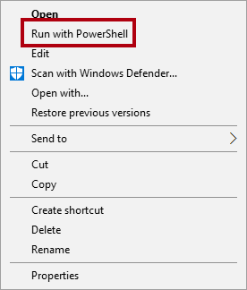

---
lab:
  title: 建立 Power BI 儀表板
  module: Create Dashboards
---

# **建立 Power BI 儀表板**

## **實驗室案例**

在此實驗室中，您將使用現有的報表，在 Power BI 服務 中建立**銷售監視**儀錶板。

在此實驗室中，您將了解如何：

- 將視覺效果釘選到儀表板
- 使用問與答建立儀表板圖格

**此實驗室大約需要30分鐘的時間。**

## **開始使用 – 登入**

在這項工作中，您會登入Power BI來設定實驗室的環境。

*注意：如果您已經登入 Power BI，請跳至下一個工作。*

1. 若要開啟 Microsoft Edge，請選取工作列上的 Microsoft Edge 程式捷徑。

     

1. 在 Microsoft Edge 瀏覽器視窗中，瀏覽至 **https://app.powerbi.com**。

    *提示：您也可以在 Microsoft Edge 我的最愛列上使用 Power BI 服務我的最愛。*

1. 使用組織認證完成登入程式（或提供給您的認證）。 若 Microsoft Edge 提示您保持登入，請選取 [是]****。

1. 在 Microsoft Edge 瀏覽器視窗中，從 Power BI 服務的 [瀏覽]**** 窗格，展開 [我的工作區]****。 讓 Microsoft Edge 瀏覽器視窗保持開啟。

     

## **開始使用 – 發佈報表**

在這項工作中，您將藉由建立語意模型來設定實驗室的環境。 *如果您已經發佈語意模型，請移至下一個工作。*

1. 在 Microsoft Edge 瀏覽器視窗中，於 [Power BI 服務] 中，流覽至 **[我的工作區**]。

1. 選取 **[上傳>流覽**]。

1. 流覽至 **D：\PL300\Labs\09-create-power-bi-dashboard\Starter** 資料夾。

1. 選取 **Sales Analysis.pbix** 檔案，然後選取 [開啟]****。

*如果系統提示您取代語意模型，請選取 **[取代它**]。*

## **建立儀表板**

在這項工作中，您將建立 **銷售監視** 儀錶板。 您將從報表釘選一個視覺效果、根據影像資料 URI 新增一個圖格，並使用問與答建立一個圖格。

1. 在 Power BI 服務 中，開啟 **[銷售分析]** 報表。

1. 在 [概觀]**** 頁面中，將 [年]**** 交叉分析篩選器] 設定為 **FY2020**。

    

1. 將 [區域]**** 交叉分析篩選器設定為 [全選]****。

    *釘選的視覺效果會在釘選時使用篩選內容進行設定。如果基礎視覺效果變更，您也必須更新儀錶板磚。對於以時間為基礎的篩選，最好是使用相對日期交叉分析篩選器（或使用相對時間型問題進行問答）。*

1. 若要建立儀錶板並釘選視覺效果，請將游標停留在 **[依月份** 的銷售額] 和 [獲利率] 視覺效果上（數據行/行）視覺效果上，然後選取圖釘。

    

1. 在 [**釘選到儀錶板] 視窗的 [儀錶板**名稱 **] 方塊中**，輸入 **[銷售監視**]，然後選取 [**釘選**]。

    

1. 開啟 **[我的工作區** ]，然後開啟 **[銷售監視]** 儀錶板。

1. 注意儀表板只有一個圖格。

    

1. 若要根據問題新增圖格，請選取儀表板左上方的 [詢問一個與資料相關的問題]****。
    
    *您可以使用問與答功能來詢問問題，Power BI 將會以視覺效果做出回應。*

    

1. 在 [Q&A] 方塊下方，以藍色方塊選取任何建議的問題，然後檢閱回應。

1. 從 [Q&A] 方塊中移除所有文字，然後輸入下列內容： **銷售額 YTD**

1. 請注意 **(空白)** 的回應。
    
    *您可能會記得您在 Power BI Desktop** 實驗室中**建立進階 DAX 計算中新增**了 Sales YTD** 量值。此量值是 Time Intelligence 運算式，因此需要 Date** 數據表上的**篩選來產生結果。*

    

1. 使用下列方式擴充問題：**在 FY2020 年**。

1. 請注意，回應現在是 **$33M**。

    

1. 若要將回應釘選到儀錶板，請在右上角選取 [ **釘選視覺效果**]。

    

1. 當系統提示您將圖格釘選到儀表板時，請選取 [釘選]****。

1. 若要返回儀錶板，請在左上角選取 **[結束 Q&amp;A**]。

1. 若要新增公司標誌，請在功能表欄上選取 **[編輯**]，然後選取 [ **新增磚**]。
    
    *使用這項技術來新增儀錶板磚可讓您使用媒體增強儀錶板，包括 Web 內容、影像、格式豐富的文本框和視訊（使用 YouTube 或 Vimeo 連結）。*

1. 在 [ **新增磚** ] 窗格中（位於右側），選取 [ **影像** ] 圖格，然後 **選取 [下一步**]。

1. 在 [**新增影像磚**] 窗格的 **[URL**] 方塊中，輸入 D：\PL300\Resources\AdventureWorksLogo_DataURL.txt** 檔案中找到**的完整 URL，然後套**用**。
    
    *您可以使用影像的 URL 來內嵌影像，也可以使用內嵌內容的數據 URL。*

1. 若要調整標誌圖格的大小，請拖曳右下角，並調整圖格的大小，使其變成一個單位寬和兩個單位高。
    
    *磚大小限制為矩形圖形。*

1. 組織圖格，讓標誌出現在左上方，其下方則顯示 [年初迄今銷售額]**** 圖格，並在右側顯示 [銷售額、獲利率]**** 圖格。

    

## **編輯磚詳細數據**

在這項工作中，您將編輯兩個磚的詳細數據。

1. 將滑鼠游標暫留在 [年初迄今的銷售額]**** 圖格上，然後選取圖格右上方的省略符號，再選取 [編輯詳細資料]****。

    

1. 在 [磚詳細數據] 窗格中（位於右側），在 [**子標題] 方塊**中**，輸入 **FY2020**，然後選取 [**套用**]。**

1. 請注意，[年初迄今的銷售額]**** 圖格會顯示子標題。

    

1. 編輯 Sales、Profit Margin** 圖格的**磚詳細數據。

1. 在 [磚詳細數據 **] 窗格的 **[** 功能**] 區段中，勾選 [顯示上次重新整理時間 **]，然後選取 **[**套用**]。

    

1. 請注意，該圖格會說明上次的重新整理時間 (其是在 Power BI Desktop 中載入資料模型時執行)。

*您將在下一個練習中重新整理語意模型。視您的數據和報表而定，您可以隨時執行臨機操作數據重新整理或設定排程。不過，排程的重新整理需要無法為此實驗室設定的閘道。因此，從 Power BI Desktop，您將執行手動數據重新整理，然後將檔案上傳至您的工作區。*

## **重新整理語意模型**

在本練習中，您會先將 2020 年 6 月的銷售訂單資料載入到 **AdventureWorksDW2020** 資料庫中。 接著，您將開啟 Power BI Desktop 檔案、執行數據重新整理，然後將檔案上傳至您的工作區。

## **更新實驗室資料庫**

在此工作中，您將執行 PowerShell 指令碼，以更新 **AdventureWorksDW2020** 資料庫中的資料。

1. 在 [檔案總管] 中的 **D:\PL300\Setup** 資料夾內，以滑鼠右鍵按一下 **UpdateDatabase-2-AddSales.ps1** 檔案，然後選取 [用 PowerShell 執行]****。

    

1. 如果系統提示您變更執行原則，請按 **A**。

1. 當系統提示您按任意鍵以關閉時，請再次按 **Enter**。

***AdventureWorksDW2020** 資料庫現在包括在 2020 年 6 月下訂的銷售訂單。*

## **重新整理 Power BI Desktop 檔案**

在這項工作中，您將開啟 **Sales Analysis** Power BI Desktop 檔案、執行數據重新整理，然後將檔案上傳至您的 **Sales Analysis** 工作區。

1. 在 Power BI Desktop 檔案的 [資料 **] 窗格中，以滑鼠右鍵按兩下 **[銷售**] 資料表，然後選取 [**重新整理數據**]。**

    

1. 當重新整理完成時，請儲存 Power BI Desktop 檔案。

1. 若要將檔案發佈至工作區，請在 [首頁 **] 功能區索引標籤的 **[共用 **] 群組內**，選取 **[發佈**]，然後選取 [**選取**以發佈]。

    

1. 當系統提示您取代語意模型時，請選取 **[取代**]。

1. 關閉 Power BI Desktop。

*Power BI 服務 中的語意模型現在有 2020 年 6 月的銷售數據。*

### **檢閱儀錶板**

在這項工作中，您將檢閱儀錶板，以注意到已更新的銷售。

1. 在 Microsoft Edge 瀏覽器視窗中，開啟 [Power BI 服務]，然後檢閱 **[我的工作區 **] 中的 **[銷售監視]** 儀錶板。

2. 在 [ **銷售] 的 [利潤獲利率** ] 圖格中，與副標題一致，請注意數據已 **重新整理：NOW**。

3. 另請注意，現在有 2020 年 6 月**的數據行**。
    
    *如果您沒有看到 2020 年 6 月的資料，則可能需要按 **F5** 以重新載入網頁瀏覽器。*

    

### **完成時間**

在此工作中，您將完成實驗室。

1. 儲存報表並關閉瀏覽器。
