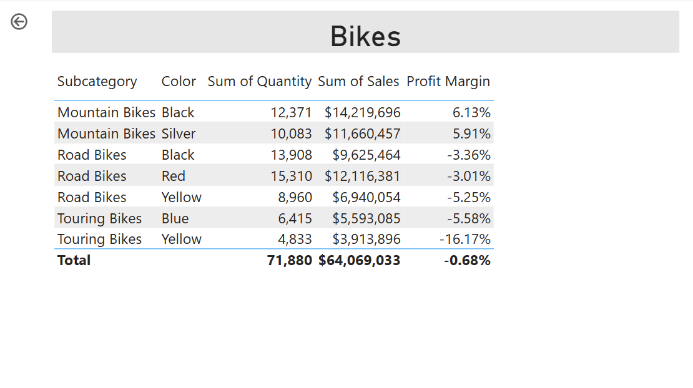

---
lab:
  title: 增強 Power BI 報表設計
  module: Enhance Power BI report designs for the user experience
---

# 增強 Power BI 報表設計

## 實驗室案例

在此實驗室中，您將使用進階設計功能來增強 _銷售分析_ 報告。

在此實驗室中，您會了解如何：

- 建立逐層分析頁面。
- 套用條件式格式。
- 建立和使用書籤和按鈕。

**此實驗室大約需要 45 分鐘。**

## 開始使用

若要完成此練習，請先開啟網頁瀏覽器，然後輸入下列 URL 以下載 zip 檔案：

`https://github.com/MicrosoftLearning/PL-300-Microsoft-Power-BI-Data-Analyst/raw/Main/Allfiles/Labs/09-enhance-power-bi-reports/09-enhanced-report.zip`

將檔案解壓縮至 **C：\Users\Student\Downloads\09-enhanced-report** 資料夾。

開啟 **09-Starter-Sales Analysis.pbix** 檔案。

> _**注意**：載入檔案時，您可能會看到登入對話方塊。選取 **[取消]** 以關閉登入對話方塊。關閉任何其他資訊視窗。如果系統提示套用變更，請選取 **[稍後套用]。**_

## 設定鑽研頁面

在本練習中，您將建立新頁面，並將它設定為鑽研頁面。 當您完成設計時，此頁面會如下所示：

1. 建立新頁面並將其重新命名為 _Product Details_。

1. 以滑鼠右鍵按一下 [產品詳細資料]**** 頁面索引標籤，然後選取 [隱藏頁面]****。

    > _報表使用者將無法直接移至鑽探頁面。相反，他們將從其他頁面上的視覺效果訪問它。您將學習如何鑽研至本實驗室最後練習中的頁面。_

1. 在 [**視覺效果]** 窗格下方的 [逐**層分析] **區段中，將`Product | Category`欄位新增至 [在此處**新增逐層分析欄位] **方塊。

    > _實驗室使用速記符號來引用字段。它看起來像這樣： `Product | Category`。在此範例中， `Product` 是資料表名稱，是 `Category` 欄位名稱。_

    

1. 若要測試鑽研頁面，請在鑽研篩選卡片中選取 [自行車]__。

    

1. 在報表頁面的左上方，請注意箭頭按鈕。

    > _報表設計工具會在將欄位新增至鑽研井時，自動新增箭號按鈕。它可讓報表使用者流覽回他們從中鑽研的頁面。_

1. 在頁面中新增 [卡片]**** 視覺效果，然後調整其大小和位置，使其位於按鈕的右邊並填滿頁面的剩餘寬度。

    

    

1. 將欄位拖曳 `Product | Category` 到卡片視覺效果中。

1. 設定視覺效果的格式選項，將 [類別標籤] **屬性轉換為 **[關閉**]。**

    

1. 在 [一般 **] **索引標籤的 [效果]** **區段中，將背景色彩屬性設定為淺灰色 （例如_白色，深_ 10%） 以提供對比。

    

1. 在頁面中新增 [資料表]**** 視覺效果，然後調整其大小和位置，使其位於卡片視覺效果的下方並填滿頁面的剩餘空間。

    

    

1. 將下列欄位新增至視覺效果：

    - `Product | Subcategory`
    - `Product | Color`
    - `Sales | Quantity`
    - `Sales | Sales`
    - `Sales | Profit Margin`

1. 若要設定視覺效果的格式選項，請在 [格線] **** 區段中，將 [全域字型大小 **] **屬性設定為 **20pt**。

    > _鑽取頁面的設計幾乎完成。您將在下一個練習中使用條件式格式增強頁面。_

## 新增條件式格式設定

在本練習中，您將使用條件式格式增強鑽研頁面。 當您完成設計時，此頁面會如下所示：

1. 選取資料表視覺效果。 在 [資料行] 井中 **，選取 [利潤率 **] **欄位上的向下箭號，然後選取 **[條件式格式設定] > [圖示**]。**

    

1. 在 [圖示 – Profit Margin]**** 視窗的 [圖示版面配置]**** 下拉式清單中，選取 [資料右邊]****。

    

1. 若要刪除中間規則，請選取 **黃色三角形右側的 [X**]。

    

1. 設定第一個規則 (紅色菱形)，如下所示：

    - 在第二個控制項中，移除此值
    - 在第三個控制項中，選取 [數字]****
    - 在第五個控制項中，輸入 **0**
    - 在第六個控制項中，選取 [數字]****

1. 設定第二個規則 (綠色圓形)，如下所示：

    - 在第二個控制項中，輸入 **0**
    - 在第三個控制項中，選取 [數字]****
    - 在第五個控制項中，移除此值
    - 在第六個控制項中，選取 [數字]****

    

    > _規則可以解釋如下：如果利潤率值小於 0，則顯示紅色菱形;否則，如果值大於或等於零，則顯示綠色圓圈。_

1. 在 圖示 – 利潤率 視窗**的 套用至** 下**拉式清單中，選取 **值和總計**。**

    

1. 選取 [確定]。

1. 在表格視覺效果中，確認顯示正確的圖示。

    

1. 設定 [色彩]**** 欄位的背景色彩條件式格式設定。

1. 在 [背景色彩 – 色彩]**** 視窗的 [設定樣式格式]**** 下拉式清單中，選取 [欄位值]****。

    

1. 在 我們應該以什麼欄位為基礎？**** 下拉式清單的 所有_資料_群組中，選取欄位`Product | Formatting | Background Color Format`。

    

1. 重複上述步驟，以使用`Product | Formatting | Font Color Format`欄位設定 [色彩] **** 欄位的字型色彩條件式格式。

 > _您可能還記得，背景和字型色彩是來自 **Power BI Desktop** 實驗室中的 **ColorFormats.csv** 檔案，然後與 Power BI Desktop** 中載入資料實驗室中**的產品查詢整合****。_

## 新增書籤和按鈕

在本練習中，您將使用按鈕增強 [我的效能 _] _頁面，讓報表使用者選取要顯示的視覺效果類型。 當您完成設計時，此頁面會如下所示：

1. 移至 [我的效能]__ 頁面。

1. 在 [檢視]**** 功能區索引標籤上，從 [顯示窗格]**** 群組中，選取 [書籤]****。

    

1. 在 [檢視]**** 功能區索引標籤上，從 [顯示窗格]**** 群組中，選取 [選取範圍]****。

    

1. 在 [選取範圍]**** 窗格中，選取 [依月份的銷售額] 和 [依月份的目標]__ 項目旁邊的眼睛圖示，以隱藏視覺效果。

    

1. 在 [書籤]**** 窗格中，選取 [新增]****。

    

    > _提示： 若要重新命名書籤，請按兩下書籤。_

1. 如果可見的圖表是橫條圖，請將書籤重新命名為 [開啟橫條圖]__，否則將書籤重新命名為 [開啟直條圖]__。

1. 若要編輯書籤，請在 [書籤] **窗格中，將游標停留在書籤上，選取省略符號，然後選取 **[資料**]。**

    > _停用 [資料 **] **選項表示書籤不會使用目前的篩選器狀態。這很重要，因為否則書籤會永久鎖定年份交叉分析篩選器目前套用的篩選器。_

    

1. 若要更新書籤，請再次選取省略符號，然後選取 **[更新]。**

    > _在下列步驟中，您將建立並設定第二個書籤，以顯示第二個視覺效果。_

1. 在 [選取範圍]**** 窗格中，切換 [依月份的銷售額] 和 [依月份的目標]__ 兩個項目的可見度。

    > _換句話說，讓可見的視覺變得隱藏，讓隱藏的視覺變得可見。_

    

1. 建立第二個書籤，並適當地命名它 （ _直條圖開啟_ 或 _長條圖開啟_。

    

1. 設定第二個書籤以忽略篩選 ([資料]**** 選項關閉)，並更新書籤。

1. 在 [選取範圍]**** 窗格中，若要讓這兩個視覺效果均可見，只要顯示隱藏的視覺效果即可。

1. 調整這兩個視覺效果的大小和位置，使其填滿多張卡片視覺效果下方的頁面，且彼此完全重疊。

    > _若要選取被遮蓋的視覺效果，請在 [ **選取]** 窗格中選取它。_

    

1. 在 [書籤]**** 窗格中，選取每個書籤，並注意只有其中一個視覺效果看得見。

    > _下一階段的設計是在頁面中添加兩個按鈕。這些按鈕將允許報表使用者選擇書籤。_

1. 在 [插入]**** 功能區中，從 [元素]**** 群組中，選取 [按鈕]****，然後選取 [空白]****。

    

1. 將此按鈕放置在 [年度]__ 交叉分析篩選器的正下方。

1. 選取按鈕，然後在 [**格式] 按鈕**窗格中，展開 [**樣式]** 區段，然後將 [文字]** **區段設定為 **[開啟**]。

    

1. 在 [文字] **區段的 [文字]** **方塊中，輸入 _[長條圖_]。**

1. 將 填滿** 區**段設定為 **開啟**，然後使用互補色來設定顏色。

1. 將 [動作] **** 區段設定為 **[開啟**]，然後將 [類型 **] **屬性設定為 **[書籤**]。

1. 選取 [**按鈕]**，然後將 [動作]** **屬性轉換為 **[開啟**]。

1. 展開 [動作]**** 區段，然後將 [類型]**** 下拉式清單設定為 [書籤]****。

1. 在 [書籤]**** 下拉式清單中，選取 [開啟橫條圖]****。

    

1. 使用複製並貼上來建立按鈕的複本，然後設定新按鈕，如下所示：

    > _提示： 複製和貼上的快速鍵命令是 **Ctrl+C** ，然後是 **Ctrl+V**。_

    - 將按鈕文字設定為 _直條圖_。
    - 將動作書籤設定為 **[直條圖開啟**]。

    > _「銷售分析」報告的設計現已完成。_

## 發佈和探索報表

在本練習中，您會將報表發佈至 Power BI 服務，並探索已發佈的報表行為。

> _**附註**： 您至少 **需要 Power BI 免費** 授權才能發佈報表。開啟 Microsoft Edge 瀏覽器，然後導覽至_ `https://app.powerbi.com`_。 使用授權實驗室主機 （ALH） 所提供的 Microsoft 365 租用戶認證登入。當要求解決謎題或開始免費 Fabric 試用時，您可以略過此操作並關閉瀏覽器。_

> _**附註**： 您可以檢閱練習的其餘部分，即使您無權存取 Power BI 服務來直接執行工作也一樣。_

1. 選取 [概觀]__ 頁面。

1. 在 [年度]__ 交叉分析篩選器中，選取 [FY2020]****。

1. 在 [區域_交叉分析篩選器] _中，確定未選取任何區域。

1. 儲存 Power BI Desktop 檔案。

1. 在 [首頁]**** 功能區索引標籤上，從 [共用]**** 群組內選取 [發佈]****。

    > _如果您尚未登入 Power BI Desktop，您必須先登入，才能發佈報表。_

    

1. 在 [ **發佈至 Power BI** ] 視窗中，請注意 _已選取 [我的工作區_ ]。

1. 若要發佈報表，請選取 **[選取**]。 等到發佈完成。

1. 當發佈成功時，請選取 [ **已確認**]。

1. 關閉 Power BI Desktop。

1. 開啟 Microsoft Edge 瀏覽器，然後登入 `https://app.powerbi.com` （或使用現有的瀏覽器工作階段）。

1. 在瀏覽器視窗的 Power BI 服務中，在 [導覽**窗格] （位於左側，可以摺疊） 中**，選取 **[我的工作區**]。

1. 若要探索報表，請選取 _09-Starter-Sales Analysis_ 報表。

1. 若要測試鑽研功能，請在 [概觀] 頁面的 [_依類別_的數量總和] 視覺效果中，以滑鼠右鍵按一下 _[服裝_] 列，然後選取 **[鑽研] > [產品詳細資料**]。__

    

1. 請注意，「產品詳細資料」__ 頁面會篩選「服裝」_的_視覺效果。

1. 若要返回來源頁面，請選取頁面左上角的箭頭按鈕。

1. 移至 [我的效能]__ 頁面。

1. 選取每個按鈕，然後注意顯示的不同視覺效果。

## 實驗室完成

1. 關閉 Microsoft Edge 瀏覽器。
1. 關閉 Power BI Desktop。