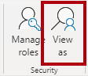

---
lab:
  title: 在 Power BI 中保護資料存取
  module: Secure data access in Power BI
---

# 在 Power BI 中保護資料存取

## 實驗室案例

在此實驗室中，您將強制執行資料列層級安全性，以確保銷售人員只能分析其指派區域的銷售資料。 您將學習如何：

- 在 Power BI 中實作動態資料列層級安全性 （RLS）。
- 使用 USERPRINCIPALNAME（） 建立和測試角色。

**此實驗室大約需要 20 分鐘。**

## 開始使用

若要完成本練習，請先開啟網頁瀏覽器，然後輸入下列 URL 以下載 zip 資料夾：

`https://github.com/MicrosoftLearning/PL-300-Microsoft-Power-BI-Data-Analyst/raw/Main/Allfiles/Labs/11-secure-data-access/11-secure-data.zip`

將資料夾解壓縮到 **C：\Users\Student\Downloads\11-secure-data** 資料夾。

開啟 **11-Starter-Sales Analysis.pbix** 檔案。

> _**注意**：載入檔案時，您可能會看到登入對話方塊。選取 **[取消]** 以關閉登入對話方塊。關閉任何其他資訊視窗。如果系統提示套用變更，請選取 **[稍後套用]。**_

## 強制執行資料列層級安全性

在此工作中，您將強制執行資料列層級安全性，以確保銷售人員只能看到其指派區域的銷售。

1. 切換至 **表格檢視**。

   

1. 在 [資料 **] **窗格中，選取 **[銷售人員 （效能）]** 資料表。

1. 檢閱資料，請注意 Michael Blythe (EmployeeKey 281) 具有以下 UPN 值：**`michael-blythe@adventureworks.com`**
    
    > *您可能還記得，Michael Blythe 被分配到三個銷售區域：美國東北部、美國中部和美國東南部。*

1. 在 [首頁 **] **功能區索引標籤上，從 [安全性 **] **群組內，選取 [**管理角色**]。

    

1. 在 [管理資訊安全角色] **視窗的 [角色 **] **區段中，選取 [新增 **]。****

1. 在方塊中，將選取的文字取代為角色名稱： **Salespeople**，然後按 **Enter**。

   

1. 若要指派篩選條件，請選取 **[銷售人員 （效能）]** 資料表，然後在 [規則]** **區段中選取 **[切換至 DAX 編輯器**]。

   

1. 在 [DAX 編輯器] 方塊中，輸入下列運算式：

    ```DAX
    [UPN] = USERPRINCIPALNAME()
    ```

   

    > *USERPRINCIPALNAME（） 是資料分析運算式 （DAX） 函式，可傳回已驗證使用者的名稱。這表示 **Salesperson （Performance）** 資料表會依查詢模型之使用者的使用者主體名稱 （UPN） 進行篩選。*

1. 選取 [ **儲存** 並 **關閉**]。

1. 若要測試資訊安全角色，請在 [首頁] **功能區索引標籤上，從 [安全性 **] **群組內選取 [**檢視方式**]。**

   

1. 在 [以角色身分檢視]**** 視窗中，選取 [其他使用者]**** 項目，然後在對應的方塊中輸入：**`michael-blythe@adventureworks.com`**

1. 檢查 [銷售人員] **角色，然後**檢查 [確定**]。**
    
    > *此設定會導致使用 [Salespeople]**** 角色，並以 Michael Blythe 的姓名模擬使用者。*

   

1. 請注意報告頁面上方的紅色橫幅，描述測試安全性內容。

   

1. 在資料表視覺效果中，請注意只會列出銷售人員 **Michael Blythe**。

   

1. 若要停止測試，請在 **紅色橫幅右側選取 [停止檢視**]。

   

1. 若要刪除銷售人員**角色，請在 [首頁 **] **功能區索引標籤上，從 [安全性 **] **群組**內選取 [管理角色**]。**

   

1. 在 [ 管理資訊安全角色 ] **視窗中，選取 [銷售人員 **] **角色上的省略符號 （...），然後選取 **[刪除]。**** 當系統提示您確認刪除時，請選取 **[是，刪除**]。

   

*附註： 當 Power BI Desktop 檔案發佈至 Power BI 服務時，您必須完成發佈後工作，才能將安全性主體對應至 **Salespeople** 角色。在這個實驗室中，你不會這樣做。*

## 實驗室完成

您可以選擇儲存 Power BI 報表，但此實驗室不需要儲存。 

1. 關閉 Microsoft Edge 瀏覽器視窗。
1. 在 Power BI Desktop 中，導覽至 **左上角的「檔案」** 選單，然後選取 **「另存新檔」**。 
1. 選取 [瀏覽此裝置]****。
1. 選取您要儲存檔案的資料夾，並為其指定描述性名稱。 
1. 選取 [儲存] **** 按鈕，將報表儲存為 .pbix 檔案。 
1. 如果出現對話方塊，提示您套用擱置的查詢變更，請選取 [ **套用**]。
1. 關閉 Power BI Desktop。
