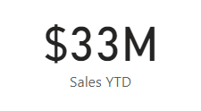

---
lab:
  title: （選用）在 Power BI 中建立儀錶板
  module: Create dashboards in Power BI
---

# 在 Power BI 中建立儀表板

## 實驗室案例

在此實驗室中，您將使用現有的報表，在 Power BI 服務中建立 **[銷售監視**] 儀錶板。

在此實驗室中，您會了解如何：

- 將視覺效果釘選到儀表板。
- 使用 Q&A 來建立儀錶板磚。

**此實驗室大約需要 30 分鐘。**

## 開始使用

若要完成本練習，請先開啟網頁瀏覽器，然後輸入下列 URL 以下載 zip 資料夾：

`https://github.com/MicrosoftLearning/PL-300-Microsoft-Power-BI-Data-Analyst/raw/Main/Allfiles/Labs/12-create-power-bi-dashboard/12-create-dashboard.zip`

將資料夾解壓縮至**C：\Users\Student\Downloads\12-create-dashboard** 資料夾。

> _**注意**：您至少**需要 Power BI 免費** 授權才能發佈報表。 開啟 Microsoft Edge 瀏覽器，然後登入`https://app.powerbi.com`。 當要求解決謎題或開始免費 Fabric 試用時，您可以略過此操作並關閉瀏覽器。

## 發佈報表

在此工作中，您將藉由建立語意模型來設定實驗室的環境。

1. 在 Microsoft Edge 瀏覽器視窗的 Power BI 服務中，流覽至 **[我的工作區**]。

1. 選取 **[匯入>報表] 或 [從此電腦**匯入編頁報表>]。

1. 導覽至**C：\Users\Student\Downloads\12-create-dashboard** 資料夾。

1. 選取**12-Starter-Sales Analysis.pbix** 檔案，然後選取 [開啟 **]。**

    > *如果提示您取代語意模型，請選取 [**取代它**]。*

## 建立儀表板

在此工作中，您將建立**Sales Monitoring** 儀表板。 您將從報表釘選一個視覺效果、根據影像資料 URI 新增一個圖格，並使用問與答建立一個圖格。

1. 在 Power BI 服務中，開啟**12-Starter-Sales 分析**報表。

1. 在 [概觀]**** 頁面中，將 [年]**** 交叉分析篩選器] 設定為**FY2020**。

    

1. 將 [區域]**** 交叉分析篩選器設定為 [全選]****。

    > *釘選視覺效果會在釘選時使用篩選內容來設定。如果基礎視覺效果變更，您也必須更新儀表板磚。針對以時間為基礎的篩選，最好使用相對日期交叉分析篩選器 （或使用相對時間型問題的 Q&A） 。*

1. 若要建立儀錶板並釘選視覺效果，請將游標停留在 [依月**的銷售額和利潤率] 視覺效果上**（欄/線） 視覺效果，然後選取圖釘。

    

1. 在 [釘選至儀表板]**視窗的 [儀表板名稱 **]** 方塊中，輸入 **[銷售監視**]，然後選取 **[釘選**]。**

    

1. 開啟 **「我的工作區**」，然後開啟「銷售監控」**** 儀表板。

1. 注意儀表板只有一個圖格。

    

1. 若要根據問題新增圖格，請選取儀表板左上方的 [詢問一個與資料相關的問題]****。 

    *您可以使用 Q&A 功能提出問題，Power BI 會以視覺效果回應。*

    

1. 選取 Q&A 方塊下方的任何一個建議問題，然後檢閱回應。

1. 從 [Q&A] 方塊中移除所有文字，然後輸入下列內容：**Sales YTD**

1. 請注意 **(空白)** 的回應。

    > *您可能還記得您在 Power BI Desktop** 中建立進階 DAX 計算實驗室**中新增**了 Sales YTD** 量值。此量值是時間智慧運算式，因此需要 [日期 **]** 資料表上的篩選器才能產生結果。*

    

1. 使用下列方式擴充問題：**在 FY2020 年**。

1. 請注意，回應現在是 **$33M**。

    

1. 若要將回應釘選到儀表板，請在**右上角選取 [釘選視覺效果**]。

    

1. 當系統提示將磚釘選到 [銷售監視 **] 儀錶板時**，請選取 [**釘選**]。

1. 若要返回儀表板，請選取**左上角的 [退出 Q&amp;A**]。

1. 若要新增公司標誌，請在功能表列上選取**編輯，** 然後選取**新增磚。**
    
    > *使用此技術新增儀表板磚可讓您使用媒體增強儀表板，包括網頁內容、影像、格式豐富的文字方塊和視訊 （使用 YouTube 或 Vimeo 連結）。*

1. 在 [新增磚]**** 窗格 （位於右側） 中，選取 [影像 **]** 磚，然後**選取 [下一步**]。

1.導覽至**C：\Users\Student\Downloads\12-create-dashboard** 資料夾，然後開啟**AdventureWorksLogo_DataURL.txt** 檔案。 

2. 在 [新增影像磚]**** 窗格的 [URL **]** 方塊中，貼上文字檔中的 URL，然後**貼上 [套用**]。
    
    > *您可以使用影像的 URL 內嵌影像，也可以使用資料 URL，以內嵌內容。*

1. 若要調整標誌磚的大小，請拖曳右下角，然後將磚大小調整為一單位寬和一單位高。
    
    > *磁磚尺寸僅限於矩形。*

1. 組織圖格，讓標誌出現在左上方，其下方則顯示 [年初迄今銷售額]**** 圖格，並在右側顯示 [銷售額、獲利率]**** 圖格。

    

## 編輯圖格詳細資料

在此工作中，您將編輯兩個磚的詳細資料。

1. 將滑鼠游標暫留在 [年初迄今的銷售額]**** 圖格上，然後選取圖格右上方的省略符號，再選取 [編輯詳細資料]****。

    

1. 在 [磚詳細資料]**窗格 （位於右側） 的 [字幕 **]** 方塊中，輸入 **[FY2020**]，然後選取 **[套用**]。**

1. 請注意，[年初迄今的銷售額]**** 圖格會顯示子標題。

    

1. 編輯 [銷售額、利潤率 **] 圖磚的**磚詳細資料。

1. 在 [磚詳細資料]**窗格的 [**功能]** 區段中，核取 [顯示上次重新整理時間 **]，然後**勾選**[套用****]。

    

1. 請注意，該圖格會說明上次的重新整理時間 (其是在 Power BI Desktop 中載入資料模型時執行)。

*您將在下一個練習中重新整理語意模型。根據您的資料和報告，您可以隨時執行臨時資料重新整理或設定排程。不過，排程的重新整理需要我們無法針對此實驗室設定的閘道。因此，您將從 Power BI Desktop 執行手動資料重新整理，然後將檔案上傳至您的工作區。*

## 重新整理語意模型

在本練習中，您會先將 2020 年 6 月的銷售訂單資料載入到**AdventureWorksDW2020** 資料庫中。 然後，您將開啟 Power BI Desktop 檔案、執行資料重新整理，然後將檔案上傳至您的工作區。

> ***附註**： 如果您無法連線到資料庫，**您可以使用 12-Solution-Sales-Analysis.pbix** 檔案。 不要更新資料庫並重新整理語意模型，而是將解決方案檔案上傳至 **[我的工作區** ]，並查看下列工作中參考的變更。

## 更新實驗室資料庫

在此工作中，您將執行 PowerShell 指令碼，以更新**AdventureWorksDW2020** 資料庫中的資料。

1. 在檔案總管中，在 C：\Users\Student\Downloads\12-create-dashboard 資料夾內 **，以滑鼠右鍵按兩下**UpdateDatabase-2-AddSales.ps1** 檔案，然後選取 **[使用 PowerShell** 執行]。**

    

1. 如果系統提示您變更執行原則，請按**A**。

1. 當系統提示您按任意鍵以關閉時，請再次按**Enter**。

***AdventureWorksDW2020** 資料庫現在包括在 2020 年 6 月下訂的銷售訂單。*

## 重新整理 Power BI Desktop 檔案

在此工作中，您將開啟**12-Starter-Sales Analysis** Power BI Desktop 檔案、執行資料重新整理，然後將檔案上傳至**Sales Analysis** 工作區。

1. 在 Power BI Desktop 檔案的 [資料]**窗格中，以滑鼠右鍵按一下 **[銷售]** 資料表，然後選取 **[重新整理資料**]。**

    

1. 當重新整理完成時，請儲存 Power BI Desktop 檔案。

1. 若要將檔案發佈至您的工作區，請在 [**首頁**] 功能區索引標籤的 [共用]**** 群組內，選取 **[發佈]**，然後選取 **[選取**以發佈]。

    

1. 當提示您取代語意模型時，請選取 取代****。

1. 關閉 Power BI Desktop。

*Power BI 服務中的語意模型現在具有 2020 年 6 月的銷售資料。*

## 檢閱儀表板

在此工作中，您將檢閱儀表板以注意更新的銷售額。

1. 在 Microsoft Edge 瀏覽器視窗中，開啟 Power BI 服務，然後檢閱 **[我的工作區 **] 中的**[銷售監視**] 儀表板。

2. 在 [**銷售額、利潤率** ] 磚中，與副標題一致，請注意資料已**重新整理：NOW**。

3. 另請注意，現在有一個 2020 年 6 月**的**專欄。

    > *如果您沒有看到 2020 年 6 月的資料，則可能需要按**F5** 以重新載入網頁瀏覽器。*

    

## 實驗室完成

1. 關閉 Microsoft Edge 瀏覽器視窗。